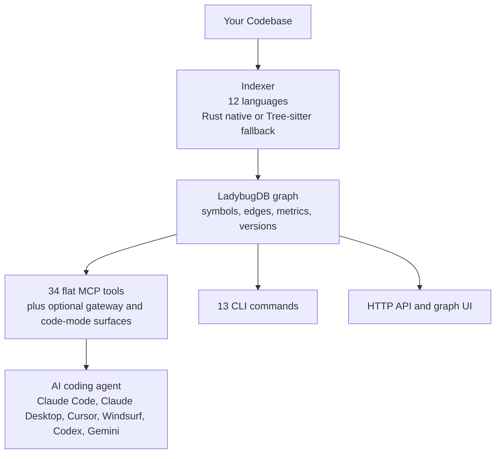
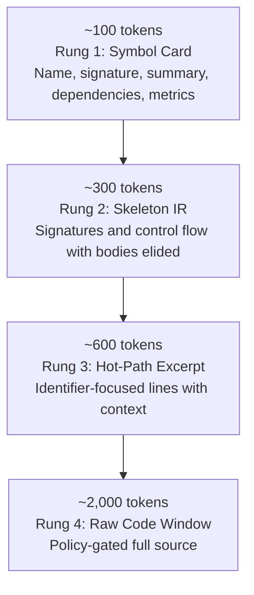
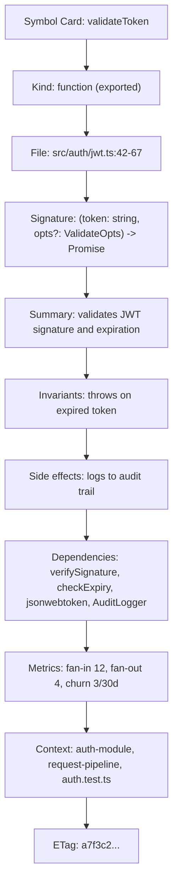
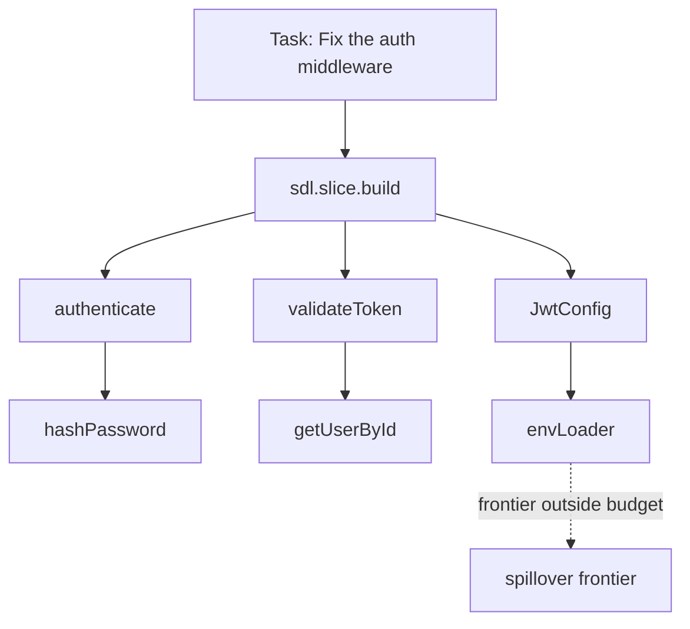
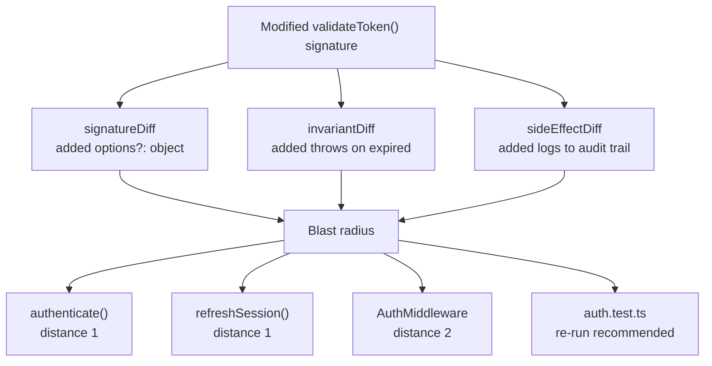
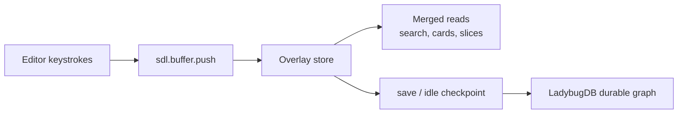
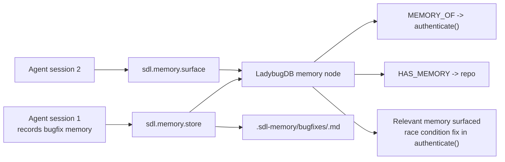
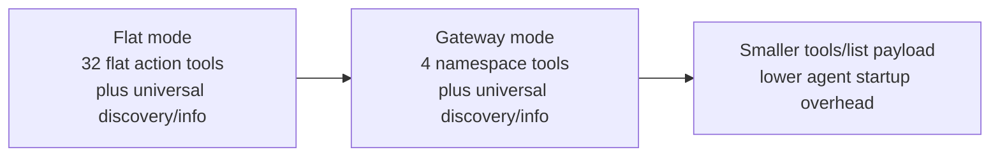
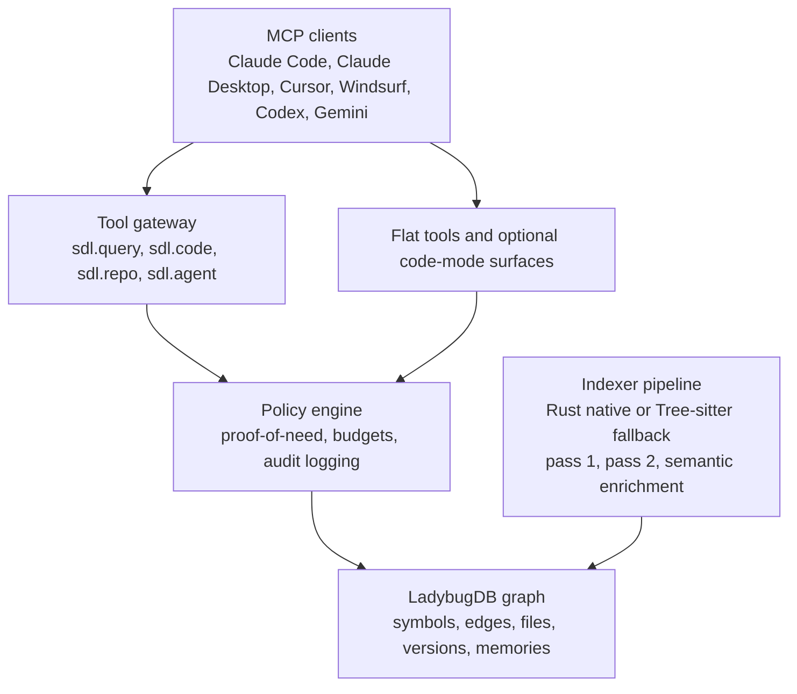

<div align="center">


<br/>

# SDL-MCP

### **Cards-first code context for AI coding agents**

*Stop feeding entire files into the context window.<br/>Start giving agents exactly the code intelligence they need.*

<br/>


</div>

---


<br/>

## What's the problem?

Every time an AI coding agent reads a file to answer a question, it consumes thousands of tokens. Most of those tokens are irrelevant to the task. The agent doesn't need 500 lines of a file to know that `validateToken` takes a `string` and returns a `Promise<User>` — but it reads them anyway, because that's all it has.

**Multiply that across a debugging session touching 20 files and you've burned 40,000+ tokens on context gathering alone.**

SDL-MCP fixes this. It indexes your codebase into a searchable **symbol graph** and serves precisely the right amount of context through a controlled escalation path. An agent that uses SDL-MCP understands your code better while consuming a fraction of the tokens.

<br/>

---

<br/>

## How it works — in 30 seconds



1. **Index once** — SDL-MCP parses every symbol in your repo and stores it as a compact metadata record (a "Symbol Card") in a graph database
2. **Query efficiently** — Agents use MCP tools to search, slice, and retrieve exactly the context they need
3. **Escalate only when necessary** — A four-rung ladder controls how much code the agent sees, from a 100-token card to full source (with justification required)

<br/>

---

<br/>

## Quick Start

```bash
# Install
npm install -g sdl-mcp

# Initialize, auto-detect languages, index your repo, and run health checks
sdl-mcp init -y --auto-index

# Start the MCP server for your coding agent
sdl-mcp serve --stdio
```

Point your MCP client at the server and the agent gains access to all SDL-MCP tools. That's it.

> **npx users:** Replace `sdl-mcp` with `npx --yes sdl-mcp@latest` in all commands above.

[Full Getting Started Guide →](./docs/getting-started.md)

<br/>

---

<br/>

## The Iris Gate Ladder

The core innovation. Named after the adjustable aperture that controls light flow in optics, the Iris Gate Ladder lets agents dial their context "aperture" from a pinhole to wide-open.



> **Most questions are answered at Rungs 1-2** without ever reading raw code. That's where the token savings come from.

| Scenario | Reading the file | Using the Ladder | Savings |
|:---------|:----------------:|:----------------:|:-------:|
| "What does `parseConfig` accept?" | ~2,000 tok | ~100 tok | **20x** |
| "Show me the shape of `AuthService`" | ~4,000 tok | ~300 tok | **13x** |
| "Where is `this.cache` set?" | ~2,000 tok | ~500 tok | **4x** |

**Why it matters:**
- **4–20x token savings** on typical code understanding queries
- Most questions answered at Rungs 1–2 without ever reading raw code
- Controlled escalation prevents agents from over-consuming context
- Policy-gated raw access ensures agents prove they need full source

[Iris Gate Ladder Deep Dive →](./docs/feature-deep-dives/iris-gate-ladder.md)

<br/>

---

<br/>

## Feature Tour

### Symbol Cards — The Atoms of Understanding

Every function, class, interface, type, and variable becomes a **Symbol Card**: a compact metadata record (~100 tokens) containing everything an agent needs to *understand* a symbol without reading its code.



Cards include **confidence-scored call resolution** (the pass-2 resolver traces imports, aliases, barrel re-exports, and tagged templates to produce accurate dependency edges), **community detection** (cluster membership), and **call-chain tracing** (process participation with entry/intermediate/exit roles).

**Why it matters:**
- **~100 tokens per symbol** vs. ~2,000 tokens to read the full file
- Confidence-scored dependency edges trace real call relationships across files
- Community detection and call-chain tracing reveal architectural structure
- ETag-based conditional requests avoid re-fetching unchanged symbols

[Indexing & Language Support Deep Dive →](./docs/feature-deep-dives/indexing-languages.md)

---

### Graph Slicing — The Right Context for Every Task

Instead of reading files in the same directory, SDL-MCP follows the *dependency graph*. Starting from symbols relevant to your task, it traverses weighted edges (call: 1.0, config: 0.8, import: 0.6), scores each symbol by relevance, and returns the N most important within a token budget.



Slices have handles, leases, refresh (delta-only updates), and spillover (paged overflow). You can also skip the symbol search entirely — pass a `taskText` string and SDL-MCP auto-discovers the relevant entry symbols.

**Why it matters:**
- Follows the **dependency graph**, not directory boundaries, for cross-cutting context
- Weighted edge scoring (call > config > import) prioritizes the most relevant symbols
- Token-budgeted: returns only what fits within your budget (~800 tokens vs. ~16,000 for raw files)
- Natural-language task-text auto-discovers entry symbols — no symbol IDs needed

[Graph Slicing Deep Dive →](./docs/feature-deep-dives/graph-slicing.md)

---

### Delta Packs & Blast Radius — Semantic Change Intelligence

`git diff` tells you what lines changed. SDL-MCP tells you what that change *means* and who's affected.



**PR risk analysis** (`sdl.pr.risk.analyze`) wraps this into a scored assessment with findings, evidence, and test recommendations. **Fan-in trend analysis** detects "amplifier" symbols whose growing dependency count means changes ripple further over time.

**Why it matters:**
- Semantic diffs show what a change **means**, not just what lines moved
- Ranked blast radius identifies which dependent symbols are most at risk
- Fan-in trend analysis detects "amplifier" symbols whose changes ripple further over time
- PR risk scoring produces actionable findings with test re-run recommendations

[Delta & Blast Radius Deep Dive →](./docs/feature-deep-dives/delta-blast-radius.md)

---

### Live Indexing — Real-Time Code Intelligence

SDL-MCP doesn't wait for you to save. As you type in your editor, buffer updates are pushed to an in-memory overlay store, parsed in the background, and merged with the durable database. Search, cards, and slices reflect your *current* code, not your last save.



**Why it matters:**
- Search, cards, and slices reflect **unsaved editor changes** in real time
- No manual re-index needed during active development
- Background AST parsing with in-memory overlay keeps queries fast

[Live Indexing Deep Dive →](./docs/feature-deep-dives/live-indexing.md)

---

### Governance & Policy — Controlled Access

Raw code access (Rung 4) is **policy-gated**. Agents must provide:
- A **reason** explaining why they need raw code
- **Identifiers** they expect to find in the code
- An **expected line count** within configured limits

Requests that don't meet policy are denied with actionable guidance ("try `getHotPath` with these identifiers instead"). Every access is audit-logged.

The sandboxed runtime execution tool (`sdl.runtime.execute`) has its own governance layer: enabled by default, but still guarded by executable allowlisting, CWD jailing, environment scrubbing, concurrency limits, and timeout enforcement. The `outputMode` parameter (`"minimal"` | `"summary"` | `"intent"`) defaults to `"minimal"` for ~95% token savings, with `sdl.runtime.queryOutput` enabling on-demand output retrieval when needed.

**Why it matters:**
- Proof-of-need gating prevents agents from wastefully reading raw code
- Denied requests include **actionable next-best-action** guidance
- Full audit logging of every code access decision
- Sandboxed runtime with executable allowlisting, CWD jailing, and environment scrubbing

[Governance & Policy Deep Dive →](./docs/feature-deep-dives/governance-policy.md)

---

### Agent Context — Task-Shaped Retrieval

`sdl.agent.context` is SDL-MCP's task-shaped context engine. Give it a task type (`debug`, `review`, `implement`, `explain`), a description, and a budget — it selects the right Iris Gate rungs, collects evidence, and returns context tuned to the job. In Code Mode, `sdl.context` provides the same retrieval surface without dropping into `sdl.workflow`.

The feedback loop (`sdl.agent.feedback`) records which symbols were useful and which were missing, improving future slice quality.

`sdl.context.summary` generates portable, token-bounded context briefings in markdown, JSON, or clipboard format for use outside MCP environments.

**Why it matters:**
- Task-shaped context retrieval plans the **right Iris Gate path** within a token budget
- Feedback loop records what was useful/missing, improving future slice quality
- Portable context summaries export findings for use outside MCP environments

[Agent Context Deep Dive →](./docs/feature-deep-dives/agent-context.md) · [Context Modes →](./docs/feature-deep-dives/context-modes.md)

---

### Sandboxed Runtime Execution

Run tests, linters, and scripts through SDL-MCP's governance layer instead of uncontrolled shell access. 16 runtimes (Node.js, Python, Go, Java, Rust, Shell, and more), code-mode or args-mode, smart output summarization with keyword-matched excerpts, and gzip artifact persistence.

**Why it matters:**
- Run tests, linters, and scripts **under governance** instead of uncontrolled shell access
- 16 runtimes supported (Node, Python, Go, Java, Rust, Shell, and more)
- Executable allowlisting, CWD jailing, timeout enforcement, and environment scrubbing
- Smart output summarization with keyword-matched excerpts and gzip artifact persistence

[Runtime Execution Deep Dive →](./docs/feature-deep-dives/runtime-execution.md)

---

### Development Memories — Cross-Session Knowledge Persistence (Opt-In)

Agents forget everything between sessions. SDL-MCP fixes this with an **opt-in graph-backed memory system** that lets agents store decisions, bugfix context, and task notes linked directly to the symbols and files they relate to. Memory is **disabled by default** and must be explicitly enabled in the configuration. When enabled, memories are stored both in the graph database (for fast querying) and as checked-in markdown files (for version control and team sharing).



When enabled, memories are **automatically surfaced** inside graph slices — when an agent builds a slice touching symbols with linked memories, those memories appear alongside the cards. During re-indexing, memories linked to changed symbols are **flagged as stale**, prompting agents to review and update them. Four MCP tools (`store`, `query`, `remove`, `surface`) provide full CRUD plus intelligent ranking by confidence, recency, and symbol overlap. Memory tools are only available when memory is enabled in the configuration.

**Why it matters:**
- Structured knowledge **persists across sessions**, linked directly to symbols and files
- Opt-in and disabled by default — enable via `"memory": { "enabled": true }` in config
- When enabled, automatically surfaced inside graph slices when touching related symbols
- Stale memories flagged when linked symbols change during re-indexing
- Dual storage: graph DB for fast querying + markdown files for version control and team sharing

[Development Memories Deep Dive →](./docs/feature-deep-dives/development-memories.md)

---

### CLI Tool Access — No MCP Server Required

Access all 32 flat SDL action tools directly from the command line with `sdl-mcp tool`. No MCP server, transport, or SDK is required.

```bash
# Search for symbols
sdl-mcp tool symbol.search --query "handleAuth" --output-format pretty

# Build a task-scoped slice
sdl-mcp tool slice.build --task-text "debug auth flow" --max-cards 50

# Pipe JSON args, chain commands
echo '{"repoId":"my-repo"}' | sdl-mcp tool symbol.search --query "auth"
```

Features include typed argument coercion (string, number, boolean, string[], json), budget flag merging, stdin JSON piping with CLI-flags-win precedence, auto-resolved `repoId` from cwd, four output formats (json, json-compact, pretty, table), typo suggestions, and per-action `--help`. The CLI dispatches through the same gateway router and Zod schemas as the MCP server — identical code paths, identical validation.

**Why it matters:**
- All MCP tool actions accessible from **any terminal** — no server, transport, or SDK required
- Same code paths and Zod validation as the MCP server — identical behavior
- Four output formats (json, json-compact, pretty, table) for scripting and CI pipelines
- Auto-resolves repoId from cwd, supports stdin JSON piping and per-action `--help`

[CLI Tool Access Deep Dive →](./docs/feature-deep-dives/cli-tool-access.md)

---

### Tool Gateway — 81% Token Reduction

The tool gateway consolidates the 32 flat SDL action tools into **4 namespace-scoped tools** (`sdl.query`, `sdl.code`, `sdl.repo`, `sdl.agent`), reducing `tools/list` overhead from the full flat schema surface to a compact gateway surface.



Each gateway tool accepts an `action` discriminator field (e.g., `{ action: "symbol.search", repoId: "x", query: "auth" }`) and routes to the same handlers with double Zod validation. Thin wire schemas in `tools/list` keep the registration compact while full validation happens server-side. Legacy flat tool names are optionally emitted alongside for backward compatibility.

**Why it matters:**
- Large reduction in `tools/list` overhead for gateway-first agents
- 32 flat action tools consolidated into 4 namespace-scoped tools for simpler agent selection
- Fewer tool choices means faster and more accurate tool dispatch by the agent
- Backward-compatible: legacy flat tool names optionally emitted alongside

[Tool Gateway Deep Dive →](./docs/feature-deep-dives/tool-gateway.md)

<br/>

---

<br/>

## All 36 Unique Tool Surfaces at a Glance

<table>
<tr><th>Category</th><th>Tool</th><th>One-Line Description</th></tr>
<tr><td rowspan="4"><strong>Repository</strong></td>
    <td><code>sdl.repo.register</code></td><td>Register a codebase for indexing</td></tr>
<tr><td><code>sdl.repo.status</code></td><td>Health, versions, watcher, prefetch, live-index stats</td></tr>
<tr><td><code>sdl.repo.overview</code></td><td>Codebase summary: stats, directories, hotspots, clusters</td></tr>
<tr><td><code>sdl.index.refresh</code></td><td>Trigger full or incremental re-indexing</td></tr>

<tr><td rowspan="3"><strong>Live Buffer</strong></td>
    <td><code>sdl.buffer.push</code></td><td>Push unsaved editor content for real-time indexing</td></tr>
<tr><td><code>sdl.buffer.checkpoint</code></td><td>Force-write pending buffers to the durable database</td></tr>
<tr><td><code>sdl.buffer.status</code></td><td>Live indexing diagnostics and queue depth</td></tr>

<tr><td rowspan="3"><strong>Symbols</strong></td>
    <td><code>sdl.symbol.search</code></td><td>Search symbols by name (with optional semantic reranking)</td></tr>
<tr><td><code>sdl.symbol.getCard</code></td><td>Get a symbol card with ETag-based conditional support</td></tr>
<tr><td><code>sdl.symbol.getCards</code></td><td>Batch-fetch up to 100 cards in one round trip</td></tr>

<tr><td rowspan="3"><strong>Slices</strong></td>
    <td><code>sdl.slice.build</code></td><td>Build a task-scoped dependency subgraph</td></tr>
<tr><td><code>sdl.slice.refresh</code></td><td>Delta-only update of an existing slice</td></tr>
<tr><td><code>sdl.slice.spillover.get</code></td><td>Page through overflow symbols beyond the budget</td></tr>

<tr><td rowspan="3"><strong>Code Access</strong></td>
    <td><code>sdl.code.getSkeleton</code></td><td>Signatures + control flow, bodies elided</td></tr>
<tr><td><code>sdl.code.getHotPath</code></td><td>Lines matching specific identifiers + context</td></tr>
<tr><td><code>sdl.code.needWindow</code></td><td>Full source code (policy-gated, requires justification)</td></tr>

<tr><td><strong>Deltas</strong></td>
    <td><code>sdl.delta.get</code></td><td>Semantic diff + blast radius between versions</td></tr>

<tr><td rowspan="2"><strong>Policy</strong></td>
    <td><code>sdl.policy.get</code></td><td>Read current gating policy</td></tr>
<tr><td><code>sdl.policy.set</code></td><td>Update line/token limits and identifier requirements</td></tr>

<tr><td><strong>Risk</strong></td>
    <td><code>sdl.pr.risk.analyze</code></td><td>Scored PR risk with findings and test recommendations</td></tr>

<tr><td><strong>Context</strong></td>
    <td><code>sdl.context.summary</code></td><td>Token-bounded portable briefing (markdown/JSON/clipboard)</td></tr>

<tr><td rowspan="3"><strong>Agent</strong></td>
    <td><code>sdl.agent.context</code></td><td>Task-shaped context retrieval with budget-controlled rung planning</td></tr>
<tr><td><code>sdl.agent.feedback</code></td><td>Record which symbols were useful or missing</td></tr>
<tr><td><code>sdl.agent.feedback.query</code></td><td>Query aggregated feedback statistics</td></tr>

<tr><td rowspan="2"><strong>Runtime</strong></td>
    <td><code>sdl.runtime.execute</code></td><td>Sandboxed subprocess execution with outputMode (minimal/summary/intent)</td></tr>
<tr><td><code>sdl.runtime.queryOutput</code></td><td>On-demand retrieval and keyword search of stored output artifacts</td></tr>

<tr><td rowspan="4"><strong>Memory</strong></td>
    <td><code>sdl.memory.store</code></td><td>Store or update a development memory with symbol/file links</td></tr>
<tr><td><code>sdl.memory.query</code></td><td>Search memories by text, type, tags, or linked symbols</td></tr>
<tr><td><code>sdl.memory.remove</code></td><td>Soft-delete a memory from graph and optionally from disk</td></tr>
<tr><td><code>sdl.memory.surface</code></td><td>Auto-surface relevant memories for a task context</td></tr>

<tr><td rowspan="3"><strong>Code Mode</strong></td>
    <td><code>sdl.context</code></td><td>Code Mode task-shaped context retrieval for explain/debug/review/implement work</td></tr>
<tr><td><code>sdl.workflow</code></td><td>Multi-step operations with budget tracking, ETag caching, and transforms</td></tr>
<tr><td><code>sdl.manual</code></td><td>Self-documentation — query usage guide, action schemas, output format reference</td></tr>

<tr><td rowspan="3"><strong>Meta</strong></td>
    <td><code>sdl.info</code></td><td>Runtime diagnostics — version, Node.js, platform, database, config paths</td></tr>
<tr><td><code>sdl.usage.stats</code></td><td>Session and lifetime token savings statistics</td></tr>
<tr><td><code>sdl.action.search</code></td><td>Search SDL action catalog to discover the right tool for a task</td></tr>
</table>

[Complete MCP Tools Reference (detailed parameters & responses) →](./docs/mcp-tools-detailed.md)

<br/>

---

<br/>

## CLI Commands

| Command | Description |
|:--------|:------------|
| `sdl-mcp init` | Bootstrap config, detect repo/languages, optionally auto-index |
| `sdl-mcp doctor` | Validate runtime, config, DB, grammars, repo access |
| `sdl-mcp index` | Index repositories (with optional `--watch` mode) |
| `sdl-mcp serve` | Start MCP server (`--stdio` or `--http`) |
| `sdl-mcp tool` | Access all 35 MCP tool actions directly ([docs](./docs/feature-deep-dives/cli-tool-access.md)) |
| `sdl-mcp info` | Runtime diagnostics — version, Node.js, platform, database, config |
| `sdl-mcp summary` | Generate copy/paste context summaries from the CLI |
| `sdl-mcp health` | Compute composite health score with badge/JSON output |
| `sdl-mcp benchmark` | Run CI regression benchmarks |
| `sdl-mcp export` | Export sync artifact |
| `sdl-mcp import` | Import sync artifact |
| `sdl-mcp pull` | Pull by version/commit with fallback |
| `sdl-mcp version` | Show version and environment info |

[CLI Reference →](./docs/cli-reference.md) · [Configuration Reference →](./docs/configuration-reference.md)

<br/>

---

<br/>

## Compatible With

SDL-MCP works with any MCP-compatible client:

| Client | Transport | Setup |
|:-------|:----------|:------|
| **Claude Code** | stdio | `sdl-mcp init --client claude-code` |
| **Claude Desktop** | stdio | `sdl-mcp init --client claude-code` |
| **Cursor** | stdio | Standard MCP server config |
| **Windsurf** | stdio | Standard MCP server config |
| **Codex CLI** | stdio | `sdl-mcp init --client codex` |
| **Gemini CLI** | stdio | `sdl-mcp init --client gemini` |
| **OpenCode** | stdio | `sdl-mcp init --client opencode` |
| **Any MCP client** | stdio / http | `sdl-mcp serve --stdio` or `--http` |

A **VSCode extension** (`sdl-mcp-vscode/`) provides live buffer integration for real-time indexing of unsaved edits.

<br/>

---

<br/>

## Tech Stack

| Component | Technology |
|:----------|:-----------|
| Runtime | Node.js 24+ / TypeScript 5.9+ (strict ESM) |
| Graph Database | LadybugDB (embedded, single-file) |
| Indexer (default) | Rust via napi-rs (multi-threaded) |
| Indexer (fallback) | tree-sitter + tree-sitter-typescript |
| MCP SDK | @modelcontextprotocol/sdk |
| Validation | Zod schemas for all payloads |
| Transports | stdio (agents) · HTTP (dev/network) |

<br/>

---

<br/>

## System Architecture



[Full Architecture Documentation →](./docs/architecture.md)

<br/>

---

<br/>

## Documentation

| Document | Description |
|:---------|:------------|
| [Getting Started](./docs/getting-started.md) | Installation, 5-minute setup, MCP client config |
| [MCP Tools Reference](./docs/mcp-tools-detailed.md) | Detailed docs for all 36 unique tool surfaces (parameters, responses, examples) |
| [CLI Reference](./docs/cli-reference.md) | All CLI commands and options |
| [Configuration Reference](./docs/configuration-reference.md) | Every config option with defaults and guidance |
| [Agent Workflows](./docs/agent-workflows.md) | Workflow instructions for CLAUDE.md / AGENTS.md |
| [Architecture](./docs/architecture.md) | Tech stack, data flow, component diagram |
| [Iris Gate Ladder](./docs/feature-deep-dives/iris-gate-ladder.md) | Context escalation methodology |
| [Troubleshooting](./docs/troubleshooting.md) | Common issues and fixes |

### Feature Deep Dives

| Topic | What You'll Learn |
|:------|:------------------|
| [Iris Gate Ladder](./docs/feature-deep-dives/iris-gate-ladder.md) | Four-rung context escalation with token savings analysis |
| [Graph Slicing](./docs/feature-deep-dives/graph-slicing.md) | BFS/beam search, edge weights, wire formats, auto-discovery |
| [Delta & Blast Radius](./docs/feature-deep-dives/delta-blast-radius.md) | Semantic diffs, ranked impact analysis, PR risk scoring |
| [Live Indexing](./docs/feature-deep-dives/live-indexing.md) | Real-time editor buffer integration and overlay architecture |
| [Governance & Policy](./docs/feature-deep-dives/governance-policy.md) | Proof-of-need gating, audit logging, runtime sandboxing |
| [Agent Context](./docs/feature-deep-dives/agent-context.md) | Task-shaped context retrieval, feedback loops, portable context summaries |
| [Context Modes](./docs/feature-deep-dives/context-modes.md) | Precise vs broad retrieval, adaptive symbol ranking, benchmark trade-offs |
| [Indexing & Languages](./docs/feature-deep-dives/indexing-languages.md) | Rust/TS engines, two-pass architecture, 12-language support |
| [Runtime Execution](./docs/feature-deep-dives/runtime-execution.md) | Sandboxed subprocess execution with governance |
| [CLI Tool Access](./docs/feature-deep-dives/cli-tool-access.md) | Direct CLI access to all tool actions, output formats, stdin piping, scripting |
| [Tool Gateway](./docs/feature-deep-dives/tool-gateway.md) | 35→4 tool consolidation, token reduction, thin schemas, migration guide |
| [Semantic Engine](./docs/feature-deep-dives/semantic-engine.md) | Pass-2 call resolution, embedding search, LLM summaries, confidence scoring |
| [Semantic Embeddings Setup](./docs/feature-deep-dives/semantic-embeddings-setup.md) | Dependencies, model installation, provider configuration, tier-by-tier setup |
| [Code Mode](./docs/feature-deep-dives/code-mode.md) | `sdl.context`, `sdl.workflow`, action discovery, manual reference, one-call workflows |
| [Development Memories](./docs/feature-deep-dives/development-memories.md) | Graph-backed cross-session memory, file sync, staleness detection, auto-surfacing |
| [Token Savings Meter](./docs/feature-deep-dives/token-savings-meter.md) | Per-call meter, session summaries, lifetime tracking, `sdl.usage.stats` |

<br/>

---

<br/>

## License

This project is **source-available**.

- **Free Use (Community License):** You may use, run, and modify this software for any purpose, including **internal business use**, under the terms in [`LICENSE`](./LICENSE).
- **Commercial Distribution / Embedding:** You must obtain a **commercial license** before you **sell, license, sublicense, bundle, embed, or distribute** this software as part of a for-sale or monetized product. See [`COMMERCIAL_LICENSE.md`](./COMMERCIAL_LICENSE.md).

Questions? Contact **gmullins.gkc@gmail.com**.
