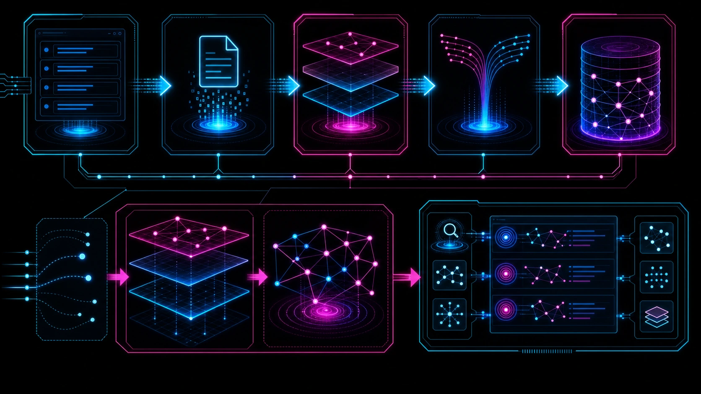

<div align="center">
  

  # Symbol Delta Ledger

  Cards-first code context for AI coding agents.

  [Get started](./docs/getting-started.md) · [Documentation](./docs/README.md) · [MCP tools](./docs/mcp-tools-reference.md) · [npm](https://www.npmjs.com/package/sdl-mcp)
</div>

## Work from the symbols that matter

SDL-MCP indexes a repository into a symbol graph and gives coding agents a controlled path from compact metadata to source code. Instead of starting with full files, an agent can search symbols, inspect cards, build a task-scoped slice, and request a bounded code window only when it needs one.

The result is a smaller, more deliberate context surface for debugging, reviews, implementation work, and repository exploration. SDL-MCP runs locally and supports the Model Context Protocol over stdio or HTTP.

## Start in a few minutes

SDL-MCP requires Node.js 24 or later. For an interactive first install, run the wrapper package from the repository you want to index:

```bash
npx create-sdl-mcp
```

For a standard global install, initialize the repository, verify it, then start the stdio server:

```bash
npm install -g sdl-mcp
cd <repository>
sdl-mcp init
sdl-mcp doctor
sdl-mcp serve --stdio
```

Use `sdl-mcp init -y --auto-index` for non-interactive setup. The [Getting Started guide](./docs/getting-started.md) covers the setup wizard, supported clients, HTTP transport, and configuration examples.

## A controlled retrieval loop


1. Index the repository into symbols, relationships, and compact metadata.
2. Start with symbol search, task-shaped context, or graph slicing.
3. Escalate through progressively richer views only when the task requires more detail.

The Iris Gate Ladder makes the escalation explicit. Cards, skeletons, hot paths, and policy-gated source windows let an agent ask for the least code that can answer its question.


## Choose the tool surface that fits the client

The generated [tool inventory](./docs/generated/tool-inventory.md) is the source of truth for registered tools and mode counts.

| Mode | Registered surface |
| --- | --- |
| Flat | 37 tools: 2 universal tools and 35 flat tools |
| Gateway | 6 tools: 2 universal tools and 4 gateway namespaces |
| Gateway with legacy | 41 tools: 2 universal, 4 gateway, and 35 flat tools |
| Code Mode exclusive | 6 tools: `sdl.action.search`, `sdl.context`, `sdl.file`, `sdl.manual`, `sdl.retrieve`, and `sdl.workflow` |

Code Mode provides a compact task-oriented surface. Gateway mode groups the regular actions into `sdl.agent`, `sdl.code`, `sdl.query`, and `sdl.repo`. The [MCP Tools Reference](./docs/mcp-tools-reference.md) explains requests and responses for the installed surface.

## Build context from repository structure

### Symbol cards

Each indexed symbol has a compact card with its identity, signature, summary, relationships, and other retrieval metadata. Cards give an agent a place to begin without opening a full source file.


### Graph slicing

Graph slicing follows repository relationships rather than directory boundaries. Give SDL-MCP a task or a starting symbol and it returns a budgeted subgraph that can be refreshed or expanded through spillover.


[Read about graph slicing](./docs/feature-deep-dives/graph-slicing.md) · [Read about task-shaped context](./docs/feature-deep-dives/agent-context.md)

## Understand change and work against current code

### Delta packs and blast radius

SDL-MCP can compare indexed versions, identify changed symbols, and trace affected relationships. `sdl.pr.risk.analyze` packages change evidence and test recommendations for pull-request review.


### Live indexing

Draft-buffer updates can appear in a live overlay before the underlying file is saved. That lets retrieval work from the code an agent is editing instead of only the last durable index.



[Read about delta packs](./docs/feature-deep-dives/delta-blast-radius.md) · [Read about live indexing](./docs/feature-deep-dives/live-indexing.md)

## Use compiler and provider facts when they are available

SDL-MCP uses tree-sitter for repository structure and can ingest SCIP and language-provider facts through provider-first indexing. This adds precise cross-references where a provider covers the file and falls back to the regular path for files it does not cover.


[Read about SCIP integration](./docs/feature-deep-dives/scip-integration.md) · [Read about provider-first indexing](./docs/feature-deep-dives/provider-first-indexing.md)

## Keep useful knowledge with the work

Development memories are opt-in. When enabled, they store decisions and task notes with repository links so later work can retrieve them alongside the relevant context. Memory behavior and storage rules are documented in the [Memory Protocol](./docs/memory-protocol.md).


## Keep tool registration compact

Gateway mode reduces the visible regular action surface to four namespace tools while preserving server-side validation and routing. Use it when a client benefits from fewer tool choices; use the flat surface when direct tool names are more useful.


[Read about the Tool Gateway](./docs/feature-deep-dives/tool-gateway.md) · [Read about Code Mode](./docs/feature-deep-dives/code-mode.md)

## Operate the repository with guardrails

Policy settings govern raw source windows. The runtime execution surface also applies configured executable, working-directory, environment, concurrency, and timeout controls. For HTTP deployments, SDL-MCP includes the graph viewer and observability dashboard.


[Governance and policy](./docs/feature-deep-dives/governance-policy.md) · [Runtime execution](./docs/feature-deep-dives/runtime-execution.md) · [Graph viewer](./docs/feature-deep-dives/graph-viewer.md) · [Observability dashboard](./docs/feature-deep-dives/observability-dashboard.md)

## Documentation map

| If you need to... | Start here |
| --- | --- |
| Install, connect an agent, or choose a transport | [Getting Started](./docs/getting-started.md) |
| Inspect the current MCP surface | [Generated Tool Inventory](./docs/generated/tool-inventory.md) and [MCP Tools Reference](./docs/mcp-tools-reference.md) |
| Configure a repository | [Configuration Reference](./docs/configuration-reference.md) and [Configuration Examples](./docs/config-examples.md) |
| Run CLI commands | [CLI Reference](./docs/cli-reference.md) |
| Follow retrieval and editing workflows | [Agent Workflows](./docs/agent-workflows.md) |
| Diagnose setup or runtime issues | [Troubleshooting](./docs/troubleshooting.md) |
| Browse every public document | [Documentation Hub](./docs/README.md) |

## License

SDL-MCP is source-available. The [Community License](./LICENSE) permits use, running, and modification, including internal business use. A [commercial license](./COMMERCIAL_LICENSE.md) is required before selling, licensing, sublicensing, bundling, embedding, or distributing SDL-MCP as part of a monetized product.
