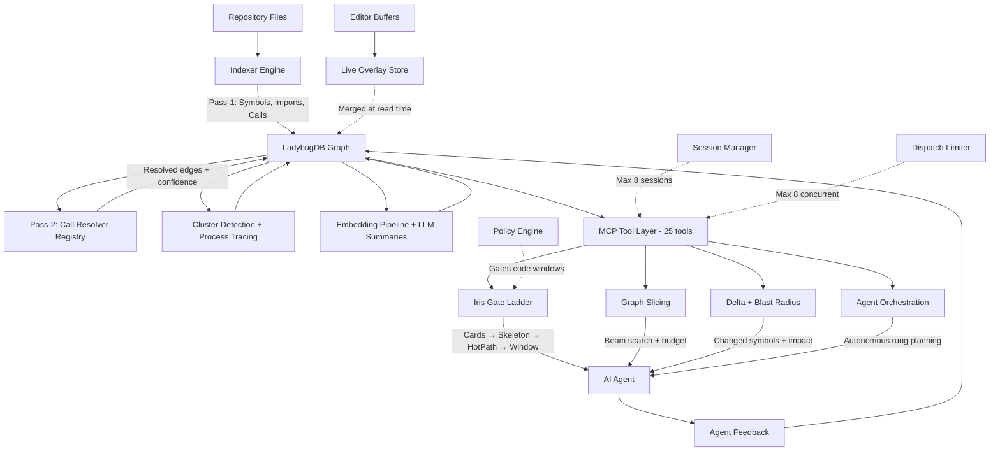

# Architecture: Tech Stack & Data Flow

<div align="right">
<details>
<summary><strong>Docs Navigation</strong></summary>

- [Overview](../README.md)
- [Documentation Hub](./README.md)
  - [Getting Started](./getting-started.md)
  - [CLI Reference](./cli-reference.md)
  - [MCP Tools Reference](./mcp-tools-reference.md)
  - [Configuration Reference](./configuration-reference.md)
  - [Agent Workflows](./agent-workflows.md)
  - [Troubleshooting](./troubleshooting.md)
- [Iris Gate Ladder](./IRIS_GATE_LADDER.md)
- [Architecture (this page)](./ARCHITECTURE.md)
- [Legacy User Guide](./USER_GUIDE.md)

</details>
</div>

SDL-MCP is a high-performance codebase indexing and context retrieval server. This document describes the system architecture, data flow, and key design patterns.

---

## Technical Stack

| Layer | Technology |
|:------|:-----------|
| Runtime | Node.js v20+ / TypeScript 5.9+ (strict, ESM) |
| Database | LadybugDB (embedded graph database, single-file storage, Kuzu engine) |
| MCP SDK | `@modelcontextprotocol/sdk` ^0.4.0 |
| Transports | stdio (CLI agents), HTTP/SSE (network clients) |
| AST parsing | tree-sitter + language grammars (0.21.x) |
| Native addon | Rust via napi-rs (optional, multi-threaded pass-1) |
| Embeddings | ONNX Runtime (MiniLM 384-dim, Nomic 768-dim) |
| Validation | Zod schemas for all tool payloads and responses |

---

## Architectural Pattern

SDL-MCP follows a **hexagonal / ports-and-adapters** design. Each module has a clear role and no cross-layer mutations:

```
                       ┌──────────────────────────────────┐
                       │         MCP Tool Layer           │
                       │  (tools.ts, server.ts, coord.ts) │
                       └────────────┬─────────────────────┘
                                    │
           ┌────────────────────────┼────────────────────────┐
           │                        │                        │
    ┌──────▼──────┐          ┌──────▼──────┐          ┌──────▼──────┐
    │   Indexer    │          │    Graph    │          │    Code     │
    │ (write path) │          │ (read path) │          │ (read path) │
    │              │          │             │          │             │
    │ Pass-1 + 2   │          │ Slice build │          │ Skeleton    │
    │ Clusters     │          │ Beam search │          │ Hot-path    │
    │ Processes    │          │ Spillover   │          │ Windows     │
    │ Summaries    │          │ Card cache  │          │ Gate/policy │
    └──────┬──────┘          └──────┬──────┘          └──────┬──────┘
           │                        │                        │
           └────────────────────────┼────────────────────────┘
                                    │
                       ┌────────────▼─────────────────────┐
                       │       LadybugDB (Graph DB)       │
                       │  Symbols, Edges, Files, Repos,   │
                       │  Clusters, Processes, Versions,   │
                       │  Embeddings, Summaries, Feedback  │
                       └──────────────────────────────────┘
```

- **Indexer** produces pure domain objects (symbols, edges) — owns all writes
- **Graph** reads from DB to build slices — no mutations
- **Delta** reads version pairs, computes diffs on demand — no mutations
- **Code** reads file content and applies policy gating — no mutations
- **DB** owns all persistence (queries + mutations separated by module)

---

## Startup Sequence

`src/main.ts` initializes the system in a strict order:

```
1. loadConfig()                         Config + Zod validation
2. initGraphDb()                        Open/create LadybugDB file
3. ensureConfiguredReposRegistered()     Bootstrap repos into graph
4. getDefaultLiveIndexCoordinator()      Singleton overlay service
5. registerTools(server, services)       Wire 25+ MCP tools
6. setupFileWatchers()                   chokidar for incremental re-index
7. ShutdownManager.register(callbacks)   Graceful cleanup handlers
8. server.start()                        Begin accepting MCP requests
```

Startup is sequenced (not parallel) — the DB must be ready before tools register, and tools must be registered before the transport accepts connections.

---

## Tool Dispatch

All 25 MCP tools flow through a single dispatch path in `src/server.ts`:

```
  Client request
       │
       ▼
  ┌─────────────┐
  │ Zod schema  │──── Validation error ──── Return isError response
  │  validate   │
  └──────┬──────┘
         │ parsed args
         ▼
  ┌─────────────┐
  │  Dispatch   │     ConcurrencyLimiter (max 8 concurrent handlers)
  │   limiter   │     30s queue timeout
  └──────┬──────┘
         │
         ▼
  ┌─────────────┐
  │   Handler   │     Tool-specific logic
  │  executes   │     Returns result + optional _rawContext hint
  └──────┬──────┘
         │
         ▼
  ┌─────────────┐
  │ Post-process│     1. Compute _tokenUsage from _rawContext
  │  pipeline   │     2. Strip _rawContext (internal only)
  └──────┬──────┘     3. logToolCall() telemetry
         │
         ▼
  JSON response wrapped in MCP content format
```

**Sideband system:** Handlers can attach `_rawContext` hints (file IDs or raw token counts). The post-processor computes `_tokenUsage` metadata (SDL tokens vs. raw-file equivalent, savings percentage) and strips internal fields before serialization.

---

## Indexing Pipeline

Indexing happens in two passes plus a finalization stage. Triggered by `sdl-mcp index` (CLI) or `sdl.index.refresh` (MCP tool).

### Pass 1: Local Extraction

Per-file, parallelizable. Each file produces:

```
  Source file (.ts, .py, .go, ...)
       │
       ▼
  ┌──────────────────┐     Engine selection:
  │   Indexer Engine  │     - Rust native (default, multi-threaded)
  │                   │     - Tree-sitter TS (fallback)
  └──────┬───────────┘
         │
    ┌────┼────┬──────────┐
    ▼    ▼    ▼          ▼
 Symbols Imports Calls  Fingerprints
 (name,  (module, (raw   (SHA-256 of
  kind,   alias,  ident-  symbol
  range,  source) ifiers) parts)
  sig)
```

**Language adapters** (`src/indexer/adapter/`) — one per language, each extends `BaseAdapter`:
- `typescript.ts` (shared by TS/JS)
- `python.ts`, `go.ts`, `java.ts`, `rust.ts`, `csharp.ts`, `c.ts`, `cpp.ts`, `php.ts`, `kotlin.ts`, `shell.ts`

**Native Rust engine** (`native/src/extract/`) — optional, mirrors all TS adapters at near-native speed via napi-rs.

### Pass 2: Cross-File Resolution

Sequential, cross-file. Resolves raw call identifiers to specific symbol IDs using the pass-2 resolver registry (`src/indexer/pass2/registry.ts`):

```
  Raw call edge ("getUserById")
       │
       ▼
  ┌───────────────────┐
  │ Resolver Registry │     11 language-specific resolvers
  │  (registry.ts)    │     registered by file extension
  └──────┬────────────┘
         │
         ▼
  ┌───────────────────┐
  │  Language Resolver │     Import maps, alias chains,
  │  (e.g., ts, go,   │     barrel re-exports, package
  │   python, java)    │     resolution, inheritance
  └──────┬────────────┘
         │
         ▼
  Resolved edge:
    targetSymbolId: "abc123"
    confidence: 0.92
    strategy: "import-alias"
    provenance: "getUserById → import {getUserById} → src/db/users.ts::getUserById"
```

11 language-specific resolvers are registered, all performing semantic cross-file analysis. Every resolver builds a repo-wide index (namespace, module, package, or directory-scoped), follows import/use/include/source chains to resolve call targets, handles language-specific patterns (generics, traits, templates, extensions, header pairs), and assigns stratified confidence scores (same-file 0.93 → imports 0.9 → same-scope 0.88–0.92 → fallback 0.45–0.78). TS and JS share one resolver implementation; the remaining 10 languages each have a dedicated resolver (700–1,350 lines).

### Finalization

After pass 1 + 2:

1. **Cluster detection** — Label Propagation Algorithm (Rust addon or TS fallback) groups highly-coupled symbols
2. **Process tracing** — call-chain analysis identifies entry/intermediate/exit roles
3. **Embedding generation** — ONNX models produce vector embeddings for semantic search
4. **LLM summaries** — optional, generates 1-3 sentence descriptions per symbol via API (Anthropic, Ollama, or mock)
5. **Version bump** — new ledger version recorded in graph

---

## Database Architecture

### LadybugDB (Embedded Graph Database)

SDL-MCP uses LadybugDB (Kuzu engine, npm alias `kuzu`) as the sole persistence layer. The database is a single file on disk (`.lbug` extension).

**Path resolution** (`src/db/initGraphDb.ts`):
1. `SDL_GRAPH_DB_PATH` env var (or legacy `SDL_DB_PATH`)
2. `graphDatabase.path` in config
3. Default: `<configDir>/sdl-mcp-graph.lbug`

**Schema** (`src/db/ladybug-schema.ts`) — idempotent DDL runs on startup. No migration files needed.

**Connection pool:**

```
  ┌─────────────────────────────────────┐
  │           Connection Pool           │
  │                                     │
  │  Read connections (round-robin):    │
  │    [conn-1] [conn-2] [conn-3] [4]  │
  │    Default: 4, configurable 1-8     │
  │                                     │
  │  Write connection (serialized):     │
  │    [write-conn] ◄── ConcurrencyLimiter(1)
  │    All mutations queued through     │
  │    withWriteConn(async fn)          │
  └─────────────────────────────────────┘
```

Read pool enables concurrent multi-session reads (4-6 MCP sessions). Write serialization prevents graph corruption.

### Graph Schema (Node + Edge Tables)

| Node Table | Key Fields |
|:-----------|:-----------|
| **Repo** | repoId, rootPath, configJson, createdAt |
| **File** | fileId, repoId, relPath, byteSize, contentHash |
| **Symbol** | symbolId, repoId, fileId, kind, name, exported, signatureJson, summary, etag |
| **Version** | versionId, repoId, timestamp, indexedAt |
| **Cluster** | clusterId, label, memberCount |
| **Process** | processId, label, repoId |
| **SummaryCache** | symbolId, summary, provider, model, cardHash, costUsd |
| **SliceHandle** | handle, createdAt, expiresAt, minVersion, maxVersion |

| Edge Table | From → To | Key Fields |
|:-----------|:----------|:-----------|
| **CALLS** | Symbol → Symbol | confidence, resolverStrategy, provenance |
| **IMPORTS** | Symbol → Symbol | importKind, alias |
| **DEFINED_IN** | Symbol → File | — |
| **BELONGS_TO** | File → Repo | — |
| **BELONGS_TO_CLUSTER** | Symbol → Cluster | membershipScore |
| **PARTICIPATES_IN** | Symbol → Process | stepOrder, role |

### Query Modules

Each module owns a specific domain of queries:

| Module | Purpose |
|:-------|:--------|
| `ladybug-repos.ts` | Repo CRUD, registration, config |
| `ladybug-symbols.ts` | Symbol upsert, search, ETag, batch fetch |
| `ladybug-edges.ts` | Call/import edge mutations, confidence updates |
| `ladybug-versions.ts` | Version chain, timestamp tracking |
| `ladybug-clusters.ts` | Cluster membership, label queries |
| `ladybug-processes.ts` | Process steps, role queries |
| `ladybug-embeddings.ts` | Vector storage, nearest-neighbor queries |
| `ladybug-metrics.ts` | Fan-in/out, churn, test refs |
| `ladybug-feedback.ts` | Agent feedback, audit events |
| `ladybug-slices.ts` | Slice handles, lease expiry |

---

## Graph Slicing

The slice builder (`src/graph/slice.ts`) constructs task-scoped context subgraphs bounded by a token budget.

```
  Entry symbols (explicit IDs or auto-discovered from taskText)
       │
       ▼
  ┌──────────────────────────┐
  │  Start-Node Resolver     │     Resolves entry symbols from:
  │  (start-node-resolver.ts)│     - explicit symbolIds
  │                          │     - taskText full-text search
  └──────────┬───────────────┘     - stackTrace parsing
             │                     - editedFiles lookup
             ▼
  ┌──────────────────────────┐
  │  Beam-Search Engine      │     BFS with weighted edges:
  │  (beam-search-engine.ts) │       call: 1.0
  │                          │       config: 0.8
  │                          │       import: 0.6
  │  Adaptive minConfidence  │     Top-K frontier pruning
  │  Budget tracking         │     Stops at maxCards or maxTokens
  └──────────┬───────────────┘
             │
             ▼
  ┌──────────────────────────┐
  │  Slice Serializer        │     Converts to SymbolCards:
  │  (slice-serializer.ts)   │     - Adaptive detail level
  │                          │     - Edge filtering (in-slice only)
  │  Wire format V1/V2/V3    │     - ETag dedup (knownCardEtags)
  │  Token estimation        │     - Spillover handle for overflow
  └──────────────────────────┘
```

**Card detail levels** — the serializer adapts detail based on remaining budget:

| Level | Fields Included | ~Tokens |
|:------|:----------------|:--------|
| minimal | name, kind, range | ~15 |
| signature | + signature, summary (truncated) | ~40 |
| deps | + dependencies (filtered to slice) | ~80 |
| full | everything (invariants, metrics, cluster, process) | ~135 |

**Wire format versions:** V1 (compact field names), V2 (deduplicated lookup tables), V3 (grouped edge encoding for large slices).

---

## Context Ladder (Iris Gate)

The four-rung escalation ladder controls how much raw code an agent receives:

```
  Rung 1: Symbol Cards           ~50-135 tokens/symbol
  ──────────────────────          Always available
       │ need more?
       ▼
  Rung 2: Skeleton IR            ~200 tokens/function
  ──────────────────────          Signatures + control flow, bodies elided
       │ need more?
       ▼
  Rung 3: Hot-Path Excerpt       ~500 tokens
  ──────────────────────          Only lines matching requested identifiers
       │ need more?
       ▼
  Rung 4: Full Code Window       variable
  ──────────────────────          Gated — requires proof-of-need justification
```

### Skeleton (`src/code/skeleton.ts`)
Deterministic code outline using tree-sitter. Keeps imports, type declarations, and signatures verbatim. Elides function/class bodies. Supports all 12 indexed languages.

### Hot-Path (`src/code/hotpath.ts`)
Finds lines matching requested identifiers with configurable context lines before/after each match. Returns excerpt, matched line numbers, and which identifiers were found.

### Proof-of-Need Gating (`src/code/gate.ts`)

```
  needWindow request
  (symbolId, reason, expectedLines, identifiersToFind)
       │
       ▼
  ┌────────────────────────────────────────────┐
  │              Policy Engine                  │
  │                                            │
  │  Priority 100: Hard caps (180 lines max)   │
  │  Priority  90: Identifiers required        │
  │  Priority  80: Budget enforcement          │
  │  Priority  10: Break-glass override        │
  │                                            │
  │  Approval if:                              │
  │    - Identifiers exist in window range     │
  │    - Symbol in current slice or frontier    │
  │    - Utility score > threshold             │
  │    - Break-glass with audit trail          │
  │                                            │
  │  Denial includes:                          │
  │    - Reason                                │
  │    - Suggested alternative tool            │
  │    - NextBestAction (e.g., "try skeleton") │
  └────────────────────────────────────────────┘
```

---

## Delta & Blast Radius

`src/delta/` computes semantic diffs between ledger versions.

**Delta computation** (`diff.ts`) — compares two version snapshots, producing changed symbols with signature/invariant/side-effect diffs.

**Blast radius** (`blastRadius.ts`) — BFS traversal of reverse dependency edges from changed symbols:

```
  Changed symbols
       │
       ▼
  ┌─────────────────────────────┐
  │ BFS reverse edge traversal  │     Walks dependents via
  │ (imports + calls + config)  │     reverse call/import edges
  └──────────┬──────────────────┘
             │
             ▼
  ┌─────────────────────────────┐
  │  Scoring & ranking          │
  │                             │
  │  score = 0.6 × distance    │     distance: graph hops
  │        + 0.3 × fanIn       │     fanIn: incoming edges
  │        + 0.1 × testProx    │     testProx: test file reachability
  │                             │
  │  Fan-in amplifiers          │     Symbols with rising fan-in
  │  across versions            │     flagged for extra attention
  └─────────────────────────────┘
```

**PR risk analysis** (`src/mcp/tools/prRisk.ts`) — builds on blast radius to recommend test targets and flag high-risk changes.

---

## Live Indexing

The live index system (`src/live-index/`) provides draft-aware code intelligence for unsaved editor buffers.

```
  Editor (VSCode, etc.)
       │
       │  buffer.push (on each keystroke/save)
       ▼
  ┌──────────────────────────────────────┐
  │  Overlay Store (in-memory)           │
  │                                      │
  │  Per-repo, per-file draft entries:   │
  │  - content (current buffer text)     │
  │  - version (monotonic, rejects stale)│
  │  - parseResult (symbols + edges)     │
  │  - dirty flag                        │
  └──────────┬───────────────────────────┘
             │
             │  Debounced parse jobs
             ▼
  ┌──────────────────────────────────────┐
  │  Live Index Coordinator              │
  │  (InMemoryLiveIndexCoordinator)      │
  │                                      │
  │  - Parse queue + worker              │
  │  - Reconcile queue (DB merge)        │
  │  - Checkpoint service (persist)      │
  │  - Idle monitor (auto-checkpoint)    │
  └──────────────────────────────────────┘
             │
             ▼
  Overlay merged into all reads:
  search, getCard, slice.build, getSkeleton
```

**Version conflict:** `upsertDraft()` rejects updates where `update.version < existing.version` — prevents out-of-order edits from overwriting newer content.

---

## Transport & Multi-Session

### stdio Transport (Default)

Single-session, used by CLI agents (Claude Code, etc.). One MCPServer instance handles all requests.

### HTTP Transport (`src/cli/transport/http.ts`)

Multi-session, per-session server isolation:

```
  ┌───────────────────────────────────────────────────────┐
  │                   HTTP Server                          │
  │                                                        │
  │  POST /mcp                                             │
  │       │                                                │
  │       ▼                                                │
  │  ┌──────────────────────────────────────────────────┐  │
  │  │  SessionManager (max 8 sessions)                 │  │
  │  │  - reserveSession() → reserves slot              │  │
  │  │  - registerSession() → transitions to active     │  │
  │  │  - Idle reaper (5 min timeout, 1 min check)      │  │
  │  └──────────────────────────────────────────────────┘  │
  │       │                                                │
  │       ▼                                                │
  │  Per-session resources:                                │
  │    transports: Map<sessionId, Transport>               │
  │    mcpServers: Map<sessionId, MCPServer>                │
  │                                                        │
  │  REST API (non-MCP):                                   │
  │    /health              → DB health check              │
  │    /api/repo/:id/buffer → buffer.push                  │
  │    /api/graph/:id/...   → graph visualization          │
  │    /api/symbol/:id/...  → symbol lookup                │
  │    /ui/graph            → static visualization UI      │
  │                                                        │
  │  EventStore (in-memory):                               │
  │    Message replay on reconnect (max 1000 events)       │
  │    FIFO eviction                                       │
  └───────────────────────────────────────────────────────┘
```

Each connected client gets its own `MCPServer` instance, ensuring complete session isolation. The `SessionManager` enforces the 8-session limit and reaps idle connections.

---

## Concurrency Control

| Limiter | Scope | Max | Timeout | Purpose |
|:--------|:------|:----|:--------|:--------|
| Tool dispatch | Per-server | 8 concurrent | 30s queue | Prevents handler starvation |
| DB write conn | Global | 1 (serialized) | — | Graph integrity |
| DB read pool | Global | 4 connections | — | Concurrent multi-session reads |
| Session manager | Global | 8 sessions | 5 min idle | Resource limits |
| Summary batch | Per-index | 5 concurrent | — | API rate limiting |

**ConcurrencyLimiter** (`src/util/concurrency.ts`) — generic queue-based limiter reused across the system.

---

## Semantic Engine

Three subsystems that enhance code intelligence beyond structural analysis:

### Pass-2 Call Resolution
11 language-specific resolvers that trace import chains and resolve raw call identifiers to symbolIds with confidence scores (0.0-1.0). See [Semantic Engine deep dive](./feature-deep-dives/semantic-engine.md).

### Embedding Search
Alpha-blended lexical + embedding similarity reranking using ONNX models. Two models available:
- **all-MiniLM-L6-v2** (384-dim, ~22 MB, bundled) — general-purpose, best with LLM summaries
- **nomic-embed-code-v1** (768-dim, ~274 MB, downloaded) — code-trained, works without summaries

### LLM Summaries
1-3 sentence semantic descriptions generated per symbol. Three providers (Anthropic API, OpenAI-compatible/Ollama, mock). Cached with content-addressed hashing. See [Indexing Languages deep dive](./feature-deep-dives/indexing-languages.md#llm-generated-summaries).

---

## Error Handling

**Typed errors** (`src/mcp/errors.ts`):
- `ConfigError`, `DatabaseError`, `ValidationError`, `IndexError`, `PolicyError`, `NotFoundError`
- `errorToMcpResponse()` converts any error to MCP-safe JSON

**Policy denials** include actionable guidance:
```
{
  "error": {
    "message": "Window exceeds 180 line limit",
    "code": "POLICY_ERROR",
    "nextBestAction": "requestSkeleton",
    "requiredFieldsForNext": { "symbolId": "sym-1", "repoId": "repo-1" }
  }
}
```

**Graceful degradation:**
- Rust native indexer unavailable → falls back to tree-sitter TS
- ONNX runtime unavailable → falls back to mock embeddings
- LLM API unavailable → skips summary generation (uses heuristic)
- Live index disabled → reads from persisted DB only

---

## Source Directory Map

```
src/
├── main.ts                    Server entry point + bootstrap
├── server.ts                  MCPServer class + tool dispatch
├── cli/
│   ├── commands/              CLI commands (init, doctor, index, serve, version)
│   └── transport/             stdio + HTTP transport setup
├── config/
│   └── types.ts               Zod config schemas
├── db/
│   ├── initGraphDb.ts         DB path resolution + initialization
│   ├── ladybug-schema.ts      Idempotent Cypher DDL
│   └── ladybug-*.ts           Per-domain query modules (12 files)
├── indexer/
│   ├── indexer.ts             Main indexing orchestrator
│   ├── adapter/               Language adapters (12 languages)
│   ├── pass2/                 Cross-file resolvers (11 resolvers)
│   ├── import-resolution/     Import chain analysis
│   ├── embeddings.ts          ONNX embedding pipeline
│   ├── summary-generator.ts   LLM summary providers
│   └── watcher.ts             File system monitoring
├── graph/
│   └── slice/                 Beam search, serializer, start-node resolver
├── delta/
│   ├── diff.ts                Version diff computation
│   └── blastRadius.ts         Impact analysis
├── code/
│   ├── skeleton.ts            Deterministic code outline
│   ├── hotpath.ts             Identifier-filtered excerpts
│   ├── gate.ts                Proof-of-need gating
│   └── windows.ts             Raw code extraction
├── policy/
│   └── engine.ts              Rule-based decision engine
├── live-index/
│   ├── overlay-store.ts       In-memory draft storage
│   └── coordinator.ts         Parse queue + reconciliation
├── mcp/
│   ├── tools.ts               Zod schemas for all 25 tools
│   ├── tools/                 Handler implementations (12 files)
│   ├── errors.ts              Typed error hierarchy
│   ├── telemetry.ts           Tool call logging
│   ├── token-usage.ts         Sideband token accounting
│   ├── session-manager.ts     Multi-session lifecycle
│   └── dispatch-limiter.ts    Concurrency gate (singleton)
└── util/
    ├── paths.ts               Windows path normalization
    ├── concurrency.ts         Generic ConcurrencyLimiter
    └── hashing.ts             SHA-256 utilities
```

---

## Component Diagram



[Back to README](../README.md)
