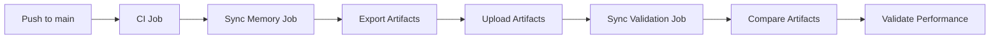

# CI Memory Sync Operations Guide

<div align="right">
<details>
<summary><strong>Docs Navigation</strong></summary>

- [Overview](../README.md)
- [Documentation Hub](./README.md)
  - [Getting Started](./getting-started.md)
  - [CLI Reference](./cli-reference.md)
  - [MCP Tools Reference](./mcp-tools-reference.md)
  - [Configuration Reference](./configuration-reference.md)
  - [Agent Workflows](./agent-workflows.md)
  - [Troubleshooting](./troubleshooting.md)
- [Legacy User Guide](./USER_GUIDE.md)

</details>
</div>

## Overview

CI Memory Sync automates the synchronization of indexed code memory across continuous integration workflows. This ensures that indexed state is consistently maintained, exported, and validated on every successful main branch merge.

**Key Benefits:**

- **Continuous Memory Updates**: Automatically updates indexed memory on every main branch merge
- **Cross-Platform Validation**: Validates sync behavior across Linux and Windows environments
- **Performance Tracking**: Monitors and validates sync operations against performance budgets
- **Artifact Traceability**: Links sync artifacts to Git commit SHAs for audit trails
- **Failure Recovery**: Provides rollback procedures and troubleshooting guidance

## Architecture

### CI Workflow Integration

The CI workflow consists of three main jobs:

1. **CI Job** (`ci`): Runs standard tests and builds
2. **Sync Memory Job** (`sync-memory`): Indexes and exports memory on main branch merges
3. **Sync Validation Job** (`sync-validation`): Cross-platform artifact comparison



### Job Dependencies

- `sync-memory` depends on `ci` (only runs after successful CI)
- `sync-validation` depends on `sync-memory` (only runs after successful sync)
- Both sync jobs only run on `push` to `refs/heads/main`

## Setup

### Prerequisites

- Node.js >= 18.0.0
- Git repository with proper `.github/workflows/ci.yml`
- SDL-MCP installed and configured
- Write permissions for `data/` and `.sdl-sync/` directories

### Configuration

The CI workflow uses these environment variables:

| Variable         | Description         | Default                       |
| ---------------- | ------------------- | ----------------------------- |
| `SDL_CONFIG`     | Path to config file | auto-discovered if unset |
| `SDL_CONFIG_PATH` | Alternate config path env var | (none)               |
| `SDL_CONFIG_HOME` | Default global config directory override | platform default |
| `SDL_DB_PATH`    | Override SQLite DB path | (none)                      |

### Workflow Configuration

The CI workflow is configured in `.github/workflows/ci.yml`:

```yaml
sync-memory:
  name: Sync Indexed Memory (${{ matrix.os }}, Node ${{ matrix.node-version }})
  runs-on: ${{ matrix.os }}
  needs: ci
  if: github.event_name == 'push' && github.ref == 'refs/heads/main'
  strategy:
    matrix:
      os: [ubuntu-latest, windows-latest]
      node-version: [20.x]
```

**Key Settings:**

- `needs: ci`: Only runs after successful CI job
- `if: github.event_name == 'push' && github.ref == 'refs/heads/main'`: Only on main merges
- `matrix.os: [ubuntu-latest, windows-latest]`: Cross-platform validation
- `matrix.node-version: [20.x]`: Single Node.js version for consistency

### Artifact Storage

Sync artifacts are stored in CI artifact storage with:

- **Retention**: 30 days
- **Naming**: `sync-artifact-{os}` (e.g., `sync-artifact-ubuntu-latest`)
- **Path**: `./ci-artifacts/sync-{os}-{sha}.sdl-artifact.json`

## Performance Budgets

CI Memory Sync validates performance budgets to keep CI feedback loops fast.

| Operation | Linux Budget | Windows Budget | Rationale |
| --------- | ------------ | -------------- | --------- |
| Index     | 45s          | 70s            | Filesystem-heavy indexing varies by OS |
| Export    | 8s           | 10s            | Artifact serialization and compression |
| Total     | 52s          | 78s            | End-to-end sync job budget |

### Performance Validation

The workflow automatically validates against budgets:

```yaml
- name: Validate sync performance budget
  shell: bash
  run: |
    if [ "${{ runner.os }}" = "Windows" ]; then
      # Windows runners have higher variance for filesystem-heavy indexing.
      MAX_INDEX_MS=70000
      MAX_EXPORT_MS=10000
      MAX_TOTAL_MS=78000
    else
      MAX_INDEX_MS=45000
      MAX_EXPORT_MS=8000
      MAX_TOTAL_MS=52000
    fi

    # Validation logic...
```

**Budget Exceedance:**

- If budget is exceeded, the job fails
- Metrics are displayed in CI logs
- See [Troubleshooting](#troubleshooting) for remediation

## Failure Scenarios

### Scenario 1: Index Timeout

**Symptoms:**

```
[ERROR] Index duration exceeded budget: 48000ms > 45000ms
```

**Causes:**

- Large repository with many files
- Slow CI runner performance
- Network issues with dependency fetching
- Complex codebase with deep nesting

**Recovery:**

1. Check repository size and file count
2. Consider increasing `MAX_INDEX_MS` budget (if justified)
3. Add more ignore patterns to exclude non-essential files
4. Use `--repo-id` to index specific repositories

**Example Adjustment:**

```yaml
MAX_INDEX_MS=60000 # Increase for large repos
```

### Scenario 2: Export Failure

**Symptoms:**

```
[ERROR] Export failed: Artifact integrity check failed: hash mismatch
```

**Causes:**

- Database corruption during export
- Insufficient disk space for artifact
- Gzip compression failure
- Memory exhaustion during compression

**Recovery:**

1. Verify database integrity
2. Check available disk space
3. Reduce repository size or increase memory
4. Re-run the workflow manually

**Manual Retry:**

```bash
git push origin main --force-with-lease
# Or trigger manually via GitHub Actions UI
```

### Scenario 3: Artifact Import Validation Failure

**Symptoms:**

```
[ERROR] Artifact file not found: ./ci-artifacts/sync-ubuntu-latest-abc123.sdl-artifact.json
```

**Causes:**

- Artifact upload failed
- Artifact retention expired
- Network issues during download
- Incorrect artifact path

**Recovery:**

1. Check CI logs for upload errors
2. Verify artifact retention period (30 days)
3. Re-trigger the workflow
4. Manually export artifact locally

### Scenario 4: Cross-Platform Mismatch

**Symptoms:**

```
⚠ Artifacts differ (expected for different commit SHAs)
```

**Causes:**

- Different commit SHAs across platforms
- Platform-specific path handling
- File system differences (case sensitivity)
- Encoding differences

**Recovery:**

1. Verify both artifacts reference the same commit SHA
2. Check for platform-specific paths in configuration
3. Ensure consistent `.gitignore` across platforms
4. Review file system encoding settings

**Expected Behavior:**

- Artifacts should match if built from the same commit SHA
- Minor differences are acceptable for different commit SHAs
- Both artifacts must be independently valid

## Rollback Procedures

### Rollback to Previous Artifact

**Use Case:** Sync corruption or data loss

**Steps:**

1. Identify the last successful commit SHA
2. Download the previous artifact from CI storage
3. Import the artifact locally

```bash
# 1. Find previous successful commit
git log --oneline -10

# 2. Download artifact via GitHub UI
# Navigate to Actions -> Select workflow run -> Artifacts

# 3. Import artifact
sdl-mcp import --artifact-path ./sync-ubuntu-latest-previous.sdl-artifact.json
```

### Rollback CI Configuration

**Use Case:** CI workflow breaking changes

**Steps:**

1. Revert CI workflow commit
2. Delete sync artifacts (optional)
3. Re-run CI pipeline

```bash
# 1. Revert workflow change
git revert <commit-sha>
git push origin main

# 2. Optional: Clear artifacts via GitHub UI
# Navigate to Actions -> Artifacts -> Delete

# 3. Re-run workflow manually
```

### Emergency Rollback

**Use Case:** Critical CI failures blocking development

**Steps:**

1. Disable sync job temporarily
2. Merge fix commit
3. Re-enable sync job

```yaml
# Temporary disable
sync-memory:
  if: false  # Disable sync job

# After fix, re-enable
sync-memory:
  if: github.event_name == 'push' && github.ref == 'refs/heads/main'
```

## Monitoring and Observability

### CI Metrics

The workflow outputs these metrics:

| Metric          | Description               | Location   |
| --------------- | ------------------------- | ---------- |
| `duration_ms`   | Operation duration        | Job output |
| `artifact_hash` | Artifact integrity hash   | Job output |
| `commit_sha`    | Git commit SHA            | Job output |
| `branch`        | Branch name               | Job output |
| `file_count`    | Number of files indexed   | Job output |
| `symbol_count`  | Number of symbols indexed | Job output |

### Log Analysis

**View Sync Logs:**

```bash
# In GitHub Actions UI
# Navigate to workflow run -> sync-memory job -> View logs
```

**Key Log Sections:**

```
Starting CI memory index on ubuntu-latest...
[OK] Index completed in 24532ms
Exporting sync artifact for CI...
[OK] Export completed in 3241ms
Validating performance budget...
[OK] Performance budget validated
```

### Alerting

Consider setting up alerts for:

- Budget exceedances (>10% over budget)
- Artifact validation failures
- Cross-platform mismatches
- Job failures after 3 retries

## Troubleshooting

### "No repository specified or configured"

**Cause:** SDL-MCP not initialized

**Fix:**

```bash
# Add to CI workflow after checkout
- name: Initialize SDL-MCP
  run: |
    node dist/cli/index.js init --force
```

### "Artifact integrity check failed"

**Cause:** Corrupted artifact or hash mismatch

**Fix:**

1. Verify artifact file integrity
2. Check for network issues during upload
3. Re-run the workflow
4. Manually validate artifact locally

```bash
# Local validation
sdl-mcp import --artifact-path artifact.json
```

### "Sync duration exceeded budget"

**Cause:** Performance regression or large repository

**Fix:**

1. Profile the indexing operation
2. Review repository size and complexity
3. Consider adjusting budget (if justified)
4. Optimize repository structure

```bash
# Profile indexing
time sdl-mcp index --repo-id my-repo
```

### "Cross-platform artifacts differ significantly"

**Cause:** Platform-specific configuration or paths

**Fix:**

1. Review configuration for platform-specific paths
2. Ensure consistent `.gitignore` across platforms
3. Check for case-sensitive file systems
4. Verify encoding settings

## Best Practices

### 1. Repository Configuration

```json
{
  "repos": [
    {
      "repoId": "my-repo",
      "rootPath": "/path/to/repo",
      "ignore": [
        "**/node_modules/**",
        "**/dist/**",
        "**/coverage/**",
        "**/.git/**"
      ],
      "maxFileBytes": 2000000
    }
  ],
  "dbPath": "./data/sdlmcp.sqlite",
  "policy": {
    "maxWindowLines": 180,
    "maxWindowTokens": 1400,
    "requireIdentifiers": true,
    "allowBreakGlass": true
  },
  "indexing": { "concurrency": 8, "enableFileWatching": false }
}
```

### 2. Ignore Patterns

Exclude non-essential files to improve performance:

```json
"ignore": [
  "**/node_modules/**",
  "**/dist/**",
  "**/build/**",
  "**/coverage/**",
  "**/.git/**",
  "**/*.min.js",
  "**/*.min.css"
]
```

### 3. Artifact Management

- Keep retention period reasonable (30 days)
- Clean up old artifacts periodically
- Monitor artifact storage costs
- Archive historical artifacts if needed

### 4. Performance Optimization

- Use caching for dependencies
- Parallelize indexing when possible
- Optimize ignore patterns
- Monitor and tune budgets

### 5. Security

- Verify artifact integrity on import
- Use `--verify` flag for all imports
- Review artifact hashes regularly
- Audit access to CI artifacts

## Maintenance

### Regular Tasks

| Task                       | Frequency | Command                 |
| -------------------------- | --------- | ----------------------- |
| Review performance metrics | Weekly    | Check CI logs           |
| Clean old artifacts        | Monthly   | GitHub Actions UI       |
| Update budgets             | Quarterly | Review repo size        |
| Audit artifact integrity   | Monthly   | `sdl-mcp export --list` |

### Update Performance Budgets

1. Analyze performance trends
2. Assess repository growth
3. Adjust budgets accordingly
4. Document justification

```yaml
# Example budget update
MAX_INDEX_MS=45000  # Increased due to 50% repo growth
MAX_EXPORT_MS=6000  # Slight increase
MAX_TOTAL_MS=51000
```

### Upgrade Procedure

When upgrading SDL-MCP:

1. Test in feature branch first
2. Verify sync artifact compatibility
3. Update CI workflow if needed
4. Monitor performance after upgrade

## Appendix

### CI Workflow Reference

**Workflow File:** `.github/workflows/ci.yml`

**Jobs:**

- `ci`: Standard CI tests and builds
- `sync-memory`: Memory indexing and export
- `sync-validation`: Cross-platform validation

**Triggers:**

- Push to `main` branch
- Pull requests to `main`
- Manual workflow dispatch

### Performance Budget Rationale

**Index (30s):**

- Based on ~1000 files with 5-10 symbols per file
- Assumes 3ms per file average
- Includes database writes and indexing

**Export (5s):**

- Based on artifact size ~1MB
- Assumes gzip compression at ~200MB/s
- Includes JSON serialization and file I/O

**Total (35s):**

- Ensures fast feedback loops
- Allows for CI queue time
- Balances thoroughness with speed

### Related Documentation

- [Sync Artifact Documentation](sync-artifacts.md)
- [User Guide](USER_GUIDE.md)
- [Testing Guide](TESTING.md)
- [PR Risk Implementation](PR_RISK_IMPLEMENTATION.md)

## Support

For issues or questions:

1. Check [Troubleshooting](#troubleshooting)
2. Review CI logs for detailed errors
3. Check [Related Documentation](#related-documentation)
4. Open an issue with:
   - CI workflow run URL
   - Error messages and logs
   - Repository size and complexity
   - Steps to reproduce
