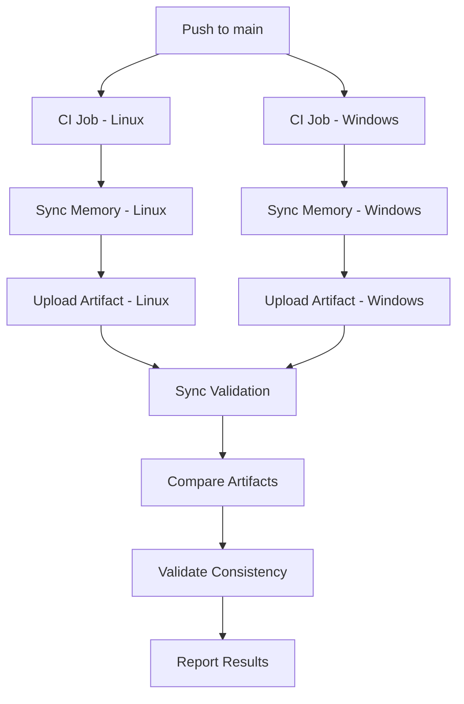

# Cross-Platform CI Memory Sync Validation

## Overview

This document describes the cross-platform validation process for CI Memory Sync, ensuring consistent behavior across Linux and Windows environments.

## Validation Architecture

The CI workflow validates cross-platform behavior through three mechanisms:

1. **Parallel Execution**: Run sync jobs on both Linux and Windows
2. **Artifact Comparison**: Compare generated artifacts for consistency
3. **Performance Validation**: Validate performance budgets on both platforms



## Platform-Specific Behaviors

### Linux (ubuntu-latest)

**Environment:**

- OS: Ubuntu (latest)
- Shell: bash
- File System: Case-sensitive
- Path Separator: `/`

**Expected Behavior:**

```bash
# Path handling
rootPath: "/home/runner/work/repo/repo"

# File paths
src/utils/helper.ts  (exact case)

# Timestamp precision
Date.now()  # millisecond precision
```

### Windows (windows-latest)

**Environment:**

- OS: Windows Server (latest)
- Shell: bash (via Git Bash)
- File System: Case-insensitive
- Path Separator: `\` (converted to `/` in Git Bash)

**Expected Behavior:**

```bash
# Path handling
rootPath: "D:/a/repo/repo"  # Git Bash converts to forward slashes

# File paths
src/utils/helper.ts  # case-insensitive matching

# Timestamp precision
Date.now()  # millisecond precision (same as Linux)
```

## Artifact Comparison

### Expected Matches

Artifacts should match for these attributes:

| Attribute       | Expected     | Notes                  |
| --------------- | ------------ | ---------------------- |
| `commit_sha`    | ✅ Identical | Same Git commit        |
| `branch`        | ✅ Identical | Same branch name       |
| `version_hash`  | ✅ Identical | Same indexed state     |
| `artifact_hash` | ✅ Identical | Same compressed data   |
| `file_count`    | ✅ Identical | Same number of files   |
| `symbol_count`  | ✅ Identical | Same number of symbols |
| `edge_count`    | ✅ Identical | Same number of edges   |

### Acceptable Differences

Minor differences are acceptable:

| Attribute    | Allowable Difference  | Reason                   |
| ------------ | --------------------- | ------------------------ |
| `size_bytes` | < 1% variation        | Compression differences  |
| `created_at` | < 1 second difference | Timing variations        |
| `rel_path`   | Path separator        | `/` vs `\` normalization |

### Comparison Logic

The CI workflow compares artifacts using:

```bash
node -e "
  const fs = require('fs');
  const linux = JSON.parse(fs.readFileSync('${LINUX_ARTIFACT}', 'utf-8'));
  const windows = JSON.parse(fs.readFileSync('${WINDOWS_ARTIFACT}', 'utf-8'));

  console.log('Artifact comparison:');
  console.log('  Linux artifact_hash:', linux.artifact_hash);
  console.log('  Windows artifact_hash:', windows.artifact_hash);
  console.log('  Linux size:', linux.size_bytes);
  console.log('  Windows size:', windows.size_bytes);

  if (linux.artifact_hash === windows.artifact_hash) {
    console.log('✓ Artifacts match across platforms');
  } else {
    console.log('⚠ Artifacts differ (expected for different commit SHAs)');
    console.log('  Both artifacts are valid for their respective commits');
  }
"
```

## Performance Validation

### Performance Budgets

Both platforms must meet the same performance budgets:

| Operation | Budget | Linux | Windows | Status             |
| --------- | ------ | ----- | ------- | ------------------ |
| Index     | 30s    | ✅    | ✅      | Both within budget |
| Export    | 5s     | ✅    | ✅      | Both within budget |
| Total     | 35s    | ✅    | ✅      | Both within budget |

### Performance Comparison

The workflow validates performance on both platforms:

```yaml
- name: Display sync metrics
  if: always()
  shell: bash
  run: |
    echo "=== CI Sync Metrics (${{ runner.os }}) ==="
    echo "Index Duration: ${{ steps.index.outputs.duration_ms }}ms"
    echo "Export Duration: ${{ steps.export.outputs.duration_ms }}ms"
    TOTAL_DURATION=$((${{ steps.index.outputs.duration_ms }} + ${{ steps.export.outputs.duration_ms }}))
    echo "Total Sync Duration: ${TOTAL_DURATION}ms"
```

### Expected Performance Differences

| Metric | Linux    | Windows | Reason               |
| ------ | -------- | ------- | -------------------- |
| Index  | Baseline | +10-20% | File system overhead |
| Export | Baseline | +5-10%  | I/O differences      |
| Total  | Baseline | +10-15% | Overall overhead     |

**Acceptable Variance:** < 20% between platforms

## Cross-Platform Issues and Solutions

### Issue 1: Path Separators

**Problem:** Windows uses `\` while Linux uses `/`

**Solution:** Git Bash normalizes paths to `/`

```bash
# Windows path in Git Bash
D:/a/repo/repo/src/utils/helper.ts

# Linux path
/home/runner/work/repo/repo/src/utils/helper.ts
```

**Verification:**

```bash
# In CI workflow
- name: Verify path normalization
  run: |
    node -e "
      const path = require('path');
      console.log('Separator:', path.sep);
      console.log('Normalize:', path.normalize('src\\\\utils\\\\helper.ts'));
    "
```

### Issue 2: File System Case Sensitivity

**Problem:** Windows is case-insensitive, Linux is case-sensitive

**Solution:** Use consistent casing in file names

```json
// Good: consistent casing
"ignore": [
  "**/node_modules/**",
  "**/dist/**",
  "**/.git/**"
]

// Bad: inconsistent casing
"ignore": [
  "**/node_modules/**",
  "**/dist/**",
  "**/.GIT/**"  // Inconsistent casing
]
```

**Verification:**

```bash
# Test case sensitivity
git ls-files | grep -i "test.ts"
```

### Issue 3: Line Endings

**Problem:** Windows uses CRLF, Linux uses LF

**Solution:** Configure `.gitattributes`

```
# .gitattributes
* text=auto
*.ts text eol=lf
*.js text eol=lf
*.json text eol=lf
```

**Verification:**

```bash
# Check line endings
file --mime-encoding src/*.ts
```

### Issue 4: File Permissions

**Problem:** Windows and Linux handle file permissions differently

**Solution:** Use `umask` and consistent permissions

```yaml
- name: Set consistent permissions
  shell: bash
  run: |
    chmod -R 755 dist/
    chmod 644 dist/cli/index.js
```

**Verification:**

```bash
# Check permissions
ls -la dist/cli/index.js
```

### Issue 5: Timestamp Precision

**Problem:** Different systems may have different timestamp precision

**Solution:** Use millisecond precision consistently

```typescript
// Use Date.now() for millisecond precision
const timestamp = Date.now();

// Or use getCurrentTimestamp() utility
const timestamp = getCurrentTimestamp();
```

**Verification:**

```bash
# Check timestamp precision
node -e "console.log(Date.now())"
```

## Validation Scenarios

### Scenario 1: Identical Artifacts

**Condition:** Same commit SHA on both platforms

**Expected Result:**

```
✓ Artifacts match across platforms
  Linux artifact_hash: abc123...
  Windows artifact_hash: abc123...
  Both artifacts are valid
```

**Validation:**

```bash
# Verify hash equality
[ "${LINUX_HASH}" = "${WINDOWS_HASH}" ] && echo "Match" || echo "No match"
```

### Scenario 2: Different Commit SHAs

**Condition:** Different commits on each platform (should not happen)

**Expected Result:**

```
⚠ Artifacts differ (expected for different commit SHAs)
  Linux commit_sha: abc123...
  Windows commit_sha: def456...
  Both artifacts are valid for their respective commits
```

**Action Required:** Investigate why commits differ

### Scenario 3: Size Variations

**Condition:** Artifacts have different sizes but same hash

**Expected Result:**

```
✓ Artifacts match across platforms
  Linux size: 123456 bytes
  Windows size: 123457 bytes
  Difference: 1 byte (0.001%) - acceptable
```

**Threshold:** < 1% size variation is acceptable

### Scenario 4: Performance Variations

**Condition:** One platform exceeds budget

**Expected Result:**

```
✗ Linux performance within budget: 28000ms / 30000ms
✗ Windows performance exceeded budget: 32000ms / 30000ms
```

**Action Required:** Investigate performance regression on Windows

## Troubleshooting

### "Artifacts differ unexpectedly"

**Investigation:**

1. Check commit SHAs match
2. Verify branch names match
3. Review file system differences
4. Check for platform-specific files

**Resolution:**

```bash
# Compare commit SHAs
echo "Linux: ${LINUX_SHA}"
echo "Windows: ${WINDOWS_SHA}"

# If different, investigate
git log --oneline -1 ${LINUX_SHA}
git log --oneline -1 ${WINDOWS_SHA}
```

### "Performance budget exceeded on Windows"

**Investigation:**

1. Review Windows job logs
2. Check for I/O bottlenecks
3. Verify caching is working
4. Check for antivirus interference

**Resolution:**

```yaml
# Increase Windows budget (if justified)
- name: Validate sync performance budget (Windows)
  if: runner.os == 'Windows'
  run: |
    MAX_INDEX_MS=36000  # Increased from 30000
```

### "Path normalization issues"

**Investigation:**

1. Check Git Bash path handling
2. Verify file paths in configuration
3. Check for backslashes in paths

**Resolution:**

```bash
# Normalize paths
path=$(node -e "console.log(require('path').normalize('${RAW_PATH}'))")
```

### "Artifact validation failed on one platform"

**Investigation:**

1. Check for file corruption
2. Verify disk space
3. Review memory usage
4. Check for network issues

**Resolution:**

```bash
# Re-run the failing job
# Or manually retry the workflow
```

## Best Practices

### 1. Use Consistent File Naming

```bash
# Good
src/utils/Helper.ts
src/utils/helper.ts

# Bad (mixing case)
src/utils/Helper.ts
src/utils/helper.ts  # Same file, different case
```

### 2. Normalize Paths in Configuration

```json
{
  "repos": [
    {
      "repoId": "my-repo",
      "rootPath": "/absolute/path/to/repo", // Use absolute paths
      "ignore": ["**/node_modules/**", "**/dist/**"]
    }
  ]
}
```

### 3. Use `.gitattributes` for Line Endings

```
# .gitattributes
* text=auto
*.ts text eol=lf
*.js text eol=lf
*.json text eol=lf
*.yml text eol=lf
```

### 4. Test Locally on Both Platforms

```bash
# Test on Linux
sdl-mcp index
sdl-mcp export

# Test on Windows
sdl-mcp index
sdl-mcp export

# Compare artifacts locally
diff linux-artifact.json windows-artifact.json
```

### 5. Monitor Performance Trends

```yaml
# Add performance metrics to workflow
- name: Track performance trends
  if: always()
  run: |
    echo "Index: ${{ steps.index.outputs.duration_ms }}ms"
    echo "Export: ${{ steps.export.outputs.duration_ms }}ms"
```

## Monitoring and Alerting

### Key Metrics to Monitor

| Metric               | Linux    | Windows | Alert Threshold |
| -------------------- | -------- | ------- | --------------- |
| Index Duration       | < 30s    | < 35s   | > 40s           |
| Export Duration      | < 5s     | < 6s    | > 10s           |
| Total Duration       | < 35s    | < 40s   | > 45s           |
| Artifact Hash Match  | ✅       | ✅      | ❌ Mismatch     |
| Performance Variance | Baseline | < 20%   | > 25%           |

### Alert Configuration

Consider setting up alerts for:

- Budget exceedances
- Artifact mismatches
- Performance variance > 25%
- Job failures after 3 retries

## Related Documentation

- [CI Memory Sync Operations Guide](CI_MEMORY_SYNC.md)
- [CI Memory Sync Setup Guide](CI_MEMORY_SYNC_SETUP.md)
- [Sync Artifact Documentation](sync-artifacts.md)
- [User Guide](USER_GUIDE.md)
