# Agent Workflows

<div align="right">
<details>
<summary><strong>Docs Navigation</strong></summary>

- [Overview](../README.md)
- [Documentation Hub](./README.md)
  - [Getting Started](./getting-started.md)
  - [CLI Reference](./cli-reference.md)
  - [MCP Tools Reference](./mcp-tools-reference.md)
  - [Configuration Reference](./configuration-reference.md)
  - [Agent Workflows (this page)](./agent-workflows.md)
  - [Troubleshooting](./troubleshooting.md)

</details>
</div>

This page defines practical workflows for coding agents using SDL-MCP.

## Workflow Overview

```mermaid
%%{init: {"theme":"base","themeVariables":{"background":"#ffffff","primaryColor":"#E7F8F2","primaryBorderColor":"#0F766E","primaryTextColor":"#102A43","secondaryColor":"#E8F1FF","secondaryBorderColor":"#2563EB","secondaryTextColor":"#102A43","tertiaryColor":"#FFF4D6","tertiaryBorderColor":"#B45309","tertiaryTextColor":"#102A43","lineColor":"#0F766E","textColor":"#102A43","fontFamily":"Inter, ui-sans-serif, system-ui, -apple-system, BlinkMacSystemFont, Segoe UI, sans-serif"},"flowchart":{"curve":"basis","htmlLabels":true}}}%%
flowchart LR
    Task["Agent task"]
    State["1. Establish state<br/>repo.status<br/>policy.get"]
    Discover["2. Discover symbols<br/>symbol.search<br/>repo.overview"]
    Understand["3. Understand context<br/>symbol.getCard<br/>slice.build<br/>memory.surface"]
    Read["4. Read code<br/>getSkeleton<br/>getHotPath<br/>needWindow"]
    Execute["5. Execute and verify<br/>runtime.execute<br/>runtime.queryOutput"]
    Record["6. Record feedback<br/>agent.feedback<br/>memory.store"]

    Task e1@--> State
    State e2@--> Discover
    Discover e3@--> Understand
    Understand e4@--> Read
    Read e5@--> Execute
    Execute e6@--> Record

    classDef source fill:#E7F8F2,stroke:#0F766E,stroke-width:2px,color:#102A43;
    classDef process fill:#E8F1FF,stroke:#2563EB,stroke-width:2px,color:#102A43;
    classDef decision fill:#FFF4D6,stroke:#B45309,stroke-width:2px,color:#102A43;
    classDef storage fill:#F2E8FF,stroke:#7C3AED,stroke-width:2px,color:#102A43;
    classDef output fill:#FFE8EF,stroke:#BE123C,stroke-width:2px,color:#102A43;
    classDef muted fill:#F8FAFC,stroke:#64748B,stroke-width:1px,color:#102A43;
    classDef animate stroke:#0F766E,stroke-width:2px,stroke-dasharray:10\,5,stroke-dashoffset:900,animation:dash 22s linear infinite;
    class e1,e2,e3,e4,e5,e6 animate;
```



## Complete Tool Reference

SDL-MCP exposes flat, gateway, and Code Mode tool surfaces. Exact tool counts move with the generated inventory, so use `npm run docs:tools:check` for current schema coverage. All seven tools registered in Code Mode advertise object-root MCP `outputSchema` metadata, including the universal `sdl.info` tool and the six Code Mode-specific tools. The multi-operation `sdl.context`, `sdl.retrieve`, `sdl.workflow`, and `sdl.file` schemas expose compact stable outer result keys; operation and action schemas remain authoritative for nested payloads. Agents should prefer `responseMode: "auto"` for large responses and run repo-local commands through `runtimeExecute`. Call `usageStats` only when the user asks for token savings, when debugging telemetry, or when persisting/reporting a usage snapshot; when explicitly needed, include the returned `formattedSummary` verbatim in a fenced `text` block.

| Category                   | Tool                       | Purpose                                                                                                                                                              |
| :------------------------- | :------------------------- | :------------------------------------------------------------------------------------------------------------------------------------------------------------------- |
| **Repository**             | `sdl.repo.register`        | Register a new repository for indexing                                                                                                                               |
|                            | `sdl.repo.status`          | Get repo status, health metrics, watcher state, prefetch stats                                                                                                       |
|                            | `sdl.index.refresh`        | Trigger incremental indexing; full mode is limited to fresh, unindexed storage                                                                                       |
|                            | `sdl.repo.overview`        | Token-efficient codebase overview (stats, directories, hotspots, clusters, processes)                                                                                |
| **Live Buffers**           | `sdl.buffer.push`          | Push editor buffer content with cursor/selection tracking for draft-aware indexing                                                                                   |
|                            | `sdl.buffer.checkpoint`    | Trigger a checkpoint to persist draft changes into the symbol overlay                                                                                                |
|                            | `sdl.buffer.status`        | Check live buffer state (pending, dirty, queue depth)                                                                                                                |
| **Symbols**                | `sdl.symbol.search`        | Search symbols by name or summary; supports semantic reranking via `semantic: true`                                                                                  |
|                            | `sdl.symbol.getCard`       | Get a single symbol card by `symbolId` or `symbolRef`, with ETag caching and optional `minCallConfidence` filtering                                                  |
|                            | `sdl.symbol.getCard`       | Batch fetch up to 100 cards by `symbolIds` or `symbolRefs`; supports `knownEtags` and partial-success metadata                                                       |
|                            | `sdl.symbol.edit`          | Preview/apply one symbol-scoped edit with AST/range/file preconditions and parse-after validation                                                                    |
| **Slices**                 | `sdl.slice.build`          | Build graph slice from entry symbols, task text, stack traces, or edited files                                                                                       |
|                            | `sdl.slice.refresh`        | Refresh an existing slice handle; returns incremental delta only                                                                                                     |
|                            | `sdl.slice.spillover.get`  | Paginated fetch for overflow symbols beyond budget                                                                                                                   |
| **Code Access**            | `sdl.code.getSkeleton`     | Deterministic skeleton IR (signatures + control flow, elided bodies)                                                                                                 |
|                            | `sdl.code.getHotPath`      | Hot-path excerpt by `symbolId` or `symbolRef`: only lines matching specified identifiers                                                                              |
|                            | `sdl.code.needWindow`      | Full raw code window by `symbolId` or `symbolRef` (gated — requires proof-of-need justification); accepts `sliceContext`                                              |
| **Deltas**                 | `sdl.delta.get`            | Delta pack between two versions with blast radius and fan-in trends                                                                                                  |
| **Policy**                 | `sdl.policy.get`           | Read current policy settings                                                                                                                                         |
|                            | `sdl.policy.set`           | Update policy (merge patch)                                                                                                                                          |
| **Risk**                   | `sdl.pr.risk.analyze`      | Analyze PR risk, blast radius, and recommend test targets                                                                                                            |
| **Agent**                  | `sdl.agent.feedback`       | Record which symbols were useful/missing after a task; supports `taskTags`                                                                                           |
|                            | `sdl.agent.feedback.query` | Query feedback records and aggregated statistics                                                                                                                     |
| **File**                   | `sdl.file.read`            | Read non-indexed files, or targeted, bounded indexed source when structured retrieval is unavailable                                                               |
|                            | `sdl.file.write`           | Write one indexed or non-indexed file with targeted modes; indexed writes reconcile the live graph                                                                 |
| **Runtime**                | `sdl.runtime.execute`      | Sandboxed subprocess execution with `outputMode` (`minimal`, `digest`, `summary`, `intent`); use digest for noisy build/test/lint/typecheck commands                  |
|                            | `sdl.runtime.queryOutput`  | On-demand keyword search of stored runtime output artifacts by `artifactHandle`                                                                                      |
| **Memory**                 | `sdl.memory.store`         | Store or update a development memory with symbol/file links                                                                                                          |
|                            | `sdl.memory.query`         | Search memories by text, type, tags, or linked symbols; `staleOnly` filter                                                                                           |
|                            | `sdl.memory.remove`        | Soft-delete a memory from graph and optionally from disk                                                                                                             |
|                            | `sdl.memory.surface`       | Auto-surface relevant memories ranked by confidence, recency, and symbol overlap                                                                                     |
| **Usage**                  | `sdl.usage.stats`          | Get cumulative token usage statistics and savings metrics                                                                                                            |
| **Diagnostics**            | `sdl.info`                 | Unified runtime, config, logging, LadybugDB, and native-addon status                                                                                                 |
| **Code Mode** _(optional)_ | `sdl.action.search`        | Discover the most relevant SDL actions with optional schema/example metadata                                                                                         |
|                            | `sdl.manual`               | Return a compact filtered API reference for a queried or explicit action subset                                                                                      |
|                            | `sdl.context`              | Retrieve task-shaped context inside Code Mode for explain/debug/review/implement work                                                                                |
|                            | `sdl.retrieve`             | Run one exact retrieval step inside Code Mode without building a workflow                                                                                            |
|                            | `sdl.workflow`             | Execute up to 50 actions in a single round trip with `$N` result piping, transforms, and optional traces                                                             |
|                            | `sdl.file`                 | Unified Code Mode file gateway for read, write, search/edit preview/apply, symbol edit preview/apply, and gated source windows                                       |

---

## Paste-Ready AGENTS.md Block

Copy this block into `AGENTS.md` for token-efficient SDL-MCP usage on the current codebase/tooling. Replace `[repoid]` with your repo's ID.

````md
## SDL-MCP Token-Efficient Protocol

- Repository ID: `[repoid]`
- MCP Server: `sdl-mcp`

### 0) Establish state before deep context

1. Call `sdl.repo.status` first.
2. Never call `sdl.index.refresh`, directly, through `sdl.workflow`, or via `sdl-mcp index`, without explicit user approval in the current turn. Dirty semantic flags, graph verification, parser-state/provenance warnings, and refresh recommendations are diagnostics, not approval.
3. Call `sdl.policy.get` and honor returned caps. Current effective policy is:
   - `maxWindowLines: 180`
   - `maxWindowTokens: 1400`
   - `requireIdentifiers: true`

### 1) The SDL Context Gate Ladder (Token-Efficient Context Escalation)

Use this order unless task constraints force escalation:

1. `sdl.context` for explain/debug/review/implement/understand/investigate prompts. Set `responseMode: "auto"`, always provide `budget.maxTokens`, and add flat focus fields when the task names exact targets.
2. `sdl.symbol.search` + `sdl.symbol.getCard` for exact symbol names, APIs, or focused edit targets.
   - Keep `limit` low (`5-20`) to start; default is `50`, max is `1000`.
   - Use `symbolRef` when you know a symbol name and optional file or kind hints but do not yet have the canonical ID.
   - Batch multiple IDs or refs through `sdl.symbol.getCard` instead of N separate calls.
   - Pass `knownEtags` to batch card requests for delta fetching; unchanged cards return as refs, not full payloads.
   - Use `minCallConfidence` to filter low-confidence call edges from card responses.
3. `sdl.slice.build` when you need a compact dependency frontier, likely file list, blast radius, or edit-planning set.
   - Use `wireFormat: "auto"` (schema default) so SDL-MCP picks compact JSON or packed strings based on token savings.
   - Use `wireFormat: "readable"` only when debugging slice payloads or developing integrations.
   - Set budget early, for example: `{ "maxCards": 30, "maxEstimatedTokens": 4000 }`.
   - Use `minConfidence` and `minCallConfidence` to drop low-trust edges when precision matters.
   - Provide `entrySymbols` when available. Explicit entries are the authoritative start nodes; task text and other hints do not add roots, while graph traversal still expands connected relationships.
   - `relationshipNote` appears only when at least one supplied explicit entry resolves as a selected start and the slice has no edges, frontier, or spillover. Use it to inspect dependencies and retry with a connected entry.
   - Without `entrySymbols`, use auto-discovery with `taskText`, `stackTrace`, `failingTestPath`, or `editedFiles`.
   - `sdl.workflow` seeds `knownCardEtags` automatically. Pass them manually only when calling `sdl.slice.build` directly outside a workflow.
   - Use `adaptiveDetail: true` or a low `cardDetail` (`"minimal"`/`"signature"`) before asking for full cards.
4. `sdl.repo.overview` only when the task needs repository shape, directory stats, or hotspots rather than task-shaped code context. Start with `level: "stats"`; use `directories`/`full` only when needed.
5. `sdl.slice.refresh` if you already have a `sliceHandle`; prefer refresh over rebuilding.
6. `sdl.slice.spillover.get` only when necessary; keep `pageSize` small (default `20`, max `100`).
7. `sdl.code.getSkeleton` before `hotPath` or raw windows. In file mode, prefer `exportedOnly: true` when possible.
8. `sdl.code.getHotPath` with focused identifiers (`1-3` identifiers, low `contextLines`, default `3`).
9. `sdl.code.needWindow` last. Keep requests tight:
   - Provide exactly one of `symbolId` or `symbolRef`; use `symbolRef` when the agent knows the name and optional file/kind but not the canonical ID.
   - `expectedLines <= 180`
   - `maxTokens <= 1400`
   - Non-empty `identifiersToFind` (required by policy)
   - Approval can proceed when one or more requested identifiers match the candidate window, so prefer a few precise identifiers over long catch-all lists.
   - Pass `sliceContext` to give the gating engine task context (e.g., `{ taskText, stackTrace, failingTestPath, editedFiles, entrySymbols }`) — this improves approval likelihood for justified requests.

### 2) Task-specific workflows

- **Debug**: call `sdl.context` first with focused `taskText`, `budget.maxTokens`, and any known `focusPaths`, `focusSymbols`, or `chatMentions`; follow with exact `symbol.search`/`symbol.getCard`, `codeHotPath`, or `codeNeedWindow` only if still ambiguous.
- **Debug (auto-discovery)**: `slice.build` with `taskText` describing the bug + `stackTrace` and/or `failingTestPath` if available → SDL-MCP finds symbols automatically. Pass the same context via `sliceContext` to `code.needWindow` if raw code is needed.
- **Feature implementation**: use `sdl.context` when you need task-shaped understanding, `symbol.search -> symbol.getCard` for exact targets, and `slice.build` when you need likely files or a dependency frontier before editing. Use `symbol.edit` for one-symbol changes and `search.edit` for bounded batch edits.
- **PR review**: `delta.get -> pr.risk.analyze -> card/hotPath for high-risk symbols`.
- **Live editing**: `buffer.push` as files change (with cursor/selection tracking) → `buffer.checkpoint` to persist → search/card/slice now reflect draft state.
- **Test execution**: `runtime.execute` with the narrowest useful runtime (`node`, `python`, `shell`, or `powershell`) to run tests and capture structured output. On Windows shell runtime, use `&` or newlines rather than semicolons for command separation.
- **Context retrieval** _(Code Mode)_: use `sdl.context` for task-shaped explain/debug/review/implement context, `sdl.retrieve` for one exact retrieval step, `symbol.search`/`symbol.getCard` for exact symbols, and `slice.build` for graph/file frontiers. If Code Mode is disabled, follow the manual ladder (`repo.overview` -> `symbol.search` -> `symbol.getCard` -> `slice.build` -> code tools).
- **Multi-step operations** _(Code Mode)_: `sdl.workflow` for runtime execution, data transforms, batch mutations, and retrieval ladders after the first SDL discovery surface. Do not wrap a single `sdl.context` call in workflow.
- **Symbol-scoped edits** _(Code Mode)_: `sdl.file` with `op: "symbolEditPreview"` -> review `planHandle` -> `op: "symbolEditApply"`. Use `symbolEditApplyNow` only when you already hold the current `astFingerprint` and range from a fresh card.
- **Search edits** _(Code Mode)_: `sdl.file` with `op: "searchEditPreview"` -> review `planHandle`, snippets, and `defaultCreateBackup` -> `op: "searchEditApply"` with the same backup value. On the flat `sdl.search.edit` surface, copy preview `applyArgs` directly. If a plan handle is missing or expired, rerun the original preview arguments and apply the new handle. `file.write` retains its default sibling `.bak`; `symbol.edit` and `search.edit` remove temporary rollback copies after a successful apply.

#### Mutating tool QA

Never run mutating QA against the production HTTP server or any active/quarantined LadybugDB family. Use the runner-owned stdio process with a disposable repository root and QA config:

```powershell
npm run qa:isolated -- --active-db <active.lbug> --fixture-root <disposable-root> --config <qa-config.json> --scenario <calls.json>
```

The scenario is a bounded JSON array of `{ "tool": "...", "arguments": { ... } }` calls. The runner preflights every required top-level tool, creates an initially absent `qa.lbug`, strips alternate database-path environment variables, verifies `ladybug.activePath` through `sdl.info` before scenario calls, and cleans up only after the owned client/server closes without WAL sidecars. On any failed run, the runner retains and prints the QA fixture artifacts for diagnosis. When a child tool fails, it reports the tool name, `isError`, first text block, and any present error code and classification. If this runner is unavailable, use read-only calls and edit previews only.

### 3) Token controls by tool

- `sdl.repo.overview`:
  - `level: "stats"` is cheapest.
  - `level: "full"` auto-enables hotspots unless overridden.
  - Use `directories`, `maxDirectories`, and `maxExportsPerDirectory` to bound payload.
- `sdl.semantic.enrichment.status`:
  - `precisionScore`, when present, is the operational composite of file coverage, symbol-match rate, edge resolution, provider tier, diagnostics availability, and pass-two skip rate. It is not labeled statistical precision; unavailable runs omit the score and basis.
- `sdl.symbol.search`:
  - Keep `limit` low (5–20) to start. Increase only if no results match.
  - `semantic: true` adds ~50ms latency but dramatically improves relevance for conceptual queries.
- `sdl.symbol.getCard` / `sdl.symbol.getCard`:
  - Prefer `symbolRef` inputs when the agent knows a stable symbol name but has not yet resolved the canonical ID.
  - Use `minCallConfidence` to filter out low-confidence call edges, reducing card size.
  - Use `knownEtags` (batch) or `ifNoneMatch` (single) to skip unchanged cards entirely.
- `sdl.slice.build`:
  - Keep `minConfidence` near `0.5` for recall-oriented work and raise it for precision-focused runs.
  - Use `minCallConfidence` to additionally filter low-confidence call edges in returned cards.
  - Slice cards filter `deps.calls`/`deps.imports` to only in-slice symbols and include per-dependency confidence scores.
  - `wireFormatVersion: 3` is the only accepted compact version (v1/v2 retired in 0.11.0); v3 uses grouped edge encoding which scales well past 50 cards.
  - Use `adaptiveDetail: true` to let SDL-MCP vary card detail levels by relevance score.
  - `cardDetail` options: `"minimal"` (cheapest) → `"signature"` → `"deps"` → `"compact"` → `"full"` (most expensive).
- `sdl.code.needWindow`:
  - Pass `sliceContext` so the gating engine can approve requests without break-glass when task context justifies them.
  - Supported `granularity` values: `"symbol"` (default), `"block"`, `"fileWindow"`.
- `sdl.delta.get`:
  - Pass `budget` for large version diffs to constrain blast-radius work.
- `sdl.pr.risk.analyze`:
  - Raise `riskThreshold` (for example `80`) to focus on highest-risk changes.
- `sdl.runtime.execute`:
  - Runtime execution executes repository tooling: build, test, lint, compiler, named scripts, and targeted edit scripts are supported. Do not use runtime execution to inspect, search, or print repository files; use `sdl.context` or `sdl.retrieve` for indexed source and `sdl.file` with `op="read"` for other files.
  - Use `outputMode: "minimal"` (default) for quiet probes and compact status/artifact output.
  - Use `outputMode: "digest"` for noisy build, test, lint, and typecheck commands; it returns a structured failure digest while preserving full output for focused queries.
  - Use `outputMode: "summary"` for head+tail output excerpts (legacy behavior).
  - Use `outputMode: "intent"` to return only `queryTerms`-matched excerpts without head/tail summary; set `contextLines: 0` when the agent needs exact matched lines only.
  - Set `timeoutMs` and `maxResponseLines` to bound output. Use `queryTerms` to extract relevant excerpts from long output.
  - For Node cleanup/edit snippets, use ESM imports such as `import fs from "node:fs"`; bare `require()` fails in ESM code snippets unless wrapped with `createRequire()`.
  - Follow compact `runtimeHints` when present; they call out predictable fixes such as ESM import syntax or Windows `cmd.exe` shell syntax.
- `sdl.runtime.queryOutput`:
  - Use to search stored output artifacts on-demand after a `minimal`-mode execution.
  - Pass the `artifactHandle` from the execute response plus `queryTerms` to extract relevant excerpts.
- `sdl.workflow` _(Code Mode)_:
  - Set `budget.maxTotalTokens` (or the accepted alias `budget.maxTokens`) and `budget.maxSteps` to bound chain execution. If a later step references a packed-capable result, `sdl.workflow` requests JSON-compatible output for that referenced step automatically.
  - Use `onError: "continue"` (default) to skip only steps that reference failed/skipped prior steps, `"continueAll"` to run later steps even when their dependencies failed, or `"stop"` to halt on first error.
  - If any step has `status: "error"`, the top-level MCP response sets `isError: true`. Results remain in order, and `onError` still controls the remaining steps.
  - Graph-backed retrieval remains fail-closed even when `indexRefresh` appears earlier in the workflow. If the task requires latest-revision graph proof, request explicit current-turn user approval before refreshing in a separate workflow; wait only for dependent retrieval.
  - Set `onlyFinalResult: true` to omit successful intermediate result envelopes. SDL-MCP retains prior failures and skips, and `intermediateResultsSuppressed` counts only the omitted successes.

### 4) Live buffer workflow

When working in an editor with live buffer support:

1. Editor pushes `sdl.buffer.push` on each `change`/`save`/`close` event with the file's current content and a monotonically increasing `version` number.
2. Call `sdl.buffer.status` to check how many buffers are pending/dirty.
3. Call `sdl.buffer.checkpoint` to persist draft symbols into the overlay.
4. All subsequent `search`, `getCard`, `slice.build`, and `getSkeleton` calls now reflect the draft state — no re-index needed.

Stale buffer pushes (version ≤ current) are rejected automatically.

### 5) Task Context (`sdl.context`) guidance

- Always provide `budget.maxTokens`; it limits the complete canonical payload.
- Pass `focusSymbols`, `focusPaths`, and `chatMentions` as flat fields when known. They are authoritative seed priorities, not output boundaries.
- An exact indexed `focusPaths` entry with no usable symbols returns `CONTEXT_FOCUS_PATH_UNAVAILABLE` instead of unrelated context. Its incremental-refresh recovery is a candidate action, not approval; use another SDL retrieval or file-based fallback, or request explicit current-turn approval if latest indexed context is required.
- Use one of the task profiles: `"debug"`, `"review"`, `"implement"`, or `"explain"`. The profile selects expansion direction, depth, test defaults, and preferred evidence rungs.
- SDL-MCP selects available retrieval lanes automatically and reports `retrieval.level` plus ordered lane availability. Callers do not choose semantic or context modes.
- Successful responses contain `status`, `taskType`, `retrieval`, `evidence`, `edges`, `omitted`, and `nextActions`. Evidence rungs are `card`, `skeleton`, and `hotPath`; raw windows remain behind `codeNeedWindow`.
- `status: "budgetLimited"` means resolved priority work exceeded the budget. Inspect `omitted.highestRanked` and follow its logical actions instead of widening the same request blindly.
- `status: "empty"` means healthy available lanes found no candidates. Insufficient retrieval returns a structured error with recovery actions.
- The engine never creates a context continuation. `responseMode: "auto"` or `"handle"` may still wrap the complete payload in a generic `response.get` artifact.

### 6) Runtime execution (`sdl.runtime.execute` + `sdl.runtime.queryOutput`)

Run commands in a repo-scoped subprocess. Runtime execution is enabled by default; set `runtime.enabled: false` to disable it.

Runtime execution executes repository tooling, not repository inspection. Use it for builds, tests, lint, compiler work, named scripts, and targeted edit scripts. Do not use runtime execution to inspect, search, or print repository files: route indexed source to `sdl.context` or `sdl.retrieve`, and other files to `sdl.file` with `op="read"`. The cooperative, high-confidence, precision-first guard has no per-call bypass, but it is not a security boundary. Disable runtime execution when one is required.

When the guard rejects a call, it returns `POLICY_ERROR`, `policy_denied`, and
`retryable: false` without command or path details. A rejected `runtimeExecute`
workflow step has `status: "error"` and the same typed error. The top-level MCP
response sets `isError: true`; `onError: "continue"`, `"continueAll"`, and
`"stop"` still control later steps as documented below.

When Code Mode is unavailable, read non-indexed files with `sdl.file.read`. When structured retrieval is unavailable for indexed source, use a targeted, bounded `sdl.file.read` fallback.
For indexed source, use the flat ladder: `sdl.repo.overview`,
`sdl.symbol.search` / `sdl.symbol.getCard`, `sdl.slice.build`, then
`sdl.code.getSkeleton`, `sdl.code.getHotPath`, or a justified
`sdl.code.needWindow` as appropriate.

**Output modes** control how much data is returned inline:

| Mode        | Default? | Returns                                                                                        |
| :---------- | :------- | :--------------------------------------------------------------------------------------------- |
| `"minimal"` | Yes      | Compact status, artifact handle, and bounded previews when output is small                     |
| `"digest"`  | No       | Structured pass/fail diagnostics for noisy build, test, lint, and typecheck output             |
| `"summary"` | No       | Head+tail output excerpts (legacy behavior)                                                    |
| `"intent"`  | No       | Only `queryTerms`-matched excerpts; no head/tail summary                                       |

**Two-phase pattern** (recommended for large output):

1. Execute quiet probes with `outputMode: "minimal"`; use `"digest"` for noisy build, test, lint, or typecheck commands.
2. If the exit code is non-zero or you need output details, call `sdl.runtime.queryOutput` with the `artifactHandle` and targeted `queryTerms`.

```json
{
  "repoId": "[repoid]",
  "runtime": "node",
  "args": ["--test", "tests/auth.test.ts"],
  "timeoutMs": 30000,
  "outputMode": "minimal"
}
```
````

Then, if needed:

```json
{
  "artifactHandle": "<handle from execute response>",
  "queryTerms": ["FAIL", "Error"],
  "maxExcerpts": 5,
  "contextLines": 3
}
```

- **Runtimes**: 17 supported runtimes: `node`, `typescript`, `python`, `shell`, `powershell`, `ruby`, `php`, `perl`, `r`, `elixir`, `go`, `java`, `kotlin`, `rust`, `c`, `cpp`, `csharp`. Default allowed: `["node", "typescript", "python", "shell", "powershell"]`.
- Use `code` to run inline code or `args` to invoke a file.
- `queryTerms` extracts only matching lines from output (like a built-in grep). In `"intent"` mode, only matched excerpts are returned.
- `persistOutput: true` (default) saves full output to an artifact handle for later retrieval via `sdl.runtime.queryOutput`.
- Stored artifacts retain their configured-redaction result byte-for-byte. The default `view: "model"` removes only leading command-prompt echoes and recognized Node test-duration suffixes; `view: "raw"` returns the unprojected, already-redacted excerpt.
- Per-line truncation caps each output line at 500 characters.

### 7) Code Mode (`sdl.context`, `sdl.retrieve`, `sdl.workflow`, `sdl.file`)

When `codeMode.enabled: true` is set in config, Code Mode registers seven tools. Every registration advertises an object-root MCP `outputSchema`:

- `sdl.action.search` — returns the most relevant SDL actions for a query, optionally with schema and example metadata.
- `sdl.info` — reports runtime and capability status without repository state.
- `sdl.manual` — returns a compact filtered API reference for all or part of the action surface.
- `sdl.context` — retrieves task-shaped context inside Code Mode. Use it for explain/debug/review/implement understanding, not as a wrapper around exact symbol lookup or edit planning.
- `sdl.retrieve` — runs one exact retrieval step inside Code Mode without the overhead of a workflow.
- `sdl.workflow` — executes up to 50 actions in a single round trip with `$N` result piping, internal data transforms, and optional traces.
- `sdl.file` — performs Code Mode file read/write, two-phase search/edit, symbol edit, and gated source-window operations through one `op` discriminator.

Routing guidance:

- Use `sdl.context` for task-shaped understanding, `sdl.retrieve` for one exact retrieval step, `symbol.search`/`symbol.getCard` for exact targets, and `slice.build` when you need a likely file/symbol frontier before editing.
- Use `sdl.workflow` only when the task is genuinely multi-step: retrieval ladder escalation, runtime execution, data shaping, batch mutations, or a reusable operation pipeline.

Workflow guidance:

- Start with `sdl.action.search` when the right action is unclear. Use `maxTokens` to bound a catalog page and `offset` to request the next page.
- When `codeSkeleton` returns a continuation, repeat the original target and arguments, changing only `skeletonOffset`.
- Use `sdl.manual(query|actions)` to avoid loading the full manual when a subset is enough.
- Each step has `fn` (action name) and `args`. Use `$N.path.to.field` to reference step N's result (0-based). `$N` piping uses raw step data even when a returned page is model-projected or `onlyFinalResult` omits its public envelope.
- Retrieve a truncated step with `workflowContinuationGet`: array paths page in items, JSON/text values page in characters, and `limit` is capped at `1000`.
- If `response.get` rejects a JSON path, choose from the sorted valid keys in the error and retry the suggested call with the same response handle.
- Set `budget`: `{ maxTotalTokens, maxSteps, maxDurationMs }`; `maxTokens` is accepted as an alias for `maxTotalTokens`.
- `onError`: `"continue"` (default, skip only dependency-blocked steps), `"continueAll"` (legacy run-every-later-step behavior), or `"stop"` (halt on first error).
- Any errored step makes the top-level MCP response `isError: true`, without changing ordered results or `onError` behavior. A graph-retrieval error remains fail-closed even after an earlier `indexRefresh`; request explicit current-turn user approval before refreshing separately, and wait only when the task depends on the resulting graph state.
- The workflow enforces the same context-ladder escalation rules as individual tools.
- Cross-step ETag caching is automatic — no need to pass ETags manually between steps.
- Use workflows for multi-step operations: retrieval ladder escalation, runtime execution, data shaping, batch mutations, and CI pipelines. Do not use them merely to wrap a single `sdl.context` call or any other single action.

### 8) Feedback loop (`sdl.agent.feedback`)

Use `sdl.agent.feedback` when a slice-backed task produced durable signal about which symbols were useful or missing. Skip it for trivial lookups, tasks that did not use a slice, or cases where you have no concrete useful/missing-symbol signal.

When feedback is useful, include:

- `versionId` (from `sdl.repo.status`) and `sliceHandle` (from `sdl.slice.build`).
- `usefulSymbols` (required, min 1), `missingSymbols` (optional).
- `taskType` (`"debug"` | `"review"` | `"implement"` | `"explain"`), `taskText`, `taskTags`.

Use `sdl.agent.feedback.query` with `limit` and `since` (ISO timestamp) to review aggregated stats on which symbols are most frequently useful/missing.

### 9) Policy management (`sdl.policy.get` / `sdl.policy.set`)

1. Call `sdl.policy.get` to read current gating thresholds.
2. Call `sdl.policy.set` with `policyPatch` (merge patch — only supplied fields change):
   - `maxWindowLines` / `maxWindowTokens` — raise for large functions.
   - `allowBreakGlass: false` — enforce strict proof-of-need gating.
   - `requireIdentifiers: false` — allow unscoped code window requests (not recommended).

### 10) Development memories (opt-in, disabled by default)

Memory is **opt-in and disabled by default**. Enable it via `"memory": { "enabled": true }` in config (global or per-repo). When enabled:

- **Store**: `sdl.memory.store` with `type` (`"decision"` | `"bugfix"` | `"task_context"` | `"pattern"` | `"convention"` | `"architecture"` | `"performance"` | `"security"`), `title`, `content`, optional `symbolIds`, `fileRelPaths`, `tags`, `confidence`.
- **Query**: `sdl.memory.query` with `query` (text search), `types`, `tags`, `symbolIds`, `staleOnly`, `limit`, `sortBy` (`"recency"` | `"confidence"`).
- **Surface**: `sdl.memory.surface` with `symbolIds` and/or `taskType` — returns ranked by confidence × recency × symbol overlap.
- **Remove**: `sdl.memory.remove` with `memoryId`; add `deleteFile: true` to also remove the `.sdl-memory/` file.
- **Automatic surfacing**: `sdl.slice.build` includes relevant memories when memory is enabled and `includeMemories` is not `false`. Set `memoryLimit: N` to control count.
- **Staleness**: after refactors, query `sdl.memory.query` with `staleOnly: true` and update or remove outdated memories.
- **Team sharing**: when file sync is enabled, memories save to `.sdl-memory/` files; commit to Git. On `sdl.index.refresh`, other team members' files are imported into the graph.

When memory is disabled, memory tools return a clear error and no memory surfacing occurs.

### 11) Do not

- Do not use broad `file.read` or raw native reads for indexed source. Use `sdl.context`, `symbol.search`/`symbol.getCard`, `slice.build`, skeletons, hot paths, or gated windows first; use targeted, bounded `file.read` only when structured retrieval is unavailable.
- Do not call `sdl.code.needWindow` before trying `sdl.code.getSkeleton`/`sdl.code.getHotPath`.
- Do not use broad `sdl.symbol.search` limits by default.
- Do not rebuild slices repeatedly when `sdl.slice.refresh` can provide incremental deltas.
- Do not call `sdl.symbol.getCard` N times when `sdl.symbol.getCard` can fetch all N in one call.
- Do not record trivial `sdl.agent.feedback` just because a task ended; use it when a slice-backed task produced concrete useful/missing-symbol signal.
- Do not call `sdl.runtime.execute` without setting `timeoutMs` — long-running processes will hang.
- Do not use `outputMode: "summary"` when you only need pass/fail status—use `"minimal"` for quiet probes or `"digest"` for noisy toolchains, then query the artifact only when needed.
- Do not ignore `nextBestAction`, `fallbackTools`, or `fallbackRationale` in denied or ambiguous responses — they tell you what to try instead.
- Do not ignore stale memories surfaced in slices — review and update or remove them.
- Do not store trivial or ephemeral notes as memories — they add noise to future surfacing.
- Do not use `sdl.workflow` just to wrap a single `sdl.context` call. Use workflow for multi-step retrieval ladders, runtime, data transforms, and mutations.
- Do not use `sdl.workflow` for a single action — it adds overhead. Use the direct tool instead.
- Do not hardcode step indices in `$N` references without checking the actual step order in your chain.

```

```
