# Architecture: Tech Stack & Data Flow

<div align="right">
<details>
<summary><strong>Docs Navigation</strong></summary>

- [Overview](../README.md)
- [Documentation Hub](./README.md)
  - [Getting Started](./getting-started.md)
  - [CLI Reference](./cli-reference.md)
  - [MCP Tools Reference](./mcp-tools-reference.md)
  - [Configuration Reference](./configuration-reference.md)
  - [Agent Workflows](./agent-workflows.md)
  - [Troubleshooting](./troubleshooting.md)
- [Iris Gate Ladder](./feature-deep-dives/iris-gate-ladder.md)
- [Architecture (this page)](./architecture.md)

</details>
</div>

SDL-MCP is a high-performance codebase indexing and context retrieval server. This document describes the system architecture, data flow, and key design patterns.

---

## Technical Stack

| Layer | Technology |
|:------|:-----------|
| Runtime | Node.js v24+ / TypeScript 5.9+ (strict, ESM) |
| Database | LadybugDB (embedded graph database, single-file storage, Kuzu engine) |
| MCP SDK | `@modelcontextprotocol/sdk` ^1.27.1 |
| Transports | stdio (CLI agents), HTTP/SSE (network clients) |
| AST parsing | tree-sitter 0.25.0 + language grammars (0.23.x–0.25.x) |
| Native addon | Rust via napi-rs (optional, multi-threaded pass-1) |
| Embeddings | ONNX Runtime (MiniLM 384-dim, nomic-embed-text-v1.5 768-dim) |
| Validation | Zod schemas for all tool payloads and responses |

---

## Architectural Pattern

SDL-MCP follows a **hexagonal / ports-and-adapters** design. Each module has a clear role and no cross-layer mutations:

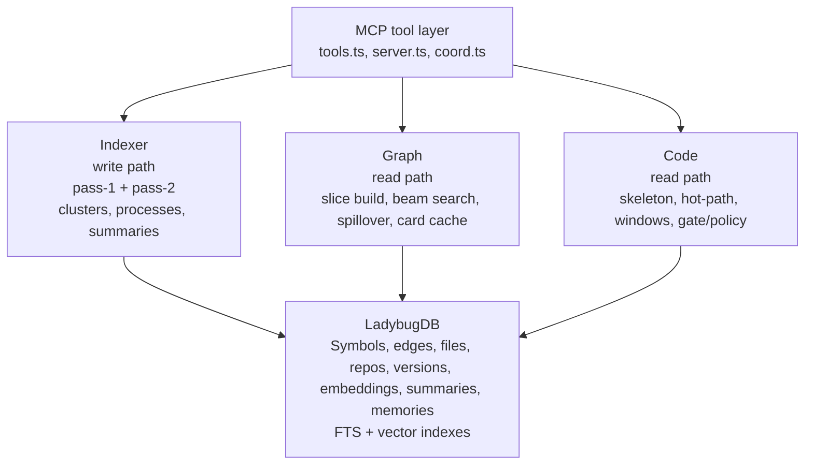

- **Indexer** produces pure domain objects (symbols, edges) — owns all writes
- **Graph** reads from DB to build slices — no mutations
- **Retrieval** (`src/retrieval/`) orchestrates hybrid search (FTS + vector + RRF fusion), with automatic fallback to legacy. Provides the start-node discovery engine for `slice.build` and `symbol.search`.
- **Delta** reads version pairs, computes diffs on demand — no mutations
- **Code** reads file content and applies policy gating — no mutations
- **DB** owns all persistence (queries + mutations separated by module)

---

## Startup Sequence

`src/main.ts` initializes the system in a strict order:

```
1. loadConfig()                         Config + Zod validation
2. initGraphDb()                        Open/create LadybugDB file
3. ensureConfiguredReposRegistered()     Bootstrap repos into graph
4. getDefaultLiveIndexCoordinator()      Singleton overlay service
5. registerTools(server, services)       Wire discovery/info tools plus flat, gateway, and/or code-mode tools
6. setupFileWatchers()                   chokidar for incremental re-index
7. ShutdownManager.register(callbacks)   Graceful cleanup handlers
8. server.start()                        Begin accepting MCP requests
```

Startup is sequenced (not parallel) — the DB must be ready before tools register, and tools must be registered before the transport accepts connections.

---

## Tool Dispatch

All MCP tools flow through a single dispatch path in `src/server.ts`. The exact surface is configuration-dependent:

- Flat mode: 34 tools (`32` flat tools + `sdl.action.search` + `sdl.info`)
- Gateway-only mode: 6 tools (`4` gateway tools + `sdl.action.search` + `sdl.info`)
- Gateway + legacy mode: 38 tools (`4` gateway tools + `32` legacy flat tools + `sdl.action.search` + `sdl.info`)
- Code Mode adds `sdl.manual`, `sdl.context`, and `sdl.workflow`, or can run in exclusive mode with just `sdl.action.search`, `sdl.manual`, `sdl.context`, and `sdl.workflow`

Before strict Zod validation, requests also pass through a shared normalization layer. Flat and gateway calls therefore accept the same canonical camelCase fields plus common aliases such as `repo_id`, `root_path`, `symbol_id`, `symbol_ids`, `from_version`, `to_version`, `slice_handle`, and `spillover_handle`.

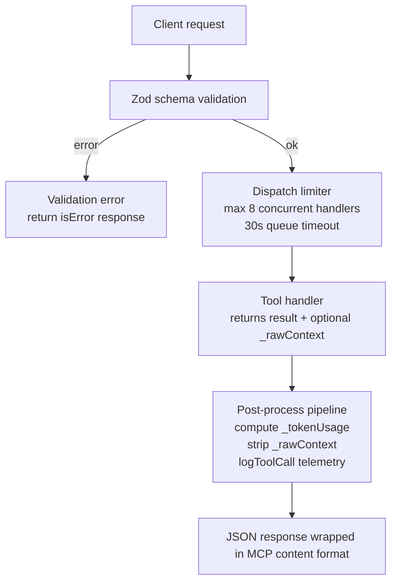

**Sideband system:** Handlers can attach `_rawContext` hints (file IDs or raw token counts). The post-processor computes `_tokenUsage` metadata (SDL tokens vs. raw-file equivalent, savings percentage) and strips internal fields before serialization.

`tools/list` metadata is assembled here as well. SDL-MCP emits human-friendly tool titles and version-stamped descriptions so flat, gateway, and code-mode registrations present a consistent surface to clients.

---

## Indexing Pipeline

Indexing happens in two passes plus a finalization stage. Triggered by `sdl-mcp index` (CLI) or `sdl.index.refresh` (MCP tool).

### Pass 1: Local Extraction

Per-file, parallelizable. Each file produces:

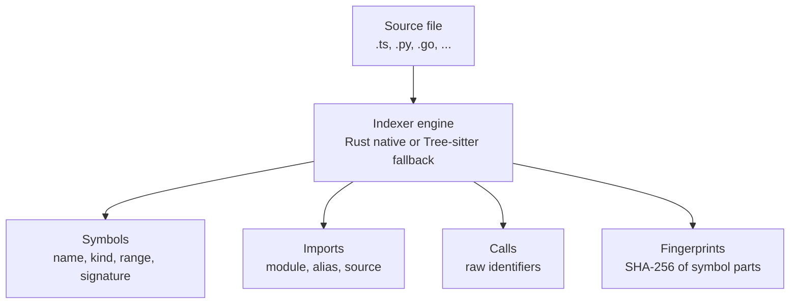
**Language adapters** (`src/indexer/adapter/`) — 11 adapters covering 12 languages, each extends `BaseAdapter`:
- `typescript.ts` (shared by TS/JS), `python.ts`, `go.ts`, `java.ts`, `rust.ts`, `csharp.ts`, `c.ts`, `cpp.ts`, `php.ts`, `kotlin.ts`, `shell.ts`

**Native Rust engine** (`native/src/extract/`) — optional, mirrors all TS adapters at near-native speed via napi-rs.

### Pass 2: Cross-File Resolution

Sequential, cross-file. Resolves raw call identifiers to specific symbol IDs using the pass-2 resolver registry (`src/indexer/pass2/registry.ts`):

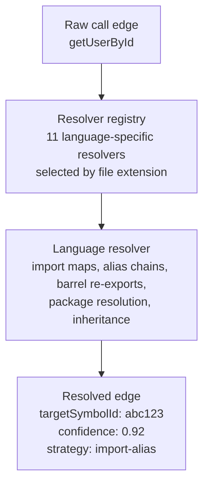
11 language-specific resolvers are registered, all performing semantic cross-file analysis. Every resolver builds a repo-wide index (namespace, module, package, or directory-scoped), follows import/use/include/source chains to resolve call targets, handles language-specific patterns (generics, traits, templates, extensions, header pairs), and assigns stratified confidence scores (same-file 0.93 → imports 0.9 → same-scope 0.88–0.92 → fallback 0.45–0.78). TS and JS share one resolver implementation; the remaining 10 languages each have a dedicated resolver (700–1,350 lines).

### Finalization

After pass 1 + 2:

1. **Cluster detection** — Label Propagation Algorithm (Rust addon or TS fallback) groups highly-coupled symbols
2. **Process tracing** — call-chain analysis identifies entry/intermediate/exit roles
3. **Embedding generation** — ONNX models produce vector embeddings for semantic search
4. **LLM summaries** — optional, generates 1-3 sentence descriptions per symbol via API (Anthropic, Ollama, or mock)
5. **Version bump** — new ledger version recorded in graph

---

## Database Architecture

### LadybugDB (Embedded Graph Database)

SDL-MCP uses LadybugDB (Kuzu engine, npm alias `kuzu`) as the sole persistence layer. The database is a single file on disk (`.lbug` extension).

**Path resolution** (`src/db/initGraphDb.ts`):
1. `SDL_GRAPH_DB_PATH` env var (or legacy `SDL_DB_PATH`)
2. `graphDatabase.path` in config
3. Default: `<configDir>/sdl-mcp-graph.lbug`

**Schema** (`src/db/ladybug-schema.ts`) — idempotent DDL runs on startup. No migration files needed.

**Connection pool:**

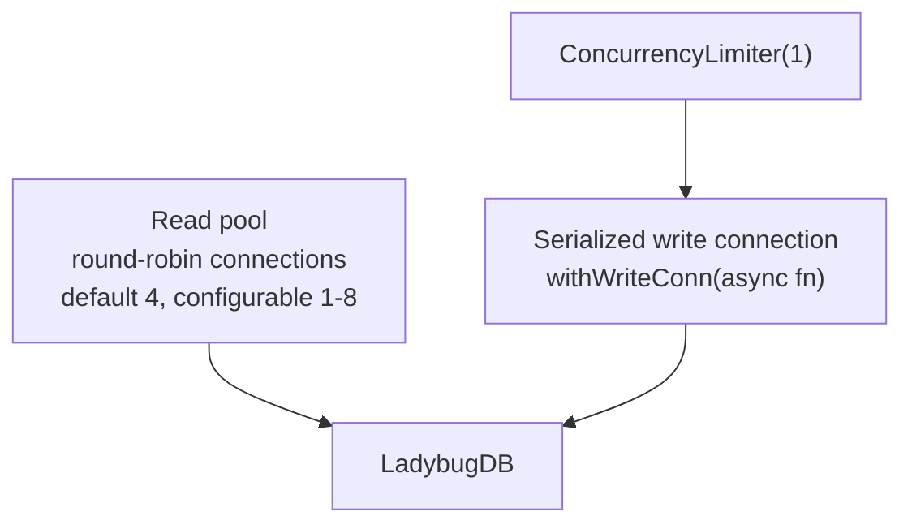
Read pool enables concurrent multi-session reads (4-6 MCP sessions). Write serialization prevents graph corruption.

### Graph Schema (Node + Edge Tables)

| Node Table | Key Fields |
|:-----------|:-----------|
| **Repo** | repoId, rootPath, configJson, createdAt |
| **File** | fileId, repoId, relPath, byteSize, contentHash |
| **Symbol** | symbolId, repoId, fileId, kind, name, exported, signatureJson, summary, summaryQuality, summarySource, etag, embeddingMiniLM, embeddingNomic |
| **Version** | versionId, repoId, timestamp, indexedAt |
| **Cluster** | clusterId, label, memberCount, searchText |
| **Process** | processId, label, repoId, searchText |
| **FileSummary** | fileId, repoId, summary, searchText, embeddingMiniLM, embeddingNomic |
| **SummaryCache** | symbolId, summary, provider, model, cardHash, costUsd |
| **SliceHandle** | handle, createdAt, expiresAt, minVersion, maxVersion |
| **AgentFeedback** | feedbackId, repoId, taskText, taskType, searchText, embeddingMiniLM, embeddingNomic |

| Edge Table | From → To | Key Fields |
|:-----------|:----------|:-----------|
| **CALLS** | Symbol → Symbol | confidence, resolverStrategy, provenance |
| **IMPORTS** | Symbol → Symbol | importKind, alias |
| **DEFINED_IN** | Symbol → File | — |
| **BELONGS_TO** | File → Repo | — |
| **BELONGS_TO_CLUSTER** | Symbol → Cluster | membershipScore |
| **PARTICIPATES_IN** | Symbol → Process | stepOrder, role |

### Query Modules

Each module owns a specific domain of queries:

| Module | Purpose |
|:-------|:--------|
| `ladybug-repos.ts` | Repo CRUD, registration, config |
| `ladybug-symbols.ts` | Symbol upsert, search, ETag, batch fetch |
| `ladybug-edges.ts` | Call/import edge mutations, confidence updates |
| `ladybug-versions.ts` | Version chain, timestamp tracking |
| `ladybug-clusters.ts` | Cluster membership, label queries |
| `ladybug-processes.ts` | Process steps, role queries |
| `ladybug-embeddings.ts` | **Deprecated** — legacy SymbolEmbedding node queries |
| `ladybug-symbol-embeddings.ts` | Inline embedding properties on Symbol nodes (replacement for ladybug-embeddings.ts) |
| `ladybug-metrics.ts` | Fan-in/out, churn, test refs |
| `ladybug-feedback.ts` | Agent feedback, audit events, searchText + embeddings for retrieval boosting |
| `ladybug-slices.ts` | Slice handles, lease expiry |
| `ladybug-memories.ts` | Memory nodes, symbol/file links, staleness |
| `ladybug-file-summaries.ts` | FileSummary nodes — file-level summaries with searchText and embeddings |
| `ladybug-usage.ts` | Token usage tracking, savings metrics |

---

## Graph Slicing

The slice builder (`src/graph/slice.ts`) constructs task-scoped context subgraphs bounded by a token budget.

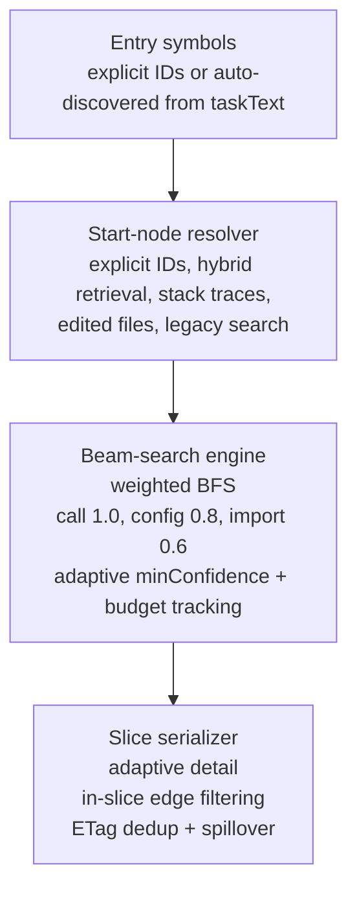
**Card detail levels** — the serializer adapts detail based on remaining budget:

| Level | Fields Included | ~Tokens |
|:------|:----------------|:--------|
| minimal | name, kind, range | ~15 |
| signature | + signature, summary (truncated) | ~40 |
| deps | + dependencies (filtered to slice) | ~80 |
| full | everything (invariants, metrics, cluster, process) | ~135 |

**Wire format versions:** V1 (compact field names), V2 (deduplicated lookup tables), V3 (grouped edge encoding for large slices).

---

## Context Ladder (Iris Gate)

The four-rung escalation ladder controls how much raw code an agent receives:

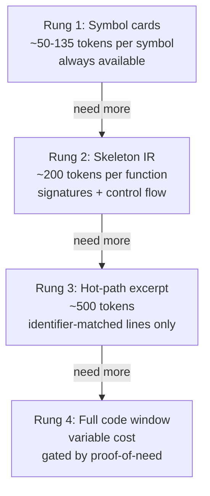

### Skeleton (`src/code/skeleton.ts`)
Deterministic code outline using tree-sitter. Keeps imports, type declarations, and signatures verbatim. Elides function/class bodies. Supports all 12 indexed languages.

### Hot-Path (`src/code/hotpath.ts`)
Finds lines matching requested identifiers with configurable context lines before/after each match. Returns excerpt, matched line numbers, and which identifiers were found.

### Proof-of-Need Gating (`src/code/gate.ts`)

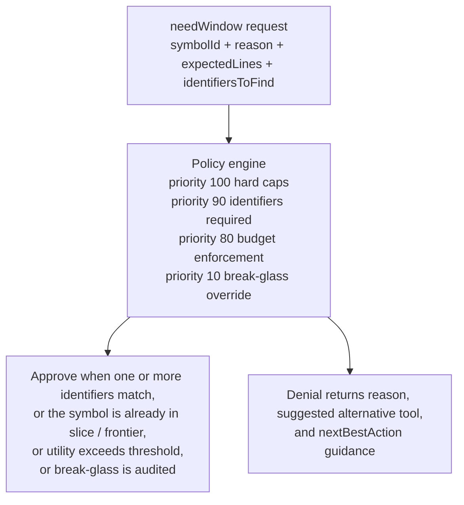

---

## Delta & Blast Radius

`src/delta/` computes semantic diffs between ledger versions.

**Delta computation** (`diff.ts`) — compares two version snapshots, producing changed symbols with signature/invariant/side-effect diffs.

**Blast radius** (`blastRadius.ts`) ? BFS traversal of reverse dependency edges from changed symbols:

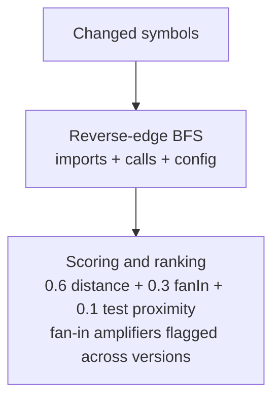
**PR risk analysis** (`src/mcp/tools/prRisk.ts`) — builds on blast radius to recommend test targets and flag high-risk changes.

---

## Live Indexing

The live index system (`src/live-index/`) provides draft-aware code intelligence for unsaved editor buffers.

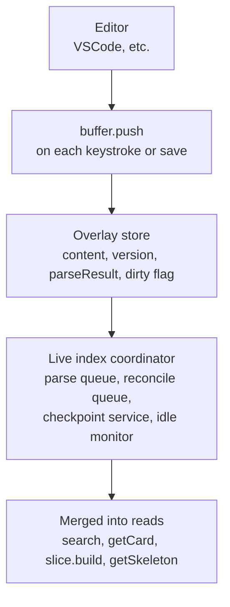
**Version conflict:** `upsertDraft()` rejects updates where `update.version < existing.version` — prevents out-of-order edits from overwriting newer content.

---

## Transport & Multi-Session

### stdio Transport (Default)

Single-session, used by CLI agents (Claude Code, etc.). One MCPServer instance handles all requests.

### HTTP Transport (`src/cli/transport/http.ts`)

Multi-session, per-session server isolation:

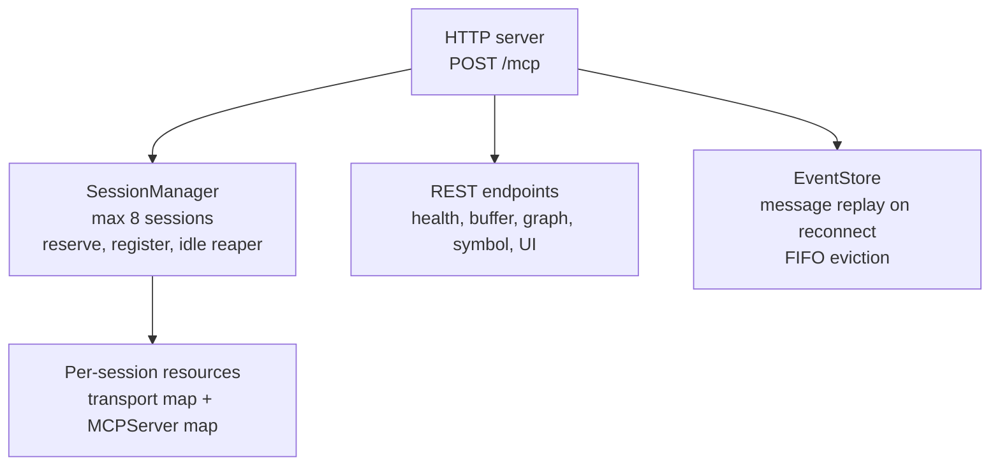
Each connected client gets its own `MCPServer` instance, ensuring complete session isolation. The `SessionManager` enforces the 8-session limit and reaps idle connections.

---

## Concurrency Control

| Limiter | Scope | Max | Timeout | Purpose |
|:--------|:------|:----|:--------|:--------|
| Tool dispatch | Per-server | 8 concurrent | 30s queue | Prevents handler starvation |
| DB write conn | Global | 1 (serialized) | — | Graph integrity |
| DB read pool | Global | 4 connections | — | Concurrent multi-session reads |
| Session manager | Global | 8 sessions | 5 min idle | Resource limits |
| Summary batch | Per-index | 5 concurrent | — | API rate limiting |

**ConcurrencyLimiter** (`src/util/concurrency.ts`) — generic queue-based limiter reused across the system.

---

## Semantic Engine

Three subsystems that enhance code intelligence beyond structural analysis:

### Pass-2 Call Resolution
11 language-specific resolvers that trace import chains and resolve raw call identifiers to symbolIds with confidence scores (0.0-1.0). See [Semantic Engine deep dive](./feature-deep-dives/semantic-engine.md).

### Embedding Search
Alpha-blended lexical + embedding similarity reranking using ONNX models. Two text models available — quality ladder: MiniLM alone < Nomic alone < either + LLM summaries:
- **all-MiniLM-L6-v2** (384-dim, ~22 MB, bundled) — general-purpose baseline, zero-setup
- **nomic-embed-text-v1.5** (768-dim, ~138 MB, downloaded) — higher-quality embeddings, longer context (8192 tokens)

Both are text models that benefit from LLM summaries when enabled.

### LLM Summaries
1-3 sentence semantic descriptions generated per symbol. Three providers (Anthropic API, OpenAI-compatible/Ollama, mock). Cached with content-addressed hashing. See [Indexing Languages deep dive](./feature-deep-dives/indexing-languages.md#llm-generated-summaries).

---

## Development Memories (Opt-In)

Graph-backed cross-session knowledge persistence. The memory subsystem is **opt-in and disabled by default**. When enabled, agents store decisions, bugfix context, and task notes as `Memory` nodes linked to symbols and files via `MEMORY_OF` and `MEMORY_OF_FILE` edges.

- **Opt-in** — disabled by default; enable via `"memory": { "enabled": true }` in config (global or per-repo)
- **Dual storage** — graph database (fast queries) + `.sdl-memory/*.md` files (version control)
- **Auto-surfacing** — when enabled, memories appear inside `slice.build` responses when they link to slice symbols
- **Staleness detection** — memories are flagged stale when linked symbols change during re-indexing
- **File import** — `.sdl-memory/` files are imported into the graph during `index.refresh` (when file sync is enabled)
- **4 MCP tools** — `memory.store`, `memory.query`, `memory.remove`, `memory.surface` (only available when memory is enabled)

See [Development Memories deep dive](./feature-deep-dives/development-memories.md).

---

## Sandboxed Runtime Execution

`sdl.runtime.execute` runs repo-scoped commands under SDL-MCP governance instead of uncontrolled shell access. 16 runtimes are supported (Node, Python, Go, Java, Rust, C, C++, C#, Kotlin, PHP, Ruby, Perl, R, Elixir, Shell, TypeScript).

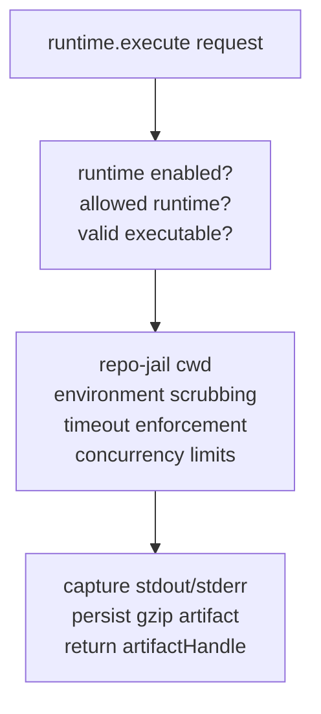

The `outputMode` parameter controls response verbosity:
- **`minimal`** (default): ~50 tokens — just status + artifact handle
- **`summary`**: ~200-500 tokens — head + tail excerpts
- **`intent`**: variable — only `queryTerms`-matched excerpts

`sdl.runtime.queryOutput` enables on-demand keyword search of stored artifacts without loading full output into context.

See [Runtime Execution deep dive](./feature-deep-dives/runtime-execution.md).

---

## Token Usage Tracking

SDL-MCP tracks per-call and cumulative token savings via sideband `_tokenUsage` metadata. Each tool response includes a savings comparison (SDL tokens vs. raw-file equivalent). `sdl.usage.stats` returns session and lifetime statistics from LadybugDB.

MCP logging notifications emit per-call savings meters and end-of-task session summaries.

---

## Error Handling

**Typed errors** (`src/domain/errors.ts`):
- `ConfigError`, `DatabaseError`, `ValidationError`, `IndexError`, `PolicyError`, `NotFoundError`
- `errorToMcpResponse()` (in `src/mcp/errors.ts`) converts any error to MCP-safe JSON

**Policy denials** include actionable guidance:
```
{
  "error": {
    "message": "Window exceeds 180 line limit",
    "code": "POLICY_ERROR",
    "nextBestAction": "requestSkeleton",
    "requiredFieldsForNext": { "symbolId": "sym-1", "repoId": "repo-1" }
  }
}
```

**Graceful degradation:**
- Rust native indexer unavailable → falls back to tree-sitter TS
- ONNX runtime unavailable → falls back to mock embeddings
- LLM API unavailable → skips summary generation (uses heuristic)
- Live index disabled → reads from persisted DB only

---

## Source Directory Map

Current command/tool registration notes:

- CLI commands: 13 (`init`, `doctor`, `info`, `index`, `serve`, `version`, `export`, `import`, `pull`, `benchmark:ci`, `summary`, `health`, `tool`)
- Gateway mode keeps `sdl.action.search` and `sdl.info` outside the 4 namespace tools
- Code Mode adds `sdl.manual`, `sdl.context`, and `sdl.workflow`, or can run exclusive with `sdl.action.search`, `sdl.manual`, `sdl.context`, and `sdl.workflow`

```mermaid
flowchart TD
    Src["src/"] --> Entry["main.ts, server.ts"]
    Src --> CLI["cli/<br/>commands, transport"]
    Src --> Config["config/<br/>types.ts"]
    Src --> DB["db/<br/>schema, init, query modules"]
    Src --> Domain["domain/<br/>types, errors"]
    Src --> Indexer["indexer/<br/>adapters, pass2, embeddings, watcher"]
    Src --> Graph["graph/<br/>slice builder"]
    Src --> Delta["delta/<br/>diff, blastRadius"]
    Src --> Code["code/<br/>skeleton, hotpath, gate, windows"]
    Src --> CodeMode["code-mode/<br/>workflow, manual, action catalog, ladder validator"]
    Src --> Gateway["gateway/<br/>router, thin-schemas, compact-schema"]
    Src --> Agent["agent/<br/>context engine, planner, evidence"]
    Src --> Policy["policy/<br/>engine"]
    Src --> Live["live-index/<br/>overlay store, coordinator, checkpoint, idle monitor"]
    Src --> Memory["memory/<br/>surface, file-sync"]
    Src --> Runtime["runtime/<br/>executor, runtimes"]
    Src --> Services["services/<br/>summary, health, card-builder"]
    Src --> Sync["sync/<br/>sync, pull"]
    Src --> Startup["startup/<br/>bootstrap"]
    Src --> Benchmark["benchmark/<br/>threshold, regression"]
    Src --> MCP["mcp/<br/>tools, errors, telemetry, token-usage, session-manager, dispatch-limiter"]
    Src --> Util["util/<br/>paths, concurrency, hashing, tokenizer"]
```


## Component Diagram

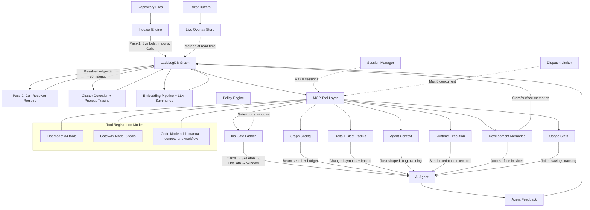

Registration-mode counts in the current implementation:

- Flat mode: 34 tools
- Gateway-only mode: 6 tools
- Gateway + legacy mode: 38 tools
- Code Mode adds `sdl.manual`, `sdl.context`, and `sdl.workflow`

[Back to README](../README.md)
