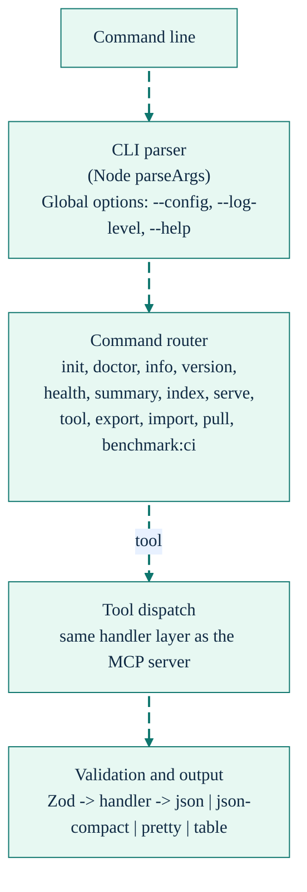

# CLI Reference

<div align="right">
<details>
<summary><strong>Docs Navigation</strong></summary>

- [Overview](../README.md)
- [Documentation Hub](./README.md)
  - [Getting Started](./getting-started.md)
  - [CLI Reference (this page)](./cli-reference.md)
  - [MCP Tools Reference](./mcp-tools-reference.md)
  - [Configuration Reference](./configuration-reference.md)
  - [Agent Workflows](./agent-workflows.md)
  - [Troubleshooting](./troubleshooting.md)

</details>
</div>

## Architecture



## Run Without Installing (npx)

If you do not want a global install, run commands through `npx`:

```bash
npx --yes sdl-mcp@latest version
npx --yes sdl-mcp@latest doctor
npx --yes sdl-mcp@latest info
```

In this document, replace `sdl-mcp` with `npx --yes sdl-mcp@latest` if you use `npx`.

## Global Options

- `-c, --config <PATH>` (explicit config file path)
- `--log-level <debug|info|warn|error>` (default: `info`)
- `--log-format <json|pretty>` (default: `pretty`)
- `-h, --help`
- `-v, --version`

Config lookup order when `--config` is omitted:

1. `SDL_CONFIG` (or `SDL_CONFIG_PATH`)
2. Local config in current working directory (`./config/sdlmcp.config.json`)
3. Global config path (default user-level location; overridable via `SDL_CONFIG_HOME`)
4. Package-local fallback (`<sdl-mcp package root>/config/sdlmcp.config.json`)

## Commands

### `sdl-mcp init`

Initialize configuration and optional client template.

```bash
sdl-mcp init --client codex --repo-path . --languages ts,py,go
sdl-mcp init -y --auto-index
sdl-mcp init -y --dry-run
```

Key options:

- `--client <claude-code|codex|gemini|opencode>`
- `--repo-path <PATH>` (default: current directory)
- `--languages <comma-separated>` (default: all supported languages)
- `-f, --force`
- `-y, --yes` (non-interactive mode with repo/language auto-detection)
- `--auto-index` (run inline incremental index and doctor checks)
- `--dry-run` (print generated config without writing files)
- `--enforce-agent-tools` (generate SDL-first enforcement assets for the chosen client: enables runtime, exclusive Code Mode, and writes client-specific instruction/hook files)

### `sdl-mcp doctor`

Validate runtime and environment.

```bash
sdl-mcp doctor --log-level info
```

Checks include Node version, config readability, DB writability, grammar availability, and repo path accessibility.

### `sdl-mcp info`

Show unified runtime, config, log, Ladybug, and native-addon diagnostics.

```bash
sdl-mcp info
sdl-mcp info --config ./config/sdlmcp.config.json
```

The report includes:

- resolved config path and load status
- active log file path and whether temp-file fallback is in use
- whether console log mirroring is enabled
- Ladybug availability and active DB path
- native-addon availability, source path, and fallback reason

### `sdl-mcp index`

Index configured repository data into the ledger.

```bash
sdl-mcp index --repo-id my-repo
sdl-mcp index --watch
```

Key options:

- `--repo-id <ID>`
- `-w, --watch`

### `sdl-mcp serve`

Start the MCP server.

```bash
sdl-mcp serve --stdio
sdl-mcp serve --http --host localhost --port 3000
```

Key options:

- `--stdio`
- `--http`
- `--host <HOST>` (default: `localhost`)
- `--port <NUMBER>` (default: `3000`)
- `--no-watch` (disable file watchers even when enabled in config)

When running with `--http`, additional surfaces are available:

- Graph UI: `http://<host>:<port>/ui/graph`
- Graph REST: `/api/graph/:repoId/symbol/:symbolId/neighborhood`, `/api/graph/:repoId/blast-radius/:fromVersion/:toVersion`, `/api/graph/:repoId/slice/:handle`
- Symbol and repo helpers: `/api/symbol/:repoId/search`, `/api/symbol/:repoId/card/:symbolId`, `/api/repo/:repoId/status`, `/api/repo/:repoId/reindex`

### `sdl-mcp export`

Export a sync artifact.

```bash
sdl-mcp export --repo-id my-repo --output .sdl-sync
sdl-mcp export --list
```

Key options:

- `--repo-id <ID>`
- `--version-id <ID>`
- `--commit-sha <SHA>`
- `--branch <NAME>`
- `-o, --output <PATH>` (default: `.sdl-sync/`)
- `--list`

### `sdl-mcp import`

Import a sync artifact.

```bash
sdl-mcp import --artifact-path .sdl-sync/my-repo.sdl-artifact.json --repo-id my-repo
```

Key options:

- `--artifact-path <PATH>`
- `--repo-id <ID>`
- `-f, --force`
- `--verify` (default: `true`)

### `sdl-mcp pull`

Pull by artifact selection rules, with optional fallback.

```bash
sdl-mcp pull --repo-id my-repo --commit-sha a1b2c3d --fallback --retries 3
```

Key options:

- `--repo-id <ID>`
- `--version-id <ID>`
- `--commit-sha <SHA>`
- `--fallback` (default: `true`)
- `--retries <NUMBER>` (default: `3`)

### `sdl-mcp benchmark:ci`

Run benchmark checks in CI.

```bash
sdl-mcp benchmark:ci --repo-id my-repo --update-baseline
```

Key options:

- `--repo-id <ID>`
- `--baseline-path <PATH>` (default: `.benchmark/baseline.json`)
- `--threshold-path <PATH>` (default: `config/benchmark.config.json`)
- `--out <PATH>` (default: `.benchmark/latest.json`)
- `--json`
- `--update-baseline`
- `--skip-indexing`

Notes:

- Edge-accuracy regression checks run as part of `benchmark:ci` and compare against `scripts/benchmark/edge-accuracy-baseline.json`.
- Benchmark repo scope can be pinned via `scripts/benchmark/phase-a-benchmark-lock.json`.

### `sdl-mcp summary`

Generate copy-paste context summaries from indexed data.

```bash
sdl-mcp summary "auth flow" --short
```

Key options:

- `--budget <NUMBER>`
- `--short|--medium|--long`
- `--format <markdown|json|clipboard>`
- `--scope <symbol|file|task>`
- `--repo <ID>`

### `sdl-mcp health`

Show composite repository health and machine-readable badge/json output.

```bash
sdl-mcp health --json
sdl-mcp health --badge
```

Key options:

- `--repo-id <ID>`
- `--json`
- `--badge`

### `sdl-mcp tool <action> [args]`

Direct MCP tool invocation from the CLI. The command currently exposes 30 action definitions from [`src/cli/commands/tool-actions.ts`](../src/cli/commands/tool-actions.ts), reuses the gateway action map for execution, and shares the same normalization and Zod validation path as the MCP server.

```bash
sdl-mcp tool repo.status --repo-id my-repo
sdl-mcp tool symbol.search --repo-id my-repo --query "handleRequest"
sdl-mcp tool slice.build --repo-id my-repo --entry-symbols sym123
```

Key options:

- `--format <json|pretty|compact>` (default: `pretty`)
- `--repo-id <ID>` (passed through to the underlying tool)
- All remaining arguments are forwarded as tool parameters

The CLI parser accepts the canonical action fields plus the same common aliases accepted by MCP requests, such as `--repo-id`, `--symbol-id`, `--symbol-ids`, `--from-version`, `--to-version`, and `--slice-handle`.

Not every MCP surface is available through `sdl-mcp tool`. Code Mode-only tools (`sdl.manual`, `sdl.context`, `sdl.workflow`) are separate, and `sdl.file.write` is currently MCP-only. Use [`CLI Tool Access`](./feature-deep-dives/cli-tool-access.md) for the current direct-action matrix.

### `sdl-mcp version`

Print version and environment.

```bash
sdl-mcp version
```

## Typical Flows

### Local Setup

```bash
sdl-mcp init --client codex
sdl-mcp info
sdl-mcp doctor
sdl-mcp index
sdl-mcp serve --stdio
```

### CI Data Sync

```bash
sdl-mcp export --repo-id my-repo --commit-sha $GIT_SHA
sdl-mcp pull --repo-id my-repo --commit-sha $GIT_SHA --fallback
sdl-mcp benchmark:ci --repo-id my-repo
```
