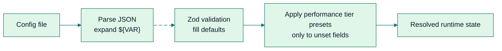

# Configuration Reference

<div align="right">
<details>
<summary><strong>Docs Navigation</strong></summary>

- [Overview](../README.md)
- [Documentation Hub](./README.md)
  - [Getting Started](./getting-started.md)
  - [CLI Reference](./cli-reference.md)
  - [MCP Tools Reference](./mcp-tools-reference.md)
  - [Configuration Reference (this page)](./configuration-reference.md)
  - [Agent Workflows](./agent-workflows.md)
  - [Troubleshooting](./troubleshooting.md)

</details>
</div>

SDL-MCP is configured through one JSON file. This page documents the current parsed configuration surface from `src/config/types.ts` and the current example config. Compatibility-only keys are intentionally omitted from the reference and examples.



## Resolution Order

| Source | How it is used |
| --- | --- |
| Default path | User-global `sdlmcp.config.json`, resolved from `SDL_CONFIG_HOME` or the OS config directory |
| CLI flag | `sdl-mcp ... --config <path>` |
| Environment | `SDL_CONFIG` or `SDL_CONFIG_PATH` |

Environment-variable expansion supports `${VAR_NAME}` and `${VAR_NAME:-default}` inside string values.

## Minimal Config

Only `repos` is required. Everything else falls back to defaults.

```json
{
  "repos": [
    {
      "repoId": "my-repo",
      "rootPath": "."
    }
  ]
}
```

## High-Impact Defaults

| Setting | Current default | Why it matters |
| --- | --- | --- |
| `performanceTier` | `"auto"` | Auto-tunes concurrency-related defaults to the current machine |
| `codeMode.enabled` | `true` | Code Mode tools are enabled by default |
| `codeMode.exclusive` | `true` | Code Mode hides gateway and flat tools unless you opt out |
| `gateway.enabled` | `true` | Gateway tools are available when Code Mode is not exclusive |
| `runtime.enabled` | `true` | `sdl.runtime.execute` is on unless you disable it |
| `memory.enabled` | `false` | Memory stays opt-in |
| `scip.enabled` | `false` | SCIP ingest stays opt-in |

The smallest high-leverage change is usually `codeMode.exclusive`. Setting it to `false` exposes Code Mode and the regular MCP surfaces together.

## Top-Level Sections

| Section | Required | Purpose |
| --- | --- | --- |
| `repos` | Yes | Repository registration defaults and per-repo overrides |
| `performanceTier` | No | Hardware-aware concurrency preset selection |
| `graphDatabase` | No | Ladybug database file location |
| `policy` | No | Iris Gate and budget enforcement |
| `redaction` | No | Secret masking in code responses |
| `indexing` | No | Indexer concurrency, watcher, and engine settings |
| `liveIndex` | No | Draft-buffer overlay behavior |
| `slice` | No | Default slice budgets and edge weights |
| `diagnostics` | No | TypeScript diagnostics behavior |
| `cache` | No | In-memory cache limits |
| `plugins` | No | Plugin loading |
| `semantic` | No | Embeddings, retrieval, and summary generation |
| `prefetch` | No | Predictive warming |
| `tracing` | No | OpenTelemetry tracing |
| `parallelScorer` | No | Worker-thread slice scoring |
| `concurrency` | No | Session, queue, and DB read concurrency |
| `runtime` | No | Runtime execution limits |
| `gateway` | No | Gateway-mode registration |
| `codeMode` | No | Code Mode tool registration and workflow budgets |
| `security` | No | Allowed repository roots |
| `httpAuth` | No | HTTP bearer-token auth |
| `memory` | No | Development memory subsystem |
| `scip` | No | SCIP ingest and optional `scip-io` generation |

## `repos[]`

Each entry configures one repository.

| Field | Type | Default | Notes |
| --- | --- | --- | --- |
| `repoId` | `string` | Required | Stable identifier used in all tool calls |
| `rootPath` | `string` | Required | Absolute path recommended; relative paths resolve from the config file |
| `ignore` | `string[]` | See below | Glob patterns excluded from indexing |
| `languages` | `string[]` | All supported languages | `ts`, `tsx`, `js`, `jsx`, `py`, `go`, `java`, `cs`, `c`, `cpp`, `php`, `rs`, `kt`, `sh` |
| `maxFileBytes` | `number` | `2000000` | Files larger than this are skipped |
| `includeNodeModulesTypes` | `boolean` | `true` | TypeScript-only helper for `@types/*` resolution |
| `packageJsonPath` | `string \| null` | `null` | Manual package root override |
| `tsconfigPath` | `string \| null` | `null` | Manual `tsconfig.json` override |
| `workspaceGlobs` | `string[] \| null` | `null` | Monorepo workspace package discovery |
| `memory` | object | Omitted | Per-repo override for the top-level memory settings |

Default `ignore` patterns:

```json
[
  "**/.git/**",
  "**/dist/**",
  "**/dist-*/**",
  "**/build/**",
  "**/out/**",
  "**/target/**",
  "**/coverage/**",
  "**/node_modules/**",
  "**/vendor/**",
  "**/.next/**",
  "**/.nuxt/**",
  "**/__pycache__/**",
  "**/.pytest_cache/**",
  "**/*.pyc",
  "**/.venv/**",
  "**/venv/**",
  "**/.tmp/**",
  "**/.claude/**",
  "**/.codex/**",
  "**/.cursor/**",
  "**/.aider*/**",
  "**/.windsurf/**",
  "**/.continue/**",
  "**/.sdl-memory/**"
]
```

### `repos[].memory`

This override only accepts partial fields. Unspecified values inherit from the top-level `memory` section.

| Field | Type |
| --- | --- |
| `enabled` | `boolean` |
| `toolsEnabled` | `boolean` |
| `fileSyncEnabled` | `boolean` |
| `surfacingEnabled` | `boolean` |
| `hintsEnabled` | `boolean` |
| `defaultSurfaceLimit` | `number` |

## `performanceTier`

| Field | Type | Default | Values |
| --- | --- | --- | --- |
| `performanceTier` | `string` | `"auto"` | `"mid"`, `"high"`, `"extreme"`, `"auto"` |

`"auto"` detects the machine tier at startup and only fills fields you did not set explicitly. It currently influences:

- `indexing.concurrency`
- `concurrency.maxSessions`
- `concurrency.maxToolConcurrency`
- `concurrency.readPoolSize`
- `runtime.maxConcurrentJobs`
- `liveIndex.reconcileConcurrency`
- `semantic.summaryMaxConcurrency`
- `parallelScorer.enabled`
- `parallelScorer.poolSize`

## `graphDatabase`

| Field | Type | Default | Notes |
| --- | --- | --- | --- |
| `path` | `string \| null` | `null` | Defaults to `<configDir>/sdl-mcp-graph.lbug` when omitted |

## `policy`

| Field | Type | Default | Notes |
| --- | --- | --- | --- |
| `maxWindowLines` | `number` | `180` | Hard cap for `sdl.code.needWindow` line count |
| `maxWindowTokens` | `number` | `1400` | Hard cap for `sdl.code.needWindow` tokens |
| `requireIdentifiers` | `boolean` | `true` | Keeps raw-window requests scoped |
| `allowBreakGlass` | `boolean` | `false` | Enables break-glass override paths |
| `defaultMinCallConfidence` | `number` | unset | Optional default confidence floor for call edges |
| `defaultDenyRaw` | `boolean` | `true` | Raw code access starts denied unless justified |
| `budgetCaps.maxCards` | `number` | unset | Optional server-side cap for slice card count |
| `budgetCaps.maxEstimatedTokens` | `number` | unset | Optional server-side cap for slice token budget |

If you set `budgetCaps`, provide both `maxCards` and `maxEstimatedTokens`.

## `redaction`

| Field | Type | Default |
| --- | --- | --- |
| `enabled` | `boolean` | `true` |
| `includeDefaults` | `boolean` | `true` |
| `patterns` | `Array<{ name?, pattern, flags? }>` | `[]` |

## `indexing`

| Field | Type | Default | Range / notes |
| --- | --- | --- | --- |
| `concurrency` | `number` | `8` | `1-32` |
| `enableFileWatching` | `boolean` | `true` | Usually disable in CI |
| `maxWatchedFiles` | `number` | `25000` | Hard guard for watcher scale |
| `workerPoolSize` | `number \| null` | `null` | Optional cap for worker threads |
| `engine` | `"typescript" \| "rust"` | `"rust"` | Falls back to TS if native addon is unavailable |
| `watchDebounceMs` | `number` | `300` | `50-5000` |
| `pass2Concurrency` | `number` | `1` | `1-16`; controls pass-2 resolution parallelism |

## `liveIndex`

| Field | Type | Default | Range |
| --- | --- | --- | --- |
| `enabled` | `boolean` | `true` | |
| `debounceMs` | `number` | `75` | `25-5000` |
| `idleCheckpointMs` | `number` | `15000` | `1000-300000` |
| `maxDraftFiles` | `number` | `200` | `1-10000` |
| `reconcileConcurrency` | `number` | `1` | `1-16` |
| `clusterRefreshThreshold` | `number` | `25` | `1-1000` |

## `slice`

| Field | Type | Default |
| --- | --- | --- |
| `defaultMaxCards` | `number` | `60` |
| `defaultMaxTokens` | `number` | `12000` |
| `edgeWeights.call` | `number` | `1.0` |
| `edgeWeights.import` | `number` | `0.6` |
| `edgeWeights.config` | `number` | `0.8` |
| `edgeWeights.implements` | `number` | `0.9` |

`edgeWeights.implements` is current and should stay documented. It is easy to miss and it materially changes slice ranking in interface-heavy codebases.

## `diagnostics`

| Field | Type | Default | Notes |
| --- | --- | --- | --- |
| `enabled` | `boolean` | `true` | |
| `mode` | `"tsLS" \| "tsc"` | `"tsLS"` | `tsLS` is faster; `tsc` is stricter |
| `maxErrors` | `number` | `50` | |
| `timeoutMs` | `number` | `2000` | |
| `scope` | `"changedFiles" \| "workspace"` | `"changedFiles"` | Workspace-wide is slower but more complete |

## `cache`

| Field | Type | Default |
| --- | --- | --- |
| `enabled` | `boolean` | `true` |
| `symbolCardMaxEntries` | `number` | `2000` |
| `symbolCardMaxSizeBytes` | `number` | `104857600` |
| `graphSliceMaxEntries` | `number` | `1000` |
| `graphSliceMaxSizeBytes` | `number` | `52428800` |

## `plugins`

| Field | Type | Default |
| --- | --- | --- |
| `paths` | `string[]` | `[]` |
| `enabled` | `boolean` | `true` |
| `strictVersioning` | `boolean` | `true` |

## `semantic`

`semantic` now centers on retrieval and vector index configuration. The reference intentionally documents the current retrieval path, not legacy compatibility shims.

| Field | Type | Default | Notes |
| --- | --- | --- | --- |
| `enabled` | `boolean` | `true` | |
| `provider` | `"api" \| "local" \| "mock"` | `"local"` | Embedding provider |
| `model` | `string` | `"jina-embeddings-v2-base-code"` | Embedding model |
| `modelCacheDir` | `string \| null` | `null` | Optional local cache override |
| `generateSummaries` | `boolean` | `false` | Generates symbol summaries during indexing |
| `summaryProvider` | `"api" \| "local" \| "mock" \| null` | `null` | Falls back to `provider` when omitted |
| `summaryModel` | `string \| null` | `null` | Provider-specific default is chosen when omitted |
| `summaryApiKey` | `string \| null` | `null` | Needed for hosted summary providers |
| `summaryApiBaseUrl` | `string \| null` | `null` | OpenAI-compatible local endpoints |
| `summaryMaxConcurrency` | `number` | `5` | `1-32` |
| `summaryBatchSize` | `number` | `20` | `1-50` |
| `embeddingConcurrency` | `number` | `1` | `1-4` |
| `retrieval.mode` | `"legacy" \| "hybrid"` | `"hybrid"` | Current recommended mode |
| `retrieval.extensionsOptional` | `boolean` | `true` | |
| `retrieval.fts.enabled` | `boolean` | `true` | |
| `retrieval.fts.indexName` | `string` | `"symbol_search_text_v1"` | |
| `retrieval.fts.topK` | `number` | `75` | |
| `retrieval.fts.conjunctive` | `boolean` | `false` | |
| `retrieval.vector.enabled` | `boolean` | `true` | |
| `retrieval.vector.topK` | `number` | `75` | |
| `retrieval.vector.efc` | `number` | `200` | Build-time HNSW setting |
| `retrieval.vector.efs` | `number` | `200` | Query-time HNSW setting |
| `retrieval.vector.indexes` | `Record<string, { indexName: string }>` | See below | Per-model vector index names |
| `retrieval.fusion.strategy` | `"rrf"` | `"rrf"` | |
| `retrieval.fusion.rrfK` | `number` | `60` | |
| `retrieval.candidateLimit` | `number` | `100` | |

Default vector indexes:

```json
{
  "jina-embeddings-v2-base-code": {
    "indexName": "symbol_vec_jina_code_v2"
  },
  "nomic-embed-text-v1.5": {
    "indexName": "symbol_vec_nomic_embed_v15"
  }
}
```

## `prefetch`

| Field | Type | Default |
| --- | --- | --- |
| `enabled` | `boolean` | `true` |
| `maxBudgetPercent` | `number` | `20` |
| `warmTopN` | `number` | `50` |

## `tracing`

| Field | Type | Default |
| --- | --- | --- |
| `enabled` | `boolean` | `true` |
| `serviceName` | `string` | `"sdl-mcp"` |
| `exporterType` | `"console" \| "otlp" \| "memory"` | `"console"` |
| `otlpEndpoint` | `string \| null` | `null` |
| `sampleRate` | `number` | `1.0` |

## `parallelScorer`

| Field | Type | Default |
| --- | --- | --- |
| `enabled` | `boolean` | `true` |
| `poolSize` | `number \| null` | `null` |
| `minBatchSize` | `number \| null` | `null` |

## `concurrency`

| Field | Type | Default | Range |
| --- | --- | --- | --- |
| `maxSessions` | `number` | `8` | `1-32` |
| `maxToolConcurrency` | `number` | `8` | `1-64` |
| `readPoolSize` | `number` | `4` | `1-16` |
| `writeQueueTimeoutMs` | `number` | `30000` | `1000-120000` |
| `toolQueueTimeoutMs` | `number` | `30000` | `5000-120000` |

## `runtime`

`runtime` is enabled by default in current source. Disable it explicitly if your deployment cannot permit subprocess execution.

| Field | Type | Default | Range / notes |
| --- | --- | --- | --- |
| `enabled` | `boolean` | `true` | |
| `allowedRuntimes` | `string[]` | `["node", "typescript", "python", "shell"]` | Can be narrowed aggressively for safer deployments |
| `allowedExecutables` | `string[]` | `[]` | Extra binary whitelist |
| `maxDurationMs` | `number` | `30000` | `100-600000` |
| `maxStdoutBytes` | `number` | `1048576` | |
| `maxStderrBytes` | `number` | `262144` | |
| `maxArtifactBytes` | `number` | `10485760` | |
| `artifactTtlHours` | `number` | `24` | |
| `maxConcurrentJobs` | `number` | `2` | `1-12` |
| `envAllowlist` | `string[]` | `[]` | |
| `artifactBaseDir` | `string \| null` | `null` | Optional artifact storage root |

Supported runtimes: `node`, `typescript`, `python`, `shell`, `ruby`, `php`, `perl`, `r`, `elixir`, `go`, `java`, `kotlin`, `rust`, `c`, `cpp`, `csharp`.

## `gateway`

| Field | Type | Default |
| --- | --- | --- |
| `enabled` | `boolean` | `true` |

With current defaults, `gateway.enabled` matters only when `codeMode.exclusive` is `false` or `codeMode.enabled` is `false`.

See [Tool Gateway](./feature-deep-dives/tool-gateway.md) for the current tool-count matrix. The deprecated legacy-alias toggle is intentionally omitted from this reference.

## `codeMode`

| Field | Type | Default | Notes |
| --- | --- | --- | --- |
| `enabled` | `boolean` | `true` | |
| `exclusive` | `boolean` | `true` | Hides flat and gateway tools when true |
| `maxWorkflowSteps` | `number` | `20` | `1-50` |
| `maxWorkflowTokens` | `number` | `50000` | `100-500000` |
| `maxWorkflowDurationMs` | `number` | `60000` | `1000-300000` |
| `ladderValidation` | `"off" \| "warn" \| "enforce"` | `"warn"` | |
| `etagCaching` | `boolean` | `true` | |

If you want both `sdl.context` and the regular gateway or flat tools in the same session, set:

```json
{
  "codeMode": {
    "enabled": true,
    "exclusive": false
  }
}
```

## `security`

| Field | Type | Default | Notes |
| --- | --- | --- | --- |
| `allowedRepoRoots` | `string[]` | `[]` | Empty means any path is allowed |

`SDL_ALLOWED_REPO_ROOTS` can append additional comma-separated roots at load time.

## `httpAuth`

| Field | Type | Default | Notes |
| --- | --- | --- | --- |
| `enabled` | `boolean` | `false` | Only affects HTTP transport |
| `token` | `string \| null` | `null` | Random token is generated at startup when auth is enabled and `token` is omitted |

## `memory`

Memory remains opt-in.

| Field | Type | Default |
| --- | --- | --- |
| `enabled` | `boolean` | `false` |
| `toolsEnabled` | `boolean` | `true` |
| `fileSyncEnabled` | `boolean` | `true` |
| `surfacingEnabled` | `boolean` | `true` |
| `hintsEnabled` | `boolean` | `true` |
| `defaultSurfaceLimit` | `number` | `5` |

## `scip`

| Field | Type | Default | Notes |
| --- | --- | --- | --- |
| `enabled` | `boolean` | `false` | Master toggle for SCIP ingest |
| `indexes` | `Array<{ path: string, label?: string }>` | `[]` | Files to ingest |
| `externalSymbols.enabled` | `boolean` | `true` | |
| `externalSymbols.maxPerIndex` | `number` | `10000` | `100-100000` |
| `confidence` | `number` | `0.95` | `0.5-1.0` |
| `autoIngestOnRefresh` | `boolean` | `true` | |
| `generator.enabled` | `boolean` | `false` | Runs `scip-io index` before refresh |
| `generator.binary` | `string` | `"scip-io"` | |
| `generator.args` | `string[]` | `[]` | Extra args after `index` |
| `generator.autoInstall` | `boolean` | `true` | Downloads `scip-io` if needed |
| `generator.timeoutMs` | `number` | `600000` | `1000-1800000` |

When both `scip.enabled` and `scip.generator.enabled` are true, SDL-MCP auto-adds `index.scip` to `scip.indexes` if you forgot to list it.

## Example Profiles

### Code Mode + Gateway Together

```json
{
  "repos": [
    {
      "repoId": "my-repo",
      "rootPath": "."
    }
  ],
  "codeMode": {
    "enabled": true,
    "exclusive": false
  },
  "gateway": {
    "enabled": true
  }
}
```

### Conservative CI

```json
{
  "repos": [
    {
      "repoId": "my-repo",
      "rootPath": "."
    }
  ],
  "indexing": {
    "concurrency": 2,
    "enableFileWatching": false
  },
  "prefetch": {
    "enabled": false
  },
  "parallelScorer": {
    "enabled": false
  },
  "runtime": {
    "enabled": false
  }
}
```

### Semantic Search + Local Summaries

```json
{
  "repos": [
    {
      "repoId": "my-repo",
      "rootPath": "."
    }
  ],
  "semantic": {
    "enabled": true,
    "provider": "local",
    "model": "jina-embeddings-v2-base-code",
    "generateSummaries": true,
    "summaryProvider": "local",
    "summaryApiBaseUrl": "http://localhost:11434/v1",
    "summaryModel": "gpt-4o-mini"
  }
}
```

## Environment Variables

| Variable | Purpose |
| --- | --- |
| `SDL_CONFIG` / `SDL_CONFIG_PATH` | Explicit config file path |
| `SDL_CONFIG_HOME` | Default config directory root |
| `SDL_GRAPH_DB_PATH` | Override Ladybug DB file path |
| `SDL_GRAPH_DB_DIR` | Override the directory that contains `sdl-mcp-graph.lbug` |
| `SDL_ALLOWED_REPO_ROOTS` | Extra comma-separated allowed repo roots |
| `SDL_LOG_LEVEL` | Logging level |
| `SDL_LOG_FILE` | Explicit log file path |
| `SDL_CONSOLE_LOGGING` | Mirror logs to stderr |
| `SDL_LOG_FORMAT` | `json` or `text` |
| `SDL_MCP_DISABLE_NATIVE_ADDON` | Force TypeScript indexing engine |
| `ANTHROPIC_API_KEY` | Hosted semantic-summary provider credential |

## Validation and Inspection

- Add `"$schema": "./node_modules/sdl-mcp/config/sdlmcp.config.schema.json"` to your config for editor help.
- Run `sdl-mcp doctor` to validate configuration and environment health.
- Run `sdl-mcp info` or call `sdl.info` to inspect the resolved runtime state.

## Omitted Compatibility Keys

This page intentionally does not document deprecated compatibility keys such as legacy SQLite path settings, retired semantic blending and ANN config, or the deprecated legacy-tool emission toggle. They may still be tolerated for backward compatibility, but they are not part of the recommended current configuration surface.
