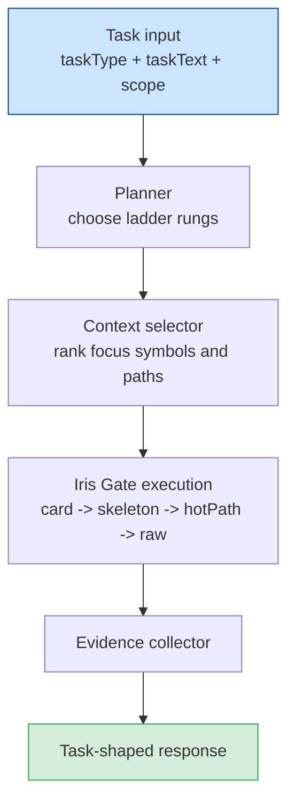

# Agent Context

[Back to README](../../README.md)

---

## Overview

`sdl.agent.context` is SDL-MCP's direct task-shaped context tool.

Instead of manually deciding whether to call `symbol.search`, `symbol.getCard`, `code.getSkeleton`, or `code.getHotPath`, you give SDL-MCP a task type, task text, and optional scope. The context engine chooses the right Iris Gate rungs, gathers evidence, and returns a response sized to the task.

In Code Mode, the equivalent surface is `sdl.context`. The two tools share the same task envelope and the same retrieval model.

`sdl.context.summary` is separate. It does not do task-shaped retrieval. It exports a compact summary for non-MCP destinations such as Slack, tickets, or PR descriptions.

---

## Direct vs Code Mode

| Surface               | Use when                                            | Primary job                                                     |
| :-------------------- | :-------------------------------------------------- | :-------------------------------------------------------------- |
| `sdl.agent.context`   | You are calling flat or gateway tools directly      | Retrieve task-shaped code context                               |
| `sdl.context`         | You are already operating through Code Mode         | Retrieve the same task-shaped context without leaving Code Mode |
| `sdl.context.summary` | You need a portable write-up for a non-MCP consumer | Export a bounded summary, not a retrieval workflow              |

---

## How It Works

The context engine:

1. classifies the task as `debug`, `review`, `implement`, or `explain`
2. chooses a ladder path based on `contextMode`, budget, and scope
3. ranks candidate symbols from `focusSymbols`, `focusPaths`, or task text
4. executes only the rungs needed to answer the task
5. returns evidence, metrics, and a broader answer envelope when appropriate

---

## Routing Rules

Use context first for:

- `explain`
- `debug`
- `review`
- `implement` when the immediate need is understanding existing code

Use `sdl.workflow` instead for:

- runtime execution
- data transforms
- batch mutations
- reusable multi-step pipelines

This separation matters. A workflow can reproduce context retrieval, but it forces the model to plan and carry more schema state than the dedicated context engine.

---

## Context Modes

`contextMode` controls breadth:

- `"precise"` returns the smallest useful evidence set
- `"broad"` returns more surrounding structure, diagnostics, and follow-up guidance

See [Context Modes](./context-modes.md) for the full comparison.

---

## Task-Type Defaults

| Task type   | Precise path     | Broad path                           |
| :---------- | :--------------- | :----------------------------------- |
| `debug`     | card -> hotPath  | card -> skeleton -> hotPath -> raw\* |
| `review`    | card             | card -> skeleton                     |
| `implement` | card -> skeleton | card -> skeleton -> hotPath          |
| `explain`   | card -> skeleton | card -> skeleton                     |

`*` Raw is still governed by policy and usually only appears when diagnostics are explicitly required.

---

## Inputs That Improve Results

The context engine works with plain task text, but these inputs sharpen retrieval:

- `focusSymbols` when you already know the symbol IDs
- `focusPaths` when you know the files or directories
- `budget.maxTokens`, `budget.maxActions`, and `budget.maxDurationMs`
- `includeTests` when test context matters
- `requireDiagnostics` only when deeper debugging is justified

When scope is absent, SDL-MCP still extracts identifiers from the task text and ranks candidates automatically.

---

## Response Shape

Broad mode returns a compact response by default. The model-visible payload includes:

- `taskId`
- `taskType`
- `success`
- `summary`
- `answer`
- `finalEvidence` (primary evidence surface)
- `nextBestAction` when relevant
- `error` when failed

The fields `actionsTaken`, `path`, `metrics`, and `retrievalEvidence` are still computed internally by the ContextEngine and available in the internal `ContextResult` type, but they are stripped at the MCP serialization layer before the response reaches the model. This compaction happens outside the engine itself, keeping the internal data model unchanged.

Precise mode strips the envelope differently:

- `taskId`
- `taskType`
- `success`
- `path`
- `finalEvidence`
- `metrics`

Both modes are significantly more token-efficient than a hand-built workflow. Broad mode prioritizes `finalEvidence` and `answer` as the primary model-visible fields. Precise mode prioritizes `finalEvidence` and `path` for chain-efficient downstream use.

---

## Feedback Loop

After a task, `sdl.agent.feedback` records which symbols were useful and which were missing.

That feedback is not just bookkeeping. SDL-MCP uses it to bias future retrieval toward historically useful symbols and to surface previously missing ones earlier in the ladder.

---

## Portable Summaries Stay Separate

Use `sdl.context.summary` when you need to publish what you found.

Examples:

- paste context into a GitHub issue
- hand off a summary to a non-MCP teammate
- generate a bounded project brief for another tool

Do not treat `sdl.context.summary` as a replacement for `sdl.agent.context` or `sdl.context`. Summary is export. Context is retrieval.

---

## Key Files

| File                          | Responsibility                                      |
| :---------------------------- | :-------------------------------------------------- |
| `src/agent/context-engine.ts` | Top-level task-shaped context orchestration         |
| `src/agent/planner.ts`        | Rung selection and budget trimming                  |
| `src/agent/executor.ts`       | Symbol ranking, rung execution, evidence generation |
| `src/agent/evidence.ts`       | Evidence capture and deduplication                  |
| `src/mcp/tools/context.ts`    | MCP handler for `sdl.agent.context`                 |

---

## Related

- [Context Modes](./context-modes.md)
- [Code Mode](./code-mode.md)
- [Iris Gate Ladder](./iris-gate-ladder.md)
- [`sdl.context.summary`](../mcp-tools-detailed.md#sdlcontextsummary)
- [`sdl.agent.feedback`](../mcp-tools-detailed.md#sdlagentfeedback)

[Back to README](../../README.md)
