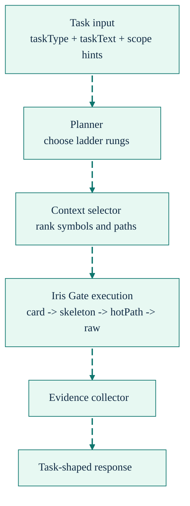

# Agent Context

[Back to README](../../README.md)

---

## Overview

`sdl.context` is SDL-MCP's task-shaped context tool for Code Mode. You give it a task type, task text, and optional scope hints. The context engine then chooses the right Iris Gate rungs, gathers evidence, and returns a response sized to the task.

Outside Code Mode, there is no separate flat `agent.context` tool. Use the manual ladder instead: `repo.overview` or `symbol.search` -> `symbol.getCard` -> `slice.build` -> `code.getSkeleton` -> `code.getHotPath` -> `code.needWindow`.

For portable exports such as tickets or PR descriptions, use the CLI `sdl-mcp summary` command. That is a separate export surface, not a retrieval tool.

---

## How It Works

The context engine:

1. Classifies the task as `debug`, `review`, `implement`, or `explain`.
2. Seeds candidates using semantic retrieval first, lexical fallback second, and feedback priors third.
3. Ranks symbols and paths with an evidence-aware scorer.
4. Plans only the rungs needed for the task and budget.
5. Returns compact evidence plus an answer envelope when broad mode is used.

---

## When To Use It

Use `sdl.context` first when the job is about understanding code:

- explain a symbol or module
- debug a behavior
- review a change
- gather implementation context before editing

Use `sdl.workflow` instead when the job is procedural:

- run tests or commands
- transform data
- chain multiple dependent operations
- batch mutations

That separation matters. A workflow can reproduce context retrieval, but it costs more tokens and forces the model to plan a ladder that `sdl.context` already knows how to choose.

---

## Context Modes

`contextMode` controls how much evidence SDL-MCP returns:

- `precise` keeps the smallest useful set of symbols and rungs.
- `broad` returns more surrounding structure, guidance, and follow-up context.

See [Context Modes](./context-modes.md) for the detailed comparison.

---

## Response Shape

Broad mode returns a compact model-facing envelope that prioritizes `finalEvidence`, `summary`, and `answer`.

Precise mode strips that envelope down further and focuses on `path`, `finalEvidence`, and `metrics`.

In both modes, the purpose is the same: give the model useful evidence without making it reconstruct the ladder by hand.

---

## Related Surfaces

| Surface | Purpose |
| :------ | :------ |
| `sdl.context` | Task-shaped context retrieval in Code Mode |
| Manual ladder | Flat or gateway retrieval when Code Mode is disabled |
| `sdl.workflow` | Procedural multi-step operations |
| `sdl-mcp summary` | Portable exported summary for non-MCP destinations |

---

## Key Files

| File | Responsibility |
| :--- | :------------- |
| `src/agent/context-engine.ts` | Top-level task-shaped context orchestration |
| `src/agent/context-seeding.ts` | Semantic, lexical, and feedback-based seeding |
| `src/agent/context-ranking.ts` | Evidence-aware candidate scoring |
| `src/agent/planner.ts` | Rung selection and budget trimming |
| `src/agent/executor.ts` | Rung execution and evidence collection |
| `src/mcp/tools/context.ts` | MCP handler for `sdl.context` |

---

## Related

- [Context Modes](./context-modes.md)
- [Code Mode](./code-mode.md)
- [Iris Gate Ladder](./iris-gate-ladder.md)
- [`sdl.context`](../mcp-tools-detailed.md#sdlcontext)
- [`sdl.agent.feedback`](../mcp-tools-detailed.md#sdlagentfeedback)

[Back to README](../../README.md)
