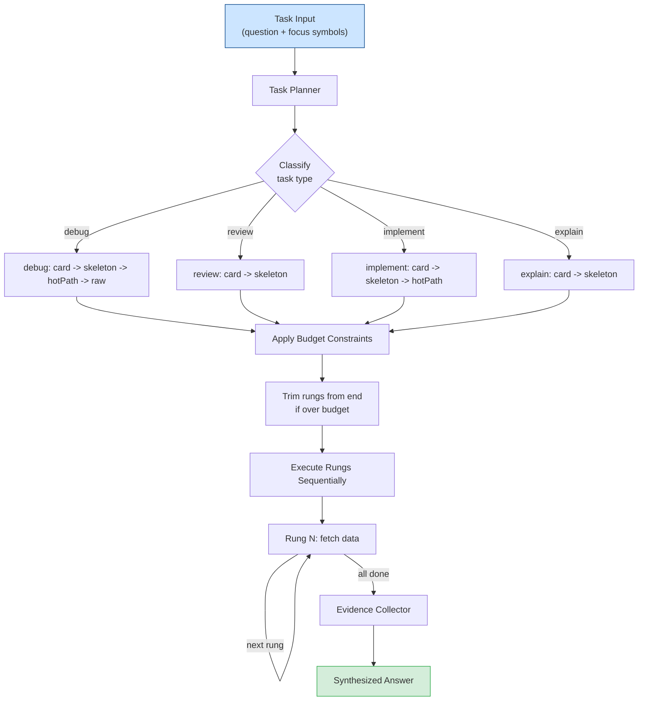

# Agent Orchestration & Intelligence

[Back to README](../../README.md)

---

## Autopilot Mode

`sdl.agent.orchestrate` is SDL-MCP's autonomous task execution engine. Instead of manually climbing the Iris Gate Ladder tool by tool, the orchestrator plans the optimal path, executes it, collects evidence, and returns a synthesized answer.

```
  Task: "Why does fetchUser throw on expired tokens?"
       │
       ▼
  ┌──────────────────────────────────┐
  │         Task Planner             │
  │                                  │
  │  Task type: debug                │
  │  Budget: 5000 tokens, 10 actions │
  │  Focus: fetchUser, tokenValidator│
  │                                  │
  │  Planned path:                   │
  │  card → card → skeleton → hotPath│
  │                                  │
  │  Estimated cost: 950 tokens      │
  └──────────┬───────────────────────┘
             │
    Execute each rung
             │
  ┌──────────┼──────────┐
  │          │          │
  ▼          ▼          ▼
card(1)   card(2)   skeleton   hotPath
 50 tok    50 tok    200 tok    500 tok
  │          │          │         │
  └──────────┴──────────┴─────────┘
                  │
                  ▼
  ┌──────────────────────────────────┐
  │         Evidence Collector       │
  │                                  │
  │  • fetchUser calls validateToken │
  │  • validateToken checks exp claim│
  │  • Throws TokenExpiredError      │
  │  • No retry logic present        │
  │                                  │
  │  Answer: "fetchUser throws       │
  │  because validateToken checks    │
  │  the `exp` claim and throws      │
  │  TokenExpiredError with no       │
  │  retry/refresh fallback."        │
  └──────────────────────────────────┘
```

### Orchestration Planning Flow



### Task Types

| Type | Broad Rungs (default) | Precise Rungs | Use Case |
|:-----|:---------------------|:-------------|:---------|
| `debug` | card → skeleton → hotPath → raw | card → hotPath | Tracing bugs through call chains |
| `review` | card → skeleton | card | Understanding changes for code review |
| `implement` | card → skeleton → hotPath | card → skeleton | Learning patterns before writing new code |
| `explain` | card → skeleton | card → skeleton | Generating explanations for documentation |

### Context Modes

The `contextMode` option controls context breadth and token efficiency:

- **`"precise"`** — Returns minimal context matching or beating manual `sdl.chain` efficiency. Adaptive selection caps at 1 symbol per rung, uses aggressive relevance scoring (threshold = 60% of top score), and strips the response envelope (`actionsTaken`, `summary`, `answer`, `nextBestAction`). Use for targeted lookups like "what does X do?" or "check NaN handling in Y".
- **`"broad"`** (default) — Returns richer surrounding context with adaptive selection (threshold = 40% of top score, up to 20 cards). Full response envelope with diagnostics, synthesized answer, and next-best-action guidance. Use for investigation tasks like "understand the auth pipeline" or "review changes in module X".

### Budget Controls

The planner estimates token costs per rung and trims from the end when budget-constrained:

| Rung | Estimated Tokens |
|:-----|:----------------:|
| Card | ~50 |
| Skeleton | ~200 |
| Hot-Path | ~500 |
| Raw | ~2,000 |

If your budget is 800 tokens, the planner might select `card → card → skeleton` and skip hot-path and raw entirely.

---

## Feedback Loop

After using a slice, agents can report which symbols were useful and which were missing via `sdl.agent.feedback`. This data is stored, aggregated, and **actively used to boost future retrieval**.

```
  After task completion:
  ┌─────────────────────────────┐
  │  sdl.agent.feedback         │
  │                             │
  │  useful: [sym1, sym2, sym5] │  ← these were helpful
  │  missing: [sym8]            │  ← expected but not in slice
  └─────────────┬───────────────┘
                │
                ▼
  ┌─────────────────────────────┐
  │  Aggregated Statistics      │
  │                             │
  │  topUseful:                 │
  │    validateToken (12 uses)  │
  │    dbQuery (9 uses)         │
  │                             │
  │  topMissing:                │
  │    errorHandler (5 reports) │  ← should be prioritized
  │    retryLogic (3 reports)   │     in future slices
  └─────────────┬───────────────┘
                │
                ▼
  ┌─────────────────────────────┐
  │  Feedback-Aware Boosting    │
  │                             │
  │  On next hybrid retrieval:  │
  │  • Query prior feedback via │
  │    FTS/vector on searchText │
  │  • Boost historically useful│
  │    symbols before RRF fusion│
  │  • Surface missing symbols  │
  │    as "previously missed"   │
  └─────────────────────────────┘
```

Query aggregated feedback via `sdl.agent.feedback.query` to understand which symbols are consistently valuable and which are consistently missing from slices.

### Feedback-Aware Retrieval Boosting

Agent feedback is not just passive data collection — it actively improves retrieval quality. Each `AgentFeedback` record stores `searchText` (concatenated from task text, type, and tags) plus embedding vectors (`embeddingMiniLM`, `embeddingNomic`), enabling FTS and vector search over prior feedback.

During hybrid retrieval for a new task, the `feedback-boost.ts` module:

1. Queries prior feedback by FTS/vector similarity to the current task text
2. Identifies symbols that were historically useful for similar tasks
3. Boosts those symbols' retrieval scores before final RRF fusion
4. Surfaces symbols that were consistently reported as "missing" from prior slices

This creates a **learning loop**: agents provide feedback → feedback improves retrieval → better slices → more accurate feedback. Over time, the retrieval system adapts to the specific patterns and priorities of your codebase and development workflow.

---

## Context Summary (Portable Briefings)

`sdl.context.summary` generates a structured, token-bounded context package that can be copy/pasted into non-MCP environments (Slack, Jira, PR descriptions, etc.):

```markdown
## Context: "auth middleware"

### Key Symbols
- `authenticate(req, res, next)` — Validates JWT token and attaches user to request
  - Cluster: auth-module (8 members)
  - Process: request-pipeline (entry, depth 0)
- `validateToken(token: string)` — Checks token signature and expiration
  - Process: request-pipeline (intermediate, depth 1)

### Dependencies
authenticate → validateToken → JwtConfig

### Risk Areas
- validateToken (fan-in: 12, high churn)

### Files Touched
- src/auth/middleware.ts (3 symbols)
- src/auth/jwt.ts (2 symbols)
```

Available in markdown, JSON, or clipboard-optimized formats.

---

## Predictive Prefetch

SDL-MCP anticipates your next tool call. When you search for symbols, the top 5 results have their cards prefetched. When you get a card, its slice frontier is prefetched. This reduces perceived latency for common workflows.

`sdl.repo.status` reports prefetch metrics:

```json
{
  "prefetchStats": {
    "hitRate": 0.72,
    "wasteRate": 0.15,
    "avgLatencyReductionMs": 45
  }
}
```

---

## Options Reference

### focusSymbols

Direct the orchestrator to specific symbols by ID. Symbols must be indexed before use -- run `sdl.symbol.search` first to find valid IDs.

```json
{
  "options": {
    "focusSymbols": ["auth:authenticateUser", "auth:validateToken"]
  }
}
```

Invalid symbols are silently skipped. If all symbols are invalid, the orchestrator collects no evidence.

### focusPaths

Scope the orchestrator to specific file paths (relative to repo root, forward slashes only, no wildcards):

```json
{
  "options": {
    "focusPaths": ["src/api", "src/data"]
  }
}
```

### includeTests

Adds a `hotPath` rung for test files in review tasks:

```json
{
  "options": {
    "includeTests": true
  }
}
```

### requireDiagnostics

Adds a `raw` rung to debug tasks (subject to policy gating):

```json
{
  "options": {
    "requireDiagnostics": true
  }
}
```

Avoid enabling this unless you genuinely need raw code -- it can double the token cost of a debug task.

### contextMode

Controls context breadth and token efficiency:

```json
{
  "options": {
    "contextMode": "precise"
  }
}
```

| Mode | Symbol Selection | Rungs | Response Envelope | Best For |
|:-----|:----------------|:------|:-----------------|:---------|
| `"precise"` | 1 per rung (aggressive threshold) | Minimal per task type | Stripped (evidence + metrics only) | Targeted lookups, token-sensitive contexts |
| `"broad"` (default) | Adaptive (up to 20 cards) | Full per task type | Complete (diagnostics, answer, next action) | Investigation, exploration, debugging |

In precise mode, the orchestrator uses task-text-derived identifiers to score and rank all symbols in the focus files, then selects only the highest-scoring symbol for each rung. File-level skeletons are skipped entirely. This produces responses that are 50-70% smaller than manual `sdl.chain` calls for the same query.

---

## Response Structure

```json
{
  "taskId": "task-1234567890-abc123",
  "taskType": "explain",
  "path": {
    "rungs": ["card", "skeleton"],
    "estimatedTokens": 250,
    "estimatedDurationMs": 60,
    "reasoning": "Explain task starts with high-level summaries"
  },
  "actionsTaken": [
    {
      "id": "action-0-1234567890",
      "type": "getCard",
      "status": "completed",
      "input": { "context": ["symbol:auth:authenticateUser"] },
      "output": { "cardsProcessed": 1 },
      "timestamp": 1234567890,
      "durationMs": 10,
      "evidence": []
    }
  ],
  "finalEvidence": [
    {
      "type": "symbolCard",
      "reference": "auth:authenticateUser",
      "summary": "Card for symbol auth:authenticateUser",
      "timestamp": 1234567890
    }
  ],
  "summary": "Task \"explain\" completed successfully. Executed 2 action(s), collected 3 evidence item(s).",
  "answer": "Based on the collected evidence from 3 sources...",
  "success": true,
  "error": null,
  "metrics": {
    "totalDurationMs": 65,
    "totalTokens": 250,
    "totalActions": 2,
    "successfulActions": 2,
    "failedActions": 0,
    "cacheHits": 0
  },
  "nextBestAction": null
}
```

### Field Reference

| Field | Description |
|:------|:------------|
| `taskId` | Unique identifier for this execution |
| `taskType` | One of `explain`, `review`, `debug`, `implement` |
| `path` | Selected rung path with cost estimates and reasoning |
| `actionsTaken` | Array of executed actions, each with `type`, `status`, `input`, `output`, `durationMs`, and collected `evidence` |
| `finalEvidence` | All evidence items collected across all actions |
| `summary` | Human-readable execution summary |
| `answer` | Synthesized answer based on collected evidence |
| `success` | `true` if all actions completed without errors |
| `error` | Error message if execution failed; `null` otherwise |
| `metrics` | Execution stats: duration, tokens, action counts, cache hits |
| `nextBestAction` | Suggested follow-up: `requestSkeleton`, `requestHotPath`, `refineRequest`, or `null` (broad only) |

**Action types**: `getCard`, `getSkeleton`, `getHotPath`, `needWindow`, `search`, `analyze`

**Action statuses**: `pending`, `inProgress`, `completed`, `failed`

**`cacheHits`** counts repeated symbol card lookups that were served from cache across execution rungs. High counts indicate efficient reuse of previously fetched cards.

**Precise mode response:** Only `taskId`, `taskType`, `success`, `path`, `finalEvidence`, and `metrics` are returned. `actionsTaken` is `[]`, `summary` is `""`, and `answer`/`nextBestAction`/`retrievalEvidence` are omitted.

---

## Usage Patterns

### Precise Lookup (recommended for targeted questions)

Minimal context — 1 card + 1 skeleton, smaller than manual `sdl.chain`. Use for "what does X do?" or "check Y for bugs".

```json
{
  "repoId": "my-repo",
  "taskType": "explain",
  "taskText": "What does processData do and what are its parameters?",
  "options": { "contextMode": "precise", "focusSymbols": ["utils:processData"] }
}
```

### Precise Debug

1 card + 1 hotPath targeting the exact symbol. Fastest debug path.

```json
{
  "repoId": "my-repo",
  "taskType": "debug",
  "taskText": "Check NaN handling in normalizeEdgeConfidence",
  "options": { "contextMode": "precise", "focusPaths": ["src/graph/slice/beam-search-engine.ts"] }
}
```

### Broad Exploration (default)

Richer context with multiple related symbols. Best for understanding modules or tracing flows.

```json
{
  "repoId": "my-repo",
  "taskType": "explain",
  "taskText": "Understand the authentication pipeline",
  "options": { "focusPaths": ["src/auth/"] }
}
```

### Deep Investigation

Full ladder with policy-governed raw access. Set a generous budget.

```json
{
  "repoId": "my-repo",
  "taskType": "debug",
  "taskText": "Investigate performance bottleneck",
  "budget": { "maxTokens": 5000 },
  "options": {
    "requireDiagnostics": true,
    "focusPaths": ["src/performance"]
  }
}
```

### Focused Review

Targeted security/quality review using skeleton + hotPath.

```json
{
  "repoId": "my-repo",
  "taskType": "review",
  "taskText": "Check for SQL injection vulnerabilities",
  "options": {
    "focusSymbols": ["db:query", "db:execute"],
    "focusPaths": ["src/database"]
  }
}
```

### Change Planning

Gather implementation context (card + skeleton + hotPath) before writing code.

```json
{
  "repoId": "my-repo",
  "taskType": "implement",
  "taskText": "Add rate limiting to API endpoints",
  "budget": { "maxTokens": 1500, "maxActions": 10 },
  "options": { "focusPaths": ["src/api/middleware"] }
}
```

### Policy-Aware Debugging

Debug with test context. Raw access is policy-gated; check `nextBestAction` for alternatives.

```json
{
  "repoId": "my-repo",
  "taskType": "debug",
  "taskText": "Debug failing integration test",
  "options": {
    "includeTests": true,
    "focusSymbols": ["test:apiIntegration"]
  }
}
```

---

## Constraints & Limitations

| Area | Constraint |
|:-----|:-----------|
| **Raw code access** | Denied by default (`defaultDenyRaw: true`). Downgraded to hotPath or skeleton with `nextBestAction` guidance. |
| **Budget enforcement** | Rungs are pruned from the end to fit budget. At least 1 rung is always kept. Budgets are estimates -- actual usage may vary. |
| **Symbol resolution** | Symbols must be indexed. Use `sdl.symbol.search` to find valid IDs. Invalid symbols are silently skipped. |
| **Path resolution** | Relative to repo root. Forward slashes only. No wildcards. |
| **Execution limits** | Hard caps via `budget.maxActions` and `budget.maxDurationMs`. Timeout produces partial results. |

---

## Break Glass Override

When policy denies raw access but you have a legitimate need (security audit, incident response), prefix the task text with `AUDIT:` or `BREAK-GLASS:`:

```json
{
  "taskType": "debug",
  "taskText": "AUDIT: Critical security investigation requiring raw access",
  "options": { "focusSymbols": ["auth:validateToken"] }
}
```

Requires `allowBreakGlass: true` in policy configuration. All break-glass uses are audit-logged.

---

## Performance Considerations

### Execution Speed by Rung

| Rung | Latency | Tokens |
|:-----|:-------:|:------:|
| Card | ~10 ms | ~50 |
| Skeleton | ~50 ms | ~200 |
| Hot-Path | ~100 ms | ~500 |
| Raw | ~500 ms | ~2,000 |

### Tips

- Use `explain` tasks for quick understanding (card-only path).
- Avoid `requireDiagnostics` unless needed -- it adds a raw rung.
- Set realistic budgets to prevent unnecessary rungs.
- `cacheHits` in metrics tracks repeated symbol card lookups served from cache. High counts indicate efficient card reuse across rungs.

---

## Troubleshooting

| Symptom | Cause | Fix |
|:--------|:------|:----|
| No evidence collected | Invalid symbols or paths in options | Verify symbols with `sdl.symbol.search`; check path spelling |
| Raw access denied | Policy enforcement (`defaultDenyRaw`) | Check `nextBestAction`; add identifiers for hotPath; use break glass if justified |
| Task exceeds budget | Estimated tokens over limit | Increase `budget.maxTokens`, reduce scope (fewer symbols/paths), or simplify task |
| Partial execution | Error or timeout mid-run | Check `failedActions` in metrics; review action errors in `actionsTaken`; increase `budget.maxDurationMs` |
| `nextBestAction` is null | Task completed successfully | Expected -- this field only populates when policy suggests alternatives |

---

## Related

- [Orchestrator Context Modes](./orchestrator-context-modes.md) - Deep dive on precise vs broad modes, adaptive symbol ranking, benchmarks
- [`sdl.agent.orchestrate`](../mcp-tools-detailed.md#sdlagentorchestrate) - Autonomous task execution
- [`sdl.agent.feedback`](../mcp-tools-detailed.md#sdlagentfeedback) - Record feedback
- [`sdl.agent.feedback.query`](../mcp-tools-detailed.md#sdlagentfeedbackquery) - Query aggregated feedback
- [`sdl.context.summary`](../mcp-tools-detailed.md#sdlcontextsummary) - Portable context briefings

[Back to README](../../README.md)
