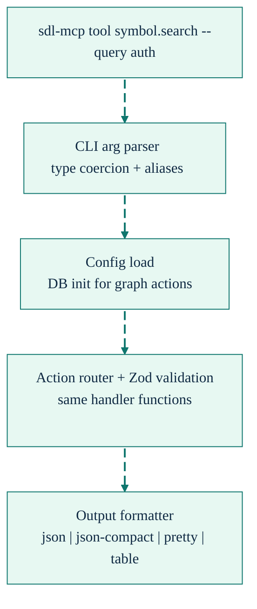

# CLI Tool Access

**Access direct SDL-MCP action aliases plus `action.search` and `manual` metadata proxies from the command line without running an MCP transport.**

The `sdl-mcp tool` command executes direct graph actions through the same gateway handler layer used by the MCP server, but it does not expose the entire runtime surface. It covers the CLI action definitions in [`src/cli/commands/tool-actions.ts`](../../src/cli/commands/tool-actions.ts), including 36 direct aliases across query, code, repo, and agent namespaces plus a small meta namespace for `action.search` and `manual`. The metadata proxies run in process and skip graph DB initialization.

---

## Quick Start

```bash
# List available actions
sdl-mcp tool --list

# Search for symbols
sdl-mcp tool symbol.search --repo-id my-repo --query "handleAuth"

# Get a symbol card
sdl-mcp tool symbol.getCard --repo-id my-repo --symbol-id "file:src/server.ts::MCPServer"

# Preview a symbol-scoped edit against the saved file.
# The returned plan handle is process-local; use applyNow for CLI writes.
sdl-mcp tool symbol.edit --repo-id my-repo --mode preview \
  --symbol-id "src/auth.ts::handleAuth" \
  --operation '{"kind":"replaceBody","content":"return true;\n"}'

# Update one JSON setting
sdl-mcp tool file.write --repo-id my-repo --file-path config/app.json \
  --json-path server.port --json-value 8080

# Build a task-scoped graph slice
sdl-mcp tool slice.build --repo-id my-repo --task-text "debug auth flow" --max-cards 50

# Search the action catalog without opening the graph DB
sdl-mcp tool action.search --query manual --summary-only

# Render focused manual metadata without opening the graph DB
sdl-mcp tool sdl.manual --actions action.search --format json

# Show action-specific help
sdl-mcp tool symbol.search --help
```

---

## How It Works

The CLI dispatcher bypasses MCP transport setup. It parses flags, loads config, resolves the action, validates arguments with the same Zod schemas used by the MCP server, and then formats the result for terminal output. Direct graph actions initialize LadybugDB before dispatch; `action.search` and `manual` skip graph initialization and call the shared metadata handlers directly.


By default, terminal output is human-readable rather than raw JSON. Use `--output-format json` or `--output-format json-compact` when a script needs machine-readable output. The MCP transport follows the same human-first rule in its visible `content` text while exposing projected task data through `structuredContent`; internal timing, packing, logging, and raw-context fields are omitted unless explicitly requested for diagnostics.



---

## Current Action Surface

Run `sdl-mcp tool --list` to inspect the current aliases grouped by namespace.

### Meta

| Action          | Alias               | Description                                  |
| :-------------- | :------------------ | :------------------------------------------- |
| `action.search` | `sdl.action.search` | Search the action catalog without graph init |
| `manual`        | `sdl.manual`        | Render focused manual metadata               |

Only these two metadata tools are proxied through the CLI today.

### Query

| Action                | Description                       |
| :-------------------- | :-------------------------------- |
| `symbol.search`       | Search symbols by name or summary |
| `symbol.getCard`      | Get a symbol card by ID           |
| `slice.build`         | Build a graph slice for a task    |
| `slice.refresh`       | Refresh an existing slice handle  |
| `slice.spillover.get` | Fetch paginated spillover cards   |
| `delta.get`           | Get a delta pack between versions |
| `pr.risk.analyze`     | Analyze PR risk and blast radius  |
| `response.get`        | Retrieve stored large responses   |

### Code

| Action             | Description                                |
| :----------------- | :----------------------------------------- |
| `code.needWindow`  | Request a policy-gated raw code window     |
| `code.getSkeleton` | Get skeleton structure without full bodies |
| `code.getHotPath`  | Get lines matching specific identifiers    |

### Repo

| Action                        | Description                                  |
| :---------------------------- | :------------------------------------------- |
| `repo.register`               | Register a repository                        |
| `repo.status`                 | Get repository status                        |
| `repo.overview`               | Get a token-efficient repository overview    |
| `index.refresh`               | Trigger indexing                             |
| `semantic.enrichment.refresh` | Report provider source selection; provider facts are indexed by provider-first |
| `semantic.enrichment.status`  | Inspect enrichment source selection and runs |
| `policy.get`                  | Read the current policy                      |
| `policy.set`                  | Update the current policy                    |
| `usage.stats`                 | Read token usage statistics                  |
| `file.read`                   | Read non-indexed files through SDL           |
| `file.write`                  | Write a single file with targeted modes      |
| `search.edit`                 | Preview and apply cross-file search/edit plans |
| `symbol.edit`                 | Preview or applyNow one saved-file symbol edit |

### Agent

| Action                 | Description                                 |
| :--------------------- | :------------------------------------------ |
| `agent.feedback`       | Record which symbols were useful or missing |
| `agent.feedback.query` | Query aggregated feedback                   |
| `buffer.push`          | Push live buffer updates                    |
| `buffer.checkpoint`    | Force a live-buffer checkpoint              |
| `buffer.status`        | Inspect live-buffer state                   |
| `runtime.execute`      | Run a sandboxed subprocess                  |
| `runtime.queryOutput`  | Query stored runtime output                 |
| `memory.store`         | Store a development memory                  |
| `memory.query`         | Search development memories                 |
| `memory.remove`        | Remove a development memory                 |
| `memory.surface`       | Surface relevant memories                   |

`sdl-mcp tool` currently exposes only two Code Mode metadata proxies: `action.search` and `manual` (with `sdl.` aliases). `sdl.context`, `sdl.retrieve`, `sdl.workflow`, and `sdl.file` remain MCP-only wrapper tools.

Use these CLI edit paths:

- `file.write` for immediate single-file edits.
- `symbol.edit --mode applyNow` for one-call saved-file symbol edits.
- `search.edit` when you want a preview/apply workflow across one or more files.
- `symbol.edit --mode preview` to inspect a saved-file plan from the CLI.

`symbol.edit --mode apply` requires the MCP/server session that created the process-local plan handle. Overlay-aware `symbol.edit` plans also require the MCP server session that owns the live draft.

---

## Output Formats

Use `--output-format` to choose how results are printed:

```bash
# Default: human-readable pretty output
sdl-mcp tool repo.status --repo-id my-repo

# Compact JSON for scripts
sdl-mcp tool repo.status --repo-id my-repo --output-format json-compact

# Full JSON alias with one positional JSON object
sdl-mcp tool action.search '{"query":"manual","limit":1}' --json

# Explicit pretty output
sdl-mcp tool symbol.search --repo-id my-repo --query "auth" --output-format pretty

# Table output for list-shaped data
sdl-mcp tool agent.feedback.query --repo-id my-repo --output-format table
```

Supported values are `json`, `json-compact`, `pretty`, and `table`. `--json` is a shorthand for `--output-format json`.

---

## Argument Handling

The CLI parser supports the same common aliases accepted by MCP requests, including `--repo-id`, `--root-path`, `--symbol-id`, `--symbol-ids`, `--from-version`, `--to-version`, and `--slice-handle`. It also accepts one positional JSON object, which is merged with stdin JSON before named flags override both.

For actions that accept nested `budget` objects, the CLI provides flat convenience flags:

```bash
sdl-mcp tool slice.build --repo-id my-repo --task-text "debug" \
  --max-cards 50 --max-tokens 10000
```

That becomes:

```json
{ "budget": { "maxCards": 50, "maxEstimatedTokens": 10000 } }
```

If stdin provides JSON input, CLI flags override the piped values.

For `file.write`, nested write modes use JSON-valued flags:

```bash
sdl-mcp tool file.write --repo-id my-repo --file-path docs/guide.md \
  --replace-lines '{"start":10,"end":12,"content":"Updated text"}'
```

For multiline content or values that are awkward to quote in a shell, pipe the request as JSON:

```bash
echo '{"repoId":"my-repo","filePath":"config/app.json","jsonPath":"server.port","jsonValue":8080}' \
  | sdl-mcp tool file.write
```

---

## Examples

### Debugging

```bash
sdl-mcp tool symbol.search --query "validateToken" --output-format pretty
sdl-mcp tool symbol.getCard --symbol-id "file:src/auth/jwt.ts::validateToken"
sdl-mcp tool slice.build --task-text "debug token validation failure" --max-cards 20
sdl-mcp tool code.getSkeleton --file src/auth/jwt.ts --output-format pretty
sdl-mcp tool code.getHotPath --symbol-id "file:src/auth/jwt.ts::validateToken" \
  --identifiers "verifySignature,checkExpiry"
```

### PR Review

```bash
sdl-mcp tool pr.risk.analyze --from-version v22 --to-version v23
sdl-mcp tool delta.get --from-version v22 --to-version v23
sdl-mcp summary "changes in v23" --format markdown --repo-id my-repo
```

### CI

```bash
sdl-mcp tool repo.register --repo-id ci-build --root-path .
sdl-mcp tool index.refresh --repo-id ci-build --mode full
sdl-mcp tool file.write --repo-id ci-build --file-path config/ci.json \
  --json-path retries --json-value 2
sdl-mcp tool runtime.execute --runtime shell --code "npm test" --timeout-ms 30000 --output-mode minimal
```

---

## Architecture Notes

The direct CLI surface is implemented by four modules:

| Module             | File                                  | Responsibility                                                      |
| :----------------- | :------------------------------------ | :------------------------------------------------------------------ |
| Action definitions | `src/cli/commands/tool-actions.ts`    | Declares the 36 CLI-visible aliases                                 |
| Arg parser         | `src/cli/commands/tool-arg-parser.ts` | Maps flags to handler fields and coerces types                      |
| Dispatcher         | `src/cli/commands/tool-dispatch.ts`   | Loads config, resolves `repoId`, routes actions, and handles errors |
| Output formatter   | `src/cli/commands/tool-output.ts`     | Formats results as JSON, compact JSON, pretty, or table output      |

The dispatcher reuses the gateway action map for execution, so the CLI and MCP server share the same handlers and core validation logic. The CLI alias list is kept in sync with the shared action handler map while still excluding separate Code Mode-only tools.

---

## Limitations

- `buffer.*` actions require a running MCP server with live indexing. In CLI mode they typically return limited or empty results.
- `file.write` applies immediately and has no preview phase. Use `search.edit` for preview/apply batch edits with drift checks and rollback. Use `symbol.edit --mode applyNow` for CLI symbol-scoped writes; two-phase `symbol.edit` apply requires the MCP/server session that created the preview plan.
- For `file.write` requests with multiline content, nested mode objects, or JSON values that are hard to quote in a shell, prefer stdin JSON.
- Code Mode tools are separate from the direct CLI alias surface.
- Each invocation initializes config and the graph database, so high-frequency automation is better served by an MCP server over HTTP or stdio.

[Back to README](../../README.md)
