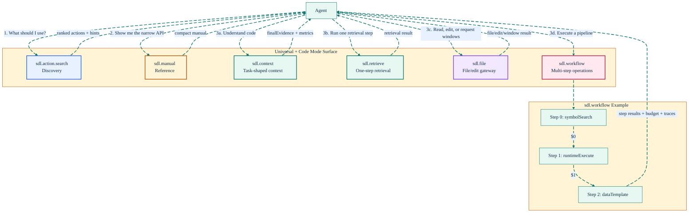

# Code Mode

**Use SDL-MCP Code Mode to keep discovery, context retrieval, and multi-step execution inside SDL instead of falling back to token-heavy native tools.**

Code Mode is built around one clear separation of responsibility:

- `sdl.action.search` is the universal discovery surface.
- `sdl.manual` loads a compact API subset.
- `sdl.context` handles task-shaped code understanding.
- `sdl.retrieve` handles one exact retrieval step.
- `sdl.workflow` handles multi-step operations.
- `sdl.file` handles file reads, writes, edits, and gated source windows.

If you remember only one rule, make it this one: use `sdl.context` first for `explain`, `debug`, `review`, and most `implement` requests. Use `sdl.retrieve` for one exact retrieval step, `sdl.file` for file/edit/window work, and `sdl.workflow` only when the work is genuinely procedural.

---

## What Code Mode Solves

Without Code Mode, agents waste tokens on:

- large tool lists
- repeated schema exposure
- serial context gathering
- native shell and file calls that SDL could answer directly

Code Mode keeps those flows inside SDL-MCP:

1. discover the right surface with `sdl.action.search`
2. load a narrow API slice with `sdl.manual`
3. route understanding work to `sdl.context`
4. route one-step retrieval to `sdl.retrieve`
5. route file, edit, and source-window work to `sdl.file`
6. route execution pipelines to `sdl.workflow`

---

## Output Surfaces

Code Mode tool output is human-first. The first MCP `content` text block is concise terminal-friendly text, while task-relevant machine-readable data is carried in `structuredContent`. Agents should read the visible text for the human-facing summary and use `structuredContent` for follow-up identifiers such as `etag`, handles, file paths, symbol IDs, references, summaries, errors, and next-action hints.

SDL-MCP internal bookkeeping is not duplicated into model-visible output by default. Timing diagnostics, packed-wire stats, raw-context baselines, action traces, precondition snapshots, backup paths, and retrieval-debug details stay in logs or diagnostics surfaces. Set `includeDiagnostics: true` or the relevant retrieval-evidence option only when the task actually needs those details; even then, the normal visible text stays concise.


## Tool Surface

### `sdl.action.search`

Use this first when the right SDL action is unclear.

It returns ranked actions with optional schema summaries, examples, prerequisites, and recommended next steps.

Use `offset` with `limit` to page through large result sets such as `query: "*"`.

### `sdl.manual`

Use this when you know the rough area and want a compact manual instead of the full API surface.

Supported filters:

- `query` for text filtering
- `actions` for an exact subset
- `format` for `typescript`, `markdown`, or `json`
- `includeSchemas` / `includeExamples` for richer output

### `sdl.context`

Use this for task-shaped context retrieval inside Code Mode.

It mirrors `sdl.context`, but it sits next to `sdl.manual` and `sdl.workflow` so an agent can stay on the Code Mode surface after discovery. Start here for:

- `explain`
- `debug`
- `review`
- `implement` when the immediate need is understanding existing code

### `sdl.retrieve`

Use this when you need one exact retrieval step and do not need the planning overhead of a workflow.

Supported operations:

- `symbolSearch`
- `symbolGetCard`
- `sliceBuild`
- `codeSkeleton`
- `codeHotPath`
- `codeNeedWindow`

### `sdl.workflow`

Use this for multi-step operations that would otherwise require multiple SDL calls.

Good fits:

- `runtimeExecute` pipelines
- data transforms
- batch mutations
- reusable multi-step lookup and shaping flows

Bad fits:

- single actions
- explain/debug/review context retrieval
- “figure out what this code does” questions

### `sdl.file`

Use this for file and edit operations inside Code Mode.

Good fits:

- read or write a non-indexed file
- preview and apply `search.edit`
- preview and apply `symbol.edit`
- request policy-gated source windows with `previewWindow` or `sourceWindow`

---

## Routing Guide

| Request shape | Start with | Why |
|:--------------|:-----------|:----|
| Explain a symbol or module | `sdl.context` | Returns task-shaped evidence without hand-building the ladder |
| Debug a bug or trace behavior | `sdl.context` | Chooses `card`, `skeleton`, `hotPath`, and raw follow-ups only when needed |
| Review code or inspect risk | `sdl.context` | Gives compact review-oriented evidence first |
| Learn a pattern before implementing | `sdl.context` | Gets structural context with less overhead than a workflow |
| Need one exact retrieval step | `sdl.retrieve` | Runs a single symbol, slice, skeleton, hot-path, or code-window operation |
| Read, write, edit, or request a source window | `sdl.file` | Keeps file operations on the compact Code Mode surface |
| Run tests, lint, or diagnostics | `sdl.workflow` | Best for `runtimeExecute` plus follow-up parsing |
| Shape or filter previous results | `sdl.workflow` | Internal transforms avoid wasting model tokens |
| Batch multiple dependent operations | `sdl.workflow` | `$N` references keep everything in one round trip |

---

## Architecture



---

## Workflow Anatomy

`sdl.workflow` executes sequential steps that reference earlier results through `$N.path` expressions.

References also support optional chaining such as `$0.results[1]?.symbolId`, which resolves to `undefined` instead of failing when the indexed value is missing.

Each step has:

- `fn`: action or internal transform name
- `args`: arguments object

Internal transforms include:

- `dataPick`
- `dataMap`
- `dataFilter`
- `dataSort`
- `dataTemplate`
- `workflowContinuationGet`

Canonical structured continuation recipe:

```json
{
  "repoId": "[repoid]",
  "steps": [
    {
      "fn": "symbolSearch",
      "args": { "query": "WorkflowExecutor", "limit": 50 },
      "maxResponseTokens": 300
    },
    {
      "fn": "workflowContinuationGet",
      "args": {
        "handle": "$0.truncatedResponse.continuationHandle",
        "path": "results",
        "offset": 0,
        "limit": 10
      }
    },
    {
      "fn": "dataMap",
      "args": {
        "input": "$1.data",
        "fields": { "symbolId": "symbolId", "name": "name", "file": "file" }
      }
    },
    {
      "fn": "dataTemplate",
      "args": {
        "input": "$2",
        "template": "{{name}} - {{file}}",
        "joinWith": "\n"
      }
    }
  ]
}
```

When `maxResponseTokens` is too small to include any result fields, the step result includes a visible `truncated: true` marker and `truncatedResponse.continuationHandle` points to the full stored result.

The workflow engine also provides:

- budget tracking
- context-ladder validation
- internal cross-step ETag caching
- optional execution traces

---

## Configuration

```json
{
  "codeMode": {
    "enabled": true,
    "exclusive": true,
    "maxWorkflowSteps": 20,
    "maxWorkflowTokens": 50000,
    "maxWorkflowDurationMs": 60000,
    "ladderValidation": "warn",
    "etagCaching": true
  }
}
```

### Registration modes

| Mode | Registered tools |
|:-----|:-----------------|
| Disabled | Base flat or gateway tools, plus universal `sdl.action.search` and `sdl.info` |
| Enabled + gateway | Gateway tools plus `sdl.action.search`, `sdl.manual`, `sdl.context`, `sdl.retrieve`, `sdl.workflow`, `sdl.file` |
| Enabled + flat | Flat tools plus `sdl.action.search`, `sdl.manual`, `sdl.context`, `sdl.retrieve`, `sdl.workflow`, `sdl.file` |
| Exclusive | `sdl.action.search`, `sdl.manual`, `sdl.context`, `sdl.retrieve`, `sdl.workflow`, `sdl.file` only |

---

## Recommended Agent Flow

For SDL-first agents:

1. `sdl.repo.status`
2. `sdl.action.search` when the right surface is unclear
3. `sdl.manual(query|actions)` when a compact API slice helps
4. `sdl.context` for explain/debug/review/implement context retrieval
5. `sdl.retrieve` for one exact retrieval step
6. `sdl.file` for file, edit, or source-window work
7. `sdl.workflow` for runtime execution, data shaping, batch mutations, and other procedural pipelines
8. `runtimeExecute` inside `sdl.workflow` for repo-local build, test, lint, or diagnostics

This is the intended path for enforced agent setups where SDL-MCP replaces token-heavy default tools whenever possible.

---

## Related Docs

- [Agent Context](./agent-context.md)
- [Context Modes](./context-modes.md)
- [Runtime Execution](./runtime-execution.md)
- [Tool Gateway](./tool-gateway.md)
- [Governance & Policy](./governance-policy.md)

[Back to README](../../README.md)
