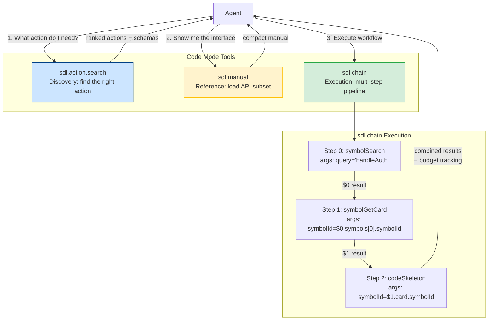

# Code Mode

**Use SDL-MCP Code Mode to reduce tool-list overhead, collapse multi-step workflows into one round trip, and keep code understanding inside SDL instead of falling back to token-heavy native tools.**

Code Mode exposes three complementary tools plus the always-available diagnostics tool:

- `sdl.action.search` for discovery
- `sdl.manual` for focused reference
- `sdl.chain` for execution
- `sdl.info` is always available alongside Code Mode for environment diagnostics

Together they let agents discover the right SDL action, load only the relevant interface details, and execute a full lookup or runtime workflow in one call.

---

## What It Solves

Without Code Mode, agents often spend tokens on:

- large tool lists
- repeated schema exposure
- multiple round trips for sequential lookups
- native shell and file tools that SDL could replace

Code Mode keeps those workflows inside SDL-MCP:

1. Discover the right action with `sdl.action.search`
2. Load only the relevant API subset with `sdl.manual`
3. Execute the workflow with `sdl.chain`

---

## Tool Surface

### `sdl.action.search`

Use this first when the right SDL action is unclear.

Example:

```json
{
  "query": "find auth symbol and inspect code structure",
  "limit": 5,
  "includeSchemas": true
}
```

This returns a ranked subset of actions, with optional schema and example metadata.

Each ranked action can include:

- `action` and `description`
- `tags`
- `schemaSummary`
- `example`
- `prerequisites`
- `recommendedNextActions`
- `fallbacks`

Code Mode uses the same metadata model that now powers gateway descriptions and manual output, so discovery, reference, and execution all point the agent toward the same next-step ladder.

### `sdl.manual`

Use this when you already know the rough area and want a compact manual instead of the full API surface.

Supported patterns:

- `query` to filter by text
- `actions` to request an exact subset
- `format` to choose `typescript`, `markdown`, or `json`
- `includeSchemas` / `includeExamples` for richer output

Example:

```json
{
  "actions": ["symbol.search", "symbol.getCard", "slice.build"],
  "format": "typescript",
  "includeExamples": true
}
```

When you pass `includeSchemas` or `includeExamples`, `sdl.manual` preserves the same discovery hints from `sdl.action.search` instead of expanding into the full API surface.

### `sdl.chain`

Use this for multi-step operations (runtime execution, data transforms, batch mutations) that would otherwise require multiple SDL calls. For code context retrieval, prefer `sdl.agent.orchestrate` — it is more token-efficient and automatically selects the right context ladder rungs.

Example:

```json
{
  "repoId": "my-repo",
  "steps": [
    { "fn": "symbolSearch", "args": { "query": "handleAuth", "limit": 3 } },
    { "fn": "symbolGetCard", "args": { "symbolId": "$0.symbols[0].symbolId" } },
    { "fn": "codeSkeleton", "args": { "symbolId": "$1.card.symbolId" } }
  ],
  "budget": { "maxTotalTokens": 4000 },
  "onError": "continue"
}
```

---

## Architecture



---

## Current Features

### Result piping

Use `$N.path` references to feed step results into later steps.

### Internal transforms

`sdl.chain` supports chain-only data shaping without opening a general-purpose VM. Use internal transform steps such as:

- `dataPick`
- `dataMap`
- `dataFilter`
- `dataSort`
- `dataTemplate`

These are useful for fetch-shape-summarize workflows where the model would otherwise waste tokens interpreting raw payloads.

### Traces

`sdl.chain` supports opt-in traces for debugging and prompt construction. Trace output can include:

- per-step summaries
- resolved argument previews
- schema summaries
- examples
- bounded result previews

### Context ladder validation

Chains still honor SDL-MCP’s escalation model. Code Mode does not bypass policy or proof-of-need gating.

---

## Configuration

```json
{
  "codeMode": {
    "enabled": true,
    "exclusive": true,
    "maxChainSteps": 20,
    "maxChainTokens": 50000,
    "maxChainDurationMs": 60000,
    "ladderValidation": "warn",
    "etagCaching": true
  }
}
```

### Registration modes

| Mode | Registered tools |
|:-----|:-----------------|
| Disabled | Base flat or gateway tools, plus universal `sdl.action.search` and `sdl.info` |
| Enabled + gateway | Gateway tools plus `sdl.action.search`, `sdl.info`, `sdl.manual`, `sdl.chain` |
| Enabled + flat | Flat tools plus `sdl.action.search`, `sdl.info`, `sdl.manual`, `sdl.chain` |
| Exclusive | `sdl.action.search`, `sdl.info`, `sdl.manual`, `sdl.chain` only |

---

## Recommended Agent Workflow

For SDL-first agents:

1. `sdl.repo.status`
2. `sdl.agent.orchestrate` for code context retrieval (`contextMode: "precise"` for targeted lookups, `"broad"` for exploration)
3. `sdl.action.search` when the right action is unclear
4. `sdl.manual(query|actions)` for API reference
5. `sdl.chain` for multi-step operations (runtime execution, data transforms, batch mutations)
6. `runtimeExecute` inside `sdl.chain` for repo-local build, test, lint, or diagnostics

This is the intended path for enforced agent setups where SDL-MCP should replace token-heavy default tools whenever possible. Context retrieval always goes through orchestrate; chain is reserved for non-context operations.

---

## Related Docs

- [Tool Gateway](./tool-gateway.md)
- [Runtime Execution](./runtime-execution.md)
- [Agent Orchestration](./agent-orchestration.md)
- [Governance & Policy](./governance-policy.md)

[Back to README](../../README.md)
