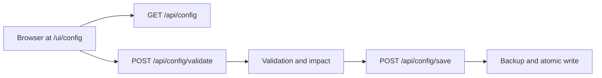

# Visual Configuration Admin Console

<div align="right">
<details>
<summary><strong>Docs Navigation</strong></summary>

- [Overview](../../README.md)
- [Documentation Hub](../README.md)
  - [Configuration Reference](../configuration-reference.md)
  - [Observability Dashboard](./observability-dashboard.md)
  - [Troubleshooting](../troubleshooting.md)

</details>
</div>

## Request flow




## Overview

The visual configuration admin console is available on the HTTP transport at
`/ui/config`. It edits the active SDL-MCP JSON config file with a dependency-free
browser UI and an accompanying `/api/config` backend.

The console is meant for large SDL-MCP configs that are hard to maintain in raw JSON
alone. It shows the as-authored config beside effective/default-expanded values, groups
settings by operational area, validates drafts through the canonical config schema plus
non-invasive semantic checks, previews a global diff, marks restart/reindex/reconnect
impact, writes backups, supports rollback, and manages reusable profiles.

Use `/ui/observability` for read-only runtime telemetry and `/ui/config` for config edits.
Both pages share the same lightweight admin shell and link to each other. If HTTP bearer auth is enabled, enter the bearer token in the config page header before loading or saving config data.

## Safety Model

Configuration mutation is intentionally conservative:

- `GET /api/config` can be called remotely when the HTTP transport is reachable and the
  existing HTTP auth policy permits it.
- Every non-GET config API request requires a loopback client address.
- If HTTP bearer auth is enabled, the existing `/api/*` auth behavior still applies in
  addition to the loopback mutation check.
- Saves require the caller to send the latest expected config hash. Stale hashes return a
  conflict with the latest redacted config snapshot.
- Secret values are never returned. Redacted secret placeholders preserve the current
  value on validate/save unless the user explicitly replaces or clears the secret.
- Unknown top-level JSON keys are preserved during normalized writes and reported as
  warnings because this SDL-MCP version ignores them.
- No broad live reload is performed in v1. Save responses report whether the change
  applies immediately, requires restart, requires reindex, or requires reconnecting MCP
  clients.

## API

### `GET /api/config`

Returns:

- `raw`: redacted as-authored JSON from the active config file.
- `effective`: redacted config after SDL-MCP defaults and schema parsing.
- `source`: config path, mtime, size, and SHA-256 hash.
- `validation`: schema and semantic validation messages.
- `metadata`: UI section and field metadata keyed by JSON Pointer paths.
- `backups`: timestamped backup summaries.
- `profiles`: reusable profile summaries.

### `POST /api/config/validate`

Body:

```json
{ "draft": { "repos": [] } }
```

Validates a draft and returns validation messages, a redacted diff from the current file,
and an impact summary. Validation is non-invasive: it checks JSON/schema shape, unknown
keys, missing environment variables, repo root readability, graph DB parent writability,
and command discoverability. It does not launch LSP servers, run SCIP, load ONNX models,
or open new graph databases.

### `POST /api/config/save`

Body:

```json
{
  "expectedHash": "sha256-of-current-file",
  "draft": { "performanceTier": "high" },
  "highRiskAccepted": true
}
```

The save path restores redacted secret placeholders, validates the draft, computes impact,
writes a timestamped backup under `.sdl-config-backups` next to the active config file,
writes temp JSON in the same directory, fsyncs it, renames it over the config file, and
returns the new source hash, backup summary, redacted diff, validation state, and impact.

High-risk changes include auth, secret, command, plugin, runtime, repo path, and graph DB
path changes. If such a change is present and `highRiskAccepted` is not true, the API
returns `409 high_risk_confirmation_required` with the redacted diff.

### `GET /api/config/backups`

Returns backup summaries for the active config file.

### `POST /api/config/rollback`

Body:

```json
{
  "expectedHash": "sha256-of-current-file",
  "backupId": "2026-05-12T10-15-30-000Z-sdlmcp.config",
  "highRiskAccepted": true
}
```

Rollback reads a known backup and restores it through the same conflict, validation,
diff, backup, atomic write, and audit path as a normal save.

## Profiles

Profiles are reusable partial patches stored at:

```text
~/.sdl-mcp/config-profiles/*.json
```

The profile format is JSON Pointer based:

```json
{
  "schemaVersion": 1,
  "id": "high-throughput-local",
  "name": "High throughput local",
  "includesSecrets": false,
  "patch": [
    { "op": "set", "path": "/performanceTier", "value": "high" },
    { "op": "set", "path": "/indexing/pass2Concurrency", "value": 8 },
    { "op": "delete", "path": "/observability/scipIngestMetrics" }
  ]
}
```

Supported operations are `set` and `delete`. Array paths preserve order by using JSON
Pointer indexes. Profiles exclude secret paths in v1. If a submitted profile patch targets a secret path or embeds a secret field inside an object value, SDL-MCP drops that operation before storing or returning the profile. Full snapshot export is not the primary v1 workflow.

Profile endpoints:

- `GET /api/config/profiles`
- `POST /api/config/profiles`
- `GET /api/config/profiles/:id`
- `DELETE /api/config/profiles/:id`
- `POST /api/config/profiles/:id/preview`
- `POST /api/config/profiles/:id/apply`

Profile apply uses the same save path and expected-hash conflict handling as direct edits.

## UI Sections

The console groups settings by operational area:

- Repositories
- Graph Database
- Policy
- Redaction
- Indexing
- Live Index
- Graph Slices
- Diagnostics
- Cache
- Plugins
- Semantic Retrieval
- Semantic Enrichment
- SCIP
- Runtime
- MCP Surface: gateway, Code Mode, HTTP, security, auth
- Memory
- Observability
- Wire / Packing
- Prefetch
- Tracing
- Parallel Scorer
- Concurrency
- Performance Tier
- Advanced / Unknown

Each section includes visual controls where metadata identifies known fields and a raw JSON
fallback for values not yet modeled by a dedicated control.

## Impact Labels

- `applies immediately`: the saved config is already read from disk by the relevant path.
- `restart required`: restart the SDL-MCP server for the change to take effect.
- `reindex required`: run or schedule indexing after the config change.
- `reconnect clients`: reconnect MCP clients so their registered tool surface matches the
  new config.

## Audit Logging

Save, rollback, and profile apply operations emit structured logs with action, remote
address, config path, changed paths, high-risk paths, backup path, and impact. Secret
values are not logged.
