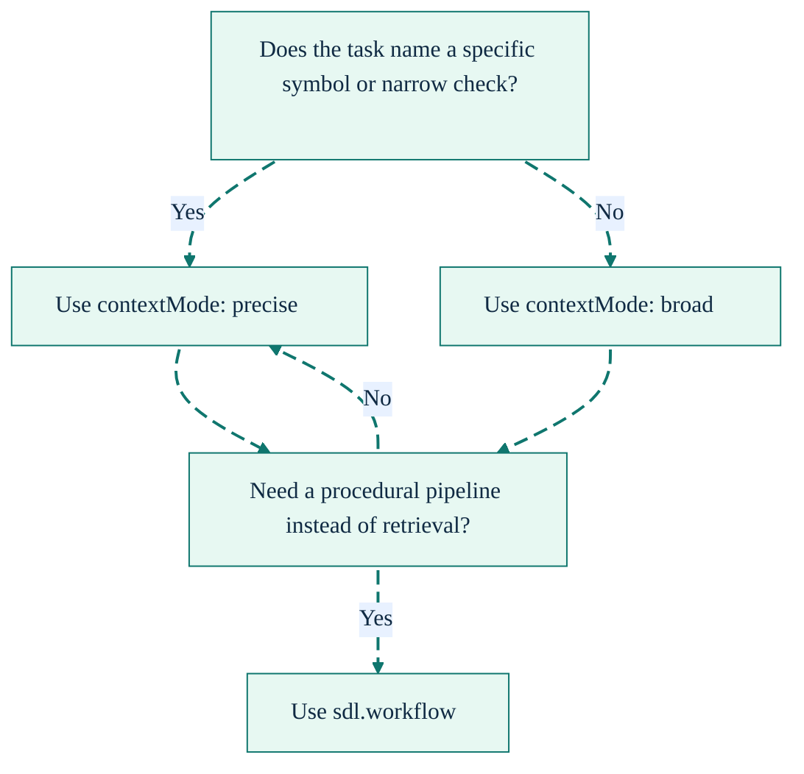

# Context Modes

[Back to README](../../README.md) | [Agent Context Overview](./agent-context.md)

---

## The Problem

Agents need different amounts of code context for different jobs.

A targeted question such as "check NaN handling in `normalizeEdgeConfidence`" should not return the same envelope as "understand the auth pipeline." Manual `sdl.workflow` assembly can get either answer, but it forces the model to spend tokens on planning, step wiring, and repeated envelopes.

`sdl.context` solves that by exposing two retrieval modes inside Code Mode:

- `contextMode: "precise"` for minimal, targeted evidence
- `contextMode: "broad"` for richer surrounding context

---

## Mental Model

```text
"What does X do?"          -> precise
"Check Y for bugs"         -> precise
"Review this symbol"       -> precise
"Understand this module"   -> broad
"Trace this flow"          -> broad
"Investigate this system"  -> broad
```

If the task names a specific symbol or line of reasoning, start with `precise`.
If the task names a behavior, subsystem, or relationship, start with `broad`.

---

## Precise Mode

Precise mode is designed for targeted lookups.

Characteristics:

- aggressively ranks symbols and keeps only the most relevant ones
- cluster expansion is capped at 4 symbols maximum, ensuring tight focus
- uses smaller rung plans
- strips non-essential response-envelope fields
- usually beats manual `sdl.workflow` retrieval on both bytes and latency

Best for:

- symbol explanations
- focused bug checks
- review of one known area
- pattern lookup before a narrow implementation

---

## Broad Mode

Broad mode is designed for investigation and exploration.

Characteristics:

- admits more surrounding symbols via graph-guided cluster expansion (capped at 10 symbols, max 3 per cluster, with diversity scoring to avoid over-representing a single cluster)
- returns a compact response with `finalEvidence`, `answer`, and `summary` as the primary model-visible fields
- the `answer` field is always preserved on successful responses -- budget pressure trims other fields first and may shorten the answer, but never removes it
- surfaces next-step guidance via `nextBestAction` when relevant
- favors structural understanding over minimum size

Best for:

- module or subsystem walkthroughs
- tracing a pipeline or request path
- broader debugging with uncertain scope
- exploratory review work

---

## Task-Type Plans

| Task type   | Precise          | Broad                                |
| :---------- | :--------------- | :----------------------------------- |
| `debug`     | card -> hotPath  | card -> skeleton -> hotPath -> raw\* |
| `review`    | card             | card -> skeleton                     |
| `implement` | card -> skeleton | card -> skeleton -> hotPath          |
| `explain`   | card -> skeleton | card -> skeleton                     |

`*` Raw still depends on policy and diagnostics requirements.

The important part is not the exact rung count. It is the routing choice:

- use context tools for understanding
- use workflows for procedure

---

## Seeding and Ranking

Candidate seeding uses a three-stage pipeline:

1. **Semantic** -- embedding similarity against task text (preferred when embeddings are available)
2. **Lexical fallback** -- identifier extraction from camelCase, PascalCase, and snake_case tokens in task text, matched against symbol names and summaries
3. **Feedback priors** -- symbols previously marked useful or missing in past tasks are boosted or surfaced earlier

Because semantic seeding is the first stage, explicit `focusPaths` are less critical in broad mode than they were previously. The engine often finds the right entry points from task text alone.

After seeding, an evidence-aware multi-factor scorer ranks every candidate using:

- retrieval confidence from the seeding stage
- graph proximity to anchor symbols
- lexical overlap between symbol names/summaries and task text
- summary support (does the symbol's summary relate to the task?)
- feedback history from prior tasks
- structural signals (exported symbols, entry-point position)

The threshold changes by mode:

- precise keeps only top-scoring symbols
- broad admits more near-matches to widen context

## Budget Trimming and Confidence

When the planner must trim rungs to stay within budget, it now considers the retrieval confidence tier:

- **High confidence**: trims aggressively to the cheapest rungs (usually card-only)
- **Medium confidence**: retains card and at least one diagnostic rung (skeleton or hotPath)
- **Low confidence**: escalates to more rungs to compensate for uncertainty

This means budget pressure no longer uniformly removes expensive rungs -- the planner preserves diagnostic depth when the retrieval signal is weak.

---

## Response Differences

### Broad mode

Returns a compact response by default. The model-visible payload includes:

- `taskId`
- `taskType`
- `success`
- `summary`
- `answer`
- `finalEvidence` (primary evidence surface)
- `nextBestAction` (when relevant)
- `error` (when failed)

The fields `actionsTaken`, `path`, `metrics`, and `retrievalEvidence` are computed internally but omitted from the model-visible response at the MCP serialization layer.

### Precise mode

Returns only the context-bearing fields:

- `taskId`
- `taskType`
- `success`
- `path`
- `finalEvidence`
- `metrics`

Both modes are compact. Broad mode favors `finalEvidence` and `answer` as the primary surfaces. Precise mode favors `finalEvidence` and `path` for chain-efficient downstream use.

---

## Benchmarks

Measured against manual `sdl.workflow` retrieval on the SDL-MCP codebase:

| Scenario            | Manual workflow                   | Precise context        | Broad context     |
| :------------------ | :-------------------------------- | :--------------------- | :---------------- |
| Targeted debug      | largest response                  | smallest response      | richer but larger |
| Focused explain     | larger envelope                   | smallest useful answer | richer structure  |
| Broad investigation | incomplete without extra planning | often too narrow       | best fit          |

The consistent pattern is:

- precise wins when the target is already known
- broad wins when the agent is still mapping the problem space

---

## Decision Guide



In plain terms:

- `precise` for a known target
- `broad` for an uncertain space
- `sdl.workflow` only when the job is actually procedural

---

## Code Mode Implication

Inside Code Mode:

- `sdl.context` is the first stop for explain/debug/review/implement retrieval
- `sdl.workflow` stays reserved for runtime execution, transforms, and batch operations

When Code Mode is disabled, fall back to the manual ladder (`symbol.search` -> `symbol.getCard` -> `slice.build` -> code tools). That separation is intentional. If an agent starts using workflows for retrieval by default, it is reintroducing the planning overhead that context mode exists to remove.

---

## Related

- [Agent Context Overview](./agent-context.md)
- [Code Mode](./code-mode.md)
- [Runtime Execution](./runtime-execution.md)
- [Token Savings Meter](./token-savings-meter.md)

[Back to README](../../README.md)
