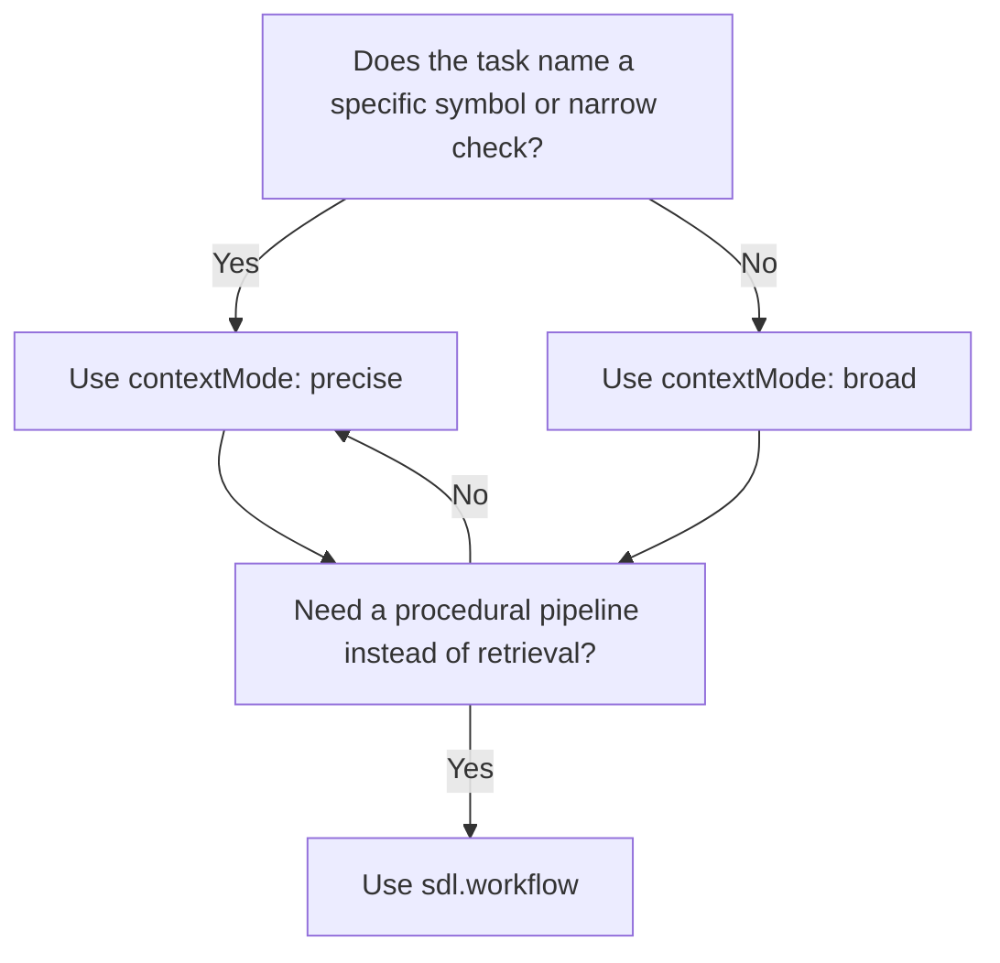

# Context Modes

[Back to README](../../README.md) | [Agent Context Overview](./agent-context.md)

---

## The Problem

Agents need different amounts of code context for different jobs.

A targeted question such as "check NaN handling in `normalizeEdgeConfidence`" should not return the same envelope as "understand the auth pipeline." Manual `sdl.workflow` assembly can get either answer, but it forces the model to spend tokens on planning, step wiring, and repeated envelopes.

`sdl.agent.context` and `sdl.context` solve that by exposing two retrieval modes:

- `contextMode: "precise"` for minimal, targeted evidence
- `contextMode: "broad"` for richer surrounding context

---

## Mental Model

```text
"What does X do?"          -> precise
"Check Y for bugs"         -> precise
"Review this symbol"       -> precise
"Understand this module"   -> broad
"Trace this flow"          -> broad
"Investigate this system"  -> broad
```

If the task names a specific symbol or line of reasoning, start with `precise`.
If the task names a behavior, subsystem, or relationship, start with `broad`.

---

## Precise Mode

Precise mode is designed for targeted lookups.

Characteristics:

- aggressively ranks symbols and keeps only the most relevant ones
- uses smaller rung plans
- strips non-essential response-envelope fields
- usually beats manual `sdl.workflow` retrieval on both bytes and latency

Best for:

- symbol explanations
- focused bug checks
- review of one known area
- pattern lookup before a narrow implementation

---

## Broad Mode

Broad mode is designed for investigation and exploration.

Characteristics:

- admits more surrounding symbols
- keeps the full answer envelope
- surfaces more diagnostics and next-step guidance
- favors structural understanding over minimum size

Best for:

- module or subsystem walkthroughs
- tracing a pipeline or request path
- broader debugging with uncertain scope
- exploratory review work

---

## Task-Type Plans

| Task type | Precise | Broad |
|:----------|:--------|:------|
| `debug` | card -> hotPath | card -> skeleton -> hotPath -> raw* |
| `review` | card | card -> skeleton |
| `implement` | card -> skeleton | card -> skeleton -> hotPath |
| `explain` | card -> skeleton | card -> skeleton |

`*` Raw still depends on policy and diagnostics requirements.

The important part is not the exact rung count. It is the routing choice:

- use context tools for understanding
- use workflows for procedure

---

## Ranking Signals

When SDL-MCP has to infer the target from task text, it scores candidate symbols using signals such as:

- exact symbol-name matches in the task text
- identifier extraction from camelCase, PascalCase, and snake_case tokens
- partial name overlap for meaningful fragments
- summary overlap with task keywords
- exported-symbol preference as a tiebreaker

The threshold changes by mode:

- precise keeps only top-scoring symbols
- broad admits more near-matches to widen context

---

## Response Differences

### Broad mode

Returns the full response envelope:

- `actionsTaken`
- `summary`
- `answer`
- `nextBestAction`
- `finalEvidence`
- `metrics`

### Precise mode

Returns only the context-bearing fields:

- `taskId`
- `taskType`
- `success`
- `path`
- `finalEvidence`
- `metrics`

This is why precise mode can answer "what does this do?" without the overhead of a synthetic narrative that the model does not need.

---

## Benchmarks

Measured against manual `sdl.workflow` retrieval on the SDL-MCP codebase:

| Scenario | Manual workflow | Precise context | Broad context |
|:---------|:----------------|:----------------|:--------------|
| Targeted debug | largest response | smallest response | richer but larger |
| Focused explain | larger envelope | smallest useful answer | richer structure |
| Broad investigation | incomplete without extra planning | often too narrow | best fit |

The consistent pattern is:

- precise wins when the target is already known
- broad wins when the agent is still mapping the problem space

---

## Decision Guide



In plain terms:

- `precise` for a known target
- `broad` for an uncertain space
- `sdl.workflow` only when the job is actually procedural

---

## Code Mode Implication

Inside Code Mode:

- `sdl.context` is the first stop for explain/debug/review/implement retrieval
- `sdl.workflow` stays reserved for runtime execution, transforms, and batch operations

That separation is intentional. If an agent starts using workflows for retrieval by default, it is reintroducing the planning overhead that context mode exists to remove.

---

## Related

- [Agent Context Overview](./agent-context.md)
- [Code Mode](./code-mode.md)
- [Runtime Execution](./runtime-execution.md)
- [Token Savings Meter](./token-savings-meter.md)

[Back to README](../../README.md)
