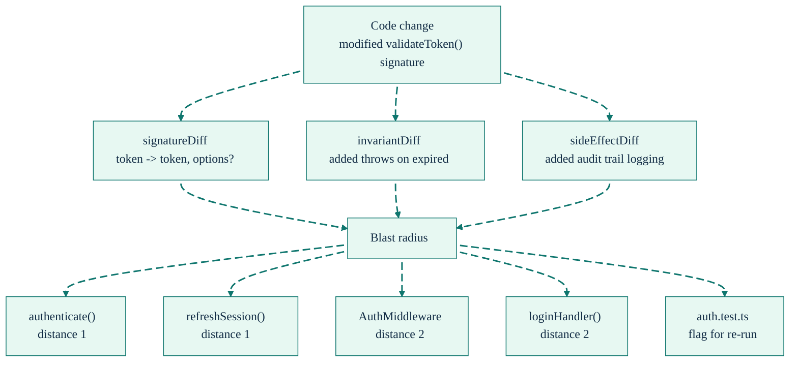
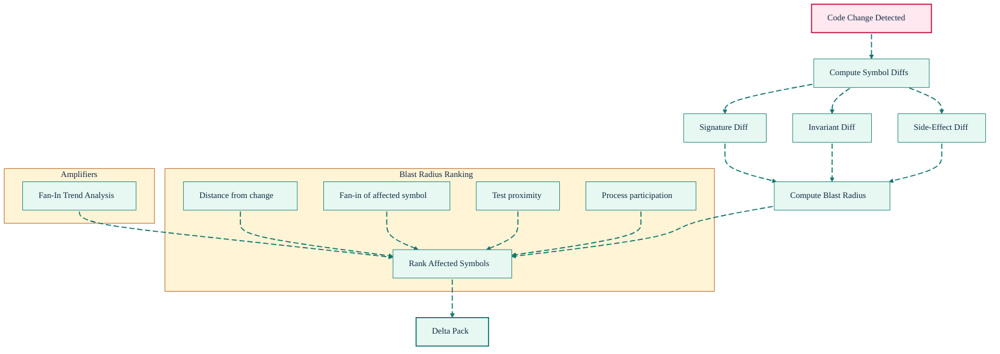

# Delta Packs & Blast Radius: Know What Changed and What It Broke

[Back to README](../../README.md)

---

## Beyond Line Diffs

`git diff` tells you *what lines changed*. SDL-MCP tells you *what that change means* at the symbol level and *who might be affected*.

A delta pack contains:

- **Changed symbols** with semantic diffs (signature changes, invariant additions/removals, side-effect changes)
- **Blast radius** — ranked list of dependent symbols that may be impacted
- **Fan-in trends** — which symbols are becoming increasingly depended upon (amplifiers)
- **Risk tiers** — whether the interface, behavior, and side effects are stable

---

## Anatomy of a Delta Pack



### Blast Radius Ranking

Each affected symbol is ranked by multiple signals:

| Signal | What It Measures |
|:-------|:-----------------|
| **Distance** | Hops in the dependency graph from the changed symbol |
| **Fan-in** | How many other symbols depend on the affected symbol |
| **Test proximity** | Whether the affected symbol has tests that should be re-run |
| **Process participation** | Whether the symbol is part of a critical call chain |

### Fan-In Trend Analysis (Amplifiers)

SDL-MCP tracks how a symbol's fan-in changes across versions. A symbol whose fan-in is growing rapidly is an **amplifier** — changes to it ripple through an increasing number of dependents. The delta response flags these:

```json
{
  "amplifiers": [
    {
      "symbolId": "abc123",
      "previous": 5,
      "current": 12,
      "growthRate": 1.4
    }
  ]
}
```

---

## Delta Computation Flow



---

## PR Risk Analysis

`sdl.pr.risk.analyze` wraps delta analysis with structured risk scoring:

- **Risk score** (0-100) computed from the number of changes, blast radius size, and risk tier stability
- **Findings** categorized by severity (high/medium/low)
- **Evidence** supporting each finding
- **Recommended tests** prioritized by risk, targeting the most impacted symbols

```text
Risk Score: 72 (HIGH)

Findings:
- [HIGH] Signature change on validateToken (fan-in: 12)
- [MED]  New side effect: audit trail logging
- [LOW]  Invariant addition (non-breaking)

Recommended Tests:
- [HIGH] Re-run auth.test.ts (direct coverage)
- [HIGH] Re-run middleware.test.ts (blast radius)
- [MED]  Add test for new options parameter
```


### Risk Scoring Formula

The overall risk score is a weighted average of four components:

```
Risk Score = ChangedSymbols × 0.4
           + BlastRadius   × 0.3
           + InterfaceStability × 0.2
           + SideEffects   × 0.1
```

| Component | Weight | What It Captures |
|:----------|:------:|:-----------------|
| **Changed Symbols** | 40% | Average per-symbol risk (interface stability, behavior stability, side-effect changes) |
| **Blast Radius** | 30% | Number of direct dependents, transitive distance, dependency rank scores |
| **Interface Stability** | 20% | Proportion of changes with signature modifications |
| **Side Effects** | 10% | Proportion of changes affecting side effects |

### Finding Types

| Type | Severity | Description |
|:-----|:---------|:------------|
| `high-risk-changes` | high | Symbols with risk score >= 70 |
| `interface-breaking-changes` | high | Modified symbols with signature changes |
| `side-effect-changes` | medium | Modified symbols with side-effect changes |
| `removed-symbols` | medium | Deleted symbols that may break dependents |
| `large-impact-radius` | medium | Many direct dependents (>10) potentially affected |
| `new-symbols` | low | Newly added symbols |

### Recommended Test Types

| Type | Priority | When Recommended |
|:-----|:---------|:-----------------|
| `unit-tests` | high | Modified symbols present |
| `integration-tests` | high | Interface-breaking changes detected |
| `regression-tests` | medium | Direct dependents in blast radius |
| `api-breakage-tests` | high | Symbols were removed |
| `new-coverage-tests` | low | New symbols added |

### CI/CD Integration

Use `sdl.pr.risk.analyze` in a pipeline to gate merges on risk score:

```bash
# Index the base branch
sdl-mcp index --repo-id my-api

# Start the MCP server and analyze PR changes
sdl-mcp serve --stdio &
echo '{
  "tool": "sdl.pr.risk.analyze",
  "arguments": {
    "repoId": "my-api",
    "fromVersion": "main",
    "toVersion": "feature-branch",
    "riskThreshold": 70
  }
}' | mcp-client

# Check the escalationRequired field in the response.
# If true, block the merge and require additional review.
```

---

## Related Tools

- [`sdl.delta.get`](../mcp-tools-detailed.md#sdldeltaget) - Raw delta pack retrieval
- [`sdl.pr.risk.analyze`](../mcp-tools-detailed.md#sdlprriskanalyze) - Structured risk analysis
- [`sdl.slice.refresh`](../mcp-tools-detailed.md#sdlslicerefresh) - Delta-scoped slice updates

[Back to README](../../README.md)
