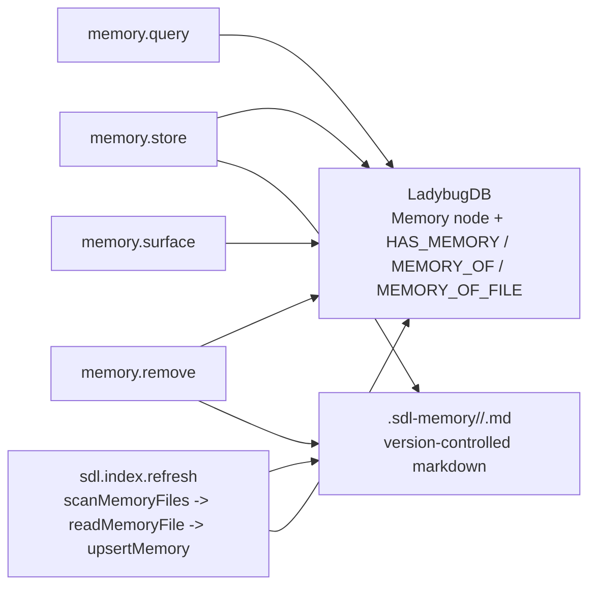
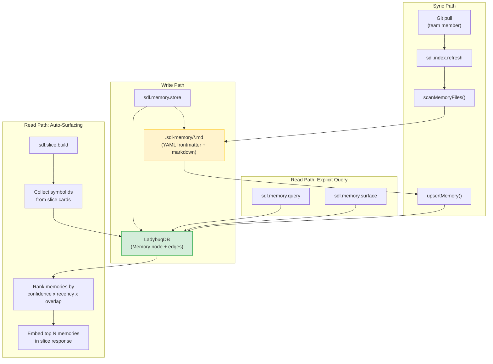
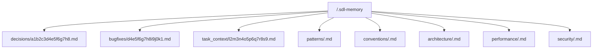

# Development Memories

Cross-session knowledge persistence for AI coding agents, backed by the graph database and version-controlled markdown files.

---

## Opt-In Feature

The memory subsystem is **opt-in and disabled by default**. When disabled, memory tools return a clear error, no `.sdl-memory/` files are imported or modified, no memory hints appear in tool responses, and no memories are surfaced in `repo.status` or `slice.build`. Existing memory data (graph nodes and `.sdl-memory/` files) is preserved and fully restored when memory is re-enabled.

See [Enabling Memory](#enabling-memory) below for configuration details.

---

## The Problem

AI coding agents are stateless. Every session starts from scratch — the agent has no memory of previous debugging sessions, architectural decisions, or bugfix context. Teams work around this with CLAUDE.md files and manual notes, but these are disconnected from the code graph and can't be automatically surfaced when relevant.

**Development Memories** solve this by storing structured knowledge directly in the symbol graph. When an agent builds a slice touching `authenticate()` and memory is enabled, it automatically sees the memory: *"Fixed race condition here — added mutex on session map"*.

---

## Architecture Overview


### Dual Storage and Auto-Surfacing Flow



### Dual Storage

Every memory exists in two places:

1. **Graph Database** — `Memory` node in LadybugDB with edges to `Repo`, `Symbol`, and `File` nodes. Enables fast querying, ranking, and automatic surfacing inside slices.

2. **Markdown Files** — `.sdl-memory/<type>/<memoryId>.md` with YAML frontmatter. These files can be committed to version control, shared across team members, and survive database rebuilds.

The graph is the primary store. Files are a durable backup and collaboration mechanism. During `sdl.index.refresh` (when memory file sync is enabled), any `.sdl-memory/` files are imported into the graph, so team members who pull new memory files automatically get them indexed.

---

## Enabling Memory

Memory is disabled by default. To use the memory subsystem, you must explicitly enable it in your SDL-MCP configuration.

### Global enable

Add `"memory": { "enabled": true }` to your top-level config to enable memory for all repositories:

```json
{
  "memory": {
    "enabled": true
  }
}
```

### Per-repo enable

You can enable memory for specific repositories while leaving it disabled globally. Per-repo settings override the global setting:

```json
{
  "memory": {
    "enabled": false
  },
  "repos": [
    {
      "repoId": "my-repo",
      "rootPath": "/path/to/repo",
      "memory": {
        "enabled": true,
        "surfacingEnabled": true,
        "fileSyncEnabled": false
      }
    }
  ]
}
```

### Sub-feature flags

When memory is enabled, individual sub-features can be toggled independently:

| Flag | Default | What it controls |
|:-----|:--------|:-----------------|
| `enabled` | `false` | Master switch for the entire memory subsystem |
| `toolsEnabled` | `true` (when enabled) | Whether `sdl.memory.*` tools are registered and callable |
| `fileSyncEnabled` | `true` (when enabled) | Whether `.sdl-memory/` files are imported during `index.refresh` and written on `memory.store` |
| `surfacingEnabled` | `true` (when enabled) | Whether memories are auto-surfaced in `slice.build` and `repo.status` responses |
| `hintsEnabled` | `true` (when enabled) | Whether `_memoryHint` fields appear in tool responses |
| `defaultSurfaceLimit` | `5` | Max memories to auto-surface in slice/status responses |

All sub-feature flags default to `true` when the master `enabled` flag is `true`, so a minimal `"memory": { "enabled": true }` activates everything.

---

## When Memory is Disabled

When memory is disabled (the default):

- **Memory tools return a clear error** — calling `sdl.memory.store`, `sdl.memory.query`, `sdl.memory.remove`, or `sdl.memory.surface` returns a descriptive error indicating that memory is not enabled for the repository
- **`.sdl-memory/` files are not imported or modified** — the file sync step during `index.refresh` is skipped entirely
- **No memory hints appear** — tool responses do not include `_memoryHint` fields
- **No memory surfacing** — `repo.status` and `slice.build` do not query or include memories in their responses
- **Existing data is preserved** — Memory nodes in the graph database and `.sdl-memory/` files on disk are left untouched; nothing is deleted
- **Re-enabling restores full functionality** — setting `enabled: true` immediately restores all memory features, including surfacing of previously stored memories

---

## Memory Types

| Type | Directory | Use Case |
|:-----|:----------|:---------|
| `decision` | `.sdl-memory/decisions/` | Architectural decisions, design choices, "why we did it this way" |
| `bugfix` | `.sdl-memory/bugfixes/` | Bug context, root cause analysis, regression notes |
| `task_context` | `.sdl-memory/task_context/` | In-progress work context, handoff notes between sessions |
| `pattern` | `.sdl-memory/patterns/` | Reusable implementation patterns that should be repeated |
| `convention` | `.sdl-memory/conventions/` | Team or repo conventions worth surfacing during edits |
| `architecture` | `.sdl-memory/architecture/` | Structural decisions that span modules or services |
| `performance` | `.sdl-memory/performance/` | Performance findings, bottlenecks, and tuning guidance |
| `security` | `.sdl-memory/security/` | Security-sensitive implementation notes and hardening guidance |

---

## Graph Schema

### Node: Memory

```
Memory {
  memoryId:          STRING  (PRIMARY KEY, 16-char hex)
  repoId:            STRING
  type:              STRING  ("decision" | "bugfix" | "task_context" | "pattern" | "convention" | "architecture" | "performance" | "security")
  title:             STRING  (max 120 chars)
  content:           STRING  (max 50,000 chars)
  contentHash:       STRING  (SHA-256 of repoId + type + title + content)
  searchText:        STRING  (title + " " + content, for text search)
  tagsJson:          STRING  (JSON array of tag strings)
  confidence:        DOUBLE  (0.0–1.0, default 0.8)
  createdAt:         STRING  (ISO 8601)
  updatedAt:         STRING  (ISO 8601)
  createdByVersion:  STRING  (ledger version ID at creation time)
  stale:             BOOLEAN (true if linked symbols changed since creation)
  staleVersion:      STRING  (version that triggered staleness, nullable)
  sourceFile:        STRING  (relative path to .sdl-memory file, nullable)
  deleted:           BOOLEAN (soft-delete flag)
}
```

### Edges

| Edge | From | To | Purpose |
|:-----|:-----|:---|:--------|
| `HAS_MEMORY` | `Repo` | `Memory` | Repository owns this memory |
| `MEMORY_OF` | `Memory` | `Symbol` | Memory is about this symbol |
| `MEMORY_OF_FILE` | `Memory` | `File` | Memory relates to this file |

### Indexes

- `idx_memory_repoId` — fast repo-scoped queries
- `idx_memory_type` — filter by memory type
- `idx_memory_contentHash` — deduplication lookups

---

## File Format

Each memory is stored as a markdown file with YAML frontmatter:

```markdown
---
memoryId: a1b2c3d4e5f6g7h8
type: bugfix
title: Race condition in authenticate() session map
tags: [auth, concurrency, mutex]
confidence: 0.9
symbols: [sym_abc123, sym_def456]
files: [src/auth/authenticate.ts, src/auth/session-store.ts]
createdAt: 2026-03-15T10:30:00.000Z
deleted: false
---

The `authenticate()` function was reading and writing to the session map
without synchronization. Under concurrent requests, two sessions could
overwrite each other's tokens.

**Fix:** Added a mutex lock around the session map read-write block.
The lock is acquired before reading the current session state and released
after writing the new token. See commit abc1234.

**Root cause:** The session store was designed for single-threaded use
but started receiving concurrent calls after the connection pool was
introduced in v0.7.
```

### Directory Structure



### File Write Semantics

- **Atomic writes** — temp file + rename to prevent partial writes
- **Non-critical** — file write failures don't fail the `memory.store` operation; the graph is the source of truth
- **BOM handling** — UTF-8 BOM is stripped on read

---

## MCP Tools

Memory tools are only available when memory is enabled in the configuration (either globally or for the specific repository). When memory is disabled, these tools return a clear error indicating that memory is not enabled.

### `sdl.memory.store`

Store or update a memory with optional symbol and file links.

**Request:**

| Field | Type | Required | Description |
|:------|:-----|:---------|:------------|
| `repoId` | string | yes | Repository ID |
| `type` | enum | yes | `"decision"`, `"bugfix"`, `"task_context"`, `"pattern"`, `"convention"`, `"architecture"`, `"performance"`, or `"security"` |
| `title` | string | yes | Short title (1–120 chars) |
| `content` | string | yes | Full memory content (1–50,000 chars) |
| `tags` | string[] | no | Up to 20 tags for filtering |
| `confidence` | number | no | 0.0–1.0 (default: 0.8) |
| `symbolIds` | string[] | no | Link to up to 100 symbols |
| `fileRelPaths` | string[] | no | Link to up to 100 files |
| `memoryId` | string | no | If provided, updates existing memory |

**Response:**

```json
{
  "ok": true,
  "memoryId": "a1b2c3d4e5f6g7h8",
  "created": true,
  "deduplicated": false
}
```

**Deduplication:** If a memory with the same `contentHash` (SHA-256 of `repoId + type + title + content`) already exists, the call returns `deduplicated: true` with the existing `memoryId` instead of creating a duplicate.

**Update mode:** When `memoryId` is provided, the existing memory is updated in-place. Edges are rebuilt (deleted and recreated). The `stale` flag is cleared. The backing file is rewritten.

---

### `sdl.memory.query`

Search and filter memories with flexible criteria.

**Request:**

| Field | Type | Required | Description |
|:------|:-----|:---------|:------------|
| `repoId` | string | yes | Repository ID |
| `query` | string | no | Text search (CONTAINS match against `searchText`). When hybrid retrieval is enabled (`semantic.retrieval.mode: "hybrid"`), memories are also retrievable via FTS index on `Memory.searchText`, enabling richer semantic matching alongside symbols in entity retrieval mode. |
| `types` | string[] | no | Filter by memory types |
| `tags` | string[] | no | Filter by tags (OR logic) |
| `symbolIds` | string[] | no | Filter to memories linked to these symbols |
| `staleOnly` | boolean | no | Only return stale memories |
| `limit` | number | no | Max results, 1–100 (default: 20) |
| `sortBy` | enum | no | `"recency"` (default) or `"confidence"` |

**Response:**

```json
{
  "repoId": "my-repo",
  "memories": [
    {
      "memoryId": "a1b2c3d4e5f6g7h8",
      "type": "bugfix",
      "title": "Race condition in authenticate()",
      "content": "The authenticate() function was reading...",
      "confidence": 0.9,
      "stale": false,
      "linkedSymbols": ["sym_abc123"],
      "tags": ["auth", "concurrency"]
    }
  ],
  "total": 1
}
```

**Symbol-scoped queries:** When `symbolIds` is provided, the query traverses `MEMORY_OF` edges to find memories linked to those specific symbols. This enables "what do we know about this function?" queries.

---

### `sdl.memory.remove`

Soft-delete a memory from the graph with optional file cleanup.

**Request:**

| Field | Type | Required | Description |
|:------|:-----|:---------|:------------|
| `repoId` | string | yes | Repository ID |
| `memoryId` | string | yes | Memory to remove |
| `deleteFile` | boolean | no | Delete the `.sdl-memory/*.md` file (default: true) |

When `deleteFile` is `false`, the backing file is kept but its `deleted` frontmatter field is set to `true`. This preserves the file in version control while marking it as inactive.

**Graph operations:** All edges (`HAS_MEMORY`, `MEMORY_OF`, `MEMORY_OF_FILE`) are deleted, and the Memory node is marked `deleted: true` (soft delete).

---

### `sdl.memory.surface`

Auto-surface relevant memories for a task context. This is the main retrieval tool — it ranks memories by a composite score of confidence, recency, and symbol overlap.

**Request:**

| Field | Type | Required | Description |
|:------|:-----|:---------|:------------|
| `repoId` | string | yes | Repository ID |
| `symbolIds` | string[] | no | Up to 500 symbols for context matching |
| `taskType` | enum | no | Filter by memory type |
| `limit` | number | no | Max results, 1–50 (default: 10) |

**Ranking Algorithm:**

```
score = confidence × recencyFactor × overlapFactor

recencyFactor = 1.0 / (1 + daysSinceCreation / 30)
    → 1.0 for today, 0.5 at 30 days, 0.25 at 90 days

overlapFactor = linkedSymbolCount / querySymbolCount
    → What fraction of query symbols does this memory relate to?
    → 1.0 when no symbolIds provided (repo-level memories always qualify)
```

The algorithm collects memories from two sources:
1. **Symbol edges** — memories linked via `MEMORY_OF` to any of the query symbols
2. **Repo edges** — all memories linked via `HAS_MEMORY` to the repository

Results are deduplicated, scored, and returned in descending rank order.

---

## Automatic Slice Integration

When memory is enabled and `surfacingEnabled` is `true`, calling `sdl.slice.build` or `sdl.repo.status` automatically surfaces relevant memories alongside the response. No extra tool call is required. `repo.status` only surfaces memories when `surfaceMemories: true` is explicitly passed, keeping the default response lightweight. When memory is disabled, no memory queries or surfacing occur.

**How it works:**

1. After the slice is built, the system collects all `symbolId`s from the slice cards
2. It queries for memories linked to those symbols plus repo-level memories
3. Memories are ranked using the same confidence × recency × overlap algorithm
4. The top N memories (default: 5) are included in the slice response as `memories[]`

**Hybrid retrieval integration:** When `semantic.retrieval.mode: "hybrid"` is enabled, `Memory.searchText` is indexed by the Ladybug FTS extension. This enables memories to be surfaced via entity retrieval alongside symbols — the hybrid retrieval orchestrator can search across symbols, memories, clusters, processes, and file summaries in a single fused query, boosting memory surfacing quality for task-text-driven workflows.

**Control parameters on `sdl.slice.build`:**

| Field | Type | Default | Description |
|:------|:-----|:--------|:------------|
| `includeMemories` | boolean | `true` (when memory is enabled) | Set to `false` to disable memory surfacing for this call. Has no effect when memory is disabled in config. |
| `memoryLimit` | number | 5 | Max memories to include (0–20) |

**Response shape** (new `memories` field on `GraphSlice`):

```json
{
  "cards": [ ... ],
  "memories": [
    {
      "memoryId": "a1b2c3d4e5f6g7h8",
      "type": "bugfix",
      "title": "Race condition in authenticate()",
      "content": "...",
      "confidence": 0.9,
      "stale": false,
      "linkedSymbols": ["sym_abc123"],
      "tags": ["auth", "concurrency"]
    }
  ]
}
```

Memory surfacing is **non-critical** — if it fails, the slice is still returned successfully (without memories) and a warning is logged.

---

## Staleness Detection

When `sdl.index.refresh` runs (full or incremental), memories linked to changed symbols are **automatically flagged as stale**.

**How it works:**

1. After indexing, the system identifies all `symbolId`s in changed files
2. It queries for memories linked to those symbols via `MEMORY_OF` edges
3. Each matching memory gets `stale: true` and `staleVersion` set to the current version ID
4. Stale memories are still surfaced but include the `stale: true` flag

**What agents should do with stale memories:**

- **Review** — the linked code changed; does the memory still apply?
- **Update** — call `sdl.memory.store` with the existing `memoryId` to update content and clear the stale flag
- **Remove** — call `sdl.memory.remove` if the memory is no longer relevant

**Query stale memories:**

```json
{
  "repoId": "my-repo",
  "staleOnly": true
}
```

---

## File Sync During Indexing

When memory is enabled and `fileSyncEnabled` is `true`, `sdl.index.refresh` scans the `.sdl-memory/` directory and imports any files found into the graph. When memory is disabled or `fileSyncEnabled` is `false`, this step is skipped entirely.

1. `scanMemoryFiles(repoRoot)` recursively finds all `.md` files under `.sdl-memory/`
2. Each file is parsed via `readMemoryFile()` (YAML frontmatter + markdown body)
3. Files marked `deleted: true` in frontmatter are skipped
4. For each valid file:
   - A `contentHash` is computed
   - The memory is upserted into the graph via `upsertMemory()`
   - Old edges are deleted and new `HAS_MEMORY`, `MEMORY_OF`, and `MEMORY_OF_FILE` edges are created

This means team members can:
- Commit `.sdl-memory/` files to Git
- Other developers pull the files
- On next `sdl.index.refresh`, the memories are automatically imported into their local graph

File sync failures are non-critical — indexing continues if memory import fails.

---

## Implementation Files

| File | Purpose |
|:-----|:--------|
| `src/db/ladybug-memory.ts` | CRUD operations for Memory nodes and edges |
| `src/db/ladybug-schema.ts` | Memory node table, edge tables, indexes (schema v6) |
| `src/mcp/tools/memory.ts` | MCP tool handlers: store, query, remove, surface |
| `src/memory/file-sync.ts` | File read/write/scan with YAML frontmatter parser |
| `src/memory/surface.ts` | Shared `surfaceRelevantMemories()` ranking (used by slice.build, repo.status, memory.surface) |
| `src/domain/types.ts` | `MemoryType`, `SurfacedMemory` type definitions |
| `src/mcp/tools.ts` | Zod schemas for all memory request/response types |
| `src/mcp/tools/slice.ts` | Automatic memory surfacing in `slice.build` |
| `src/indexer/indexer-memory.ts` | Staleness flagging + file import during indexing |
| `src/mcp/hooks/memory-hint.ts` | Memory hint hook system |
| `src/gateway/schemas.ts` | Gateway action schemas for memory tools |
| `src/gateway/router.ts` | Gateway routing for memory actions |
| `src/gateway/legacy.ts` | Legacy flat tool registration for memory tools |
| `tests/unit/memory-file-sync.test.ts` | Unit tests for file sync (333 lines) |

---

## Usage Examples

### Store a decision about architecture

```json
// sdl.memory.store
{
  "repoId": "my-repo",
  "type": "decision",
  "title": "Use mutex for session store concurrency",
  "content": "After investigating the race condition in authenticate(), decided to use a simple mutex rather than a concurrent map. The mutex approach is simpler and the session store throughput doesn't justify lock-free data structures.\n\nAlternatives considered:\n- ConcurrentHashMap: overhead not justified for <100 concurrent sessions\n- Read-write lock: writes are frequent enough to negate read lock benefits",
  "tags": ["auth", "concurrency", "architecture"],
  "confidence": 0.95,
  "symbolIds": ["sym_authenticate_abc123", "sym_sessionStore_def456"]
}
```

### Query memories about auth

```json
// sdl.memory.query
{
  "repoId": "my-repo",
  "query": "auth",
  "types": ["bugfix", "decision"],
  "sortBy": "confidence"
}
```

### Review stale memories after a refactor

```json
// sdl.memory.query
{
  "repoId": "my-repo",
  "staleOnly": true,
  "limit": 50
}
```

### Surface memories for current task

```json
// sdl.memory.surface
{
  "repoId": "my-repo",
  "symbolIds": ["sym_abc", "sym_def", "sym_ghi"],
  "limit": 5
}
```

---

## Best Practices

1. **Write memories when you learn something non-obvious** — if a debugging session took 30 minutes, the root cause is worth a `bugfix` memory
2. **Link memories to specific symbols** — unlinked memories only surface via repo-level queries; linked memories appear automatically in relevant slices
3. **Use tags consistently** — tags enable cross-cutting queries like "all auth-related decisions"
4. **Review stale memories** — after refactors, query `staleOnly: true` and update or remove outdated knowledge
5. **Commit `.sdl-memory/` to Git** — this shares knowledge across the team and survives database rebuilds
6. **Set confidence intentionally** — high confidence (0.9+) for verified facts, lower (0.5–0.7) for hypotheses or temporary notes
