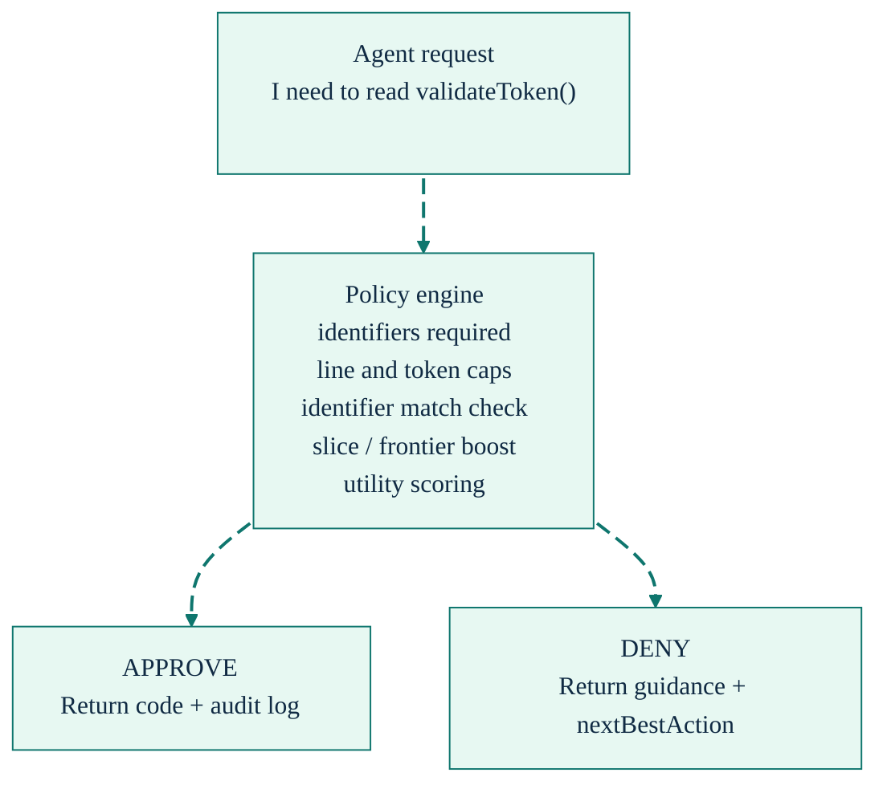
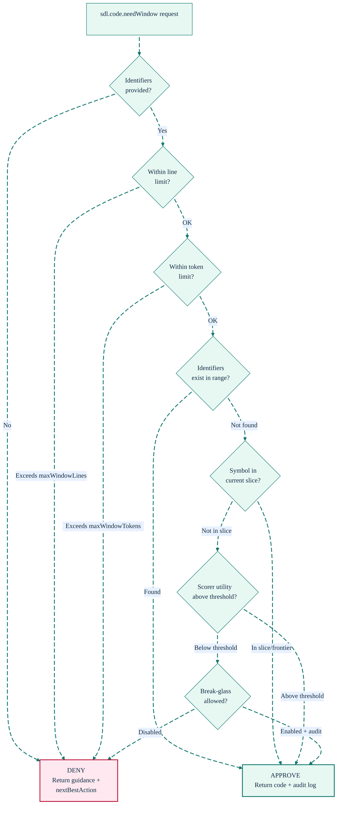

# Governance & Policy: Controlled Context Access

[Back to README](../../README.md)

---

## Why Gate Code Access?

Without governance, AI agents default to reading entire files. This wastes tokens, risks exposing sensitive code regions, and creates unpredictable context costs. SDL-MCP's policy engine enforces a "prove you need it" model for raw code access. Approval can proceed as soon as one or more requested identifiers match the candidate window, so tight identifier lists outperform broad catch-all requests.

---

## How It Works

Every request to `sdl.code.needWindow` (raw code, Rung 4) passes through the policy engine before code is returned:



### Configurable Policy Settings

| Setting | Default | Description |
|:--------|:-------:|:------------|
| `maxWindowLines` | 180 | Maximum lines per raw code request |
| `maxWindowTokens` | 1400 | Maximum tokens per raw code request |
| `requireIdentifiers` | true | Agent must specify what identifiers it expects to find |
| `allowBreakGlass` | false | Allow emergency override with full audit logging (set to `true` to enable) |
| `defaultDenyRaw` | true | Default deny for raw code windows — requires proof-of-need (symbol in slice, identifiers provided, reason given) |
| `budgetCaps` | — | Optional server-side budget defaults: `{ maxCards, maxEstimatedTokens }` |

Adjust via `sdl.policy.set`:

```json
{
  "repoId": "my-app",
  "policyPatch": {
    "maxWindowLines": 300,
    "requireIdentifiers": true
  }
}
```

### What Gets Audited

Every raw code access and every denial is logged with:

- **Audit hash** — unique identifier for the decision
- **Request details** — who asked, for what symbol, with what justification
- **Decision** — approve, deny, or downgrade (to skeleton/hot-path)
- **Evidence used** — what factors influenced the decision

### Graceful Denials

When a request is denied, the response doesn't just say "no." It provides:

```json
{
  "approved": false,
  "whyDenied": ["No identifiers matched in the requested range"],
  "nextBestAction": {
    "tool": "sdl.code.getHotPath",
    "args": {
      "symbolId": "abc123",
      "identifiersToFind": ["errorCode", "retryCount"]
    },
    "rationale": "Hot-path can locate these identifiers without full code access"
  }
}
```

---

## Policy Decision Tree



---

## Runtime Execution Governance

`sdl.runtime.execute` has its own governance layer:

- **Enabled by default** - set `runtime.enabled: false` in hardened deployments that cannot permit subprocess execution
- **Executable validation** — only allowed executables can run
- **CWD jailing** — subprocess can't escape the repo root
- **Environment scrubbing** — only `PATH` and allowlisted vars are passed
- **Concurrency limits** — prevents resource exhaustion
- **Timeout enforcement** — hard kill on timeout
- **Output truncation** — responses are summarized, not raw-dumped

---

## Related Tools

- [`sdl.policy.get`](../mcp-tools-detailed.md#sdlpolicyget) - Read current policy
- [`sdl.policy.set`](../mcp-tools-detailed.md#sdlpolicyset) - Update policy settings
- [`sdl.code.needWindow`](../mcp-tools-detailed.md#sdlcodeneedwindow) - The gated raw code tool
- [`sdl.runtime.execute`](../mcp-tools-detailed.md#sdlruntimeexecute) - Sandboxed command execution

[Back to README](../../README.md)
