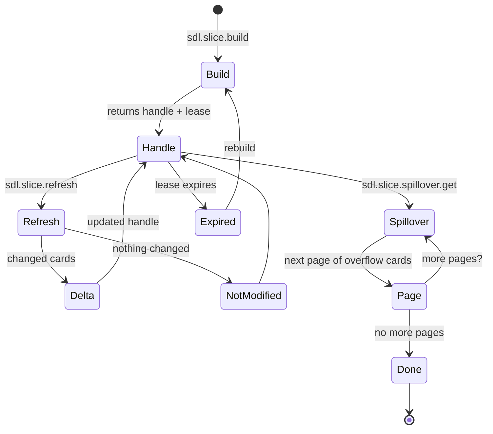

# Graph Slicing: The Right Context for Every Task

[Back to README](../../README.md)

---

## Why Directories Are the Wrong Abstraction

Traditional code assistants answer "what context do I need?" by reading files in the same directory. But code doesn't respect directory boundaries. A function in `src/auth/validate.ts` might depend on `src/db/queries.ts`, `src/config/types.ts`, and `src/util/hashing.ts`. Directory-based context misses these cross-cutting relationships.

SDL-MCP's graph slicing follows the *dependency graph* instead. Starting from the symbols relevant to your task, it traverses call and import edges outward, scoring each symbol by relevance, and returns the N most important symbols within a token budget.

---

## How Slicing Works

```
     Your Task: "Fix the auth middleware"
                    │
                    ▼
           ┌──────────────┐
           │ Entry Symbols │  ← auto-discovered from taskText
           │ authenticate  │     or explicitly provided
           │ validateToken │
           └──────┬───────┘
                  │
          BFS / beam search
          across weighted edges
                  │
    ┌─────────────┼─────────────┐
    │             │             │
    ▼             ▼             ▼
 ┌──────┐   ┌──────────┐   ┌─────────┐
 │hashPw│   │getUserById│  │JwtConfig│   ← call weight: 1.0
 └──┬───┘   └────┬─────┘   └────┬────┘     import weight: 0.6
    │            │              │            config weight: 0.8
    ▼            ▼              ▼
 ┌──────┐   ┌────────┐   ┌──────────┐
 │bcrypt│   │dbQuery │   │envLoader │   ← frontier (just
 └──────┘   └────────┘   └──────────┘     outside the slice)

 ═══════════════════════════════════════
        Token budget reached.
        8 cards returned (~800 tokens)
        vs. reading 8 files (~16,000 tokens)
```

### Edge Weights

Not all relationships are equal. SDL-MCP weights edges by how strongly they indicate relevance:

| Edge Type | Weight | Rationale |
|:----------|:------:|:----------|
| **Call** | 1.0 | If A calls B, B is almost certainly relevant to understanding A |
| **Config** | 0.8 | Configuration dependencies are important but less direct |
| **Import** | 0.6 | An import indicates awareness, not necessarily relevance |

### Scoring Factors

Each symbol in the BFS frontier is scored by:

- **Graph distance** from entry symbols (closer = more relevant)
- **Fan-in** (how many other symbols depend on it)
- **Centrality** (its position in the overall graph)
- **Search term proximity** (if `taskText` was provided)
- **Confidence** of the edge resolution (low-confidence call edges can be filtered)

---

## Slice Lifecycle

Slices aren't one-shot. They have a full lifecycle:

```
  slice.build        slice.refresh       slice.spillover.get
  ──────────►  handle  ──────────►  delta  ──────────►  overflow
                 │                    │                     │
                 │   lease expires    │   nothing changed   │   no more pages
                 ▼                   ▼                     ▼
              rebuild            notModified              done
```

1. **Build** (`sdl.slice.build`) — Creates the slice, returns a handle and lease
2. **Refresh** (`sdl.slice.refresh`) — Returns only what changed since your last version (dramatically cheaper than rebuilding)
3. **Spillover** (`sdl.slice.spillover.get`) — Pages through symbols that didn't fit in the budget

### Lifecycle Diagram



### Auto-Discovery Mode

You don't even need to know symbol IDs. Pass a `taskText` string and SDL-MCP will:

1. Full-text search for matching symbols
2. Score and rank them
3. Build the slice automatically

```json
{
  "repoId": "my-app",
  "taskText": "fix the authentication timeout bug",
  "budget": { "maxCards": 30, "maxEstimatedTokens": 4000 }
}
```

---

## Wire Format Efficiency

Slices support three compact wire format versions for minimal bandwidth:

| Version | Encoding | Best For |
|:-------:|:---------|:---------|
| V1 | Shortened field names | Backward compatibility |
| V2 (default) | + deduplicated file paths & edge type lookup tables | Most use cases |
| V3 | + grouped edge encoding | Large, edge-dense graphs |

Combined with ETag-based conditional cards (`knownCardEtags`), a slice refresh can return zero duplicate data.

---

## Related Tools

- [`sdl.symbol.search`](../mcp-tools-detailed.md#sdlsymbolsearch) - Find entry symbols
- [`sdl.context.summary`](../mcp-tools-detailed.md#sdlcontextsummary) - Portable summary from slice data
- [`sdl.delta.get`](../mcp-tools-detailed.md#sdldeltaget) - Change tracking between versions

[Back to README](../../README.md)
