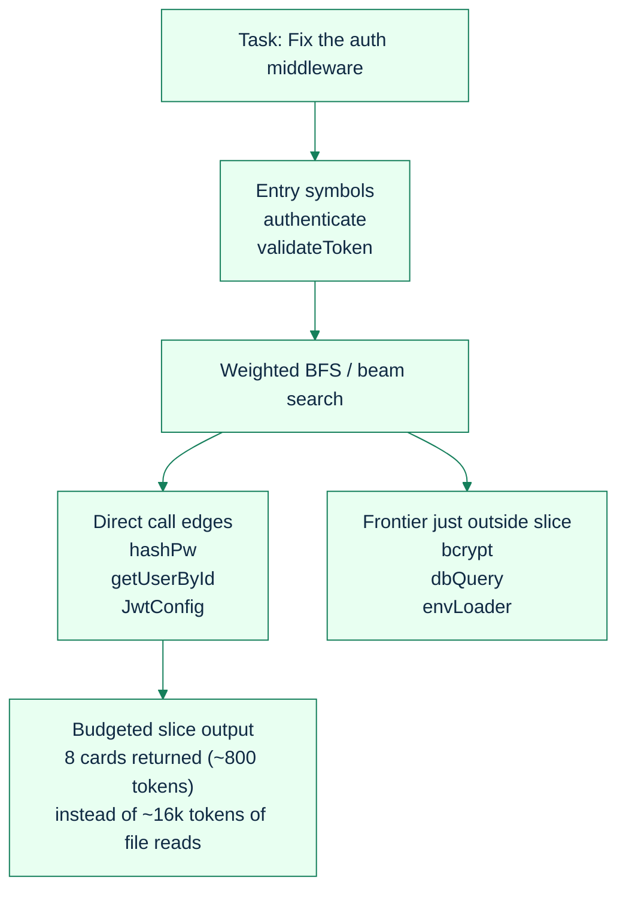
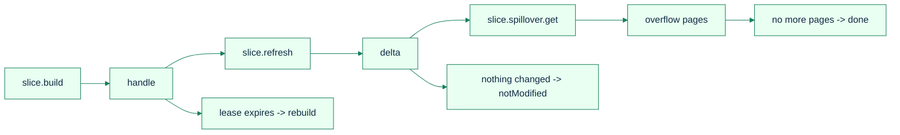
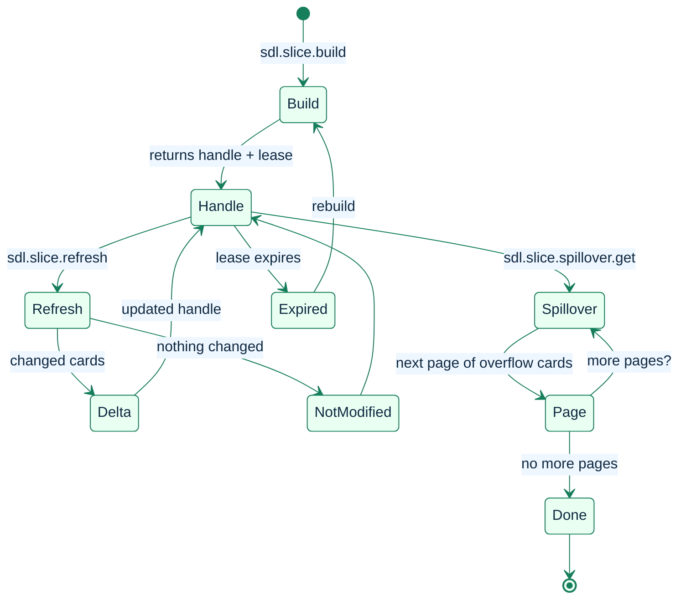

# Graph Slicing: The Right Context for Every Task

[Back to README](../../README.md)

---

## Why Directories Are the Wrong Abstraction

Traditional code assistants answer "what context do I need?" by reading files in the same directory. But code doesn't respect directory boundaries. A function in `src/auth/validate.ts` might depend on `src/db/queries.ts`, `src/config/types.ts`, and `src/util/hashing.ts`. Directory-based context misses these cross-cutting relationships.

SDL-MCP's graph slicing follows the *dependency graph* instead. Starting from the symbols relevant to your task, it traverses call and import edges outward, scoring each symbol by relevance, and returns the N most important symbols within a token budget.

---

## How Slicing Works



### Edge Weights

Not all relationships are equal. SDL-MCP weights edges by how strongly they indicate relevance:

| Edge Type | Weight | Rationale |
|:----------|:------:|:----------|
| **Call** | 1.0 | If A calls B, B is almost certainly relevant to understanding A |
| **Config** | 0.8 | Configuration dependencies are important but less direct |
| **Import** | 0.6 | An import indicates awareness, not necessarily relevance |

### Scoring Factors

Each symbol in the BFS frontier is scored by weighted factors:

- **Query relevance** (weight: 0.4) — search term overlap from `taskText`
- **Stack trace locality** (weight: 0.2) — proximity to parsed stack trace entries
- **Hotness** (weight: 0.15) — composite of fan-in, fan-out, and churn metrics
- **Structure** (weight: 0.15) — file path structural specificity
- **Kind** (weight: 0.1) — symbol kind weight (functions/methods scored higher than variables)
- **Cluster cohesion** — same-cluster symbols get a +0.15 boost, related-cluster +0.05
- **Confidence** of the edge resolution (low-confidence call edges can be filtered via `minConfidence` or `minCallConfidence`)

---

## Slice Lifecycle

Slices aren't one-shot. They have a full lifecycle:


1. **Build** (`sdl.slice.build`) — Creates the slice, returns a handle and lease
2. **Refresh** (`sdl.slice.refresh`) — Returns only what changed since your last version (dramatically cheaper than rebuilding)
3. **Spillover** (`sdl.slice.spillover.get`) — Pages through symbols that didn't fit in the budget

### Lifecycle Diagram



### Auto-Discovery Mode

You don't even need to know symbol IDs. Pass a `taskText` string (or `stackTrace`, `failingTestPath`, `editedFiles`) and SDL-MCP will automatically discover the best entry symbols:

**With hybrid retrieval** (when `semantic.retrieval.mode: "hybrid"` and indexes are healthy):
1. Run a single hybrid search (FTS + vector + RRF fusion) on the task text
2. Score and rank candidates across all retrieval sources
3. Build the slice from the top-ranked seeds

**Legacy fallback** (when hybrid is unavailable):
1. Token-by-token `searchSymbolsLite` fan-out across the task text
2. Score and rank individual matches
3. Build the slice from the top-ranked seeds

The hybrid path produces better start-node quality because it understands *meaning* (via vector search) not just token overlap, and it runs a single efficient query instead of per-token fan-out.

```json
{
  "repoId": "my-app",
  "taskText": "fix the authentication timeout bug",
  "budget": { "maxCards": 30, "maxEstimatedTokens": 4000 },
  "includeRetrievalEvidence": true
}
```

When `includeRetrievalEvidence: true` is set, the slice response includes evidence showing how seeds were discovered:

```json
{
  "retrievalEvidence": {
    "mode": "hybrid",
    "symptomType": "taskText",
    "candidateCountPerSource": {
      "fts": 28,
      "vector:jina-embeddings-v2-base-code": 24
    },
    "fusionLatencyMs": 8,
    "fallbackReason": null
  }
}
```

The `symptomType` field classifies the input: `"taskText"`, `"stackTrace"`, `"failingTest"`, or `"editedFiles"`.

---

## Wire Format Efficiency

Slices support three compact wire format versions for minimal bandwidth:

| Version | Encoding | Best For |
|:-------:|:---------|:---------|
| V1 | Shortened field names | Backward compatibility |
| V2 (default) | + deduplicated file paths & edge type lookup tables | Most use cases |
| V3 | + grouped edge encoding | Large, edge-dense graphs |

Combined with ETag-based conditional cards (`knownCardEtags`), a slice refresh can return zero duplicate data.

---

## Related Tools

- [`sdl.symbol.search`](../mcp-tools-detailed.md#sdlsymbolsearch) - Find entry symbols
- [](../mcp-tools-detailed.md#sdlcontextsummary) - Portable summary from slice data
- [`sdl.delta.get`](../mcp-tools-detailed.md#sdldeltaget) - Change tracking between versions

[Back to README](../../README.md)
