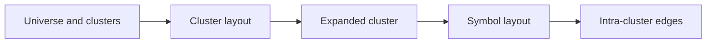

# Graph Viewer

SDL Galaxy is the first-class 3D graph viewer served by the HTTP transport at `/ui/viewer`. It replaces the old static graph explorer; `/ui/graph` and `/ui/graph.html` return a permanent redirect to `/ui/viewer`.

## Viewer flow

## Architecture

The viewer is intentionally no-framework and no-bundler. Browser modules under `src/ui/viewer/` are compiled by `tsconfig.ui.json`, copied with the rest of the UI assets, and load `three` plus `fflate` from local vendor assets. Server-side graph data is exposed through `src/viewer/routes.ts`, keeping `src/cli/transport/http.ts` limited to routing and static asset concerns.

The layout path has two engines. TypeScript in `src/graph/layout/force-layout.ts` is the reference implementation. The Rust twin in `native/src/layout.rs` exposes `computeLayout(inputJson, seed, iterations)` through napi-rs. `viewer.layout.engine: "auto"` uses Rust when available and falls back to TypeScript; `"typescript"` forces the TS path; `"rust"` fails if the native addon cannot be loaded.

## Endpoints

| Endpoint | Purpose |
| --- | --- |
| `GET /api/graph/universe` | Repositories, settings, and deterministic galaxy positions. |
| `GET /api/graph/repo/:repoId/clusters` | Tier-1 cluster list. |
| `GET /api/graph/repo/:repoId/layout?lod=cluster` | Cached cluster layout. |
| `GET /api/graph/repo/:repoId/layout?lod=symbol&clusterId=:id` | Cached symbol layout for one expanded cluster. |
| `GET /api/graph/repo/:repoId/edges?scope=clusters` | Inter-cluster edges. |
| `GET /api/graph/repo/:repoId/edges?clusterId=:id` | Intra-cluster edges for one expanded cluster. With no edge-kind filter, returns renderable edges between symbols in that cluster; boundary edges are omitted. |
| `GET /api/graph/repo/:repoId/search?q=:query` | Symbol search used by the search lens. |
| `GET /api/graph/repo/:repoId/symbol/:symbolId/card` | Inspector card payload. |
| `GET /api/graph/repo/:repoId/impact` | Impact lens payload. |
| `GET /api/graph/events/recent` | Recent graph activity events. |
| `GET /api/observability/stream?types=graph` | Graph activity SSE stream. |
| `GET /api/graph/skins` and `/api/graph/skins/:id` | Server-installed skin packs. |

Legacy `/api/graph/:repoId/slice/...`, `/neighborhood`, and `/blast-radius` endpoints remain for scripts, but new UI work should use the facade endpoints above.

## Configuration

The `viewer` config block controls enablement, frame caps, layout engine selection, expansion limits, skin directories, and ambient mode. Use lower FPS caps on integrated GPUs; ambient mode defaults to 30 FPS after the configured idle timeout.

## Skins

Skin packs are zip files with a required `skin.json` manifest and optional `textures/` and `models/` assets. The client validates entry counts, compressed bytes, decompressed bytes, and path traversal before applying any asset. See [Skin Pack Template](../../templates/skin-pack/README.md) for authoring details.

## Troubleshooting

- Blank page: run `npm run build` and confirm `dist/ui/vendor/three.module.min.js` and `dist/ui/vendor/fflate.js` exist.
- 401 API errors: pass the same bearer token flow used by the observability dashboard, either in the token field or URL hash as `#token=...`.
- No activity pulses: confirm observability is enabled and connect to `/api/observability/stream?types=graph`.
- Slow rendering: lower `viewer.fps`, reduce `viewer.layout.maxSymbolsPerClusterExpand`, or use cluster-only LOD.
