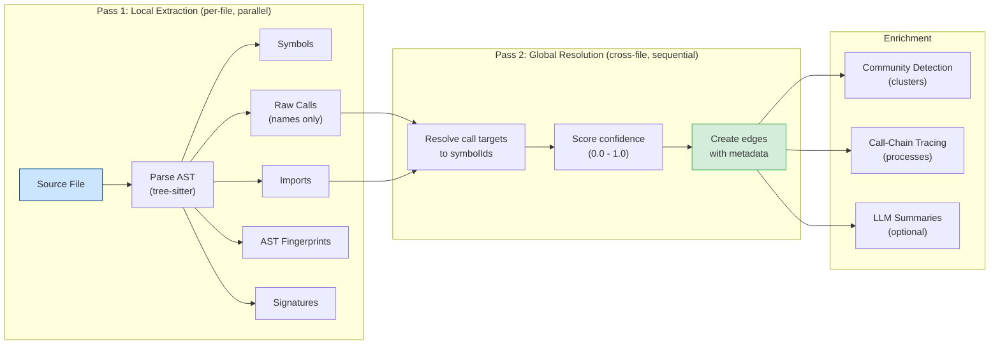

# Multi-Language Indexing: Deep Code Understanding

[Back to README](../../README.md)

---

## Two Indexing Engines

SDL-MCP ships with two indexing engines that can be selected via configuration:

### Native Rust Engine (Default)

A high-performance, multi-threaded Rust addon compiled via `napi-rs`. This is the **default engine** (`indexing.engine` defaults to `"rust"`). It handles pass-1 symbol extraction at near-native speed. Falls back to the TypeScript engine automatically if the native addon is unavailable.

- Multi-threaded file parsing
- ~18MB DLL on Windows
- Distributed as per-platform npm packages (`sdl-mcp-native`)

### Tree-sitter TypeScript Engine (Fallback)

A pure Node.js engine using tree-sitter grammars for AST parsing. This is the **fallback engine** used when the native Rust addon is unavailable. It works everywhere Node.js runs.

Select explicitly via config:
```jsonc
{
  "indexing": {
    "engine": "typescript"  // fallback; default is "rust" (native addon)
  }
}
```

---

## Two-Pass Architecture

Indexing happens in two passes:

```
 Pass 1: Local Extraction          Pass 2: Global Resolution
 ─────────────────────────         ─────────────────────────
 Per-file, parallelizable          Cross-file, sequential

 ┌──────────┐                      ┌──────────────────────┐
 │ Parse AST│                      │ Resolve call targets │
 │ Extract: │                      │                      │
 │  symbols │ ──────────────────►  │ "getUserById" call   │
 │  imports │                      │   → symbolId abc123  │
 │  calls   │                      │   confidence: 0.95   │
 │  types   │                      │   resolver: "import- │
 └──────────┘                      │    alias-resolver"   │
                                   └──────────────────────┘
```

### Two-Pass Pipeline Diagram



### Pass 1: What Gets Extracted

For every file, the indexer produces:

| Artifact | Description |
|:---------|:------------|
| **Symbols** | Functions, classes, interfaces, types, methods, constructors, variables, modules |
| **Import edges** | Which modules/symbols are imported |
| **Call identifiers** | Raw function/method call names (not yet resolved to symbol IDs) |
| **AST fingerprints** | Content-addressed hashes for stable symbol identity |
| **Signatures** | Parameter names, types, return types, generics, overloads |

### Pass 2: Cross-File Resolution

The pass-2 resolver takes raw call identifiers from pass-1 and resolves them to specific symbol IDs. Every supported language has a dedicated resolver registered via an extensible registry pattern. Resolution strategies vary by language:

**TypeScript / JavaScript:**
- Import alias mapping — follows `import { foo as bar }` chains
- Barrel re-export resolution — traces through `index.ts` re-exports
- Scope analysis — distinguishes local variables from imported symbols
- Tagged template resolution — handles tagged template literals (e.g., `sql\`...\``)
- Namespace import resolution

**Go:**
- Package indexing and import aliasing
- Receiver type inference from assignments
- Method resolution on receiver types

**Python:**
- Module path resolution (absolute and relative imports)
- Class method lookup with `self`/`cls` receiver resolution
- Same-module symbol resolution
- Instance method detection on imported classes

**Java:**
- Package-based namespacing
- Inheritance chain traversal (`.extends`)
- Wildcard import resolution
- Qualified method call resolution

**C#:**
- Namespace indexing via `using` statements (including `using static` and aliases)
- Base class method lookup
- Qualified accessor resolution

**C++:**
- `#include` chain traversal (header → implementation pairing)
- `using namespace` resolution
- Template function and method overload matching

**PHP:**
- Namespace indexing via `use` statements
- Fully-qualified class name (FQN) resolution
- Method lookup by class FQN

**Rust:**
- Module tree construction from file paths (`crate::module::name`)
- `use` path resolution
- Trait method resolution via `impl` block ownership

**Kotlin:**
- Package-scoped indexing via `import` statements
- Extension function resolution
- Companion object method lookup

**C:**
- Header pair inference (`.c` ↔ `.h` matching)
- `#include`-based symbol collection
- Directory-scoped fallback for translation units

**Shell:**
- `source` statement parsing (follows sourced file paths)
- Directory-scoped function resolution

Every resolved call edge includes a **confidence score** (0.0–1.0), a **resolver ID**, and a human-readable **provenance** trace.

---

## Supported Languages

| Language | Extensions | Pass-1 | Pass-2 Resolver |
|:---------|:-----------|:------:|:----------------:|
| TypeScript | `.ts`, `.tsx` | Full | Semantic (aliases, barrels, tagged templates) |
| JavaScript | `.js`, `.jsx`, `.mjs`, `.cjs` | Full | Semantic (shared with TS) |
| Python | `.py`, `.pyw` | Full | Semantic (module paths, relative imports, class methods) |
| Go | `.go` | Full | Semantic (packages, receiver types) |
| Java | `.java` | Full | Semantic (packages, inheritance, wildcards) |
| C# | `.cs` | Full | Semantic (namespaces, `using`, generics, static imports) |
| C | `.c`, `.h` | Full | Semantic (header pairs, `#include` inference) |
| C++ | `.cpp`, `.hpp`, `.cc`, `.cxx`, `.hxx` | Full | Semantic (`#include` chains, namespaces, templates) |
| PHP | `.php`, `.phtml` | Full | Semantic (namespaces, `use`, FQN resolution) |
| Rust | `.rs` | Full | Semantic (module tree, `use` paths, trait methods) |
| Kotlin | `.kt`, `.kts` | Full | Semantic (packages, imports, extension functions, companion objects) |
| Shell | `.sh`, `.bash`, `.zsh` | Full | Semantic (`source` statements, directory scoping) |

---

## Incremental Indexing

After the initial full index, subsequent runs use incremental mode:

1. **Content hashing** — each file's content is hashed
2. **Change detection** — only files whose hash changed are re-parsed
3. **Targeted pass-2** — only affected call edges are re-resolved
4. **Version bumping** — a new ledger version is created

File watching (`chokidar`) can trigger incremental re-indexing automatically when files change on disk.

---

## Graph Enrichment

After indexing, the graph is enriched with:

### Community Detection (Clusters)

Symbols are grouped into clusters of highly-coupled code. A cluster might represent "the auth module" or "the database layer." Each symbol card includes its cluster membership.

### Call-Chain Tracing (Processes)

Sequential call paths are traced to identify:
- **Entry points** — where call chains begin (e.g., HTTP handlers)
- **Intermediate nodes** — functions in the middle of call chains
- **Exit points** — where call chains terminate (e.g., database queries)

Each symbol card includes its process participation with role and depth.

### LLM-Generated Summaries

SDL-MCP can generate 1–3 sentence semantic summaries for every symbol using an LLM provider. Summaries are cached in the graph database and surfaced in symbol cards, improving both human readability and embedding quality.

#### Four Quality Tiers

The summary system interacts with the embedding pipeline to create four distinct quality tiers:

```
 Tier       Embedding Model          Summary Source              Cost
 ─────      ──────────────────────   ─────────────────────────   ──────────
 Low        all-MiniLM-L6-v2         Heuristic (basic)           Free
            384-dim, ~22 MB                                      (bundled)

 Medium     nomic-embed-text-v1.5    Heuristic (basic)           Free
            768-dim, ~138 MB                                     (download)

 Enhanced   either model             Enhanced heuristics +       Free
 (1.5)      + semantic: true         NN summary transfer         (requires
                                                                 embeddings)

 High       either model             LLM-generated               API cost
            + summaries              (1-3 sentences)             (~$2/1M tok)
```

- **Low** — default. Embeds raw symbol text (name + kind + signature) with a general-purpose model. Enhanced per-kind heuristic summaries are always generated (class, interface, type, enum, variable, constructor), but no embedding-based enrichment.
- **Medium** — swaps in a higher-quality text model with longer context (8192 tokens). Same heuristic summaries as Low.
- **Enhanced (Tier 1.5)** — when `semantic.enabled: true`, the NN summary transfer module runs automatically after indexing. It uses the ANN embedding index to find well-documented neighbor symbols and propagates their documentation patterns to undocumented symbols. Direct transfers (similarity >= 0.85, quality 0.6) copy the summary verbatim; adapted transfers (similarity 0.7-0.85, quality 0.5) extract the verb/pattern and apply it to the target name. No API calls — fully offline.
- **High** — adds LLM-generated summaries (quality 0.8) to either embedding model. The quality-gated filter skips symbols that already have `summaryQuality >= 0.8` (e.g., from JSDoc), avoiding redundant API calls. Produces the best results because the LLM distills code meaning into plain English that embedding models handle well.

Each symbol now carries `summaryQuality` (0.0-1.0) and `summarySource` fields tracking provenance: `jsdoc` (1.0), `llm` (0.8), `nn-direct` (0.6), `nn-adapted` (0.5), `heuristic-typed` (0.4), `heuristic-fallback` (0.3).

#### Three Providers

| Provider | Config value | Model default | Requires |
|:---------|:-------------|:--------------|:---------|
| **Anthropic API** | `"api"` | `claude-haiku-4-5-20251001` | `summaryApiKey` or `ANTHROPIC_API_KEY` env var |
| **OpenAI-compatible** | `"local"` | `gpt-4o-mini` | Local server (e.g., Ollama at `localhost:11434`) |
| **Mock** | `"mock"` | — | Nothing (deterministic heuristic patterns) |

#### Batch Processing & Caching

Summaries are generated in batches during indexing:

1. Fetch all symbols in the repository
2. Check the `SummaryCache` graph table for fresh entries (keyed by a hash of name + kind + signature + fingerprint + provider + model)
3. Split cache-miss symbols into batches (`summaryBatchSize`, default 20)
4. Process batches concurrently (`summaryMaxConcurrency`, default 5)
5. Store results in the cache with cost tracking

Cache entries automatically invalidate when the symbol's code changes (fingerprint mismatch) or when the configured provider/model changes.

#### Configuration

```jsonc
{
  "semantic": {
    "generateSummaries": true,              // Enable LLM summaries (default: false)
    "summaryProvider": "api",               // "api" | "local" | "mock"
    "summaryModel": "claude-haiku-4-5-20251001",
    "summaryApiKey": "${ANTHROPIC_API_KEY}",
    "summaryApiBaseUrl": null,              // Custom endpoint for "local" provider
    "summaryMaxConcurrency": 5,             // Parallel requests (1–20)
    "summaryBatchSize": 20                  // Symbols per batch (1–50)
  }
}
```

Each generated summary includes a **divergence score** (token-based Jaccard similarity vs. a heuristic baseline) for quality monitoring, and an estimated **cost in USD** tracked per symbol and per batch run.

See the [Semantic Engine deep dive](./semantic-engine.md) for the full interaction between summaries, embeddings, and pass-2 resolution.

---

## Related Tools

- [`sdl.repo.register`](../mcp-tools-detailed.md#sdlreporegister) - Register a repo for indexing
- [`sdl.index.refresh`](../mcp-tools-detailed.md#sdlindexrefresh) - Trigger indexing
- [`sdl.repo.overview`](../mcp-tools-detailed.md#sdlrepooverview) - See cluster/process statistics
- [`sdl.symbol.getCard`](../mcp-tools-detailed.md#sdlsymbolgetcard) - See enriched symbol data

[Back to README](../../README.md)
