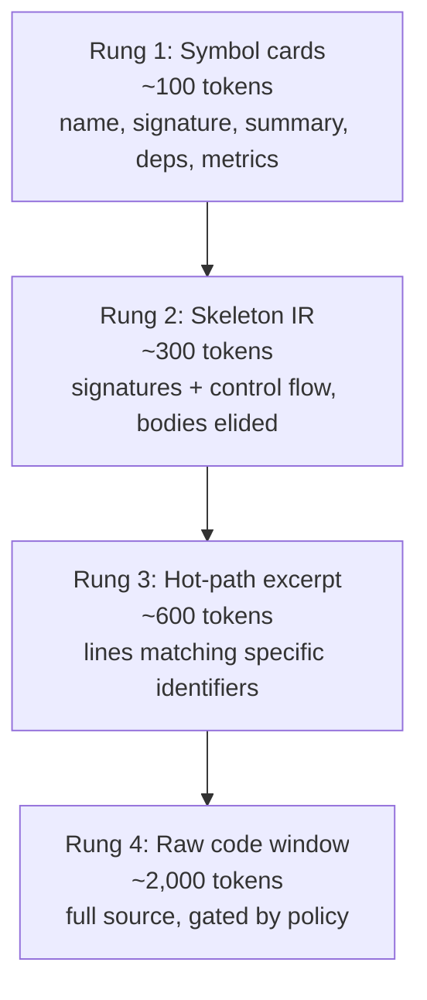
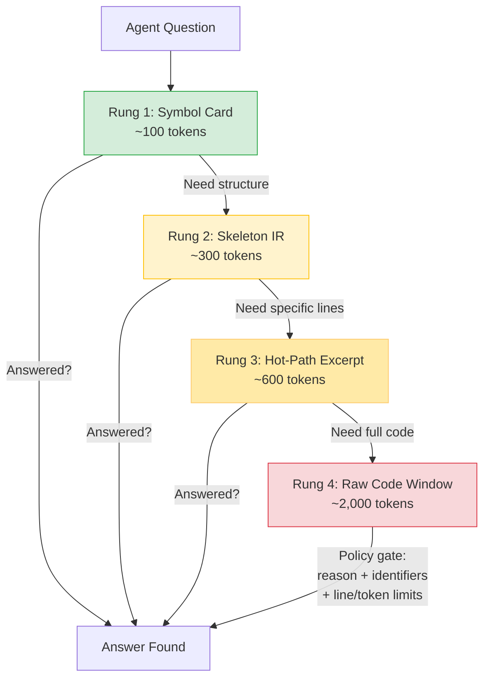

# The Iris Gate Ladder: Context Without the Waste

[Back to README](../../README.md)

---

## The Problem with "Just Read the File"

When AI coding agents need to understand a function, they typically read the entire file. For a 500-line file, that consumes ~2,000 tokens, even if the answer is in a 3-line signature. Multiply that across a debugging session touching 20 files, and you've burned 40,000+ tokens on context gathering alone, most of it noise.

The Iris Gate Ladder eliminates this waste. Named after the adjustable aperture that controls light flow in optics, it lets agents dial their context window from a pinhole to wide-open, only as needed.

---

## The Four Rungs

### Rung 1: Symbol Cards (`sdl.symbol.getCard`)

The atom of SDL-MCP. A symbol card is a compact metadata record containing everything an agent needs to *understand* a symbol without reading its code:

- **Identity**: name, kind (function/class/interface/etc.), file, line range
- **Signature**: parameter names and types, return type, generics, overloads
- **Summary**: 1-2 line semantic description (LLM-generated or extracted)
- **Dependencies**: what it imports and calls (with confidence-scored resolution)
- **Metrics**: fan-in (who calls me), fan-out (who I call), 30-day churn, test references
- **Architecture**: cluster membership (community detection), process participation (call-chain role)
- **Versioning**: content-addressed ETag for conditional requests

**Most questions are answered here.** "What does `buildSlice` do?" "What does `handleAuth` depend on?" "Is `parseConfig` exported?" All answered by a card, for ~100 tokens.

### Rung 2: Skeleton IR (`sdl.code.getSkeleton`)

When you need to understand the *shape* of a file or class without reading every line. Skeletons include:

- All function/method signatures
- Control flow structures (`if`, `for`, `while`, `try/catch`)
- Implementation bodies replaced with `/* ... */`

Think of it as an interactive table of contents. You can also filter to `exportedOnly: true` for large library files.

### Rung 3: Hot-Path Excerpt (`sdl.code.getHotPath`)

When you know *what* you're looking for. Provide a list of identifiers (e.g., `["errorCode", "retryCount"]`) and get back only the lines where they appear, plus a configurable number of context lines above and below. Everything else is skipped.

This is surgically precise: you see exactly the code you need.

### Rung 4: Raw Code Window (`sdl.code.needWindow`)

The last resort. Full source code access, but with guardrails:

- **Justification required**: agents must explain *why* they need raw code
- **Identifier hints**: what specific identifiers they expect to find
- **Line/token limits**: enforced by the policy engine
- **Audit logging**: every raw access is recorded
- **Denial guidance**: if denied, the response suggests an alternative (e.g., "try `getHotPath` with these identifiers instead")

---

## Token Savings in Practice

| Scenario | Traditional (read file) | Iris Gate Ladder | Savings |
|:---------|:-----------------------:|:----------------:|:-------:|
| "What does `parseConfig` accept?" | ~2,000 tokens | ~100 (card) | **20x** |
| "Show me the structure of `AuthService`" | ~4,000 tokens | ~300 (skeleton) | **13x** |
| "Where is `this.cache` set?" | ~2,000 tokens | ~500 (hot-path) | **4x** |
| "Debug the retry logic in `fetchWithBackoff`" | ~2,000 tokens | ~2,000 (window) | 1x (but audited) |

**Across a typical 30-tool debugging session**, the ladder saves 10-50x tokens compared to naive file reads.

---

## Escalation Flow

---

## Related Tools

- [`sdl.symbol.search`](../mcp-tools-detailed.md#sdlsymbolsearch) - Find symbols to get cards for
- [`sdl.slice.build`](../mcp-tools-detailed.md#sdlslicebuild) - Get cards for an entire task context at once
-  - Generate a portable context briefing

[Back to README](../../README.md)
