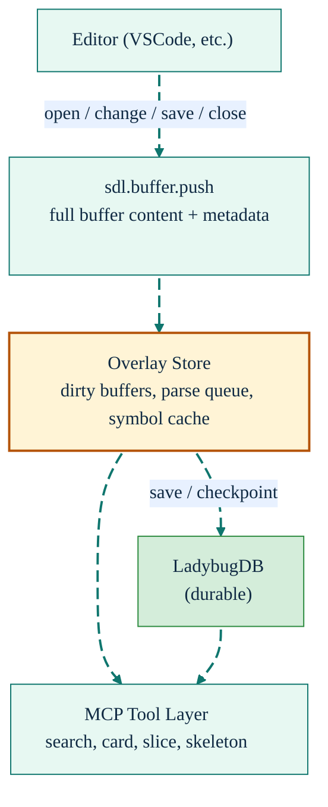
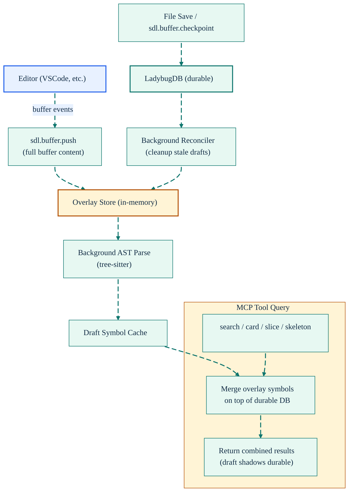

# Live Indexing: Real-Time Code Intelligence

[Back to README](../../README.md)

---

## The Stale Context Problem

Traditional code indexing is a batch operation: you index once, then the database is stale until you index again. For an AI agent helping you write code, this means the symbols it sees are always one step behind your edits.

SDL-MCP's live indexing system eliminates this gap. As you type in your editor, SDL-MCP receives buffer updates, parses them in the background, and overlays the new symbols on top of the durable database. Search, cards, and slices reflect your *current* code, not your last save.

---

## Architecture



### Overlay Merge and Checkpoint Flow



### How It Works

1. **Buffer Push**: Your editor extension sends the full file content on every keystroke (debounced) via `sdl.buffer.push`.
2. **Background Parse**: The overlay store queues a tree-sitter parse to extract symbols from the draft content.
3. **Overlay Merge**: When any tool queries the database (search, getCard, slice.build), the overlay symbols are merged on top of the durable DB results. Draft symbols shadow their durable counterparts.
4. **Checkpoint**: On file save or manual checkpoint (`sdl.buffer.checkpoint`), the overlay is written to the durable LadybugDB graph.
5. **Reconciliation**: A background reconciler ensures overlay and durable state converge, cleaning up stale drafts.

### What Gets Overlaid

| Tool | Overlay Behavior |
|:-----|:-----------------|
| `sdl.symbol.search` | Draft symbols appear in results alongside durable symbols |
| `sdl.symbol.getCard` | Returns draft symbol card if the file has unsaved changes |
| `sdl.slice.build` | Includes draft symbols in the BFS traversal |
| `sdl.code.getSkeleton` | Generates skeleton from draft content |
| `sdl.code.getHotPath` | Searches draft content for identifiers |

---

## Configuration

```jsonc
{
  "liveIndex": {
    "enabled": true,          // master switch
    "debounceMs": 75,         // debounce between buffer events (25-5000, default: 75)
    "idleCheckpointMs": 15000,// auto-checkpoint after idle period (default: 15s)
    "maxDraftFiles": 200,     // max concurrent draft files (default: 200)
    "reconcileConcurrency": 1,// concurrent overlay→DB merge jobs (1-8)
    "clusterRefreshThreshold": 25 // reconciled symbols before cluster refresh
  }
}
```

### Status Monitoring

`sdl.repo.status` includes a `liveIndexStatus` section:

```json
{
  "liveIndexStatus": {
    "enabled": true,
    "pendingBuffers": 2,
    "dirtyBuffers": 1,
    "parseQueueDepth": 0,
    "checkpointPending": false,
    "lastCheckpointResult": "success"
  }
}
```

For deeper diagnostics, use `sdl.buffer.status`.

---

## Related Tools

- [`sdl.buffer.push`](../mcp-tools-detailed.md#sdlbufferpush) - Push editor buffer events
- [`sdl.buffer.checkpoint`](../mcp-tools-detailed.md#sdlbuffercheckpoint) - Force a checkpoint
- [`sdl.buffer.status`](../mcp-tools-detailed.md#sdlbufferstatus) - Live indexing diagnostics
- [`sdl.repo.status`](../mcp-tools-detailed.md#sdlrepostatus) - Includes live index health

[Back to README](../../README.md)
