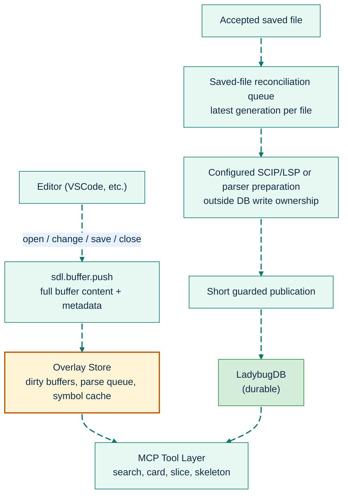
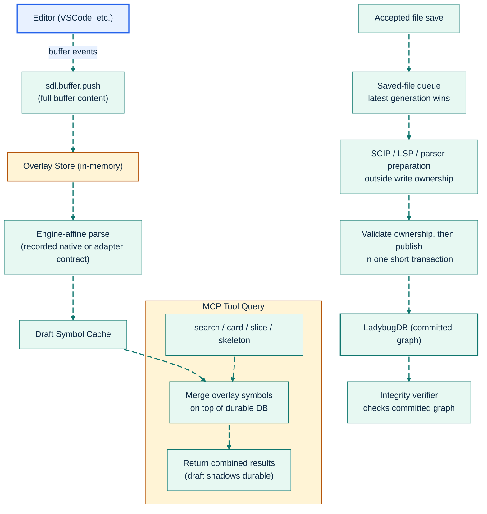

# Live Indexing: Real-Time Code Intelligence

[Back to README](../../README.md)

---

## The Stale Context Problem

Traditional code indexing is a batch operation: you index once, then the database is stale until you index again. For an AI agent helping you write code, this means the symbols it sees are always one step behind your edits.

SDL-MCP's live indexing system eliminates this gap. As you type in your editor, SDL-MCP receives buffer updates, parses them in the background, and overlays the new symbols on top of the durable database. Search, cards, and slices reflect your *current* code, not your last save.

---

## Architecture


```mermaid
%%{init: {"theme":"base","themeVariables":{"background":"#ffffff","primaryColor":"#E7F8F2","primaryBorderColor":"#0F766E","primaryTextColor":"#102A43","secondaryColor":"#E8F1FF","secondaryBorderColor":"#2563EB","secondaryTextColor":"#102A43","tertiaryColor":"#FFF4D6","tertiaryBorderColor":"#B45309","tertiaryTextColor":"#102A43","lineColor":"#0F766E","textColor":"#102A43","fontFamily":"Inter, ui-sans-serif, system-ui, -apple-system, BlinkMacSystemFont, Segoe UI, sans-serif"},"flowchart":{"curve":"basis","htmlLabels":true}}}%%
flowchart TD
    accTitle: Draft overlay and saved-file reconciliation
    accDescr: Draft buffer updates stay in the in-memory overlay. Accepted file saves queue background fact preparation and a short guarded publication to the durable graph.
    Editor["Editor (VSCode, etc.)"] e1@-->|"open / change / save / close"| Push["sdl.buffer.push<br/>full buffer content + metadata"]
    Push e2@--> Overlay["Overlay Store<br/>dirty buffers, parse queue, symbol cache"]
    Overlay e3@--> Tools["MCP Tool Layer<br/>search, card, slice, skeleton"]
    Save["Accepted saved file"] e4@--> Queue["Saved-file reconciliation queue<br/>latest generation per file"]
    Queue e5@--> Prepare["Configured SCIP/LSP or parser preparation<br/>outside DB write ownership"]
    Prepare e6@--> Publish["Short guarded publication"]
    Publish e7@--> DB["LadybugDB<br/>(durable)"]
    DB e8@--> Tools

    style Overlay fill:#FFF4D6,stroke:#B45309,stroke-width:2px,color:#102A43
    style DB fill:#d4edda,stroke:#2b8a3e

    classDef source fill:#E7F8F2,stroke:#0F766E,stroke-width:2px,color:#102A43;
    classDef process fill:#E8F1FF,stroke:#2563EB,stroke-width:2px,color:#102A43;
    classDef decision fill:#FFF4D6,stroke:#B45309,stroke-width:2px,color:#102A43;
    classDef storage fill:#F2E8FF,stroke:#7C3AED,stroke-width:2px,color:#102A43;
    classDef output fill:#FFE8EF,stroke:#BE123C,stroke-width:2px,color:#102A43;
    classDef muted fill:#F8FAFC,stroke:#64748B,stroke-width:1px,color:#102A43;
    classDef animate stroke:#0F766E,stroke-width:2px,stroke-dasharray:10\,5,stroke-dashoffset:900,animation:dash 22s linear infinite;
    class e1,e2,e3,e4,e5,e6,e7,e8 animate;
```

### Overlay Merge and Checkpoint Flow


```mermaid
%%{init: {"theme":"base","themeVariables":{"background":"#ffffff","primaryColor":"#E7F8F2","primaryBorderColor":"#0F766E","primaryTextColor":"#102A43","secondaryColor":"#E8F1FF","secondaryBorderColor":"#2563EB","secondaryTextColor":"#102A43","tertiaryColor":"#FFF4D6","tertiaryBorderColor":"#B45309","tertiaryTextColor":"#102A43","lineColor":"#0F766E","textColor":"#102A43","fontFamily":"Inter, ui-sans-serif, system-ui, -apple-system, BlinkMacSystemFont, Segoe UI, sans-serif"},"flowchart":{"curve":"basis","htmlLabels":true}}}%%
flowchart TD
    accTitle: Overlay merge and saved-file publication
    accDescr: Draft symbols merge into reads from memory. Accepted saves prepare current facts before validating ownership and publishing one durable graph transaction; the verifier checks that committed graph.
    Editor["Editor (VSCode, etc.)"]
    Push["sdl.buffer.push<br/>(full buffer content)"]
    Overlay["Overlay Store (in-memory)"]
    Parse["Engine-affine parse<br/>(recorded native or adapter contract)"]
    Cache["Draft Symbol Cache"]

    subgraph "MCP Tool Query"
        Query["search / card / slice / skeleton"]
        Merge["Merge overlay symbols<br/>on top of durable DB"]
        Result["Return combined results<br/>(draft shadows durable)"]
    end

    Save["Accepted file save"]
    Queue["Saved-file queue<br/>latest generation wins"]
    Prepare["SCIP / LSP / parser preparation<br/>outside write ownership"]
    Publish["Validate ownership, then publish<br/>in one short transaction"]
    DB["LadybugDB (committed graph)"]
    Verify["Integrity verifier<br/>checks committed graph"]

    Editor e1@-->|"buffer events"| Push
    Push e2@--> Overlay
    Overlay e3@--> Parse
    Parse e4@--> Cache
    Cache e5@--> Merge
    Query e6@--> Merge
    Merge e7@--> Result
    Save e8@--> Queue
    Queue e9@--> Prepare
    Prepare e10@--> Publish
    Publish e11@--> DB
    DB e12@--> Verify

    style Editor fill:#E8F1FF,stroke:#2563EB,stroke-width:2px,color:#102A43
    style DB fill:#E7F8F2,stroke:#0F766E,stroke-width:2px,color:#102A43
    style Overlay fill:#FFF4D6,stroke:#B45309,stroke-width:2px,color:#102A43

    classDef source fill:#E7F8F2,stroke:#0F766E,stroke-width:2px,color:#102A43;
    classDef process fill:#E8F1FF,stroke:#2563EB,stroke-width:2px,color:#102A43;
    classDef decision fill:#FFF4D6,stroke:#B45309,stroke-width:2px,color:#102A43;
    classDef storage fill:#F2E8FF,stroke:#7C3AED,stroke-width:2px,color:#102A43;
    classDef output fill:#FFE8EF,stroke:#BE123C,stroke-width:2px,color:#102A43;
    classDef muted fill:#F8FAFC,stroke:#64748B,stroke-width:1px,color:#102A43;
    classDef animate stroke:#0F766E,stroke-width:2px,stroke-dasharray:10\,5,stroke-dashoffset:900,animation:dash 22s linear infinite;
    class e1,e2,e3,e4,e5,e6,e7,e8,e9,e10,e11,e12 animate;
```

### How It Works

1. **Buffer push**: An editor can send full draft content through `sdl.buffer.push`. The overlay keeps that unsaved content and its symbols in memory only.
2. **Overlay merge**: Search, cards, slices, and skeletons merge the overlay over the committed graph. A draft shadows the older durable result without creating a durable saved-file generation.
3. **Accepted save**: A file save, managed file edit, or watcher event records the latest accepted source generation in the shared reconciliation queue. The caller receives a queued result while the durable graph still contains the previous committed revision.
4. **Preparation and publication**: Configured SCIP or LSP facts, or the recorded parser contract, prepare outside index gates and database writer ownership. The worker acquires write ownership only for a short final validation and one publication transaction.
5. **Verification**: The integrity worker checks the graph that the publication committed. It does not regenerate provider facts, parse files, or start an index refresh.

### Engine Affinity and Recovery

Full indexing stores a `FileParserState` for each file parsed by SDL-MCP and a `RepoParserState` coverage summary bound to the verified graph version and revision. Graph integrity and parser coverage are separate contracts: a matching graph can be verified while repository parser coverage is `partial`, such as when provider-owned files have no SDL-MCP parser record. Existing durable files still require their own valid `FileParserState` and always reuse its engine, engine contract, adapter key, and language. A genuinely new file selects a contract only after repository provenance preflight succeeds.

The native engine parses live content through the in-memory `parseContent` capability and the `native:1` identity contract. SDL-MCP never falls back from a recorded native contract to TypeScript, or between plugin adapters, because that could change symbol IDs, AST fingerprints, and ranges. Contract-bearing plugins identify live parsing with the plugin name, package version, adapter identity, and adapter contract version.

Saved-file reconciliation publishes file, symbol, edge, parser-provenance, manifest, and revision changes together, but preparation happens before it takes the writer. The worker validates the source hash, save generation, provider/config/dependency inputs, lifecycle epoch, and graph baseline immediately before publication. Save 13 invalidates save 12 while save 12 prepares; save 12 cannot publish, even briefly, after save 13 is accepted.

A separate background verifier validates committed graph integrity and provenance ownership, then publishes the deterministic `complete` or `partial` coverage summary with `graphIntegrityState: "verified"`. Under partial repository coverage, an existing durable file still needs a present, structurally valid, available, and matching parser contract; missing or corrupt per-file state, unavailable engines, contract mismatches, remap ambiguity, stale generations, or phase failures retain the latest queued work without writing stale facts. A targeted reconciliation failure does not trigger incremental indexing or a rebuild. Whole-database safe rebuild remains a separately chosen recovery operation for conditions that require it.

### What Gets Overlaid

| Tool | Overlay Behavior |
|:-----|:-----------------|
| `sdl.symbol.search` | Draft symbols appear in results alongside durable symbols |
| `sdl.symbol.getCard` | Returns draft symbol card if the file has unsaved changes |
| `sdl.slice.build` | Includes draft symbols in the BFS traversal |
| `sdl.code.getSkeleton` | Generates skeleton from draft content |
| `sdl.code.getHotPath` | Searches draft content for identifiers |

---

## Configuration

```jsonc
{
  "liveIndex": {
    "enabled": true,          // master switch
    "debounceMs": 75,         // debounce between buffer events (25-5000, default: 75)
    "idleCheckpointMs": 15000,// checkpoint eligibility after idle period (default: 15s)
    "maxDraftFiles": 200,     // max concurrent draft files (default: 200)
    "reconcileConcurrency": 1 // concurrent saved-file preparation jobs (1-8)
  }
}
```

### Status Monitoring

`sdl.buffer.status` reports the reconciliation state even when draft overlays are disabled:

```json
{
  "reconciliationState": "preparing"
}
```

The state is one of `idle`, `pending`, `preparing`, `publishing`, or `blocked`. Normal tool reads continue when the database engine permits them; a publication does not promise that every native exclusive operation can run concurrently.

Connected MCP servers can emit an SDK-filtered logging message with `logger: "sdl-mcp"` for an interested repository and `data: { type: "graph-update", repoId, phase: "started" | "completed" | "failed" }`. Stale and canonical no-op work does not emit these events. `sdl.buffer.status` remains the bounded status fallback when a client filters logging notifications.

### Save outcomes

For an indexed saved file, `indexUpdate: { applied: false, pending: true }` means the disk save succeeded and reconciliation is queued. It contains no fabricated symbol or edge counts. `applied: true` means the publication committed. A later provider or parser failure leaves the saved source on disk and retains the current work for recovery. Immediate write or admission failures can attempt rollback only while the edit still owns the target.

An explicit checkpoint retires a clean saved draft only after confirming its committed publication. Newer saves invalidate older prepared graph work. Newer unsaved drafts stay in the overlay, do not invalidate saved-file preparation, and cannot be cleared by an older checkpoint.

Watchers use this same save path and do not start incremental indexing. Incremental indexes remain explicit, manually approved recovery or maintenance work. A Windows Node 24.14.0 integration probe holds an actual publication transaction and observes graph and FTS reads returning the old committed result before release and the new result after commit. That probe demonstrates the publication boundary; it is not a universal latency or concurrency guarantee for native exclusive operations.

Recovery inventories use the configured source and ignore rules. If a previously indexed file still exists but becomes excluded, such as after an ignore or size-limit change, targeted retirement remains blocked; an explicit incremental index can apply that scope change. Incomplete inventories never imply deletion.

---

## Related Tools

- [`sdl.buffer.push`](../mcp-tools-detailed.md#sdlbufferpush) - Push editor buffer events
- [`sdl.buffer.checkpoint`](../mcp-tools-detailed.md#sdlbuffercheckpoint) - Force a checkpoint
- [`sdl.buffer.status`](../mcp-tools-detailed.md#sdlbufferstatus) - Live indexing diagnostics
- [`sdl.repo.status`](../mcp-tools-detailed.md#sdlrepostatus) - Includes live index health

[Back to README](../../README.md)
