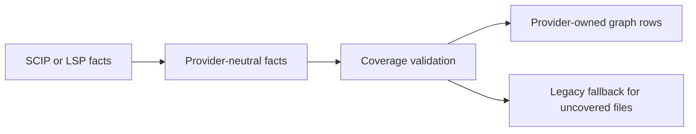

# Provider-First Indexing

Provider-first indexing is the indexing direction for large repositories. It treats compiler or language-server facts as the first graph source and keeps the existing tree-sitter/Rust indexer as the fallback path.

Language support status is tracked in [Language Provider Support](./language-provider-support.md). That chart is backed by `docs/generated/language-provider-support.json` and checked by `npm run docs:language-support:check`.

Provider-first is its own indexing mode. Its symbol IDs are stable within the provider-first pipeline, but they are not intended to be interchangeable with legacy symbol IDs. Consumers should resolve symbols through current graph queries, provider provenance, source path, kind, name, and range rather than assuming a legacy/provider-first ID can be reused across modes.

For performance tuning, use the deterministic subset workflow in [Provider-first fallback benchmark](../../devdocs/benchmarks/provider-first-fallback-benchmark.md). That workflow is the fast iteration loop only. A larger representative run or full target run is still required before declaring an optimization complete.

## Provider-first flow

## Quick Reference

| Need | Where to look |
| --- | --- |
| Choose `indexing.pipeline` behavior | [Pipeline Selection](#pipeline-selection) |
| Understand graph identity and provider fact normalization | [Provider Facts](#provider-facts) |
| Validate a completed provider-first graph | [Accuracy Gates](#accuracy-gates) |
| Follow the full-refresh execution path | [Full Builds](#full-builds) |
| Interpret fallback and skipped-tail behavior | [Same-Run Legacy Fallback](#same-run-legacy-fallback) |
| Inspect shadow DB staging, finalization, and activation | [Shadow DB Lifecycle](#shadow-db-lifecycle) |
| Read provider-first progress, coverage, and timing output | [Progress And CLI Diagnostics](#progress-and-cli-diagnostics) |
| Understand when provider references become exact edges | [Call Proof And Edge Materialization](#call-proof-and-edge-materialization) |
| Check what is implemented versus pending | [Current Implementation Status](#current-implementation-status) |

## Pipeline Selection

`indexing.pipeline` controls selection:

| Value | Behavior |
| --- | --- |
| `"legacy"` | Use the tree-sitter/Rust legacy indexer only when SCIP and LSP provider inputs are disabled. If SCIP or LSP inputs are enabled, SDL-MCP coerces the run to provider-first and emits a diagnostic because provider facts are provider-first owned. |
| `"providerFirst"` | Require an executable provider-first run for SCIP or LSP refreshes. SCIP-covered files with usable symbol facts are materialized from provider facts even when references are partial. LSP-covered files can materialize bounded document-symbol and diagnostic facts. Uncovered or provider-unusable files are routed to the legacy indexer in the same run. Incremental SCIP refreshes require `scip.generator.enabled` so changed files can be passed to `scip-io`; static SCIP index files without a generator fall back rather than treating stale provider output as fresh. |
| `"auto"` | Use provider-first when an executable provider path is available; otherwise use legacy. SCIP and LSP runs can mix provider materialization with same-run legacy fallback. If provider execution fails before trustworthy facts are available, `auto` falls back to a pure legacy run without SCIP/LSP overlay ingestion. |

`providerFirst.maxLegacyFallbackFiles` defaults to `1000000`. That high default is intentional: normal full builds should complete the graph rather than adopt a provider-only subset. Larger gaps keep the provider-primary graph, skip the expensive legacy parse, and report skipped file counts only when the emergency cap is exceeded or intentionally lowered.

Unsafe provider output fails instead of silently running legacy. Unsafe output includes contradictory graph identities, absolute paths, and path-traversing paths. Safe repo-relative provider files outside the configured scan scope are filtered and reported. Ambiguous native provider symbols that have definitions in multiple files are skipped and reported as provider-unusable rather than aborting the whole provider run.

Provider priority is fixed:

1. SCIP
2. LSP
3. Legacy fallback

SCIP wins because it provides compiler-grade definitions, references, relationships, external symbols, and per-document coverage quickly. LSP is primary only through bounded collection. The current executable LSP path materializes document symbols and diagnostics into provider facts; definitions, references, workspace symbols, and hierarchy calls remain planned provider facts. SDL-MCP consumes configured LSP commands exported by lsp-io; it does not run package-manager install recipes for servers.

## Provider Facts

Provider output is normalized into a provider-neutral IR before any graph write:

- `FileFact`
- `SymbolFact`
- `OccurrenceFact`
- `EdgeFact`
- `ExternalSymbolFact`
- `DiagnosticFact`
- `CoverageFact`
- `ProviderRunFact`

### Identity

SDL symbol IDs are derived from `repoId`, provider type, provider ID, native provider symbol ID, and source path. Provider version and definition ranges are intentionally excluded from the SDL ID so ordinary SCIP/LSP version drift and line movement do not corrupt identity. Native provider IDs, versions, and ranges are still stored on facts for audit and cache invalidation.

### SCIP Ownership And Overlap

For SCIP, internal `SymbolFact` ownership follows definition occurrences. Some providers repeat `SymbolInformation` metadata in documents that only reference a symbol; SDL-MCP resolves those occurrences to the symbol's definition document instead of emitting another file-local symbol. If the provider reports real definitions for the same native symbol in multiple non-coalescible files, validation treats that as unsafe rather than guessing which definition should own the SDL identity.

Configured SCIP indexes can overlap. Provider-first treats each normalized repo-relative file as single-owner during fact collection:

- The first configured provider payload owns that file's file-local facts.
- Later overlapping indexes still record their `ProviderRunFact`.
- Later overlapping indexes do not duplicate file, symbol, occurrence, edge, diagnostic, coverage, or source-line facts for the same path.

This keeps multi-index and split-index setups from creating duplicate graph primary keys. Provider edge provenance is stored as JSON with the provider identity, source index path when known, source repo path when known, and the internal edge dedupe key. Provider-derived symbol summaries score documentation depth as minimal, standard, or rich instead of assigning one flat quality value to all docs.

Duplicate raw SCIP documents that normalize to the same repo-relative path are merged before file, symbol, occurrence, and coverage facts are emitted. Exact duplicate symbols or occurrences are counted once, while complementary symbols or occurrences from another root are preserved.

### Source Fidelity

Provider-first file facts carry raw source fidelity metadata from the repository source bytes:

- `contentHash`: SHA-256 over the file bytes on disk.
- `byteSize`: the raw byte length.

Provider metadata hashes are not accepted as substitutes for local `File` rows.

### Provider-Specific Normalization

Go SCIP indexes receive two provider-specific normalization guards before graph rows are emitted:

- The synthetic scip-go package summary document with an empty relative path is skipped, so it cannot create a fake `.` file, coverage row, or package symbol.
- scip-go descriptors that begin with a backtick-wrapped import path, such as `` `github.com/acme/project/pkg/store`/New().``, are normalized to the package segment before shared SCIP kind/name mapping, so SDL names stay source-like (`store`, `New`) instead of retaining import-path text.

Rust-analyzer namespace descriptors ending in `/`, such as `cluster/`, are materialized as SDL `module` symbols. Repeated crate namespace descriptors such as `crate/` are coalesced to one provider symbol while every occurrence still resolves to that symbol ID. Remaining `unknown descriptor suffix` diagnostics point at descriptor shapes that still need explicit mapping rather than the standard Rust module form.

JVM SCIP indexes from `scip-java` receive these normalization guards:

- Java/Kotlin constructor descriptors named `` `<init>` `` are treated as constructors even when the descriptor uses SCIP-Java's arity form, such as `` `<init>`(+1).``.
- JVM type-parameter descriptors written with bracketed suffixes, such as `RecordJsonAdapter#[T]`, are skipped as type parameters instead of being reported as unknown descriptor suffixes.
- Broad Java/Kotlin declaration spans that exceed the physical source line stay neutral when they describe delegated properties or type/class declarations. These ranges are not source-proven invocations and should not block provider-first shadow activation.

## Accuracy Gates

Provider-first writes are guarded by five accuracy gates:

| Gate | Requirement |
| --- | --- |
| Source fidelity | Every local `File` row must have a valid raw SHA-256 `contentHash` and non-negative `byteSize` that can be checked against disk by `npm run check:provider-first-graph -- --db <path> --repo-root <path>`. |
| Local symbol usability | Every non-external real symbol must have file ownership, repo ownership, and metrics after finalization. |
| Edge quality | All `DEPENDS_ON` endpoints must exist, duplicate relationships are rejected, and SCIP-derived `call` edges are emitted only when source-text proof produced an exact edge with provider provenance. |
| Derived graph health | Code-window ranges and graph-derived rows must stay within source bounds and remain recoverable after provider-first finalization. |
| Provenance and auditability | Provider runs, diagnostics, and bounded coverage/call-proof summaries are persisted through semantic graph tables so bad graphs can be debugged without scraping CLI output. |

The internal graph checker writes JSON and Markdown reports under `.tmp/provider-first-graph-checks/` and exits non-zero on gate failures. Use it after building a provider-first DB, especially when validating a new provider, generator version, or large-repo optimization.

## Full Builds

The target full-build path is:

1. Collect SCIP indexes and capped LSP facts.
2. Emit staging artifacts.
3. Bulk-load a fresh shadow `.lbug`.
4. Validate row counts, relationship endpoints, and active generation coverage.
5. Build FTS and derived graph algorithm state.
6. Checkpoint only after writes and index builds are idle.
7. Activate the shadow DB with lock-aware close/reopen behavior.

### Graph Readiness Versus Semantic Readiness

Embeddings, LLM summaries, retrieval-index bootstrap, and semantic enrichment are not part of the first ready gate. They advance a separate semantic readiness state. Provider-first graph finalization skips inline semantic work so shadow activation can happen against graph-ready rows first.

After the finalized graph is active, SDL-MCP runs the configured semantic readiness refresh against the activated DB:

- Summaries run when `semantic.generateSummaries` is enabled.
- Symbol and FileSummary embeddings run from the configured semantic model plan.
- Deferred retrieval indexes are rebuilt.
- Semantic dirty flags are cleared only after that pass completes.

If semantic refresh cannot complete, the CLI reports `Semantic readiness: deferred`, `DerivedState.embeddingsDirty` remains set, and `DerivedState.summariesDirty` is set only when summaries are configured. A degraded mock fallback or any deferred embedding rows count as incomplete; mock rows are not reported as embedded. Shadow activation re-applies the semantic dirty marker after the activated DB is reopened. Repeated provider-first runs that reuse already-current active provider rows run the same post-graph semantic refresh rather than reporting a clean graph prematurely.

### Persisted Graph Integrity

SDL-MCP verifies the persisted symbol graph before it reports the latest graph version as healthy. The indexer derives the expected digest from authoritative in-memory rows before persistence: provider-first uses normalized `ProviderFirstGraphRows`, while legacy indexing reduces each parser result to a per-file digest before the write buffers drain. Empty, binary, disabled-language, unsupported, and unparseable files establish an empty expectation before their persistence boundary. The gate retains counts and bounded file/page digests instead of a second full symbol graph.

The canonical tuple covers immutable symbol identity, location, signature, parser/provider source, SCIP identity, status, external classification, and placeholder metadata. Its universe includes every `Symbol` owned through the repository's `SYMBOL_IN_REPO` relationship, not only nodes linked to a `File`: provider externals and unresolved dependency placeholders are grouped under a deterministic empty-path sentinel. Relationship ownership keeps a shared unresolved node in each repository's universe even when another repository becomes the node property's most recent writer. Expected rows use UTF-8 scalar ordering, including supplementary-plane characters, to match LadybugDB's stable keyset order. The tuple intentionally excludes `summarySource`: supported semantic refresh can replace that provenance after the initial symbol write, so including it would reject a correct final graph. Missing legacy `source` values normalize to the persisted `treesitter` schema default on both sides.

Expected fileless membership comes from authoritative symbol and edge rows. Incremental indexing seeds aggregate liveness counts from the verified baseline, adds per-file buckets only for files the run replaces, and records exact source detail only for current pass-2 submissions. This avoids retaining the baseline as a second edge graph while still replacing references at the authoritative changed-file and pass-2 source boundaries. Fileless symbols promoted to current file-backed definitions leave the inherited fileless set before current edges are classified. Planned import-target and built-in-call transformations update the expectation before their database mutations.

Placeholder pruning finalizes the expectation from those counts before the persisted cleanup runs; the cleanup query's returned rows are never used as the expected baseline. Liveness for a repository-owned fileless target includes incoming file-backed references whose repo-unique source has the same canonical `repoId`; only the fileless target can be shared across repositories. The baseline aggregate uses that stable source property because LadybugDB 0.18.1 exits natively on the equivalent cyclic repository-relationship plan after placeholder deletion. Exact affected-file and pass-2 replacement queries remain relationship-scoped. Changed-file subtraction remains scoped to the exact affected files. When those references disappear, cleanup removes only the stale target-repository `SYMBOL_IN_REPO` relationship. A shared physical node and another repository's membership remain intact; the node is deleted only after it has no repository memberships and is globally isolated. Because LadybugDB's safe-delete threshold applies to the global `Symbol` table, the pruning decision combines the target repository's authoritative expected count with a conservative pre-prune count of physical symbols outside or shared with it. A shared node can therefore be counted on both sides and disable pruning near the boundary, but it cannot make an unsafe physical table look smaller. When that global boundary is too large, or the baseline contains an unsupported fileless-source edge shape, SDL-MCP skips physical placeholder pruning and conservatively retains the verified incremental membership. Full refreshes never inherit that membership. If LadybugDB's safety boundary retains a stale placeholder tail during a full refresh, final verification fails closed instead of accepting the extra rows. The final independent scan therefore detects missed, extra, or incorrect cleanup without producing false mismatches in multi-repository databases.

After shadow activation and deferred semantic refresh finish, SDL-MCP streams the final active LadybugDB symbols in stable file-and-symbol keyset order and compares that digest with the expected value. A mismatch records bounded details in operational logs, marks `DerivedState.graphIntegrityState` as `failed`, and returns a generic deterministic error without exposing symbol or path details in MCP output.

Publishing either the verified digest or a verifier-owned failure is a conditional state transition: it succeeds only while `DerivedState` is still `verifying` for the same version. A concurrent durable mutation can reset that state, or a newer verification can replace its version, without a stale verifier overwriting the resulting `unknown` or newer `verified` state. The stale caller still receives the generic integrity error. This keeps the O(symbols) final scan on a read connection; only the constant-time compare-and-set uses the single writer.

Incremental indexing starts from the previous verified digest, re-reads the active graph before any deletion, and replaces only changed or removed per-file digests with current authoritative results. When a scan finds no changed files, SDL-MCP waits for useful background verification and validates the current persisted graph before recovery or versioning work. A clean result reuses the existing latest version. A lost verifier wakeup is recovered from the durable revision, while an unknown, failed, or mismatched baseline raises a typed permanent error without starting a refresh loop. A populated active graph rejects destructive full refreshes before provider generation or graph writes. After an upgrade or integrity failure, stop SDL-MCP and use `index --force --safe-rebuild <absolute-new-path>` to build every configured repository in a fresh database and validate it after reopen.

Durable saved-file patches advance the current versioned manifest instead of resetting integrity to `unknown`. The shared transaction writes File and Symbol rows, parser-owned edges, canonical touched dependency placeholders, file and fileless manifest deltas, and one new integrity revision. It marks the revision `verifying`, notifies the coalescing worker after commit, and returns without a foreground full-graph scan. The shared patch boundary covers saved edits, watcher reconciliation, checkpoint recovery, and indexed write tools.

Sync artifact import and pull also reset integrity before their first canonical graph write, including same-version re-imports. If an import fails after partially writing its artifact, the repository remains unverified rather than retaining the previous digest.

### Current Executable Flow

Full SCIP provider-first runs currently:

1. Collect SCIP documents and external symbols.
2. Normalize them into provider facts.
3. Validate coverage against the scanned repository file set.
4. Optionally stage provider-materialized graph rows as Ladybug-loadable CSV artifacts for a fresh shadow `.lbug` when the shadow can still be finalized.
5. Materialize provider-owned files, symbols, and edges through the existing active LadybugDB single-writer APIs.

Large SCIP collections above the occurrence-retention limit keep lightweight per-file coverage and edge inputs, but they do not retain full occurrence fact rows. Those rows are currently diagnostic payload and would otherwise be created only to be dropped before coverage analysis. Provider-first also drops decoded provider fact payloads and discarded graph-row copies after coverage analysis, before same-run legacy fallback and versioning continue.

Existing symbols for provider-materialized files are removed before the provider rows are written so stale legacy symbols do not survive beside SCIP-owned symbols. Files with usable SCIP symbol facts are provider-primary even when some references are unresolved. Unresolved references stay in coverage facts and edge inputs until a later targeted fallback or pass-2 phase consumes them. Files whose provider coverage is missing or has no usable symbols are indexed by the legacy path in the same run.

Generator warnings from `scip-io` remain visible in SCIP diagnostics but do not abort explicit `providerFirst` after a usable index decodes into provider rows. Missing configured SCIP index files still fail explicit provider-first runs because the configured source of truth was unavailable.

Provider runs are persisted to `SemanticProviderRun`. Provider diagnostics and grouped coverage/call-proof diagnostics are persisted to `SemanticDiagnostic`. Bounded coverage summaries are stored in `SemanticProviderRun.metadataJson`.

### Incremental Refreshes

Provider-first incremental refreshes start with the normal repository scan so removed files and unchanged files are still detected against LadybugDB metadata. Only changed files enter provider collection:

- SCIP incremental writes a temporary newline manifest of changed repo-relative paths and runs `scip-io index --files-from <manifest> --output <temp.scip>`. Only that generated temp index is decoded for the current run; configured root SCIP indexes are ignored so stale provider ranges cannot re-enter changed-file materialization. The temp output does not update the full `index.scip` generator cache.
- LSP incremental passes only changed scanned files into document-symbol collection. Unchanged files keep their existing graph rows.
- Provider-covered changed files are materialized into the active graph with existing symbols for those files deleted first, known-fresh writers enabled, provider edges written, and repo-wide external-symbol pruning disabled.
- Changed files that are uncovered or provider-unusable route through the same legacy incremental fallback path. Users with `indexing.pipeline: "legacy"` keep the legacy incremental process.

Provider-first incremental runs skip shadow staging/finalization because the provider output is intentionally scoped to changed files and cannot represent a complete shadow graph. Post-index finalization receives the changed provider file ids so metrics, memory invalidation, and derived-state work stay scoped to the incremental change set.

### Scan Scope And Coverage

Provider documents that are safe repo-relative paths but are outside the configured scan scope are filtered out before coverage validation and materialization. For example, a provider document for a language that is not listed in the repo config is filtered. Suspicious absolute or path-traversing provider paths still fail before writes.

Scan scope is derived from:

- The built-in adapter extension set for configured C, C++, Python, PHP, Kotlin, and shell languages.
- Provider-first companion extensions for configured C++: `.c`, `.h`, `.def`, and `.inc`.
- Provider-first companion extensions for configured Python: `.pyi`.

The companion extensions prevent safe SCIP documents for headers, generated include fragments, C bridge files, and Python stubs from being accidentally treated as outside-scope provider output.

For C/C++ provider-first coverage, SDL-MCP separates three denominators:

| Denominator | Meaning |
| --- | --- |
| Scan scope | Every configured source file SDL-MCP scanned. |
| SCIP semantic eligibility | The union of scan-scope files named by discovered `compile_commands.json` entries plus provider-emitted C/C++ header/include documents inside scan scope. |
| SCIP provider coverage | The provider document count that remains inside scan scope after unsafe or out-of-scope paths are filtered. |

When semantic eligibility is known, fallback-cap summaries include a semantic eligibility diagnostics block. It splits the fallback tail into semantic-eligible uncovered files, semantic-eligible provider-unusable files, and scanned files outside semantic eligibility, with bounded sample paths for each group. This keeps large C/C++ runs from treating every skipped scanned file as an equally useful fallback candidate and makes it clear whether raising `providerFirst.maxSemanticEligibleFallbackFiles` would buy more active-graph semantic coverage while leaving shadow activation deferred.

## Same-Run Legacy Fallback

Same-run legacy fallback is capped by `providerFirst.maxLegacyFallbackFiles` (default `1000000`). A full provider-first index should normally parse the uncovered or provider-unusable tail and produce a complete graph, because partial graphs limit product adoption.

If the uncovered set is larger than the cap, or an operator lowers the cap for iteration or resource protection, SDL-MCP:

1. Keeps the provider-primary active rows.
2. Skips the expensive fallback parse.
3. Reports `legacy fallback skipped ... over cap ...`.
4. Skips shadow staging because graph-derived readiness plus shadow finalization/activation remain blocked by the intentionally partial graph.

When semantic eligibility is known, SDL-MCP still reports the useful semantic-eligible subset separately. Parsing that subset while skipping the outside-semantic tail is opt-in through `providerFirst.maxSemanticEligibleFallbackFiles` (default `0`) because shadow finalization and activation remain blocked by the skipped tail.

Complete same-run provider-first legacy fallback uses the tuned legacy path:

- Native Rust pass-1 when configured and available.
- Parser workers for TypeScript pass-1.
- Normal configured concurrency.
- The batch persistence accumulator.

Intentionally partial provider-first fallback stays conservative with inline TypeScript/tree-sitter pass-1 parsing and direct per-file LadybugDB writes. The skipped tail already blocks activation, and that mixed partial path has hit hard native and worker exits on large C++ repos.

When same-run legacy fallback is needed, fallback files are parsed through the legacy path first. SDL-MCP then collects those just-written active graph rows by repo-relative path and restages a merged provider-plus-fallback shadow build. Full fallback reruns rebuild stale fallback `File` rows from scratch when a previous versionless attempt already wrote them, which avoids duplicate relationship creation during recovery.

Large active provider rows are reused when the active SCIP input fingerprint has a matching non-truncated `ScipIngestion` marker, or when a versionless recovery run finds that the current provider symbol shape is already present in the active graph. Otherwise, dirty partial graphs take the merge-safe materialization path instead of assuming the existing graph is complete.

## Shadow DB Lifecycle

### Staging

The staging directory is created beside the active graph DB at `provider-first-shadow/<repoId>/<generationId>/`. It contains:

- Table-shaped node CSVs: `repos.csv`, `files.csv`, `symbols.csv`, and `external-symbols.csv`.
- Relationship CSVs: `file-in-repo.csv`, `symbol-in-file.csv`, `symbol-in-repo.csv`, and `depends-on.csv`.
- A loaded `shadow.lbug`.
- A manifest with staged counts, expected versus actual shadow-load counts, copy order, requested format, actual format, secondary-index warnings, shadow-load status, and validation metadata.

CSV staging uses an explicit LadybugDB `NULL_STRINGS` sentinel so nullable values do not collapse with intentional empty-string sentinels. Shadow `COPY` runs with `PARALLEL=FALSE` and `QUOTE='"'` because provider symbol names, signatures, and source paths can contain quoted newlines or late comma-bearing values that LadybugDB's inferred CSV settings may otherwise reject. `providerFirst.stagingFormat: "parquet"` currently falls back to CSV and records that reason in the manifest because Parquet writing is not bundled yet.

When same-run legacy fallback is skipped by the configured cap, SDL-MCP skips shadow staging because finalization and activation remain ineligible while uncovered files are intentionally absent. If provider call-proof gaps already make graph-derived state dirty, shadow staging and finalization are skipped because the provider call edges are not trusted enough for a shadow graph. Shadow DBs are also single-repo scoped today: when the active DB already contains another repo, SDL-MCP skips shadow staging and uses the active materialization path so unrelated repos remain indexed. Revisit this once shadow builds can copy a complete DB, including non-target repos, before activation. The active graph still receives normal finalization rows, and the CLI reports the skipped shadow reason.

If staging artifact writes or shadow DB loading fail, the run reports the failed shadow phase as skipped and continues through the active LadybugDB materialization path. Unsafe provider graph validation still fails before any provider writes.

### Finalization

After active graph finalization finishes, loaded shadows are finalized by writing these rows to finalization CSV artifacts and loading those artifacts into the shadow `.lbug` with LadybugDB `COPY`:

- Auxiliary dependency symbols and their repository/file membership.
- Final active edges.
- Version rows.
- Symbol versions.
- Metrics.
- File summaries.
- Clusters.
- Processes.
- Shadow clusters.
- `DerivedState` rows.

Finalization then validates active-versus-shadow counts, including file links for
auxiliary symbols, and checkpoints the shadow database. Provider metadata can
remain `unresolved` while still belonging to a concrete source file; finalization
preserves that relationship instead of treating status as fileless ownership.
The finalization manifest sits under the shadow build's `finalization/`
directory so failed parity checks can be inspected without re-running provider
collection.

Shadow finalization seeds edge-target symbol nodes that are needed as relationship endpoints but are not repo-linked in the active graph. It does not add missing `SYMBOL_IN_REPO` relationships that would skew parity counts.

Relationship rows whose endpoint contains quotes, whose endpoint/property text contains record separators, or whose `pass2-cpp` provenance requires CSV quoting are excluded from relationship `COPY` and written through parameterized LadybugDB writes after the bulk load. This preserves unresolved quoted or multi-line dependency, cluster, process, shadow-cluster, and C++ pass-2 edge rows without letting one rare row break the whole activation.

### Activation

When activation prerequisites are met, live indexing:

1. Closes the active LadybugDB pool.
2. Swaps the finalized shadow `.lbug` into the active path.
3. Reopens the active database.
4. Keeps the previous active DB as a backup.
5. Restores that backup if the activated shadow cannot be reopened.

## Active Materialization

Active provider materialization still writes to the live LadybugDB path before shadow activation so same-run fallback and graph finalization can use the normal active graph APIs. Provider-first uses a narrower write shape than the general legacy writer:

- After old file-backed symbols have been deleted, provider symbols are written as temporary `Symbol`, `SYMBOL_IN_FILE`, and `SYMBOL_IN_REPO` CSV artifacts and imported with LadybugDB `COPY`.
- Provider edges use a known-endpoint bulk loader after files, symbols, and external symbols are already present.
- The edge loader writes a temporary `DEPENDS_ON` CSV and imports it with LadybugDB `COPY` inside the active transaction.
- Source-symbol replacement means fresh provider sources have no old outgoing `DEPENDS_ON` rows to probe before relationship loading.

That path skips generic relationship existence checks, endpoint creation, stale optional-field preservation, and placeholder repair work that are still required for broader legacy writes.

Before opening the active graph, SDL-MCP quarantines a dangling `<graph>.wal.checkpoint` sidecar when no matching `<graph>.wal` exists. That stale sidecar can make LadybugDB crash during native open. Real WAL files are left in place.

## Progress And CLI Diagnostics

Provider-first live progress uses a first-class `providerFirst` stage instead of showing most provider work as generic finalization. The same `IndexProgress` payload is forwarded through terminal rendering, delegated HTTP reindex SSE, and MCP progress notifications.

Provider-first substages cover:

- `coverageScan`
- provider collection: `metadata`, `documents`, `externalSymbols`, `sourceLines`, `normalize`, `rows`, and `validate`
- `coverageAnalyze`
- active `materialize.*` work
- `shadowStage`
- `shadowFinalize`
- `shadowActivate`

Known-count loops include `stageCurrent` and `stageTotal`. Loops without a reliable total emit bounded heartbeat messages so long provider runs keep showing movement.

### Runtime And Wall-Time Lines

CLI output reports provider-first coverage separately from total indexed files. At the start of each `sdl-mcp index` run, the CLI prints `Runtime: sdl-mcp ...` with the package version, Node.js version, and loaded module path. Delegated HTTP indexing also prints `Server runtime: ...` from the server process that actually performed indexing. Use these runtime lines when comparing benchmark logs so stale global installs or long-lived server processes do not get mistaken for current tuning results.

Per-repo summaries print both `Duration` and `Wall time`:

- `Duration` is the indexed phase reported by `indexRepoImpl`.
- `Wall time` covers the caller-visible wait around `indexRepo`, including pre-lock SCIP generator/pre-refresh work and delegated-server streaming time.

When the two differ, tune the `Wall time` path first if the goal is user-perceived runtime.

Repeated unchanged generator runs use the generated-index cache by default. Summaries print `SCIP generator cache: hit` or `stored` when that cache participates. Warm cache hits can reuse latest metadata before the full input scan when git status shows that dirty paths are unrelated to configured source extensions or generator config files. Relevant source or build-manifest changes still fall back to the existing stat/content fingerprint path.

### Provider Timing Block

Provider-first live progress replaces the old `SCIP ingest` document counter for provider runs. Legacy indexing no longer ingests SCIP overlays; provider inputs are collected and materialized by provider-first only.

The final summary includes a provider-first timing block with:

- Total provider-first wall time.
- The slowest provider-first phase.
- Phase buckets for collection, coverage scan, active materialization, same-run legacy fallback, final shadow staging, shadow finalization, and activation when those phases run.

Collection prints broad buckets and a `collect.normalize` subphase line for coalescing, symbol relpath indexes, symbol facts, retained or lightweight occurrence facts, diagnostics, coverage, relationship edges, and occurrence edges. This makes normalizer bottlenecks visible without rerunning with a profiler.

The active materialization bucket prints a subphase line for provider-owned symbol deletion, file upserts, symbol upserts, stale external pruning, external-symbol merges, and edge inserts. Provider symbol writes also report `nodeAndRelCreate` for the combined symbol-node plus file/repo ownership `COPY` load.

That timing block is always emitted for executed provider-first runs, even when broad `--diagnostics` timing output is not requested, so normal indexing tests can identify the next bottleneck without changing CLI flags.

### Legacy Fallback Diagnostics

When same-run legacy fallback parses uncovered or provider-unusable files, the CLI prints a legacy fallback diagnostics block. It includes:

- Fallback file count, total time, average time per fallback file, and the slowest fallback subphase.
- Pass-1, pass-1 drain, pass-2, and finalization buckets.
- Pass-1 drain write subphase buckets when a drain accumulator is active: `deleteOldSymbols`, `upsertFiles`, `symbolRefs`, `upsertSymbols`, and `insertEdges`.
- Pass-2 subphase buckets: `targetSelection`, `importCache`, `resolverDispatch`, `writeActive`, and `writeQueue`.
- Nested finalization buckets: `symbolStatus`, `metrics`, `metrics.*`, `fileSummaries`, `fileSummaries.*`, `audit`, and `qualityAudit`.
- Derived buckets: `loadSymbols`, `loadEdges`, cluster compute/write, process compute/write, and algorithm stage.
- Nested cluster/process write buckets: `clusterWrite.loadExisting`, `clusterWrite.writeRows`, `clusterWrite.deleteRows`, `clusterWrite.upsertClusters`, `clusterWrite.upsertMembers`, `processWrite.loadExisting`, `processWrite.writeRows`, `processWrite.deleteRows`, `processWrite.upsertProcesses`, and `processWrite.upsertSteps`.
- Version detail buckets: `latest`, `create`, `snapshot`, `readPages`, and `writePages`.
- Deferred-index detail buckets: `secondary`, `config`, and `retrieval`.
- Deferred retrieval lifecycle buckets: `symbolDiscovery`, `symbolFts`, `symbolVectors`, `entityDiscovery`, `entityFts`, `fileSummaryVectors`, and `agentFeedbackVectors`.
- Secondary buckets: `initSharedState`, `refreshSymbolIndex`, import re-resolution, edge finalization, versioning, deferred indexes, and memory sync.
- An `unaccounted` residual for timing gaps.
- Sample fallback paths with an omitted-count suffix when there are more than ten.

Nested finalization, pass-2, version snapshot, deferred-index, and retrieval-index lifecycle timings are collected for provider-first fallback even when broad index diagnostics are disabled.

### Shadow DB Diagnostics

The summary includes a `Provider-first shadow staging` line with the actual staging format and staged file/symbol/external/edge counts when staging runs. It then prints `Provider-first shadow DB loaded` when the fresh shadow `.lbug` passes actual row-count validation.

When call-proof, fallback-cap, source-scope, incremental, or multi-repo blockers make the shadow non-activatable before artifact creation, the CLI prints `Provider-first shadow staging skipped` with the health reason instead. Once active finalization has produced version, metrics, summaries, derived state, and algorithm rows, the CLI prints `Provider-first shadow DB finalized` with final active/shadow parity counts. `symbols` matches the public real-symbol total, while unresolved or external dependency support nodes copied for edge parity are reported separately as `auxiliarySymbols`.

Finalized runs also report `copy=bulkCsv` and the number of finalization artifacts loaded into the shadow DB. Failed or skipped finalization is reported separately for staged shadows whose finalization cannot complete. Secondary-index build failures remain non-fatal but are surfaced as shadow DB warnings. Runtimes that reject `CREATE INDEX` syntax are reported as skipped secondary indexes rather than data-load failures.

If artifact writes or shadow loading fail, the CLI prints a skipped-staging or skipped-load line with the reason. When activation is not attempted or cannot complete safely, the CLI prints a separate `Provider-first shadow DB activation skipped` or failed line with the missing prerequisites or rollback status.

After a finalized shadow is swapped into the active path, SDL-MCP reopens it and rebuilds or verifies the configured critical Symbol FTS index before accepting the handoff. If that required index is absent or the FTS runtime is unavailable, activation fails and restores the previous active database. The post-handoff validation runs only against the newly activated shadow, so reopening the restored backup does not repeat the failed validation.

### Coverage Diagnostics

The `Provider-first coverage` line reports:

- How many scanned repository files were provider-primary.
- How many provider-primary files had full versus partial provider coverage.
- How many files were uncovered or provider-unusable and therefore parsed by legacy fallback or skipped by the fallback cap.
- How many safe repo-relative provider files were ignored because they were outside the configured scan scope.

When provider-covered files are unusable, the CLI prints grouped provider-unusable diagnostics such as missing coverage facts or files where SDL-MCP skipped every provider symbol during normalization. `no usable provider symbols` diagnostics include affected file counts, sample paths, and skipped-symbol reason counts.

When provider-primary call proof is incomplete, the CLI prints grouped diagnostics with reference counts, file counts, sample paths, and bounded expected/actual source samples. Reason codes include stale symbol text, multi-line ranges, missing source lines, oversized files, unreadable files, and source paths outside the repo root. Coverage facts retain those samples even when large SCIP runs drop full occurrence fact rows, so provider range drift can be inspected without dumping every occurrence.

## Call Proof And Edge Materialization

SCIP reference occurrences become exact `call` edges only when repo source lines still match the expected SCIP symbol text and prove invocation syntax such as `helper()` or `helper?.()`.

Readable non-call references, including property keys, string literal keys, and broad value reads, remain neutral occurrence facts and do not count against call-proof readiness. Unresolved references, invocation-shaped stale SCIP ranges on the actual callable token, missing source lines, oversized files, unreadable files, or C++ shapes outside the retained source window also remain neutral occurrence facts for later targeted fallback or pass-2 provider work. Source-unavailable cases still keep graph-derived readiness dirty until the call-proof risk is resolved.

Coverage facts keep per-file call-proof reason counts. The coverage summary and CLI keep globally bounded mismatch samples so operators can distinguish provider/source drift from local source read limits.

Provider-first SCIP execution runs cluster/process/algorithm derived state after graph materialization only when call proof is complete for provider-primary files. Otherwise, graph-derived readiness remains dirty with a health reason.

### General Proof Rules

Call proof includes several language-aware cases:

- Constructor symbols whose SCIP display name is `` `<constructor>` `` are compared against the owning class name, so `new Executor()` can prove the constructor call without being treated as provider/source drift.
- JVM constructor symbols whose SCIP display name is `` `<init>` `` are also compared against the owning class name, including parameter-count descriptors such as `` `<init>`(+1).``. This covers Java/Kotlin `new Type(...)`, `this(...)`, and `super(...)` constructor references emitted by `scip-java`.
- JVM qualified constructor/type references whose source range covers a fully qualified receiver, such as `mockwebserver3.Dispatcher()`, prove the terminal type or constructor name only when the range is followed by invocation syntax.
- JVM delegated-property spans and broad type/class spans whose provider range exceeds the source line remain neutral instead of being counted as call-proof gaps.
- Scoped anonymous/type-literal member symbols such as `typeLiteral753:cleanupSession` are compared against their member suffix, so `cleanupSession()` remains provable when SCIP includes the synthetic owner in the symbol name.
- Python nested callable descriptors such as `eventclass().wrapper` are compared against the terminal callable name, so `wrapper()` can prove the call without globally accepting arbitrary suffix matches.
- Python import clauses whose SCIP range covers `name as local_name` contribute only the file-local alias as an extra proof candidate, so `_get_op_result_or_value(...)` can prove the imported `get_op_result_or_value` helper while leaving the alias scoped to that document.
- Python module initializer references that expand to a qualified member invocation, such as `lit.util` inside `lit.util.warning(...)`, remain neutral because the module is not the invoked callable.
- File-local aliases from named imports such as `import { original as localAlias }` are accepted only within the document that declares the alias, so `localAlias()` can prove a call to `original` without globally relaxing the symbol text check.
- Non-import TypeScript `as` expressions are not treated as aliases.
- C#/.NET overload arity descriptors from `scip-dotnet`, such as `CharacteristicObject#GetValue(+1).`, are canonicalized to the normal callable descriptor `CharacteristicObject#GetValue().` before symbol identity, name extraction, relationship mapping, and source call proof.

### C And C++ Proof Rules

For `scip-clang` and `cxx` symbols, exact source-text proof still runs first. Only symbol-text mismatches enter the bounded C++ token-window proof.

The bounded proof accepts qualified, member, and template calls such as `llvm::cast<T>(value)`, `object.method()`, and `ptr->method()` when the retained local source window proves that the terminal callable token matches a generated SCIP source candidate and is followed by invocation syntax.

It also handles these C/C++ cases:

- Constructor declarations such as `APInt Offset(...)` when the provider symbol is the constructor and the source range points at the declarator name.
- Typedef-alias constructor declarations such as `MutexLock l(&mutex)` only when the same SCIP document also exposes the alias type occurrence, for example `testing/internal/MutexLock#`, in the same descriptor scope as the canonical provider constructor `testing/internal/GTestMutexLock#GTestMutexLock(...)`.
- C++ member-initializer constructor references from nearby declarations when the provider occurrence range points at the member name, so a range on `Args` in `: Args(std::move(Args))` can prove the constructor for the member's declared type without relaxing unrelated mismatches.
- Local class definitions that declare an object after the closing brace, such as `struct RestorePath { ... } restore_path(path);`, from the nearby class/struct/union declaration instead of treating the variable name as stale constructor text.
- Multi-line template or member invocations such as a split `llvm::cast<T>(...)`, when a clang/cxx provider occurrence range spans multiple source lines and source lines were retained.
- Comma-separated declarator lists such as `APFloat MA(Sem), SC(Sem), TC(Sem)` by reusing the exposed type from the first declarator in the same statement.

Neutral C/C++ occurrence data includes:

- Qualifier-only references such as `std` in `std::move(...)`.
- Template-argument references such as `NumberExprAST` in `std::make_unique<NumberExprAST>(...)`.
- Invocation-like text inside string/comment literals.
- Mismatched all-caps macro wrapper tokens such as `LLVM_ATTRIBUTE_C_DEPRECATED(...)`.
- C++ control-flow and language keywords such as `if`, `for`, `switch`, `sizeof`, and `decltype`.
- C++ string literal spans that clang reports as implicit constructor references, for example `StringRef` over LLVM IR fixture text or escaped non-ASCII literals.

LLVM-style camel-case macro expansions such as `clEnumValN(...)` can produce several scip-clang references on the same source token for namespace, type, or enum symbols inside the macro expansion. Location-only macro descriptors can also leave the real macro token unresolved while expanded symbols, for example `offsetof(Header, Magic)`, point at the invoked macro text. SDL-MCP keeps those overlapping non-callable references neutral instead of treating the invoked macro token as provider drift.

C++/clang location-only macro descriptors such as `` `.../assert.h:77:11`! `` are accepted only when the source range is an identifier followed by invocation syntax, so macro calls like `assert(...)` can prove a call without relaxing ordinary C++ symbol text mismatches.

Some clang C++ occurrences describe an implicit result or conversion on top of a real expression token. SDL-MCP keeps those neutral when:

- The source token is a C++ named cast such as `static_cast<T>(value)`.
- The token is a callable object name and a separate `operator()` occurrence is present on the invocation paren.
- A constructor/conversion occurrence such as `SrcOp` is ranged over a different invoked expression token such as `buildConstant(...)`.

Declarator and member-initializer names are excluded from that neutral path, so constructor proof for `APInt Offset(...)`, `APFloat MA(Sem), SC(Sem)`, and `Args(...)` still has to come from the C++ constructor proof.

Conversion-operator declarations such as `operator StringMapIterBase<T>()` and `operator()(...)` stay neutral because they declare an operator rather than invoking one. Member calls such as `value.operator bool()` still prove through the normal call path. Symbolic operator declarations such as `operator<(...)` also stay neutral when SCIP ranges cover only `operator` and the retained source line supplies the expected punctuation.

Operator-token references, including unary operators like `~value` and callable-object parens, are proofed from the operator descriptor rather than requiring identifier spelling. When a unary operator wraps a real callable expression such as `~maskTrailingOnes<T>(...)`, the C++ token-window proof matches the bare callable while keeping destructor symbols exact. Backtick-wrapped clang descriptor names and balanced trailing template arguments such as `` `~V8` `` and `ScopedHashTableScope<K, V>` also contribute their source spelling so constructor and destructor declaration ranges can prove against `ScopedHashTableScope()` or `~ScopedHashTableScope()`.

SCIP byte columns over UTF-8 source are mapped back to JavaScript string indices before source proof so non-ASCII fixture text does not surface as a range-out-of-bounds call-proof gap.

### Pass-2 Edge Writes

Provider-first pass-2 import resolution reuses provider-owned exported symbol rows before falling back to LadybugDB reads. The generic import cache gets exported `(symbolId, name)` tuples from provider rows. Python pass-2 also gets exported kind/range details so imported class-method resolution can avoid per-target `getSymbolsByFile` reads for provider-owned modules.

Outside the live provider-first fallback path, full-mode pass-1 drain writes use the same fresh-source principle for import/config edges. When the source symbol was just inserted by the drain batch, SDL-MCP prepares unresolved/external target placeholder nodes in bulk and loads eligible `DEPENDS_ON` relationships with LadybugDB `COPY`. Edges that still need general endpoint repair stay on the generic writer.

Full-mode pass-2 writes split resolved known-endpoint call edges from unresolved placeholder edges:

- Large clean resolved-edge batches use the `DEPENDS_ON` relationship `COPY` loader after source-symbol replacement.
- Small batches, unresolved `unresolved:*` targets, and rows with copied edge properties that require CSV quoting keep the generic writer with full-mode skip flags.

This keeps placeholder metadata, repo links, rare C++ provenance with commas, quotes, or newlines, and small-batch latency correct.

## Derived State, Metrics, And Summaries

Semantic refresh is skipped in provider-first post-index finalization and tracked as deferred semantic readiness so index wall time is no longer dominated by the `Summary Embeddings` and `Symbol Embeddings` phases. When semantic refresh is deferred, the deferred index build leaves Symbol FTS, entity FTS, Symbol vectors, and FileSummary vectors for later retrieval readiness/bootstrap work rather than charging those builds to the first provider-first index wall-clock.

PageRank and K-core run by default for the readiness-critical centrality signal. Louvain shadow communities remain optional derived enrichment and are policy-skipped above `indexing.algorithmRefresh.louvain.maxCallEdges`, which defaults to `10000` call edges so provider-first full indexes do not spend most of their wall time in LadybugDB community detection.

### Metrics

Metrics materialization reports `metrics.writeRows` separately from `metrics.writeWait`. Full refreshes replace repo-scoped `Metrics` rows with a buffered delete-plus-`COPY` transaction, while partial incremental refreshes keep merge-safe batch upserts.

Full metric refreshes also persist a repo-level metrics payload fingerprint over fan/churn/test/canonical/centrality values, excluding `updatedAt`. They skip the delete-plus-`COPY` when the payload is unchanged so repeated runs report `metrics.writeMetrics=0` instead of rewriting identical rows.

Test-reference metrics reuse the already-loaded indexed file list instead of doing a second filesystem glob. They persist per-file matched symbol names across one-shot CLI runs, then build the current symbol lookup only for cached names and changed test-file tokens. Warm large-repo runs avoid allocating lookup buckets for every symbol just to rediscover the same small set of test references.

Metrics test-reference discovery uses the indexed file set and content hashes from the just-loaded graph. Warm full runs can trust cached test-reference matches when the indexed content hash matches the cache, so they avoid both a second test-file glob and filesystem stats for unchanged cached test files. If the cache was produced by an older hash format, one run refreshes the cache and later runs use the indexed-hash fast path.

### File Summaries

FileSummary materialization skips unchanged `summary` and `searchText` payloads, so repeated provider-first runs avoid rewriting every file-level summary just to move `updatedAt`. Full-repo summary refreshes read symbols by direct `Symbol.repoId` filtering instead of a large file-id predicate or an extra `SYMBOL_IN_REPO` traversal. They derive exported-name search text from the same symbol facts. Provider-first full runs preload provider-owned symbol facts from the in-memory provider rows so LadybugDB only has to serve fallback-owned file symbols.

Changed existing summaries use a node-only update path and report `fileSummaries.writeExisting`. First-time summaries stream temporary `FileSummary`, `FILE_SUMMARY_IN_REPO`, and `SUMMARY_OF_FILE` CSV artifacts through LadybugDB `COPY` while retaining the merge-safe upsert path as a fallback.

`fileSummaries.writeWait` reports time spent waiting for the post-index write-session body limiter, which commonly overlaps metrics writes rather than FileSummary query execution. The `updated` count reflects rows actually written.

### Clusters, Processes, Versions, And Snapshots

Canonical cluster/process materialization batches cluster/process parent rows and writes all member/step rows in one relationship batch per refresh. This avoids one parent write plus one relationship batch per cluster or process in the same-run fallback path.

The version snapshot stage reads current symbols by `symbolId` cursor pages, not one full-repo JavaScript array. Fresh full-index version IDs use larger bounded read pages, stream those pages into one buffered CSV artifact, and load `SymbolVersion` rows with a single LadybugDB `COPY`. Repair and reused-version paths keep chunked `UNWIND MERGE` writes because they must tolerate partially populated snapshots.

Snapshot reads require repo-owned, non-external symbols even when stale dependency-support metadata still reports `symbolStatus: "real"`. Shadow finalization uses the same boundary for `SymbolVersion` and `Metrics` rows so external SCIP dependency nodes stay auxiliary instead of inflating public version counts.

When the freshly staged shadow classifies a symbol as unresolved or external, finalization treats that staged classification as authoritative for copied active edges, symbol versions, metrics, and expected parity counts. This lets a current provider run downgrade stale active real rows back to auxiliary metadata without blocking shadow activation.

Dropping decoded provider fact payloads and discarded graph-row copies after coverage analysis keeps provider-first full refreshes from spending most of the remaining fallback time or heap on active graph snapshot bookkeeping before the finalized shadow database is activated.

Full-mode stale symbol retirement deletes all Symbol-incident relationships with a single `DETACH DELETE` after explicit ID-keyed cleanup for metrics, symbol references, embeddings, summaries, and file memory links.

## Large-Run Guardrails

Legacy internal repeat-full paths retain bounded stale-symbol retirement for controlled isolated databases. Public index admission does not expose those paths against a populated active graph; it requires a fresh whole-database safe-rebuild candidate.

For very large provider sets, SDL-MCP keeps the existing LadybugDB deletion and merge safety ceilings. Safe rebuild does not raise those limits or repair an incoherent table in place; it indexes into a new database where no stale provider nodes need retirement.

These runs report `provider active rows reused for existing large symbol set`, return without opening an active graph writer, and keep graph-derived readiness deferred until a clean active rebuild, restore, or eligible shadow activation physically replaces stale provider-primary rows. Fresh graph DBs still use the known-fresh provider `COPY` path because no active provider rows need to be retired.

## Incremental Builds

Provider-first incremental refreshes require a prior provider-first bootstrap in the active graph. Repos without real SCIP or LSP provider symbols use the legacy incremental lane until a full provider-first run establishes the provider baseline.

For bootstrapped repos, only changed scanned files enter SCIP/LSP provider collection. Provider-covered changed files are replaced in place, deleted files are removed through the normal `File` deletion path, unchanged files keep their existing graph rows, and uncovered or provider-unusable changed files route to legacy incremental fallback. Scoped incremental provider output skips repo-wide external pruning and shadow staging because it is not a complete provider truth set.

## Current Implementation Status

### Implemented

Configuration and provider IR:

- Config surface: `indexing.pipeline` and `indexing.providerFirst.*`.
- Provider-neutral IR types.
- Stable provider symbol and occurrence IDs.
- Durable LSP cache keys.
- Runtime provider-source planning exposed on `IndexResult.providerFirst`.

Provider normalization:

- SCIP document normalization into provider facts.
- Cross-index SCIP overlap coalescing at the provider fact-set boundary, with provider runs retained but duplicate file-local graph facts suppressed.
- Definition-owned SCIP symbol materialization so referenced-only `SymbolInformation` metadata resolves occurrences without creating duplicate file-local symbols.
- scip-go normalization that skips the synthetic empty-path package document and strips backtick-wrapped import paths from Go package descriptors before SDL name extraction.
- scip-dotnet normalization that strips overload arity descriptors before SDL symbol identity and source-facing name extraction, so method definitions and references share one provider key.
- Rust-analyzer namespace descriptors ending in `/` are normalized into usable SDL `module` symbols, with repeated crate namespace descriptors coalesced to one provider symbol.

Full-refresh execution:

- Full-refresh SCIP provider execution, with active graph materialization for provider-primary files through provider-specific LadybugDB write APIs and graph-derived algorithm finalization after complete source-line call proof.
- Same-run legacy fallback for scanned files with missing or provider-unusable coverage, excluding those files from provider materialization to avoid duplicate provider/legacy symbols and surfacing grouped provider-unusable reason counts in CLI output.
- Conservative SCIP occurrence edge materialization: imports and implementations can become edges, and source-proved invocation references become exact calls, while broad non-call references and stale/unavailable call-proof cases are retained as occurrences.
- Large SCIP occurrence retention guardrails: large provider-first runs keep coverage counts and edge inputs without retaining full occurrence fact rows that would be discarded before coverage analysis.
- Large repeat full-index guardrails: existing active provider rows are reused whenever stale provider-symbol retirement exceeds the safety cap, avoiding duplicate primary-key `COPY` failures and native delete/merge crashes while making the stale-row tradeoff explicit in execution reasons.

Readiness, validation, and provenance:

- Call-proof diagnostic grouping for provider-primary files, including reason codes, reference counts, affected file counts, sample paths, and bounded mismatch samples in CLI output. Readable non-call references are excluded from call-proof readiness.
- Semantic-readiness split for provider-first runs: graph finalization skips inline semantic refresh, activates graph-ready rows first, then refreshes semantic summaries, embeddings, and retrieval indexes against the active DB. Failed semantic refresh leaves semantic dirty flags for recovery.
- Provider materialization metadata: edge provenance records provider/index/source-path context, and provider documentation summary quality is graded by documentation depth.
- Source-fidelity validation: provider-first local file rows use raw source SHA-256 plus byte size, and provider graph validation rejects missing/invalid hashes, invalid local ranges, missing endpoints, duplicate relationships, and unproved provider call edges before writes.
- Provider provenance persistence: `SemanticProviderRun` stores provider run metadata plus bounded coverage summaries, while `SemanticDiagnostic` stores provider diagnostics and grouped coverage/call-proof failures.
- Internal graph checker: `npm run check:provider-first-graph -- --db <path> --repo-root <path>` verifies source fidelity, local symbol usability, edge quality, source ranges, and provider provenance against a completed `.lbug`.
- Explicit provider-first failure when SCIP execution, unsafe coverage validation, LSP execution, or provider graph facts are not safe.

Shadow DB and diagnostics:

- Shadow staging artifacts and bulk load: provider-materialized rows, plus same-run legacy fallback rows when fallback parsing runs, are written as streaming table-shaped CSV files plus a manifest beside the active graph DB, then loaded into a fresh shadow `.lbug` with node `COPY` before relationship `COPY`, explicit CSV quote/null handling, secondary indexes built after the load, checkpointing, and expected-versus-actual row-count validation.
- Shadow finalization and activation handoff: loaded shadow DBs receive finalized active graph rows through finalization CSV artifacts and LadybugDB `COPY`, active-versus-shadow parity validation, explicit activation eligibility reasons, and a live close/swap/reopen handoff that keeps a previous active DB backup and rolls back if activation or reopen fails.
- Provider-first phase timing in normal CLI summaries, including provider collection subphase buckets, SCIP normalizer subphase buckets, active materialization subphase buckets, and the combined provider-symbol `nodeAndRelCreate` `COPY` bucket, independent of broad `--diagnostics` output, so optimization work can target the slowest provider-first bucket from ordinary indexing runs.

### Still Pending

- Reducing the active-graph read side of shadow finalization for very large graphs.
- Broader pass-2 provider bridging for unresolved references/card/code surfaces inside provider-primary files.
- Capped LSP execution.
- Active-generation flip metadata for affected files after incremental validation.
- Parquet staging.
