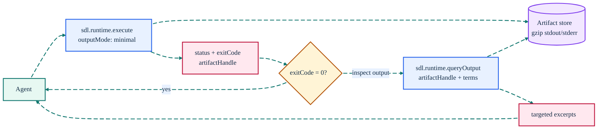

# Sandboxed Runtime Execution

[Back to README](../../README.md)

---

## Run Commands Under Governance

`sdl.runtime.execute` lets agents run repo-scoped commands under SDL-MCP policy instead of falling back to unrestricted shell access.

This is the preferred execution path for SDL-enforced agent workflows. In Code Mode, agents should normally call it through `runtimeExecute` inside `sdl.workflow`.

---

## Supported Runtimes (16)

SDL-MCP is Windows-first but supports all major platforms (Windows, Linux, macOS). The following runtimes are supported:

### Interpreted Runtimes

| Runtime | Typical executable | Common uses |
|:--------|:-------------------|:------------|
| `node` | `node` or `bun` | JavaScript tests, scripts, build tooling |
| `typescript` | `tsx` / `ts-node` | TypeScript scripts without pre-compilation |
| `python` | `python3` / `python` | Tests, scripts, analysis, automation |
| `shell` | `bash` / `sh` / `cmd.exe` / `powershell` | General command execution |
| `ruby` | `ruby` | Ruby scripts and tests |
| `php` | `php` | PHP scripts |
| `perl` | `perl` | Perl scripts |
| `r` | `Rscript` | R scripts and analysis |
| `elixir` | `elixir` | Elixir scripts |

### Compiled Runtimes

| Runtime | Build step | Common uses |
|:--------|:-----------|:------------|
| `go` | `go run` | Go programs |
| `java` | `javac` then `java` | Java programs |
| `kotlin` | `kotlinc` then `kotlin` | Kotlin programs |
| `rust` | `rustc` then execute | Rust programs |
| `c` | `gcc` / `cl` then execute | C programs |
| `cpp` | `g++` / `cl` then execute | C++ programs |
| `csharp` | `dotnet-script` / `csc` | C# scripts/programs |

Compiled runtimes use a compile-then-execute workflow: SDL-MCP compiles the source, runs the resulting binary, then cleans up.

---

## Sandboxed Execution Flow



### Example: Two-phase test run

**Phase 1 — Execute:**

```json
{
  "repoId": "my-repo",
  "runtime": "node",
  "args": ["--test", "tests/auth.test.ts"],
  "outputMode": "minimal",
  "timeoutMs": 30000
}
```

**Response (~50 tokens):**

```json
{
  "status": "failure",
  "exitCode": 1,
  "signal": null,
  "durationMs": 4200,
  "outputLines": 312,
  "outputBytes": 18400,
  "artifactHandle": "runtime-my-repo-1774356909696-fc5aa1f22e33e17c"
}
```

**Phase 2 — Query (only if needed):**

```json
{
  "artifactHandle": "runtime-my-repo-1774356909696-fc5aa1f22e33e17c",
  "queryTerms": ["FAIL", "Error", "AssertionError"],
  "maxExcerpts": 5,
  "contextLines": 3
}
```

**Response:**

```json
{
  "artifactHandle": "runtime-my-repo-1774356909696-fc5aa1f22e33e17c",
  "excerpts": [
    {
      "lineStart": 45,
      "lineEnd": 51,
      "content": "  45| not ok 3 - authenticate() rejects expired tokens\n  46|   ---\n  47|   Error: AssertionError: expected 401 but got 200\n  ...",
      "source": "stdout"
    }
  ],
  "totalLines": 312,
  "totalBytes": 18400,
  "searchedStreams": ["stdout", "stderr"]
}
```

---

## sdl.runtime.queryOutput

Retrieves and searches stored runtime output artifacts on demand. Use this after an `outputMode: "minimal"` execution to inspect specific parts of the output without loading it all into context.

**Parameters:**

| Parameter | Type | Required | Description |
|:----------|:-----|:---------|:------------|
| `artifactHandle` | string | Yes | Handle returned by `sdl.runtime.execute` |
| `queryTerms` | string[] | Yes | Keywords to search for in the output |
| `maxExcerpts` | integer | No | Maximum excerpt windows to return (default: 10) |
| `contextLines` | integer | No | Lines of context around each match (default: 3) |
| `stream` | `"stdout"` \| `"stderr"` \| `"both"` | No | Which stream(s) to search (default: `"both"`) |

**Response:**

| Field | Type | Description |
|:------|:-----|:------------|
| `artifactHandle` | string | Echo of the requested handle |
| `excerpts` | array | Matched windows: `{lineStart, lineEnd, content, source}` |
| `totalLines` | integer | Total lines in the artifact |
| `totalBytes` | integer | Total bytes in the artifact |
| `searchedStreams` | string[] | Streams that were searched |


## Example

```json
{
  "repoId": "my-repo",
  "runtime": "node",
  "args": ["scripts/check.mjs"],
  "outputMode": "summary",
  "timeoutMs": 30000,
  "queryTerms": ["FAIL", "Error"],
  "maxResponseLines": 100
}
```

Example uses:

- `node` / `typescript` for JavaScript/TypeScript tests and scripts
- `python` for test helpers, analysis, and automation
- `go`, `rust`, `java`, `kotlin` for compiled language programs
- `shell` only when a shell wrapper is the right abstraction

---

## Configuration

```jsonc
{
  "runtime": {
    "enabled": true,
    // Default: ["node", "typescript", "python", "shell"]. Add more as needed from the 16 supported runtimes.
    "allowedRuntimes": ["node", "typescript", "python", "shell"],
    "maxDurationMs": 600000,
    "maxConcurrentJobs": 2,
    "maxStdoutBytes": 1048576,
    "maxStderrBytes": 262144,
    "maxArtifactBytes": 10485760,
    "artifactTtlHours": 24,
    // Whitelist additional executables beyond the runtime defaults
    "allowedExecutables": [],
    // Environment variables passed through to subprocesses
    "envAllowlist": ["NODE_ENV", "DATABASE_URL"]
  }
}
```

For enforced agent setups, this runtime block is generated automatically by:

```bash
sdl-mcp init --client <client> --enforce-agent-tools
```

---

## SDL-First Guidance

When SDL-MCP is configured for agent enforcement:

- prefer `runtimeExecute` in `sdl.workflow` over native shell tools
- prefer the two-phase pattern: `outputMode: "minimal"` then `sdl.runtime.queryOutput` on demand
- prefer structured query terms over dumping large output back to the model
- use `shell` only when a shell is necessary, not as the default runtime

---

## Related Docs

- [`sdl.runtime.execute`](../mcp-tools-detailed.md#sdlruntimeexecute)
- [`sdl.runtime.queryOutput`](../mcp-tools-detailed.md#sdlruntimequeryoutput)
- [Code Mode](./code-mode.md)
- [Governance & Policy](./governance-policy.md)

[Back to README](../../README.md)
