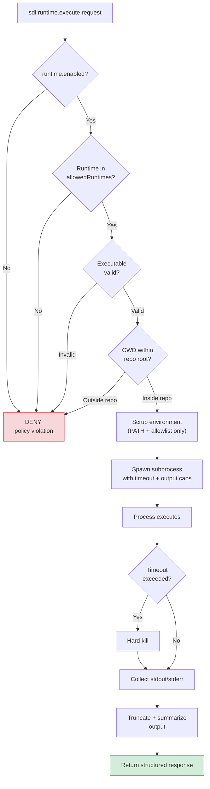

# Sandboxed Runtime Execution

[Back to README](../../README.md)

---

## Run Commands Under Governance

`sdl.runtime.execute` lets agents run repo-scoped commands under SDL-MCP policy instead of falling back to unrestricted shell access.

This is the preferred execution path for SDL-enforced agent workflows. In Code Mode, agents should normally call it through `runtimeExecute` inside `sdl.chain`.

---

## Supported Interpreted Runtimes

SDL-MCP is Windows-first but supports all major platforms (Windows, Linux, macOS). The following runtimes are supported:

| Runtime | Typical executable | Common uses |
|:--------|:-------------------|:------------|
| `node` | `node` or `bun` | JavaScript/TypeScript tests, scripts, build tooling |
| `python` | `python3` / `python` | Tests, scripts, analysis, automation |
| `shell` | `bash` / `sh` / `cmd.exe` / `powershell` | General command execution when a shell is actually needed |

---

## Sandboxed Execution Flow



## Security Model

Every runtime request passes through SDL-MCP governance:

1. feature gate: `runtime.enabled`
2. allowed runtime check
3. executable compatibility validation
4. repo-scoped cwd enforcement
5. env scrubbing
6. timeout and output caps
7. concurrency limits

This keeps command execution consistent with SDL policy rather than depending on client-native shell permissions.

---

## Example

```json
{
  "repoId": "my-repo",
  "runtime": "node",
  "args": ["scripts/check.mjs"],
  "timeoutMs": 30000,
  "queryTerms": ["FAIL", "Error"],
  "maxResponseLines": 100
}
```

Example uses:

- `node` for JavaScript/TypeScript tests and scripts
- `python` for test helpers and analysis
- `shell` only when a shell wrapper is the right abstraction

---

## Configuration

```jsonc
{
  "runtime": {
    "enabled": true,
    "allowedRuntimes": ["node", "python", "shell"],
    "maxDurationMs": 30000,
    "maxConcurrentJobs": 2,
    "maxStdoutBytes": 1048576,
    "maxStderrBytes": 262144,
    "maxArtifactBytes": 10485760
  }
}
```

For enforced agent setups, this runtime block is generated automatically by:

```bash
sdl-mcp init --client <client> --enforce-agent-tools
```

---

## SDL-First Guidance

When SDL-MCP is configured for agent enforcement:

- prefer `runtimeExecute` in `sdl.chain` over native shell tools
- prefer structured query terms over dumping large output back to the model
- use `shell` only when a shell is necessary, not as the default runtime

---

## Related Docs

- [`sdl.runtime.execute`](../mcp-tools-detailed.md#sdlruntimeexecute)
- [Code Mode](./code-mode.md)
- [Governance & Policy](./governance-policy.md)

[Back to README](../../README.md)
