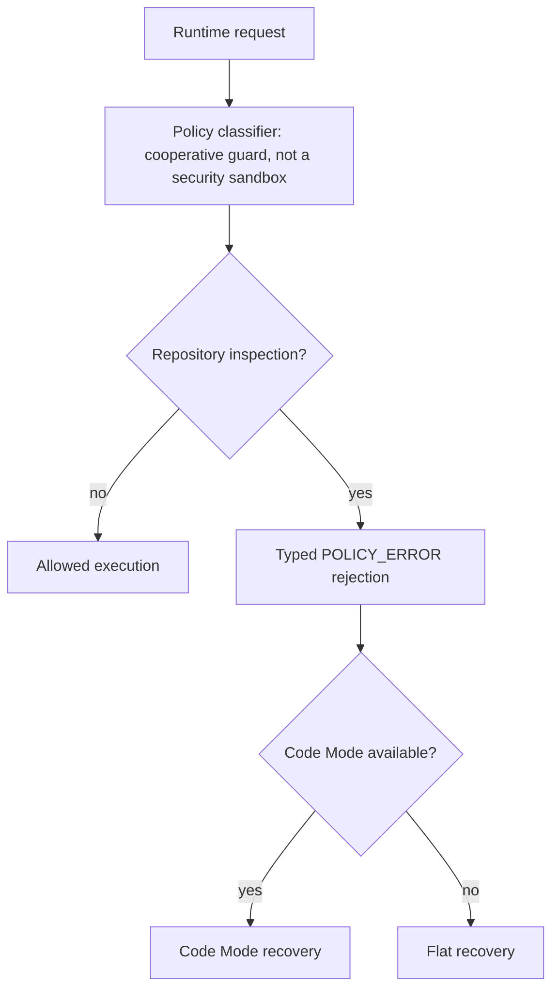
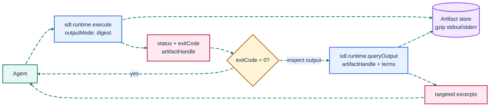

# Sandboxed Runtime Execution

[Back to README](../../README.md)

---

## Run Commands Under Governance

`sdl.runtime.execute` executes repository tooling under SDL-MCP policy instead of falling back to unrestricted shell access. Permitted uses include build, test, lint, compiler, named scripts, and targeted edit scripts. Do not use runtime execution to inspect, search, or print repository files: use `sdl.context` or `sdl.retrieve` for indexed source and `sdl.file` with `op="read"` for other files.

This is the preferred execution path for SDL-enforced agent workflows. In Code Mode, agents should normally call it through `runtimeExecute` inside `sdl.workflow`.

Use the optional `stdin` field for multiline scripts, large command input, or
quote-heavy payloads. SDL-MCP writes it to the child process as UTF-8, closes
stdin, reports `stdinBytes` and `stdinSha256`, and does not echo the full input
in visible output or persisted logs. The limit is 512 KiB.

For `runtime: "node"`, inline `code` always runs as ESM regardless of the
repository's module type: SDL-MCP pipes it to `node --input-type=module`
(or a temp `.mjs` file when the request also supplies `stdin`). Write ESM
snippets. Bare `require()` fails with `require is not defined in ES module
scope`; use `import { createRequire } from "node:module"` only when a
CommonJS dependency is unavoidable. Use args-only execution such as
`args: ["-e", "..."]` only when you specifically need a CommonJS-style
`require` one-liner.

```json
{
  "runtime": "node",
  "code": "process.stdin.pipe(process.stdout);",
  "stdin": "runtime input\n"
}
```

### Repository inspection guard

The runtime guard is cooperative and precision-first: it rejects only
high-confidence attempts to inspect, search, or print files inside the current
repository before user code runs. It is not a general content scanner or a
security boundary, and it does not inspect every possible execution path.
There is no per-call bypass for a detected repository inspection. Disable
runtime execution when a security boundary is required.

The deterministic rejection message is:

```text
RUNTIME_REPOSITORY_INSPECTION_DISALLOWED: runtimeExecute executes repository tooling and cannot inspect repository files. Use sdl.context or sdl.retrieve for indexed source; use sdl.file with op="read" for non-indexed files.
```

Direct `sdl.runtime.execute` calls return `isError: true` with the typed error
`{ message, code: "POLICY_ERROR", classification: "policy_denied", retryable: false }`.
In `sdl.workflow`, the `runtimeExecute` step carries the same typed error with
`status: "error"`, and the top-level response sets `isError: true`.
`onError: "stop"` skips later steps, `"continue"` runs independent later
steps and skips dependency-blocked ones, and `"continueAll"` attempts later
steps. The guard never exposes the matched command, path, or source text.

When Code Mode is unavailable, read non-indexed files with `sdl.file.read`.
For indexed source, use the flat ladder: `sdl.repo.overview`,
`sdl.symbol.search` / `sdl.symbol.getCard`, `sdl.slice.build`, then
`sdl.code.getSkeleton`, `sdl.code.getHotPath`, or a justified
`sdl.code.needWindow` as appropriate.

The flowchart summarizes the recovery route. It describes a cooperative guard,
not a security sandbox.


```mermaid
flowchart TD
    Request["Runtime request"] --> Guard["Policy classifier: cooperative guard, not a security sandbox"]
    Guard --> Inspect{"Repository inspection?"}
    Inspect -->|no| Allowed["Allowed execution"]
    Inspect -->|yes| Rejected["Typed POLICY_ERROR rejection"]
    Rejected --> Mode{"Code Mode available?"}
    Mode -->|yes| CodeMode["Code Mode recovery"]
    Mode -->|no| Flat["Flat recovery"]
```

---

## Supported Runtimes (17)

SDL-MCP is Windows-first but supports all major platforms (Windows, Linux, macOS). The following runtimes are supported:

### Interpreted Runtimes

| Runtime | Typical executable | Common uses |
|:--------|:-------------------|:------------|
| `node` | `node` or `bun` | JavaScript tests, scripts, build tooling |
| `typescript` | `tsx` / `ts-node` | TypeScript scripts without pre-compilation |
| `python` | `python3` / `python` | Tests, scripts, analysis, automation |
| `shell` | `bash` / `sh` / `cmd.exe` | General command execution |
| `powershell` | `powershell.exe` / `pwsh` | PowerShell scripts and Windows-first automation |
| `ruby` | `ruby` | Ruby scripts and tests |
| `php` | `php` | PHP scripts |
| `perl` | `perl` | Perl scripts |
| `r` | `Rscript` | R scripts and analysis |
| `elixir` | `elixir` | Elixir scripts |

### Compiled Runtimes

| Runtime | Build step | Common uses |
|:--------|:-----------|:------------|
| `go` | `go run` | Go programs |
| `java` | `javac` then `java` | Java programs |
| `kotlin` | `kotlinc` then `kotlin` | Kotlin programs |
| `rust` | `rustc` then execute | Rust programs |
| `c` | `gcc` / `cl` then execute | C programs |
| `cpp` | `g++` / `cl` then execute | C++ programs |
| `csharp` | `dotnet-script` / `csc` | C# scripts/programs |

Compiled runtimes use a compile-then-execute workflow: SDL-MCP compiles the source, runs the resulting binary, then cleans up.

When `persistOutput` is enabled, compiler failures use the same artifact store, and runtimes that fail before emitting output persist a small stderr marker. This keeps noisy TS/Rust/C/C++ failures and early failure phases queryable by artifact handle. With `persistOutput: false`, SDL-MCP stores no runtime output artifact and returns no artifact handle.


## Output Modes

Use `outputMode: "digest"` for build, test, lint, and other noisy diagnostics. The digest parses common tool output into a compact `digest` object and keeps `stdoutSummary` short. When `persistOutput` is enabled, it also leaves full stdout/stderr behind an `artifactHandle` for `sdl.runtime.queryOutput`.

Use `outputMode: "minimal"` when exit status and metadata are enough. Use `outputMode: "intent"` when you already know the terms that define success or failure. If the digest omits the detail you need, query the artifact with focused `queryTerms` or a `lineRange`; do not rerun the command just to print full output.

Runtime stdout/stderr handles are retrieved with `sdl.runtime.queryOutput`. They are distinct from large tool-response handles: retrieve those with `sdl.response.get`, selecting `full: true`, `jsonPath`, or `raw: true` explicitly for JSON response artifacts.

---

## Sandboxed Execution Flow


```mermaid
%%{init: {"theme":"base","themeVariables":{"background":"#ffffff","primaryColor":"#E7F8F2","primaryBorderColor":"#0F766E","primaryTextColor":"#102A43","secondaryColor":"#E8F1FF","secondaryBorderColor":"#2563EB","secondaryTextColor":"#102A43","tertiaryColor":"#FFF4D6","tertiaryBorderColor":"#B45309","tertiaryTextColor":"#102A43","lineColor":"#0F766E","textColor":"#102A43","fontFamily":"Inter, ui-sans-serif, system-ui, -apple-system, BlinkMacSystemFont, Segoe UI, sans-serif"},"flowchart":{"curve":"basis","htmlLabels":true}}}%%
flowchart LR
    Agent["Agent"]
    Execute["sdl.runtime.execute<br/>outputMode: digest"]
    Store[("Artifact store<br/>gzip stdout/stderr")]
    Status["status + exitCode<br/>artifactHandle"]
    Decision{"exitCode = 0?"}
    Query["sdl.runtime.queryOutput<br/>artifactHandle + terms"]
    Excerpts["targeted excerpts"]

    Agent e1@--> Execute
    Execute e2@--> Store
    Execute e3@--> Status
    Status e4@--> Decision
    Decision e5@-->|yes| Agent
    Decision e6@-->|inspect output| Query
    Query e7@--> Store
    Query e8@--> Excerpts
    Excerpts e9@--> Agent

    classDef source fill:#E7F8F2,stroke:#0F766E,stroke-width:2px,color:#102A43;
    classDef process fill:#E8F1FF,stroke:#2563EB,stroke-width:2px,color:#102A43;
    classDef decision fill:#FFF4D6,stroke:#B45309,stroke-width:2px,color:#102A43;
    classDef storage fill:#F2E8FF,stroke:#7C3AED,stroke-width:2px,color:#102A43;
    classDef output fill:#FFE8EF,stroke:#BE123C,stroke-width:2px,color:#102A43;
    classDef muted fill:#F8FAFC,stroke:#64748B,stroke-width:1px,color:#102A43;
    classDef animate stroke:#0F766E,stroke-width:2px,stroke-dasharray:10\,5,stroke-dashoffset:900,animation:dash 22s linear infinite;
    class Agent source;
    class Execute,Query process;
    class Store storage;
    class Decision decision;
    class Status,Excerpts output;
    class e1,e2,e3,e4,e5,e6,e7,e8,e9 animate;
```

### Example: Two-phase test run

**Phase 1 — Execute:**

```json
{
  "repoId": "my-repo",
  "runtime": "node",
  "args": ["--test", "tests/auth.test.ts"],
  "outputMode": "digest",
  "timeoutMs": 30000
}
```

**Response (digest plus metadata):**

```json
{
  "status": "failure",
  "exitCode": 1,
  "signal": null,
  "durationMs": 4200,
  "stdoutSummary": "1 failing test: authenticate() rejects expired tokens",
  "stderrSummary": "",
  "digest": {
    "kind": "node-test",
    "ok": false,
    "summary": "1 failing test: authenticate() rejects expired tokens",
    "failures": [
      {
        "name": "authenticate() rejects expired tokens",
        "message": "AssertionError: expected 401 but got 200"
      }
    ]
  },
  "artifactHandle": "runtime-my-repo-1774356909696-fc5aa1f22e33e17c",
  "truncation": {
    "stdoutTruncated": false,
    "stderrTruncated": false,
    "totalStdoutBytes": 18400,
    "totalStderrBytes": 0
  },
  "nextAction": {
    "kind": "queryOutput",
    "action": "runtime.queryOutput",
    "message": "Query the failure artifact with runtime.queryOutput.",
    "queryTerms": ["error", "failed", "exception"]
  }
}
```

**Phase 2 — Query (only if needed):**

```json
{
  "artifactHandle": "runtime-my-repo-1774356909696-fc5aa1f22e33e17c",
  "queryTerms": ["FAIL", "Error", "AssertionError"],
  "maxExcerpts": 5,
  "contextLines": 3
}
```

**Response:**

```json
{
  "artifactHandle": "runtime-my-repo-1774356909696-fc5aa1f22e33e17c",
  "excerpts": [
    {
      "lineStart": 45,
      "lineEnd": 51,
      "content": "  45| not ok 3 - authenticate() rejects expired tokens\n  46|   ---\n  47|   Error: AssertionError: expected 401 but got 200\n  ...",
      "source": "stdout"
    }
  ],
  "totalLines": 312,
  "totalBytes": 18400,
  "searchedStreams": ["stdout", "stderr"],
  "matchStatus": "matched",
  "matchCount": 1
}
```

If the running server detects that runtime-critical source files are newer than built `dist` files, `sdl.runtime.execute` includes `serverDriftWarnings`. `repo.status` and JSON `sdl.manual` also expose `serverInfo` with version, start time, and drift warnings.

---

## sdl.runtime.queryOutput

Retrieves and searches stored runtime output artifacts on demand. Use this after an `outputMode: "digest"` or `outputMode: "minimal"` execution to inspect specific parts of the output without loading it all into context.

**Parameters:**

| Parameter | Type | Required | Description |
|:----------|:-----|:---------|:------------|
| `artifactHandle` | string | Yes | Handle returned by `sdl.runtime.execute` |
| `queryTerms` | string[] | Yes, unless `lineRange` is set | Keywords to search for in the output |
| `cursor` | object | No | Resume a prior search from `{stream, afterLine}` returned as `nextCursor` |
| `lineRange` | object | No | Return an exact `{stream, startLine, endLine}` without keyword matching |
| `maxExcerpts` | integer | No | Maximum excerpt windows to return (default: 10) |
| `contextLines` | integer | No | Lines of context around each match (default: 3) |
| `stream` | `"stdout"` \| `"stderr"` \| `"both"` | No | Which stream(s) to search (default: `"both"`) |

**Response:**

| Field | Type | Description |
|:------|:-----|:------------|
| `artifactHandle` | string | Echo of the requested handle |
| `excerpts` | array | Matched windows: `{lineStart, lineEnd, content, source}` |
| `totalLines` | integer | Total lines in the artifact |
| `totalBytes` | integer | Total bytes in the artifact |
| `searchedStreams` | string[] | Streams that were searched |
| `matchStatus` | `"matched"` \| `"noMatchFallback"` \| `"lineRange"` | Whether excerpts came from term matches, fallback preview, or an exact range |
| `matchCount` | integer | Number of matching lines after the cursor; `0` means no query terms matched |
| `nextCursor` | object | Cursor for the next page when more matches exist |

Set `stream` to `"stdout"`, `"stderr"`, or `"both"` to control the search scope. When a response includes `nextAction`, replay its action and arguments unchanged.


## Example

```json
{
  "repoId": "my-repo",
  "runtime": "node",
  "args": ["scripts/check.mjs"],
  "outputMode": "digest",
  "timeoutMs": 30000,
  "queryTerms": ["FAIL", "Error"],
  "maxResponseLines": 100
}
```

Example uses:

- `node` / `typescript` for JavaScript/TypeScript tests and scripts
- `python` for test helpers, analysis, and automation
- `go`, `rust`, `java`, `kotlin` for compiled language programs
- `shell` only when a shell wrapper is the right abstraction

---

## Configuration

```jsonc
{
  "runtime": {
    "enabled": true,
    // Default: ["node", "typescript", "python", "shell", "powershell"]. Add more as needed from the 17 supported runtimes.
    "allowedRuntimes": ["node", "typescript", "python", "shell", "powershell"],
    "maxDurationMs": 600000,
    "maxConcurrentJobs": 2,
    "maxStdoutBytes": 1048576,
    "maxStderrBytes": 262144,
    "maxArtifactBytes": 10485760,
    "artifactTtlHours": 24,
    // Whitelist additional executables beyond the runtime defaults
    "allowedExecutables": [],
    // Environment variables passed through to subprocesses
    "envAllowlist": ["NODE_ENV", "DATABASE_URL"]
  }
}
```

For enforced agent setups, this runtime block is generated automatically by:

```bash
sdl-mcp init --client <client> --enforce-agent-tools
```

---

## SDL-First Guidance

When SDL-MCP is configured for agent enforcement:

- prefer `runtimeExecute` in `sdl.workflow` over native shell tools
- prefer the two-phase pattern: `outputMode: "digest"` then `sdl.runtime.queryOutput` on demand
- use `stdin` instead of PowerShell here-strings, multiline `node -e`, base64 decode/eval, or filesystem write scripts for multiline input
- on Windows PowerShell, prefer `npm.cmd` for npm scripts when the `npm.ps1` shim emits `$LASTEXITCODE` noise
- prefer structured query terms over dumping large output back to the model
- use `shell` only when a shell is necessary, not as the default runtime

---

## Related Docs

- [`sdl.runtime.execute`](../mcp-tools-detailed.md#sdlruntimeexecute)
- [`sdl.runtime.queryOutput`](../mcp-tools-detailed.md#sdlruntimequeryoutput)
- [Code Mode](./code-mode.md)
- [Token Economy](./token-economy.md)
- [Governance & Policy](./governance-policy.md)

[Back to README](../../README.md)
