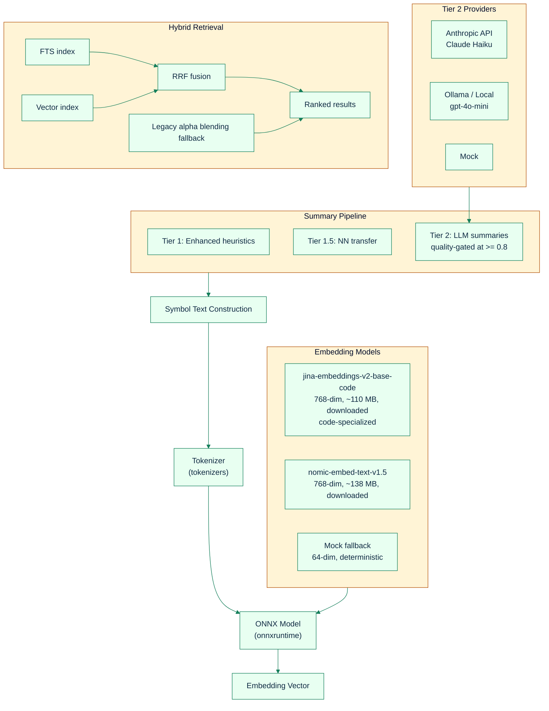
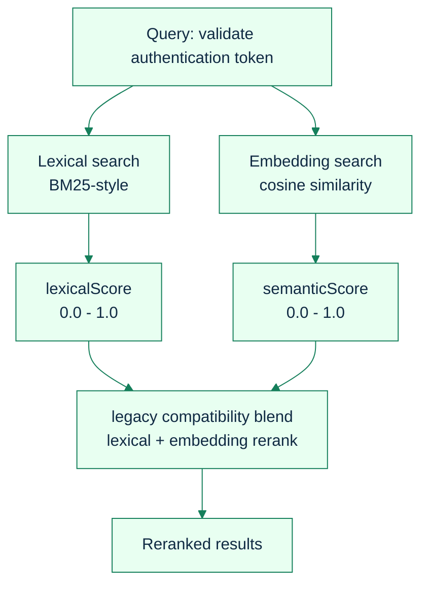
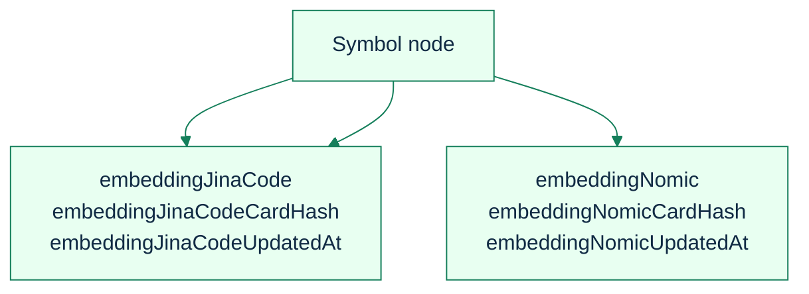

# Semantic Embeddings: Dependencies & Setup Guide

[Back to README](../../README.md) | [Semantic Engine Deep Dive](./semantic-engine.md) | [Configuration Reference](../configuration-reference.md)

---

SDL-MCP's semantic system has three layers — **embedding models**, **LLM summary generation**, and **pass-2 call resolution** — each with its own dependencies and setup. This guide covers installation, configuration, and verification for every tier and provider.

---

## Architecture Overview



## Required vs Optional Dependencies

| Dependency            | npm Package        | Version   | Required? | Purpose                              |
| :-------------------- | :----------------- | :-------- | :-------- | :----------------------------------- |
| ONNX Runtime          | `onnxruntime-node` | `^1.24.3` | Optional  | Run embedding model inference (CPU)  |
| HuggingFace Tokenizer | `tokenizers`       | `^0.13.3` | Optional  | Tokenize text for ONNX models        |
| Jina Code Model       | bundled            | —         | Included  | 768-dim code-optimized embeddings    |
| Nomic Model           | downloaded         | —         | Optional  | 768-dim high-quality text embeddings |
| Jina Code Model       | downloaded         | —         | Optional  | 768-dim code-specialized embeddings  |
| Anthropic API Key     | —                  | —         | Optional  | LLM summary generation (High tier)   |
| Ollama Server         | —                  | —         | Optional  | Local LLM summary generation         |

**Without the optional dependencies**, SDL-MCP still works — embeddings fall back to a deterministic 64-dim mock. Semantic search will function but with lower quality results.

---

## Quick Setup by Tier

### Tier 1: Low (Free, Bundled — Default)

The default configuration. Uses the bundled Jina Code model with symbol text enriched by enhanced per-kind heuristic summaries. No LLM summaries.

Enhanced heuristics are always active, generating pattern-matched summaries for all symbol kinds (class, interface, type, enum, variable, constructor) in addition to the existing typed function/method summaries. When `semantic.enabled: true`, NN summary transfer also runs automatically, propagating documentation from well-documented neighbors to undocumented symbols via embedding similarity.

**Step 1 — Install ONNX dependencies:**

```bash
cd sdl-mcp
npm install onnxruntime-node tokenizers
```

**Step 2 — Verify the bundled model exists:**

```bash
npx sdl-mcp doctor
```

Look for:

```
Semantic embedding models .................. PASS
  onnxruntime-node: 1.24.x
  tokenizers: available
  model: jina-embeddings-v2-base-code (768d, files present)
```

**Step 3 — Config (optional — this is the default):**

```jsonc
// sdl-mcp.config.json
{
  "semantic": {
    "enabled": true,
    "provider": "local",
    "model": "jina-embeddings-v2-base-code",
  },
}
```

**Step 4 — Index your repository:**

```bash
npx sdl-mcp index --repo-id my-repo
```

Embeddings are generated during the finalization step of indexing. Subsequent searches with `semantic: true` will use them.

**How text is constructed for Jina Code:**

Jina payloads use a structured, labeled-section format optimized for code models:

```
function validateToken (TypeScript)
File: src/auth/jwt.ts
Exported: true
Signature: (token: string, opts?: ValidateOpts) => Promise<DecodedToken>
Summary: Validates JWT signature and checks expiration claim
Imports: jsonwebtoken, JwtOptions
Calls: verify (function), isExpired (function)
Terms: validate, token, jwt, auth
```

Includes graph context (imports/calls made by the symbol) and search terms. See [Model-Aware Embedding Payloads](./semantic-engine.md#model-aware-embedding-payloads) for details.

---

### Tier 2: Medium (Free, Downloaded)

Uses the higher-quality Nomic text embedding model. Better semantic matching thanks to 768 dimensions and an 8,192-token context window (both have 768-dim but Nomic has different training focus). Still fully offline — no LLM API calls needed.

**Step 1 — Install ONNX dependencies (if not already):**

```bash
npm install onnxruntime-node tokenizers
```

**Step 2 — Download the Nomic model (~138 MB):**

Option A — Pre-download via script:

```bash
node scripts/download-models.mjs nomic-embed-text-v1.5
```

Option B — Let SDL-MCP download on first use (automatic):
The model is fetched from HuggingFace on the first embedding call during indexing. No manual step needed, but the first index run will take longer.

**Where files are stored:**

| Platform | Path                                                   |
| :------- | :----------------------------------------------------- |
| Windows  | `%LOCALAPPDATA%\sdl-mcp\models\nomic-embed-text-v1.5\` |
| macOS    | `~/.cache/sdl-mcp/models/nomic-embed-text-v1.5/`       |
| Linux    | `~/.cache/sdl-mcp/models/nomic-embed-text-v1.5/`       |
| Custom   | Set `semantic.modelCacheDir` in config                 |

**What gets downloaded:**

| File                   | Source                                                                                                      | Size    |
| :--------------------- | :---------------------------------------------------------------------------------------------------------- | :------ |
| `model_quantized.onnx` | [HuggingFace](https://huggingface.co/nomic-ai/nomic-embed-text-v1.5/resolve/main/onnx/model_quantized.onnx) | ~138 MB |
| `tokenizer.json`       | [HuggingFace](https://huggingface.co/nomic-ai/nomic-embed-text-v1.5/resolve/main/tokenizer.json)            | ~700 KB |
| `config.json`          | [HuggingFace](https://huggingface.co/nomic-ai/nomic-embed-text-v1.5/resolve/main/config.json)               | ~1 KB   |

**Step 3 — Configure:**

```jsonc
// sdl-mcp.config.json
{
  "semantic": {
    "enabled": true,
    "provider": "local",
    "model": "nomic-embed-text-v1.5",
  },
}
```

**Step 4 — Re-index to generate new embeddings:**

```bash
npx sdl-mcp index --repo-id my-repo --mode full
```

A full re-index is needed when switching models because the embedding dimensions change (384 ? 768).

**Step 5 — Verify:**

```bash
npx sdl-mcp doctor
```

Look for:

```
Semantic embedding models .................. PASS
  onnxruntime-node: 1.24.x
  tokenizers: available
  model: nomic-embed-text-v1.5 (768d, files present)
```

**How text is constructed for Nomic:**

Nomic payloads use flowing prose optimized for natural-language models:

```
validateToken is a function in src/auth/jwt.ts that validates JWT signature
and checks expiration claim. It takes (token: string, opts?: ValidateOpts)
=> Promise<DecodedToken>. It imports jsonwebtoken, JwtOptions and calls
verify, isExpired. Related terms: validate, token, jwt, auth.
```

Includes the same graph context as Jina but formatted as English sentences. The Nomic model's 8,192-token window captures longer summaries without truncation. See [Model-Aware Embedding Payloads](./semantic-engine.md#model-aware-embedding-payloads) for details.

---

### Tier 2b: Medium — Code-Specialized (Free, Downloaded)

Uses the **jina-embeddings-v2-base-code** model, which is trained specifically on source code across 30+ programming languages. Same 768 dimensions and 8,192-token context window as Nomic, but optimized for code retrieval rather than general text. Best choice when your primary use case is searching code rather than documentation.

**Step 1 — Install ONNX dependencies (if not already):**

```bash
npm install onnxruntime-node tokenizers
```

**Step 2 — Download the Jina Code model (~110 MB):**

Option A — Pre-download via script:

```bash
node scripts/download-models.mjs jina-embeddings-v2-base-code
```

Option B — Let SDL-MCP download on first use (automatic):
The model is fetched from HuggingFace on the first embedding call during indexing.

**Where files are stored:**

| Platform | Path                                                          |
| :------- | :------------------------------------------------------------ |
| Windows  | `%LOCALAPPDATA%\sdl-mcp\models\jina-embeddings-v2-base-code\` |
| macOS    | `~/.cache/sdl-mcp/models/jina-embeddings-v2-base-code/`       |
| Linux    | `~/.cache/sdl-mcp/models/jina-embeddings-v2-base-code/`       |
| Custom   | Set `semantic.modelCacheDir` in config                        |

**What gets downloaded:**

| File                   | Source                                                                                                           | Size    |
| :--------------------- | :--------------------------------------------------------------------------------------------------------------- | :------ |
| `model_quantized.onnx` | [HuggingFace](https://huggingface.co/jinaai/jina-embeddings-v2-base-code/resolve/main/onnx/model_quantized.onnx) | ~110 MB |
| `tokenizer.json`       | [HuggingFace](https://huggingface.co/jinaai/jina-embeddings-v2-base-code/resolve/main/tokenizer.json)            | ~700 KB |
| `config.json`          | [HuggingFace](https://huggingface.co/jinaai/jina-embeddings-v2-base-code/resolve/main/config.json)               | ~1 KB   |

**Step 3 — Configure:**

```jsonc
// sdl-mcp.config.json
{
  "semantic": {
    "enabled": true,
    "provider": "local",
    "model": "jina-embeddings-v2-base-code",
  },
}
```

**Step 4 — Re-index to generate new embeddings:**

```bash
npx sdl-mcp index --repo-id my-repo --mode full
```

A full re-index is needed when switching models because the embedding dimensions and model semantics change.

**Step 5 — Verify:**

```bash
npx sdl-mcp doctor
```

Look for:

```
Semantic embedding models .................. PASS
  onnxruntime-node: 1.24.x
  tokenizers: available
  model: jina-embeddings-v2-base-code (768d, files present)
```

**When to choose Jina Code over Nomic:**

- Your codebase is primarily source code with minimal prose documentation
- You work across multiple programming languages (Jina Code was trained on 30+ languages)
- You want better code-to-code similarity matching (e.g., finding similar implementations)

**When to choose Nomic over Jina Code:**

- Your queries are natural-language descriptions (e.g., "find the authentication handler")
- Your codebase has rich documentation, comments, and summaries
- You're using LLM-generated summaries (Tier 3) — Nomic handles natural-language summaries better

> **Note**: Unlike Nomic, the Jina Code model does not use document/query prefixes. Text is embedded as-is.

---

### Tier 3: High (API Tokens Required)

Adds LLM-generated natural-language summaries (quality 0.8) to any embedding model. Jina Code and Nomic both benefit from richer symbol text. For maximum quality with natural-language queries, pair summaries with `nomic-embed-text-v1.5`. For code-centric queries, pair with `jina-embeddings-v2-base-code`. Produces the highest quality semantic search results because the LLM distills code meaning into plain English that embedding models handle well.

The LLM stage is quality-gated: symbols that already have `summaryQuality >= 0.8` (e.g., from JSDoc extraction) are automatically skipped, avoiding redundant API calls. In practice, this means well-documented codebases spend less on LLM summaries while undocumented symbols get the most attention.

Choose one of three LLM providers:

#### Option A: Anthropic API (Claude Haiku)

**Step 1 — Get an API key:**

Sign up at [console.anthropic.com](https://console.anthropic.com) and create an API key.

**Step 2 — Set the API key:**

Option A — Environment variable:

```bash
export ANTHROPIC_API_KEY=sk-ant-api03-...
```

Option B — Config file:

```jsonc
{
  "semantic": {
    "summaryApiKey": "sk-ant-api03-...",
  },
}
```

**Step 3 — Configure:**

```jsonc
// sdl-mcp.config.json — use either embedding model; both benefit from summaries
{
  "semantic": {
    "enabled": true,
    "provider": "local",
    "model": "nomic-embed-text-v1.5",
    "generateSummaries": true,
    "summaryProvider": "api",
    "summaryModel": "claude-haiku-4-5-20251001",
    "summaryMaxConcurrency": 5,
    "summaryBatchSize": 20,
  },
}
```

> **Tip:** For maximum quality with natural-language queries, pair summaries with `nomic-embed-text-v1.5`. For code-centric queries, the default `jina-embeddings-v2-base-code` is very effective.

**Step 4 — Index (summaries generated during finalization):**

```bash
npx sdl-mcp index --repo-id my-repo
```

**Cost estimate:** ~$2 per 1M tokens. A typical symbol summary uses ~50-100 input tokens and ~30-50 output tokens. For a 1,000-symbol repository: roughly $0.15–$0.30.

**Default model:** `claude-haiku-4-5-20251001`

Other supported models (any Anthropic model works):

- `claude-sonnet-4-20250514` (higher quality, higher cost)
- `claude-haiku-4-5-20251001` (recommended — best quality/cost ratio)

#### Option B: Ollama (Local, Free)

Run an OpenAI-compatible LLM server locally. No API costs, but requires a machine with enough RAM.

**Step 1 — Install Ollama:**

Download from [ollama.com](https://ollama.com/download) and install for your platform.

**Step 2 — Pull a model:**

```bash
ollama pull llama3.2:3b       # Lightweight (~2GB RAM)
# or
ollama pull qwen2.5-coder:7b  # Better for code (~5GB RAM)
# or
ollama pull gpt-4o-mini       # If available via compatible API
```

**Step 3 — Start the server (if not auto-started):**

```bash
ollama serve
```

Ollama runs an OpenAI-compatible API at `http://localhost:11434/v1` by default.

**Step 4 — Configure:**

```jsonc
// sdl-mcp.config.json
{
  "semantic": {
    "enabled": true,
    "provider": "local",
    "model": "jina-embeddings-v2-base-code",
    "generateSummaries": true,
    "summaryProvider": "local",
    "summaryModel": "llama3.2:3b",
    "summaryApiBaseUrl": "http://localhost:11434/v1",
    "summaryMaxConcurrency": 2,
    "summaryBatchSize": 10,
  },
}
```

> Lower `summaryMaxConcurrency` (2-3) and `summaryBatchSize` (10) for local models to avoid overwhelming a single GPU/CPU.

**Step 5 — Index:**

```bash
npx sdl-mcp index --repo-id my-repo
```

#### Option C: Any OpenAI-Compatible API

Any server implementing the `/v1/chat/completions` endpoint works — LM Studio, vLLM, text-generation-inference, etc.

**Configure:**

```jsonc
{
  "semantic": {
    "generateSummaries": true,
    "summaryProvider": "local",
    "summaryModel": "your-model-name",
    "summaryApiKey": "your-api-key",
    "summaryApiBaseUrl": "http://your-server:8080/v1",
  },
}
```

The `summaryProvider: "local"` value sends OpenAI-format requests (`POST /chat/completions`) to the configured base URL.

---

## Model Comparison

| Property              | `jina-embeddings-v2-base-code` (default) | `nomic-embed-text-v1.5` (optional)     |
| :-------------------- | :--------------------------------------- | :------------------------------------- | :--------------------------- |
| Dimensions            | 384                                      | 768                                    | 768                          |
| Max input tokens      | 256                                      | 8,192                                  | 8,192                        |
| ONNX file size        | ~110 MB (INT8)                           | ~138 MB (INT8)                         | ~110 MB (INT8)               |
| Bundled with npm      | Yes                                      | No, downloaded on demand               | No, downloaded on demand     |
| Training data         | English sentence embeddings              | Diverse text embeddings                | Source code (30+ languages)  |
| Input format          | Natural-language symbol text             | Natural-language symbol text           | Natural-language symbol text |
| Document/query prefix | None                                     | `search_document: ` / `search_query: ` | None                         |
| Best paired with      | LLM summaries                            | LLM summaries (NL queries)             | Code-centric queries         |
| Disk location         | `<pkg>/models/`                          | `<cache>/models/`                      | `<cache>/models/`            |
| Upstream source       | `sentence-transformers`                  | `nomic-ai`                             | `jinaai`                     |

**Choosing a model:**

- **Jina Code** — Zero setup, bundled, optimized for code. Has 8192-token context so handles long functions well.
- **Nomic** — Best for natural-language queries ("find the auth handler") and when using LLM summaries. Its 8,192-token window captures longer signatures and documentation.
- **Jina Code** — Best for code-to-code similarity and multi-language codebases. Trained directly on source code from 30+ languages, so it understands code structure natively without needing natural-language summaries.

## Summary Provider Comparison

| Provider           | Config value | Default model               | Endpoint                                     | Auth                                   | Cost                 |
| :----------------- | :----------- | :-------------------------- | :------------------------------------------- | :------------------------------------- | :------------------- |
| **Anthropic**      | `"api"`      | `claude-haiku-4-5-20251001` | `https://api.anthropic.com/v1/messages`      | `ANTHROPIC_API_KEY` or `summaryApiKey` | ~$2/1M tokens        |
| **Ollama / Local** | `"local"`    | `gpt-4o-mini`               | `http://localhost:11434/v1/chat/completions` | Optional (default: `"ollama"`)         | Free (local compute) |
| **Mock**           | `"mock"`     | —                           | None                                         | None                                   | Free                 |

**API format differences:**

- `"api"` sends Anthropic Messages API format (`x-api-key` header, `anthropic-version` header)
- `"local"` sends OpenAI Chat Completions format (`Authorization: Bearer` header)

**System prompt used for all providers:**

> "You are a code documentation assistant. Write a 1-3 sentence summary of what this TypeScript/JavaScript symbol does. Be specific, not generic. Focus on behavior, not structure."

---

## Semantic Search: How It Works

When you call `sdl.symbol.search` with `semantic: true` in legacy mode, SDL-MCP uses a compatibility alpha-blended rerank after lexical and embedding search:



Hybrid retrieval is the recommended default. The legacy path remains available through `semantic.retrieval.mode: "legacy"`, but the current recommended configuration surface is the hybrid pipeline under `semantic.retrieval.*`.


## Hybrid Retrieval Setup

Hybrid retrieval replaces the legacy alpha-blending search with native Ladybug FTS + vector indexes fused via Reciprocal Rank Fusion (RRF). It is controlled by `semantic.retrieval.mode`.

### Enabling Hybrid Retrieval

```jsonc
{
  "semantic": {
    "enabled": true,
    "retrieval": {
      "mode": "hybrid", // "hybrid" (default) or "legacy"
      "fts": {
        "enabled": true, // Full-text search on Symbol.searchText
        "indexName": "symbol_search_text_v1",
        "topK": 75, // Max FTS candidates
        "conjunctive": false, // true = AND all terms; false = OR
      },
      "vector": {
        "enabled": true, // Vector search on inline embeddings
        "topK": 75, // Max candidates per model
        "efs": 200, // Query-time accuracy parameter
      },
      "fusion": {
        "strategy": "rrf", // Reciprocal Rank Fusion
        "rrfK": 60, // Smoothing constant (higher = more uniform)
      },
      "candidateLimit": 100, // Max candidates after fusion
    },
  },
}
```

### How It Works

1. **FTS and vector indexes are created automatically** on DB init when `semantic.enabled: true`. The FTS extension indexes `Symbol.searchText`; vector indexes cover `Symbol.embeddingJinaCode` and `Symbol.embeddingNomic`.
2. **At query time**, FTS and vector searches run in parallel. Each source produces a ranked candidate list.
3. **RRF fuses** the rank lists: `score(d) = S 1/(k + rank_i(d))` — symbols ranked highly by multiple sources rise to the top.
4. **If extensions are unavailable** (e.g., `fts` or `vector` not loaded), the system automatically falls back to the legacy alpha-blending path and records the fallback reason in telemetry.

### Extension Requirements

Hybrid retrieval requires the Ladybug `fts` and `vector` extensions. These are loaded best-effort on DB connection — if they're unavailable, hybrid search falls back to legacy automatically. Run `sdl-mcp doctor` to check extension status:

```
Retrieval extensions ...................... PASS
  fts: loaded
  vector: loaded
  FTS index: symbol_search_text_v1 (healthy)
  Vector index: symbol_vec_jina_code_v2 (healthy)
  Vector index: symbol_vec_nomic_embed_v15 (healthy)
```

### Migration from SymbolEmbedding

Prior to hybrid retrieval, embeddings were stored in a separate `SymbolEmbedding` node table. Migration m007 automatically copies embeddings to inline Symbol properties (`embeddingJinaCode`, `embeddingNomic`) on DB init. Mock-fallback rows are skipped. The old `SymbolEmbedding` table is deprecated but retained for backward compatibility.

The current recommended configuration surface is `semantic.retrieval.*`. Retired compatibility knobs are intentionally omitted from this setup guide.

---

## Embedding Vector Storage

Embeddings are stored as **inline properties on Symbol nodes** in LadybugDB:



Vectors are compressed using Float16 quantization:

```text
Original:  [0.0234, -0.1567, 0.8901, ...]   (float64, 3072 bytes for 768-dim)
Quantized: [234, -1567, 8901, ...]          (int16 x 10000 scale)
Stored:    Base64(Int16Array)               (768 bytes for 768-dim)
```

This reduces storage by about 75% with negligible quality loss. Vectors are L2-normalized after decompression.

## Summary Caching & Invalidation

LLM-generated summaries are cached in the `SummaryCache` graph table. Cache keys are computed as:

```
cardHash = SHA256(symbolName | kind | signature | astFingerprint | providerName | modelName)
```

**A cache entry invalidates when:**

- The symbol's code changes (new `astFingerprint`)
- The symbol's signature changes
- The configured provider or model changes
- The symbol is deleted

**Cache entries survive:**

- Whitespace-only changes (stable fingerprint)
- Unrelated file edits
- Server restarts (persisted in graph DB)

---

## Troubleshooting

### "Embeddings will fall back to deterministic mock vectors"

**Cause:** `onnxruntime-node` or `tokenizers` not installed.

**Fix:**

```bash
npm install onnxruntime-node tokenizers
```

Then run `npx sdl-mcp doctor` to verify.

### "Bundled model files not found"

**Cause:** The `models/jina-embeddings-v2-base-code/` directory is missing from the package.

**Fix:**

```bash
node scripts/download-models.mjs jina-embeddings-v2-base-code
```

### "Failed to download model_quantized.onnx for model nomic-embed-text-v1.5"

**Cause:** Network error during HuggingFace download. Possibly behind a proxy or firewall.

**Fix — manual download:**

```bash
# Download files manually and place in cache directory:
# Windows: %LOCALAPPDATA%\sdl-mcp\models\nomic-embed-text-v1.5\
# Linux/Mac: ~/.cache/sdl-mcp/models/nomic-embed-text-v1.5/

curl -L -o model_quantized.onnx "https://huggingface.co/nomic-ai/nomic-embed-text-v1.5/resolve/main/onnx/model_quantized.onnx"
curl -L -o tokenizer.json "https://huggingface.co/nomic-ai/nomic-embed-text-v1.5/resolve/main/tokenizer.json"
curl -L -o config.json "https://huggingface.co/nomic-ai/nomic-embed-text-v1.5/resolve/main/config.json"
```

Or point to a custom cache directory:

```jsonc
{
  "semantic": {
    "modelCacheDir": "/path/to/your/models",
  },
}
```

### "Local embedding provider falling back to mock"

**Cause:** ONNX session creation failed. Could be missing model files, incompatible onnxruntime version, or corrupted download.

**Fix:**

1. Run `npx sdl-mcp doctor` to identify what's missing
2. Re-download the model: `node scripts/download-models.mjs <model-name>`
3. If onnxruntime-node won't install (platform issue), use mock mode:
   ```jsonc
   { "semantic": { "provider": "mock" } }
   ```

### "No API key for summary generation"

**Cause:** `summaryProvider: "api"` configured but no key found.

**Fix — set the key:**

```bash
export ANTHROPIC_API_KEY=sk-ant-api03-...
```

Or add `"summaryApiKey": "sk-ant-..."` to the `semantic` config block.

### Summaries not generating with Ollama

**Cause:** Ollama server not running, wrong model name, or wrong port.

**Fix:**

1. Verify Ollama is running: `curl http://localhost:11434/v1/models`
2. Verify your model is pulled: `ollama list`
3. Test manually:
   ```bash
   curl http://localhost:11434/v1/chat/completions \
     -H "Content-Type: application/json" \
     -d '{"model":"llama3.2:3b","messages":[{"role":"user","content":"Hello"}]}'
   ```
4. Ensure `summaryApiBaseUrl` includes `/v1`: `"http://localhost:11434/v1"`

---

## Configuration Quick Reference

```jsonc
{
  "semantic": {
    // -- Embedding Model -----------------------------------------
    "enabled": true, // Enable semantic search
    "provider": "local", // "local" | "api" | "mock"
    "model": "jina-embeddings-v2-base-code", // or "nomic-embed-text-v1.5"
    "modelCacheDir": null, // Override model storage path
    // -- LLM Summaries -------------------------------------------
    "generateSummaries": false, // Enable LLM summary generation
    "summaryProvider": null, // "api" | "local" | "mock" (default: inherit from provider)
    "summaryModel": null, // Model name (default: claude-haiku-4-5-20251001 for api)
    "summaryApiKey": null, // API key (or use ANTHROPIC_API_KEY env var)
    "summaryApiBaseUrl": null, // Custom endpoint (default: Anthropic for api, localhost:11434 for local)
    "summaryMaxConcurrency": 5, // Parallel summary requests (1-20)
    "summaryBatchSize": 20, // Symbols per batch (1-50)

    // -- Retrieval -----------------------------------------------
    "retrieval": {
      "mode": "hybrid",
      "extensionsOptional": true,
      "fts": { "enabled": true, "indexName": "symbol_search_text_v1", "topK": 75, "conjunctive": false },
      "vector": { "enabled": true, "topK": 75, "efs": 200 },
      "fusion": { "strategy": "rrf", "rrfK": 60 },
      "candidateLimit": 100
    }
  },
}
```

---

## Recommended Configurations

### Small personal project (free, minimal setup)

```jsonc
{
  "semantic": {
    "enabled": true,
    "model": "jina-embeddings-v2-base-code",
  },
}
```

### Large codebase, better quality (free, ~138 MB download)

```jsonc
{
  "semantic": {
    "enabled": true,
    "model": "nomic-embed-text-v1.5",
  },
}
```

### Production team with API budget (highest quality)

```jsonc
{
  "semantic": {
    "enabled": true,
    "model": "nomic-embed-text-v1.5",
    "generateSummaries": true,
    "summaryProvider": "api",
    "summaryModel": "claude-haiku-4-5-20251001",
    "summaryMaxConcurrency": 5,
  },
}
```

### Air-gapped environment with local LLM

```jsonc
{
  "semantic": {
    "enabled": true,
    "model": "nomic-embed-text-v1.5",
    "modelCacheDir": "/shared/models",
    "generateSummaries": true,
    "summaryProvider": "local",
    "summaryModel": "qwen2.5-coder:7b",
    "summaryApiBaseUrl": "http://gpu-server:11434/v1",
    "summaryMaxConcurrency": 2,
  },
}
```

---

## Related Documentation

- [Semantic Engine Deep Dive](./semantic-engine.md) — pass-2 resolution, embedding search, and LLM summaries working together
- [Indexing & Languages](./indexing-languages.md) — two-pass architecture, 12-language support, LLM summary tiers
- [Configuration Reference](../configuration-reference.md) — complete config schema
- [CLI Reference](../cli-reference.md) — `sdl-mcp doctor`, `sdl-mcp index` commands

[Back to README](../../README.md)
