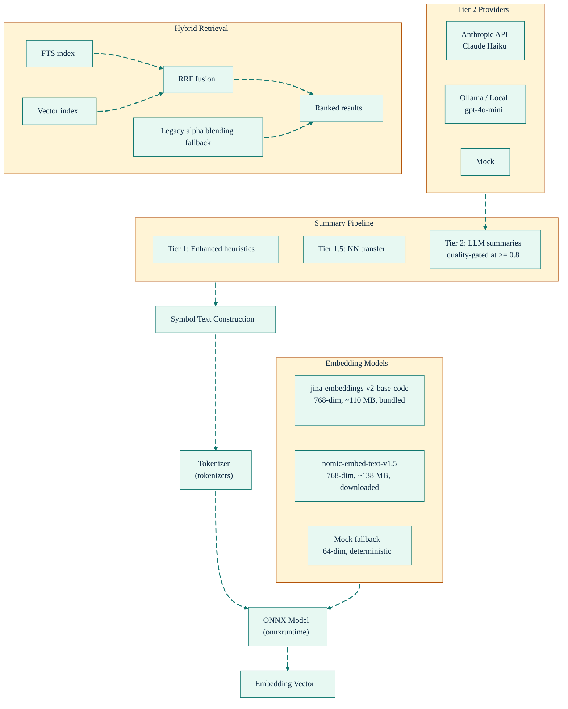
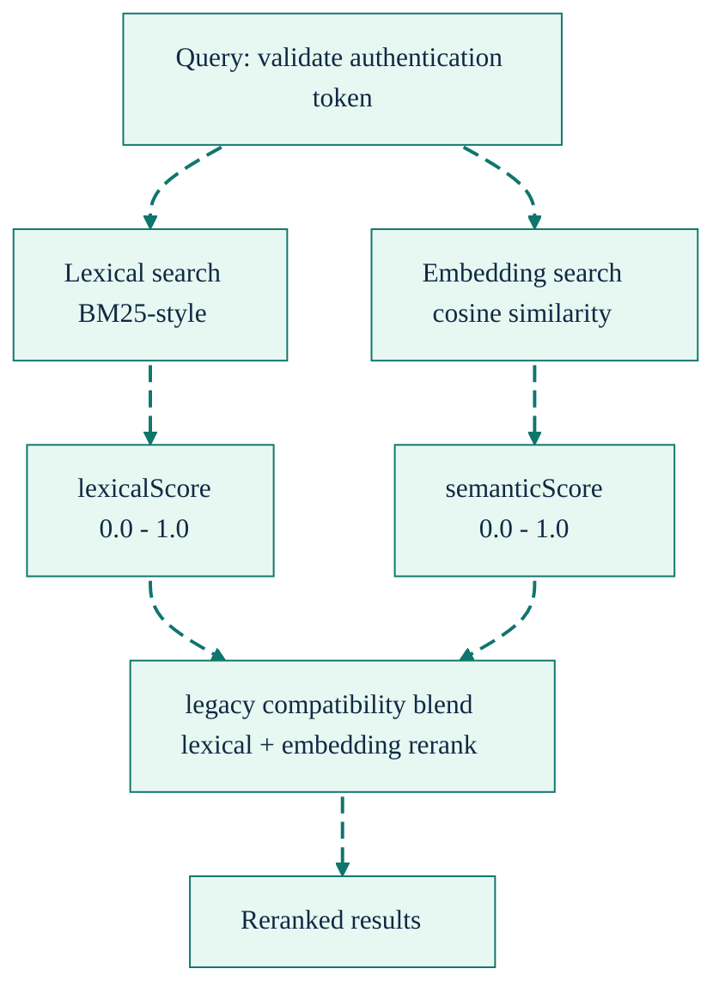
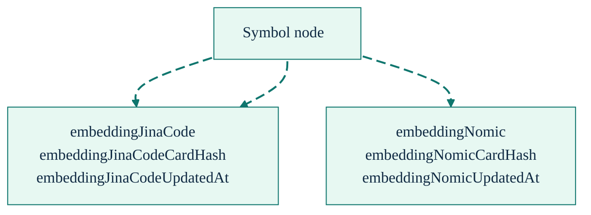

# Semantic Embeddings: Dependencies & Setup Guide

[Back to README](../../README.md) | [Semantic Engine Deep Dive](./semantic-engine.md) | [Configuration Reference](../configuration-reference.md)

---

SDL-MCP's semantic system has three layers � **embedding models**, **LLM summary generation**, and **pass-2 call resolution** � each with its own dependencies and setup. This guide covers installation, configuration, and verification for every tier and provider.

---

## Architecture Overview



## Required vs Optional Dependencies

| Dependency            | npm Package        | Version   | Required? | Purpose                                      |
| :-------------------- | :----------------- | :-------- | :-------- | :------------------------------------------- |
| ONNX Runtime          | `onnxruntime-node` | `^1.24.3` | Optional  | Run local embedding model inference          |
| HuggingFace Tokenizer | `tokenizers`       | `^0.13.3` | Optional  | Tokenize text for ONNX models                |
| Jina Code Model       | downloaded         | -         | Optional  | Default Symbol-lane code embeddings          |
| Nomic Model           | downloaded         | -         | Optional  | Default FileSummary-lane text embeddings     |
| Anthropic API Key     | -                  | -         | Optional  | LLM summary generation                       |
| Ollama Server         | -                  | -         | Optional  | Local LLM summary generation                 |

Without the optional ONNX dependencies, SDL-MCP still works: embeddings fall back to deterministic 64-dim mock vectors. Semantic search will function, but with lower quality results.

---

## Quick Setup by Tier

### Tier 1: Specialized Default (Free, Recommended)

The default semantic profile is `specialized`: Symbol embeddings use `jina-embeddings-v2-base-code`, while FileSummary embeddings use `nomic-embed-text-v1.5`. This keeps index time lower than the old both-models-on-both-lanes behavior while preserving the strongest practical default for code-shaped and prose-shaped payloads. LLM summaries remain off unless you enable them.

Enhanced heuristics are always active, generating pattern-matched summaries for all symbol kinds (class, interface, type, enum, variable, constructor) in addition to typed function/method summaries. When `semantic.enabled: true`, NN summary transfer also runs automatically, propagating documentation from well-documented neighbors to undocumented symbols via embedding similarity.

**Step 1 - Install ONNX dependencies:**

```bash
cd sdl-mcp
npm install onnxruntime-node tokenizers
```

**Step 2 - Optionally pre-download the default local models:**

```bash
node scripts/download-models.mjs jina-embeddings-v2-base-code nomic-embed-text-v1.5
```

If you skip this step, SDL-MCP downloads any missing local model files on the first embedding pass. Use `semantic.modelCacheDir` when you need a pre-seeded cache in an offline or restricted network.

**Step 3 - Verify the model plan:**

```bash
npx sdl-mcp doctor
```

Look for:

```
Semantic embedding models .................. PASS
  onnxruntime-node: 1.24.x
  tokenizers: available
  embedding profile: specialized
  symbol models: jina-embeddings-v2-base-code
  FileSummary models: nomic-embed-text-v1.5
  model files: jina-embeddings-v2-base-code (768d, files present); nomic-embed-text-v1.5 (768d, files present)
```

**Step 4 - Config (optional, this is the effective default):**

```jsonc
// sdl-mcp.config.json
{
  "semantic": {
    "enabled": true,
    "provider": "local",
    "embeddingProfile": "specialized",
  },
}
```

**Step 5 - Index your repository:**

```bash
npx sdl-mcp index --repo-id my-repo
```

Embeddings are generated during the finalization step of indexing. Subsequent searches with `semantic: true` use every healthy vector index that exists, so missing optional model files degrade naturally.

**How text is constructed for Jina Symbol embeddings:**

Jina payloads use a structured, labeled-section format optimized for code models:

```
function validateToken (TypeScript)
File: src/auth/jwt.ts
Exported: true
Signature: (token: string, opts?: ValidateOpts) => Promise<DecodedToken>
Summary: Validates JWT signature and checks expiration claim
Imports: jsonwebtoken, JwtOptions
Calls: verify (function), isExpired (function)
Terms: validate, token, jwt, auth
```

**How text is constructed for Nomic FileSummary embeddings:**

Nomic payloads favor flowing prose and file-level context:

```
src/auth/jwt.ts contains authentication helpers for validating JWT signatures,
checking expiration claims, and normalizing decoded token state. It exports
validateToken and imports jsonwebtoken.
```

See [Model-Aware Embedding Payloads](./semantic-engine.md#model-aware-embedding-payloads) for details.

---

### Tier 2: Max Recall (Free, More Index Time)

Use `embeddingProfile: "max-recall"` when you want the old recall-first behavior: both Jina and Nomic run for both Symbol and FileSummary embeddings. This can improve recall for ambiguous queries, but it roughly doubles the embedding work compared with the specialized default.

**Step 1 - Install ONNX dependencies and pre-download optional models:**

```bash
npm install onnxruntime-node tokenizers
node scripts/download-models.mjs nomic-embed-text-v1.5
```

**Step 2 - Configure max recall:**

```jsonc
// sdl-mcp.config.json
{
  "semantic": {
    "enabled": true,
    "provider": "local",
    "embeddingProfile": "max-recall",
  },
}
```

**Step 3 - Re-index to populate the extra lane/model vectors:**

```bash
npx sdl-mcp index --repo-id my-repo --mode full
```

A full re-index is recommended when switching profiles so every requested lane/model vector is populated. Both supported models are 768-dimensional; the re-index is about filling missing vector columns, not changing vector dimensionality.

**Step 4 - Verify:**

```bash
npx sdl-mcp doctor
```

Look for both models in both lanes:

```
Semantic embedding models .................. PASS
  embedding profile: max-recall
  symbol models: jina-embeddings-v2-base-code, nomic-embed-text-v1.5
  FileSummary models: jina-embeddings-v2-base-code, nomic-embed-text-v1.5
```

---

### Tier 2b: Custom Lane Overrides

Use explicit lane arrays when you want to tune one lane without changing the other. Explicit arrays override the selected profile only for that lane.

```jsonc
// sdl-mcp.config.json
{
  "semantic": {
    "enabled": true,
    "provider": "local",
    "symbolEmbeddingModels": ["jina-embeddings-v2-base-code"],
    "fileSummaryEmbeddingModels": ["nomic-embed-text-v1.5"],
  },
}
```

**When to bias a lane toward Jina:**

- You need code-to-code similarity matching.
- Your codebase spans multiple programming languages.
- Symbol payloads are more useful than prose-heavy file summaries.

**When to bias a lane toward Nomic:**

- Your queries are natural-language descriptions like "find the authentication handler".
- Your codebase has rich documentation, comments, and generated summaries.
- FileSummary vectors are central to the retrieval workflow.

> Legacy `semantic.model` and `semantic.additionalModels` still work for compatibility when no profile or per-lane arrays are configured, but new configs should use `embeddingProfile`, `symbolEmbeddingModels`, and `fileSummaryEmbeddingModels`.

---

### Tier 3: High (API Tokens Required)

Adds LLM-generated natural-language summaries (quality 0.8) to any embedding model. Jina Code and Nomic both benefit from richer symbol text. For maximum quality with natural-language queries, pair summaries with `nomic-embed-text-v1.5`. For code-centric queries, pair with `jina-embeddings-v2-base-code`. Produces the highest quality semantic search results because the LLM distills code meaning into plain English that embedding models handle well.

The LLM stage is quality-gated: symbols that already have `summaryQuality >= 0.8` (e.g., from JSDoc extraction) are automatically skipped, avoiding redundant API calls. In practice, this means well-documented codebases spend less on LLM summaries while undocumented symbols get the most attention.

Choose one of three LLM providers:

#### Option A: Anthropic API (Claude Haiku)

**Step 1 � Get an API key:**

Sign up at [console.anthropic.com](https://console.anthropic.com) and create an API key.

**Step 2 � Set the API key:**

Option A � Environment variable:

```bash
export ANTHROPIC_API_KEY=sk-ant-api03-...
```

Option B � Config file:

```jsonc
{
  "semantic": {
    "summaryApiKey": "sk-ant-api03-...",
  },
}
```

**Step 3 � Configure:**

```jsonc
// sdl-mcp.config.json - specialized embeddings with API summaries
{
  "semantic": {
    "enabled": true,
    "provider": "local",
    "embeddingProfile": "specialized",
    "generateSummaries": true,
    "summaryProvider": "api",
    "summaryModel": "claude-haiku-4-5-20251001",
    "summaryMaxConcurrency": 5,
    "summaryBatchSize": 20,
  },
}
```

> **Tip:** Use `embeddingProfile: "max-recall"` when summaries and ambiguous natural-language queries justify the extra embedding work. Keep `specialized` when index time matters more.

**Step 4 � Index (summaries generated during finalization):**

```bash
npx sdl-mcp index --repo-id my-repo
```

**Cost estimate:** ~$2 per 1M tokens. A typical symbol summary uses ~50-100 input tokens and ~30-50 output tokens. For a 1,000-symbol repository: roughly $0.15�$0.30.

**Default model:** `claude-haiku-4-5-20251001`

Other supported models (any Anthropic model works):

- `claude-sonnet-4-20250514` (higher quality, higher cost)
- `claude-haiku-4-5-20251001` (recommended � best quality/cost ratio)

#### Option B: Ollama (Local, Free)

Run an OpenAI-compatible LLM server locally. No API costs, but requires a machine with enough RAM.

**Step 1 � Install Ollama:**

Download from [ollama.com](https://ollama.com/download) and install for your platform.

**Step 2 � Pull a model:**

```bash
ollama pull llama3.2:3b       # Lightweight (~2GB RAM)
# or
ollama pull qwen2.5-coder:7b  # Better for code (~5GB RAM)
# or
ollama pull gpt-4o-mini       # If available via compatible API
```

**Step 3 � Start the server (if not auto-started):**

```bash
ollama serve
```

Ollama runs an OpenAI-compatible API at `http://localhost:11434/v1` by default.

**Step 4 � Configure:**

```jsonc
// sdl-mcp.config.json
{
  "semantic": {
    "enabled": true,
    "provider": "local",
    "embeddingProfile": "specialized",
    "generateSummaries": true,
    "summaryProvider": "local",
    "summaryModel": "llama3.2:3b",
    "summaryApiBaseUrl": "http://localhost:11434/v1",
    "summaryMaxConcurrency": 2,
    "summaryBatchSize": 10,
  },
}
```

> Lower `summaryMaxConcurrency` (2-3) and `summaryBatchSize` (10) for local models to avoid overwhelming a single GPU/CPU.

**Step 5 � Index:**

```bash
npx sdl-mcp index --repo-id my-repo
```

#### Option C: Any OpenAI-Compatible API

Any server implementing the `/v1/chat/completions` endpoint works � LM Studio, vLLM, text-generation-inference, etc.

**Configure:**

```jsonc
{
  "semantic": {
    "generateSummaries": true,
    "summaryProvider": "local",
    "summaryModel": "your-model-name",
    "summaryApiKey": "your-api-key",
    "summaryApiBaseUrl": "http://your-server:8080/v1",
  },
}
```

The `summaryProvider: "local"` value sends OpenAI-format requests (`POST /chat/completions`) to the configured base URL.

---

## Model Comparison

| Property              | `jina-embeddings-v2-base-code` | `nomic-embed-text-v1.5` |
| :-------------------- | :--------------------------------------- | :------------------------------------- |
| Default lane          | Symbol embeddings                         | FileSummary embeddings                  |
| Profile role          | Code-shaped payloads                      | Prose-heavy payloads                    |
| Dimensions            | 768                                       | 768                                    |
| Max input tokens      | 8,192                                     | 8,192                                  |
| ONNX file size        | ~110 MB (INT8), bundled                   | ~138 MB (INT8), downloaded on demand   |
| Bundled with npm      | Yes                                       | No                                     |
| Training data         | Source code across many languages         | General text and natural-language data |
| Input format          | Structured code sections                  | Flowing prose with document/query prefix |
| Best paired with      | Symbol search and code-to-code matching   | File summaries and NL-heavy queries    |
| Disk location         | `<pkg>/models/`                          | `<cache>/models/`                      |
| Upstream source       | `jinaai`                                  | `nomic-ai`                             |

**Choosing a profile:**

- **Specialized** - Recommended default. Runs Jina for Symbols and Nomic for FileSummary nodes.
- **Max recall** - Runs both supported models on both lanes. Use when recall matters more than index time.
- **Custom lanes** - Set `symbolEmbeddingModels` or `fileSummaryEmbeddingModels` when one lane needs explicit tuning.

## Summary Provider Comparison

| Provider           | Config value | Default model               | Endpoint                                     | Auth                                   | Cost                 |
| :----------------- | :----------- | :-------------------------- | :------------------------------------------- | :------------------------------------- | :------------------- |
| **Anthropic**      | `"api"`      | `claude-haiku-4-5-20251001` | `https://api.anthropic.com/v1/messages`      | `ANTHROPIC_API_KEY` or `summaryApiKey` | ~$2/1M tokens        |
| **Ollama / Local** | `"local"`    | `gpt-4o-mini`               | `http://localhost:11434/v1/chat/completions` | Optional (default: `"ollama"`)         | Free (local compute) |
| **Mock**           | `"mock"`     | �                           | None                                         | None                                   | Free                 |

**API format differences:**

- `"api"` sends Anthropic Messages API format (`x-api-key` header, `anthropic-version` header)
- `"local"` sends OpenAI Chat Completions format (`Authorization: Bearer` header)

**System prompt used for all providers:**

> "You are a code documentation assistant. Write a 1-3 sentence summary of what this TypeScript/JavaScript symbol does. Be specific, not generic. Focus on behavior, not structure."

---

## Semantic Search: How It Works

When you call `sdl.symbol.search` with `semantic: true` in legacy mode, SDL-MCP uses a compatibility alpha-blended rerank after lexical and embedding search:



Hybrid retrieval is the recommended default. The legacy path remains available through `semantic.retrieval.mode: "legacy"`, but the current recommended configuration surface is the hybrid pipeline under `semantic.retrieval.*`.

## Hybrid Retrieval Setup

Hybrid retrieval replaces the legacy alpha-blending search with native Ladybug FTS + vector indexes fused via Reciprocal Rank Fusion (RRF). It is controlled by `semantic.retrieval.mode`.

### Enabling Hybrid Retrieval

```jsonc
{
  "semantic": {
    "enabled": true,
    "retrieval": {
      "mode": "hybrid", // "hybrid" (default) or "legacy"
      "fts": {
        "enabled": true, // Full-text search on Symbol.searchText
        "indexName": "symbol_search_text_v1",
        "topK": 75, // Max FTS candidates
        "conjunctive": false, // true = AND all terms; false = OR
      },
      "vector": {
        "enabled": true, // Vector search on inline embeddings
        "topK": 75, // Max candidates per model
        "efs": 200, // Query-time accuracy parameter
      },
      "fusion": {
        "strategy": "rrf", // Reciprocal Rank Fusion
        "rrfK": 60, // Smoothing constant (higher = more uniform)
      },
      "candidateLimit": 100, // Max candidates after fusion
    },
  },
}
```

### How It Works

1. **FTS and vector indexes are created automatically** on DB init when `semantic.enabled: true`. The FTS extension indexes `Symbol.searchText`; vector indexes cover `Symbol.embeddingJinaCode` and `Symbol.embeddingNomic`.
2. **At query time**, FTS and vector searches run in parallel. Each source produces a ranked candidate list.
3. **RRF fuses** the rank lists: `score(d) = S 1/(k + rank_i(d))` � symbols ranked highly by multiple sources rise to the top.
4. **If extensions are unavailable** (e.g., `fts` or `vector` not loaded), the system automatically falls back to the legacy alpha-blending path and records the fallback reason in telemetry.

### Extension Requirements

Hybrid retrieval requires the Ladybug `fts` and `vector` extensions. These are loaded best-effort on DB connection � if they're unavailable, hybrid search falls back to legacy automatically. Run `sdl-mcp doctor` to check extension status:

```
Retrieval extensions ...................... PASS
  fts: loaded
  vector: loaded
  FTS index: symbol_search_text_v1 (healthy)
  Vector index: symbol_vec_jina_code_v2 (healthy)
  Vector index: symbol_vec_nomic_embed_v15 (healthy)
```

### Migration from SymbolEmbedding

Prior to hybrid retrieval, embeddings were stored in a separate `SymbolEmbedding` node table. Migration m007 automatically copies embeddings to inline Symbol properties (`embeddingJinaCode`, `embeddingNomic`) on DB init. Mock-fallback rows are skipped. The old `SymbolEmbedding` table is deprecated but retained for backward compatibility.

The current recommended configuration surface is `semantic.retrieval.*`. Retired compatibility knobs are intentionally omitted from this setup guide.

---

## Performance Tuning & Hardware Acceleration

Local embedding generation is the dominant cost of a full reindex on most repos (often 60-70% of wall time). The settings below let you trade memory, accuracy, and compatibility for speed without changing the embedding model.

### Model Variants (`semantic.modelVariant`)

Each ONNX model on HuggingFace ships several pre-quantised variants. SDL-MCP picks the variant by name; unsupported requests fall back to the model's `defaultVariant` with a warning.

| Variant   | jina-code | nomic-text | File size (approx)         | Speed vs fp32   | Quality vs fp32         |
| :-------- | :-------: | :--------: | :------------------------- | :-------------- | :---------------------- |
| `default` |     ✓     |     ✓      | jina ~162MB / nomic ~137MB | baseline (int8) | baseline (int8)         |
| `int8`    |     ✓     |     ✓      | ~140-160MB                 | ~2-3× fp32      | -1 to -3% retrieval     |
| `uint8`   |     —     |     ✓      | ~137MB                     | ~2-3× fp32      | -1 to -3% retrieval     |
| `q4`      |     —     |     ✓      | ~165MB                     | ~3-4× fp32      | -3 to -7% retrieval     |
| `q4f16`   |     —     |     ✓      | ~111MB                     | ~3-4× fp32      | -3 to -7% retrieval     |
| `bnb4`    |     —     |     ✓      | ~158MB                     | ~3-4× fp32      | -3 to -7% retrieval     |
| `fp16`    |     ✓     |     ✓      | ~270-321MB                 | ~1.3-1.5× fp32  | <0.5% loss (negligible) |
| `fp32`    |     ✓     |     ✓      | ~547-642MB                 | baseline        | reference               |

The default ships the int8 quantised variant. Move to `fp16` if you want a small speed boost with no measurable quality loss, or to `q4`/`q4f16`/`bnb4` if you can tolerate ~3-7% retrieval quality drop for ~3× speed. Each variant downloads on first use to the model cache directory; tokenizer + config are shared across variants.

```jsonc
{
  "semantic": {
    "modelVariant": "fp16", // or "default" / "int8" / "uint8" / "q4" / "q4f16" / "bnb4" / "fp32"
  },
}
```

### GPU / Accelerator Execution Providers (`semantic.executionProviders`)

ONNX Runtime ships several execution providers in the default `onnxruntime-node` npm package — no separate package or build needed. SDL-MCP filters the user list against the platform's bundled providers and auto-appends `"cpu"` as final fallback so session creation never strands.

| Platform    | Bundled providers         | Covers                                                                  |
| :---------- | :------------------------ | :---------------------------------------------------------------------- |
| Windows x64 | `cpu`, `dml`, `webgpu`    | DirectML covers any DX12 GPU: AMD Radeon, NVIDIA, Intel Arc, integrated |
| macOS       | `cpu`, `coreml`           | Apple Silicon ANE/GPU + Intel Mac GPU                                   |
| Linux x64   | `cpu`, `cuda`, `tensorrt` | NVIDIA GPU + CUDA 12 + cuDNN must be installed on the host              |
| Linux arm64 | `cpu`                     | CPU only in default package                                             |

Out of scope (require a custom ONNX Runtime build): `rocm` (AMD on Linux), `openvino`, `qnn`. If you swap in a custom `onnxruntime-node` build, those providers will work — sdl-mcp's filter only drops entries known to be unavailable in the default package.

```jsonc
{
  "semantic": {
    // Windows + AMD/NVIDIA/Intel discrete or integrated GPU:
    "executionProviders": ["dml", "cpu"],
    // Apple Silicon Mac:
    // "executionProviders": ["coreml", "cpu"],
    // NVIDIA Linux (CUDA 12 + cuDNN installed):
    // "executionProviders": ["cuda", "cpu"],
  },
}
```

Expected speedup vs CPU-only on a workstation-class machine: **3-8× for transformer inference**. Combine with `modelVariant: "fp16"` for additive gains.

### Throughput Tuning (`embeddingConcurrency`, `embeddingBatchSize`)

| Knob                   | Default | Range   | Effect                                                                                  |
| :--------------------- | :------ | :------ | :-------------------------------------------------------------------------------------- |
| `embeddingConcurrency` | `1`     | `1-8`   | ONNX batches in flight per model. Higher = more overlap of tokenization with inference. |
| `embeddingBatchSize`   | `32`    | `1-128` | Rows per ONNX inference call for symbols. Larger = fewer round trips but higher peak memory. |
| `fileSummaryEmbeddingBatchSize` | `4` | `1-16` | Rows per ONNX inference call for FileSummary vectors. Keep lower because file payloads are larger. |
| `fileSummaryEmbeddingMaxChars` | `4096` | `512-32768` | Character cap for FileSummary embedding text; stored summaries and FTS text remain complete. |

FileSummary embedding model lanes run serially for resource safety; `embeddingsSequential`
controls the symbol embedding model lanes.

Tuning advice for a 16-physical-core CPU (e.g. 9950X3D):

- Start with `embeddingConcurrency: 4`, `embeddingBatchSize: 32`, `intraOpNumThreads: 16` (= physical cores).
- If CPU stays below 70% during the embedding phase, the tokenizer (single-thread JS) is the bottleneck — raise `embeddingConcurrency` to 6 or 8 to keep more batches in tokenization while ORT computes.
- If wall time stops improving past concurrency 4, the bottleneck has shifted to ORT compute; tweak `intraOpNumThreads` instead (set to physical core count, not logical — hyperthreading hurts inference).

### Multi-Model Sequencing (`embeddingsSequential`)

When two or more embedding models are configured (e.g. jina + nomic), SDL-MCP runs them concurrently via `Promise.all` by default. On systems where ORT serializes parallel sessions at the thread-pool layer, this can produce an alternation pattern: one model's progress jumps, then the other's, back and forth, with neither model holding the full thread budget end-to-end.

Set `embeddingsSequential: true` to run models in series instead. Each model then keeps its weights hot in L3 cache for the full duration. Wall time becomes `model_a_time + model_b_time` rather than the contended-parallel worst case. Whether this wins depends on hardware — measure both to decide.

```jsonc
{
  "semantic": {
    "embeddingsSequential": true,
  },
}
```

### ONNX Runtime Thread Pool (`semantic.onnx`)

| Field                    | Default                    | Notes                                                                                                               |
| :----------------------- | :------------------------- | :------------------------------------------------------------------------------------------------------------------ |
| `onnx.intraOpNumThreads` | `0` (auto = logical cores) | Set to **physical** core count for best inference (transformer matmul/attention). Hyperthreading slows ORT compute. |
| `onnx.interOpNumThreads` | `0` (auto = 1)             | Only used in `executionMode: "parallel"`. Keep at 1 for sentence-transformer ONNX graphs.                           |
| `onnx.executionMode`     | `"sequential"`             | Sequential is usually optimal — these models have linear graphs.                                                    |

The `intraOpNumThreads` setting is the single most impactful knob after model variant + execution provider selection.

---

## Embedding Vector Storage

Embeddings are stored as **inline properties on Symbol nodes** in LadybugDB:



Vectors are compressed using Float16 quantization:

```text
Original:  [0.0234, -0.1567, 0.8901, ...]   (float64, 3072 bytes for 768-dim)
Quantized: [234, -1567, 8901, ...]          (int16 x 10000 scale)
Stored:    Base64(Int16Array)               (768 bytes for 768-dim)
```

This reduces storage by about 75% with negligible quality loss. Vectors are L2-normalized after decompression.

## Summary Caching & Invalidation

LLM-generated summaries are cached in the `SummaryCache` graph table. Cache keys are computed as:

```
cardHash = SHA256(symbolName | kind | signature | astFingerprint | providerName | modelName)
```

**A cache entry invalidates when:**

- The symbol's code changes (new `astFingerprint`)
- The symbol's signature changes
- The configured provider or model changes
- The symbol is deleted

**Cache entries survive:**

- Whitespace-only changes (stable fingerprint)
- Unrelated file edits
- Server restarts (persisted in graph DB)

---

## Troubleshooting

### "Embeddings will fall back to deterministic mock vectors"

**Cause:** `onnxruntime-node` or `tokenizers` not installed.

**Fix:**

```bash
npm install onnxruntime-node tokenizers
```

Then run `npx sdl-mcp doctor` to verify.

### "Model files not found"

**Cause:** The configured local embedding model files are missing from the model cache directory.

**Fix:**

```bash
node scripts/download-models.mjs <model-name>
# or prefetch the default specialized-lane models:
node scripts/download-models.mjs jina-embeddings-v2-base-code nomic-embed-text-v1.5
```

### "Failed to download model_quantized.onnx for model nomic-embed-text-v1.5"

**Cause:** Network error during HuggingFace download. Possibly behind a proxy or firewall.

**Fix � manual download:**

```bash
# Download files manually and place in cache directory:
# Windows: %LOCALAPPDATA%\sdl-mcp\models\nomic-embed-text-v1.5\
# Linux/Mac: ~/.cache/sdl-mcp/models/nomic-embed-text-v1.5/

curl -L -o model_quantized.onnx "https://huggingface.co/nomic-ai/nomic-embed-text-v1.5/resolve/main/onnx/model_quantized.onnx"
curl -L -o tokenizer.json "https://huggingface.co/nomic-ai/nomic-embed-text-v1.5/resolve/main/tokenizer.json"
curl -L -o config.json "https://huggingface.co/nomic-ai/nomic-embed-text-v1.5/resolve/main/config.json"
```

Or point to a custom cache directory:

```jsonc
{
  "semantic": {
    "modelCacheDir": "/path/to/your/models",
  },
}
```

### "Local embedding provider falling back to mock"

**Cause:** ONNX session creation failed. Could be missing model files, incompatible onnxruntime version, or corrupted download.

**Fix:**

1. Run `npx sdl-mcp doctor` to identify what's missing
2. Re-download the model: `node scripts/download-models.mjs <model-name>`
3. If onnxruntime-node won't install (platform issue), use mock mode:
   ```jsonc
   { "semantic": { "provider": "mock" } }
   ```

### "No API key for summary generation"

**Cause:** `summaryProvider: "api"` configured but no key found.

**Fix � set the key:**

```bash
export ANTHROPIC_API_KEY=sk-ant-api03-...
```

Or add `"summaryApiKey": "sk-ant-..."` to the `semantic` config block.

### Summaries not generating with Ollama

**Cause:** Ollama server not running, wrong model name, or wrong port.

**Fix:**

1. Verify Ollama is running: `curl http://localhost:11434/v1/models`
2. Verify your model is pulled: `ollama list`
3. Test manually:
   ```bash
   curl http://localhost:11434/v1/chat/completions \
     -H "Content-Type: application/json" \
     -d '{"model":"llama3.2:3b","messages":[{"role":"user","content":"Hello"}]}'
   ```
4. Ensure `summaryApiBaseUrl` includes `/v1`: `"http://localhost:11434/v1"`

---

## Configuration Quick Reference

```jsonc
{
  "semantic": {
    // -- Embedding Model -----------------------------------------
    "enabled": true, // Enable semantic search
    "provider": "local", // "local" | "api" | "mock"
    "embeddingProfile": "specialized", // "specialized" | "max-recall"
    "symbolEmbeddingModels": ["jina-embeddings-v2-base-code"], // Optional Symbol-lane override
    "fileSummaryEmbeddingModels": ["nomic-embed-text-v1.5"], // Optional FileSummary-lane override
    "modelCacheDir": null, // Override model storage path
    // -- LLM Summaries -------------------------------------------
    "generateSummaries": false, // Enable LLM summary generation
    "summaryProvider": null, // "api" | "local" | "mock" (default: inherit from provider)
    "summaryModel": null, // Model name (default: claude-haiku-4-5-20251001 for api)
    "summaryApiKey": null, // API key (or use ANTHROPIC_API_KEY env var)
    "summaryApiBaseUrl": null, // Custom endpoint (default: Anthropic for api, localhost:11434 for local)
    "summaryMaxConcurrency": 5, // Parallel summary requests (1-20)
    "summaryBatchSize": 20, // Symbols per batch (1-50)

    // -- ONNX Inference Performance ------------------------------
    "embeddingConcurrency": 1, // 1-8: ONNX batches in flight per model
    "embeddingBatchSize": 32, // 1-128: rows per symbol ONNX inference call
    "fileSummaryEmbeddingBatchSize": 4, // 1-16: rows per FileSummary ONNX call
    "fileSummaryEmbeddingMaxChars": 4096, // bounds FileSummary vector payloads
    "embeddingsSequential": false, // run multi-model embedding in series (vs Promise.all)
    "modelVariant": "default", // "default" | "fp16" | "fp32" | "int8" | nomic-only "uint8"/"q4"/"q4f16"/"bnb4"
    "executionProviders": ["cpu"], // ORT EPs: ["dml","cpu"] (Win), ["coreml","cpu"] (macOS), ["cuda","cpu"] (Linux NVIDIA)
    "onnx": {
      "intraOpNumThreads": 0, // 0 = auto (logical cores). Set to physical core count for best inference perf.
      "interOpNumThreads": 0, // 0 = 1. Only used in executionMode "parallel".
      "executionMode": "sequential", // "sequential" | "parallel"
    },

    // -- Retrieval -----------------------------------------------
    "retrieval": {
      "mode": "hybrid",
      "extensionsOptional": true,
      "fts": {
        "enabled": true,
        "indexName": "symbol_search_text_v1",
        "topK": 75,
        "conjunctive": false,
      },
      "vector": { "enabled": true, "topK": 75, "efs": 200 },
      "fusion": { "strategy": "rrf", "rrfK": 60 },
      "candidateLimit": 100,
    },
  },
}
```

---

## Recommended Configurations

### Small personal project (free, recommended default)

```jsonc
{
  "semantic": {
    "enabled": true,
    "provider": "local",
    "embeddingProfile": "specialized",
  },
}
```

### Large codebase, maximum recall (free, more index time)

```jsonc
{
  "semantic": {
    "enabled": true,
    "provider": "local",
    "embeddingProfile": "max-recall",
  },
}
```

### Production team with API budget (summaries plus specialized lanes)

```jsonc
{
  "semantic": {
    "enabled": true,
    "provider": "local",
    "embeddingProfile": "specialized",
    "generateSummaries": true,
    "summaryProvider": "api",
    "summaryModel": "claude-haiku-4-5-20251001",
    "summaryMaxConcurrency": 5,
  },
}
```

### Air-gapped environment with local LLM

```jsonc
{
  "semantic": {
    "enabled": true,
    "provider": "local",
    "embeddingProfile": "specialized",
    "modelCacheDir": "/shared/models",
    "generateSummaries": true,
    "summaryProvider": "local",
    "summaryModel": "qwen2.5-coder:7b",
    "summaryApiBaseUrl": "http://gpu-server:11434/v1",
    "summaryMaxConcurrency": 2,
  },
}
```

---

## Related Documentation

- [Semantic Engine Deep Dive](./semantic-engine.md) � pass-2 resolution, embedding search, and LLM summaries working together
- [Indexing & Languages](./indexing-languages.md) � two-pass architecture, 12-language support, LLM summary tiers
- [Configuration Reference](../configuration-reference.md) � complete config schema
- [CLI Reference](../cli-reference.md) � `sdl-mcp doctor`, `sdl-mcp index` commands

[Back to README](../../README.md)
