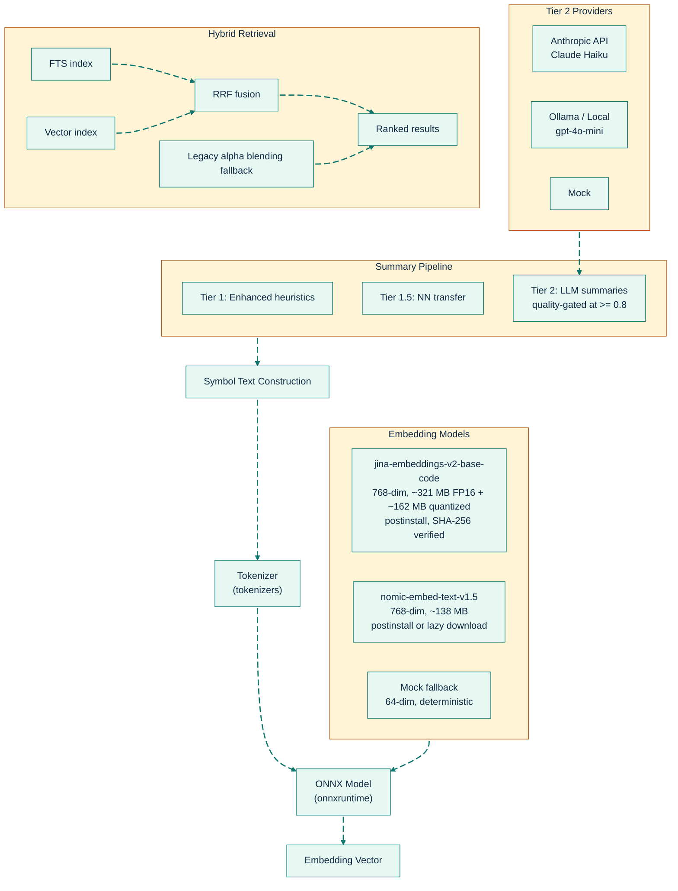
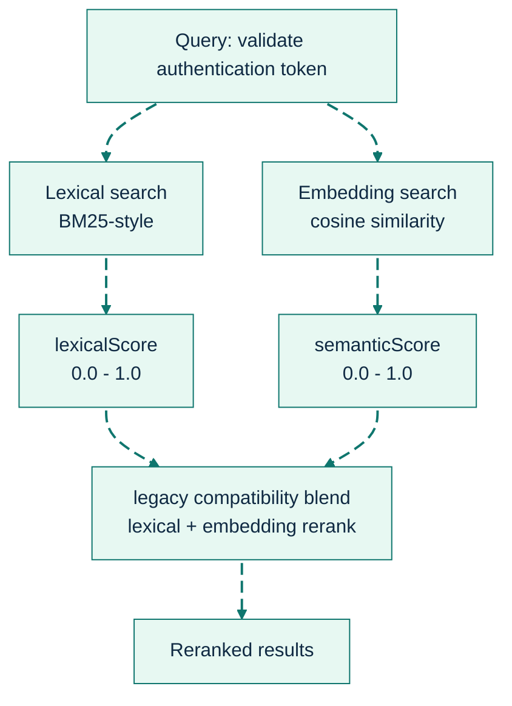
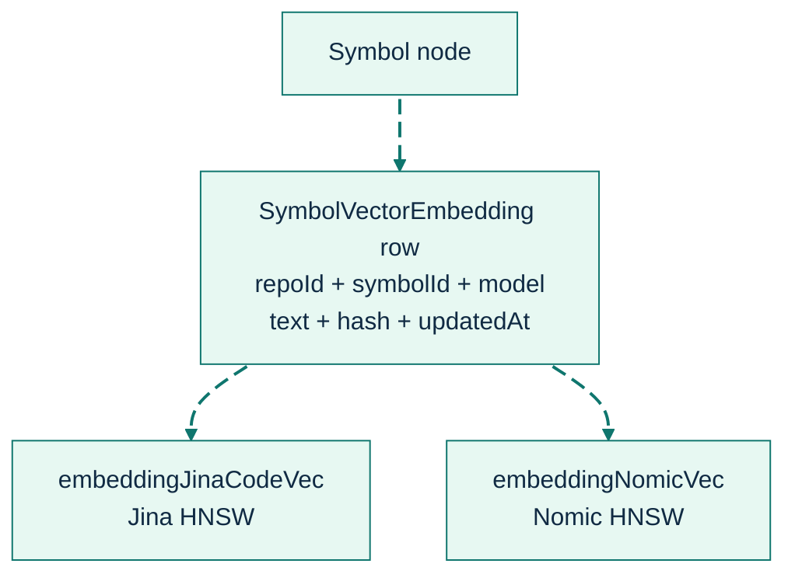

# Semantic Embeddings: Dependencies & Setup Guide

[Back to README](../../README.md) | [Semantic Engine Deep Dive](./semantic-engine.md) | [Configuration Reference](../configuration-reference.md)

---

SDL-MCP's semantic system has three layers: **embedding models**, **LLM summary generation**, and **pass-2 call resolution**. Each layer has its own dependencies and setup. This guide covers installation, configuration, and verification for every tier and provider.

---

## Architecture Overview


```mermaid
%%{init: {"theme":"base","themeVariables":{"background":"#ffffff","primaryColor":"#E7F8F2","primaryBorderColor":"#0F766E","primaryTextColor":"#102A43","secondaryColor":"#E8F1FF","secondaryBorderColor":"#2563EB","secondaryTextColor":"#102A43","tertiaryColor":"#FFF4D6","tertiaryBorderColor":"#B45309","tertiaryTextColor":"#102A43","lineColor":"#0F766E","textColor":"#102A43","fontFamily":"Inter, ui-sans-serif, system-ui, -apple-system, BlinkMacSystemFont, Segoe UI, sans-serif"},"flowchart":{"curve":"basis","htmlLabels":true}}}%%
flowchart TD
    Text["Symbol Text Construction"] e1@--> Tokenizer["Tokenizer<br/>(tokenizers)"]
    Tokenizer e2@--> Onnx["ONNX Model<br/>(onnxruntime)"]
    Onnx e3@--> Vector["Embedding Vector"]

    subgraph Models["Embedding Models"]
        Jina["jina-embeddings-v2-base-code<br/>768-dim, ~321 MB FP16 + ~162 MB quantized<br/>postinstall, SHA-256 verified"]
        Nomic["nomic-embed-text-v1.5<br/>768-dim, ~138 MB<br/>postinstall or lazy download"]
        Mock["Mock fallback<br/>64-dim, deterministic"]
    end

    subgraph Summary["Summary Pipeline"]
        Tier1["Tier 1: Enhanced heuristics"]
        Tier15["Tier 1.5: NN transfer"]
        Tier2["Tier 2: LLM summaries<br/>quality-gated at >= 0.8"]
    end

    subgraph Providers["Tier 2 Providers"]
        Anthropic["Anthropic API<br/>Claude Haiku"]
        Ollama["Ollama / Local<br/>gpt-4o-mini"]
        MockProvider["Mock"]
    end

    subgraph Retrieval["Hybrid Retrieval"]
        FTS["FTS index"] e4@--> RRF["RRF fusion"]
        VecIndex["Vector index"] e5@--> RRF
        RRF e6@--> Results["Ranked results"]
        Fallback["Legacy alpha blending fallback"] e7@--> Results
    end

    Models e8@--> Onnx
    Summary e9@--> Text
    Providers e10@--> Tier2

    classDef source fill:#E7F8F2,stroke:#0F766E,stroke-width:2px,color:#102A43;
    classDef process fill:#E8F1FF,stroke:#2563EB,stroke-width:2px,color:#102A43;
    classDef decision fill:#FFF4D6,stroke:#B45309,stroke-width:2px,color:#102A43;
    classDef storage fill:#F2E8FF,stroke:#7C3AED,stroke-width:2px,color:#102A43;
    classDef output fill:#FFE8EF,stroke:#BE123C,stroke-width:2px,color:#102A43;
    classDef muted fill:#F8FAFC,stroke:#64748B,stroke-width:1px,color:#102A43;
    classDef animate stroke:#0F766E,stroke-width:2px,stroke-dasharray:10\,5,stroke-dashoffset:900,animation:dash 22s linear infinite;
    class e1,e2,e3,e4,e5,e6,e7,e8,e9,e10 animate;
```

## Required vs Optional Dependencies

| Dependency            | npm Package        | Version   | Required? | Purpose                                      |
| :-------------------- | :----------------- | :-------- | :-------- | :------------------------------------------- |
| ONNX Runtime          | `onnxruntime-node` | `^1.24.3` | Optional  | Run local embedding model inference          |
| HuggingFace Tokenizer | `tokenizers@npm:@anush008/tokenizers` | `^0.6.0` | Optional  | Tokenize text for ONNX models                |
| Jina Code Model       | downloaded         | -         | Optional  | FP16 and quantized Symbol-lane graphs         |
| Nomic Model           | downloaded         | -         | Optional  | Default FileSummary-lane text embeddings     |
| Anthropic API Key     | -                  | -         | Optional  | LLM summary generation                       |
| Ollama Server         | -                  | -         | Optional  | Local LLM summary generation                 |

Without the optional ONNX dependencies, SDL-MCP structural and text retrieval remain available. Semantic vector retrieval remains unavailable/degraded because mock fallback vectors are neither persisted nor returned.

---

## Quick Setup by Tier

### Tier 1: Specialized Default (Free, Recommended)

The default semantic profile is `specialized`: Symbol embeddings use `jina-embeddings-v2-base-code`, while FileSummary embeddings use `nomic-embed-text-v1.5`. Jina's omitted/`default` mode selects FP16 only for Windows DirectML-first throughput sessions; non-Windows automatic, CPU, and deterministic sessions select quantized. Explicit variants remain authoritative on every platform, and Nomic remains quantized. LLM summaries remain off unless you enable them.

Enhanced heuristics are always active, generating pattern-matched summaries for all symbol kinds (class, interface, type, enum, variable, constructor) in addition to typed function/method summaries. When `semantic.enabled: true`, NN summary transfer also runs automatically, propagating documentation from well-documented neighbors to undocumented symbols via embedding similarity.

**Step 1 - Install ONNX dependencies:**

```bash
cd sdl-mcp
npm install onnxruntime-node tokenizers@npm:@anush008/tokenizers@^0.6.0
```

**Step 2 - Optionally pre-download the default local models:**

```bash
node scripts/download-models.mjs jina-embeddings-v2-base-code nomic-embed-text-v1.5
```

If you skip this step, SDL-MCP downloads any missing local model files on the first embedding pass. Use `semantic.modelCacheDir` when you need a pre-seeded cache in an offline or restricted network.

**Step 3 - Verify the model plan:**

```bash
npx sdl-mcp doctor
```

Look for:

```
Semantic embedding models .................. PASS
  onnxruntime-node: 1.24.x
  tokenizers: available
  embedding profile: specialized
  symbol models: jina-embeddings-v2-base-code
  FileSummary models: nomic-embed-text-v1.5
  model files: jina-embeddings-v2-base-code (768d, files present); nomic-embed-text-v1.5 (768d, files present)
```

**Step 4 - Config (optional, this is the effective default):**

```jsonc
// sdl-mcp.config.json
{
  "semantic": {
    "enabled": true,
    "provider": "local",
    "embeddingProfile": "specialized",
  },
}
```

**Step 5 - Index your repository:**

```bash
npx sdl-mcp index --repo-id my-repo
```

Embeddings are generated during the finalization step of indexing. Subsequent searches with `semantic: true` use every healthy vector index that exists, so missing optional model files degrade naturally.

**How text is constructed for Jina Symbol embeddings:**

Jina payloads use a structured, labeled-section format optimized for code models:

```
function validateToken (TypeScript)
File: src/auth/jwt.ts
Exported: true
Signature: (token: string, opts?: ValidateOpts) => Promise<DecodedToken>
Summary: Validates JWT signature and checks expiration claim
Imports: jsonwebtoken, JwtOptions
Calls: verify (function), isExpired (function)
Terms: validate, token, jwt, auth
```

**How text is constructed for Nomic FileSummary embeddings:**

Nomic payloads favor flowing prose and file-level context:

```
src/auth/jwt.ts contains authentication helpers for validating JWT signatures,
checking expiration claims, and normalizing decoded token state. It exports
validateToken and imports jsonwebtoken.
```

Incremental FileSummary vector writes debounce the LadybugDB HNSW rebuild until 50 rows are uncached. When a changed-file scope falls below that threshold, SDL-MCP also checks repository-wide FileSummary hashes so deferred rows join later runs instead of starving. The CLI reports the pending model count, while FileSummary FTS remains current during the delay.

See [Model-Aware Embedding Payloads](./semantic-engine.md#model-aware-embedding-payloads) for details.

---

### Tier 2: Max Recall (Free, More Index Time)

Use `embeddingProfile: "max-recall"` when you want the old recall-first behavior: both Jina and Nomic run for both Symbol and FileSummary embeddings. This can improve recall for ambiguous queries, but it roughly doubles the embedding work compared with the specialized default.

**Step 1 - Install ONNX dependencies and pre-download optional models:**

```bash
npm install onnxruntime-node tokenizers@npm:@anush008/tokenizers@^0.6.0
node scripts/download-models.mjs nomic-embed-text-v1.5
```

**Step 2 - Configure max recall:**

```jsonc
// sdl-mcp.config.json
{
  "semantic": {
    "enabled": true,
    "provider": "local",
    "embeddingProfile": "max-recall",
  },
}
```

**Step 3 - Build a validated candidate to populate the extra lane/model vectors:**

```bash
npx sdl-mcp index --force --safe-rebuild /absolute/path/to/new-graph.lbug
```

The safe rebuild indexes every configured repository because the candidate is a
whole LadybugDB database. It populates every requested lane/model vector without
destructively refreshing the active graph. Both supported models are
768-dimensional; the rebuild fills missing vector columns rather than changing
vector dimensionality.

**Step 4 - Verify:**

```bash
npx sdl-mcp doctor
```

Look for both models in both lanes:

```
Semantic embedding models .................. PASS
  embedding profile: max-recall
  symbol models: jina-embeddings-v2-base-code, nomic-embed-text-v1.5
  FileSummary models: jina-embeddings-v2-base-code, nomic-embed-text-v1.5
```

---

### Tier 2b: Custom Lane Overrides

Use explicit lane arrays when you want to tune one lane without changing the other. Explicit arrays override the selected profile only for that lane.

```jsonc
// sdl-mcp.config.json
{
  "semantic": {
    "enabled": true,
    "provider": "local",
    "symbolEmbeddingModels": ["jina-embeddings-v2-base-code"],
    "fileSummaryEmbeddingModels": ["nomic-embed-text-v1.5"],
  },
}
```

**When to bias a lane toward Jina:**

- You need code-to-code similarity matching.
- Your codebase spans multiple programming languages.
- Symbol payloads are more useful than prose-heavy file summaries.

**When to bias a lane toward Nomic:**

- Your queries are natural-language descriptions like "find the authentication handler".
- Your codebase has rich documentation, comments, and generated summaries.
- FileSummary vectors are central to the retrieval workflow.

> Legacy `semantic.model` and `semantic.additionalModels` still work for compatibility when no profile or per-lane arrays are configured, but new configs should use `embeddingProfile`, `symbolEmbeddingModels`, and `fileSummaryEmbeddingModels`.

---

### Tier 3: High (API Tokens Required)

Adds LLM-generated natural-language summaries (quality 0.8) to any embedding model. Jina Code and Nomic both benefit from richer symbol text. For maximum quality with natural-language queries, pair summaries with `nomic-embed-text-v1.5`. For code-centric queries, pair with `jina-embeddings-v2-base-code`. Produces the highest quality semantic search results because the LLM distills code meaning into plain English that embedding models handle well.

The LLM stage is quality-gated: symbols that already have `summaryQuality >= 0.8` (e.g., from JSDoc extraction) are automatically skipped, avoiding redundant API calls. In practice, this means well-documented codebases spend less on LLM summaries while undocumented symbols get the most attention.

Choose one of three LLM providers:

#### Option A: Anthropic API (Claude Haiku)

**Step 1 � Get an API key:**

Sign up at [console.anthropic.com](https://console.anthropic.com) and create an API key.

**Step 2 � Set the API key:**

Option A � Environment variable:

```bash
export ANTHROPIC_API_KEY=sk-ant-api03-...
```

Option B � Config file:

```jsonc
{
  "semantic": {
    "summaryApiKey": "sk-ant-api03-...",
  },
}
```

**Step 3 � Configure:**

```jsonc
// sdl-mcp.config.json - specialized embeddings with API summaries
{
  "semantic": {
    "enabled": true,
    "provider": "local",
    "embeddingProfile": "specialized",
    "generateSummaries": true,
    "summaryProvider": "api",
    "summaryModel": "claude-haiku-4-5-20251001",
    "summaryMaxConcurrency": 5,
    "summaryBatchSize": 20,
  },
}
```

> **Tip:** Use `embeddingProfile: "max-recall"` when summaries and ambiguous natural-language queries justify the extra embedding work. Keep `specialized` when index time matters more.

**Step 4 � Index (summaries generated during finalization):**

```bash
npx sdl-mcp index --repo-id my-repo
```

**Cost estimate:** ~$2 per 1M tokens. A typical symbol summary uses ~50-100 input tokens and ~30-50 output tokens. For a 1,000-symbol repository: roughly $0.15�$0.30.

**Default model:** `claude-haiku-4-5-20251001`

Other supported models (any Anthropic model works):

- `claude-sonnet-4-20250514` (higher quality, higher cost)
- `claude-haiku-4-5-20251001` (recommended � best quality/cost ratio)

#### Option B: Ollama (Local, Free)

Run an OpenAI-compatible LLM server locally. No API costs, but requires a machine with enough RAM.

**Step 1 � Install Ollama:**

Download from [ollama.com](https://ollama.com/download) and install for your platform.

**Step 2 � Pull a model:**

```bash
ollama pull llama3.2:3b       # Lightweight (~2GB RAM)
# or
ollama pull qwen2.5-coder:7b  # Better for code (~5GB RAM)
# or
ollama pull gpt-4o-mini       # If available via compatible API
```

**Step 3 � Start the server (if not auto-started):**

```bash
ollama serve
```

Ollama runs an OpenAI-compatible API at `http://localhost:11434/v1` by default.

**Step 4 � Configure:**

```jsonc
// sdl-mcp.config.json
{
  "semantic": {
    "enabled": true,
    "provider": "local",
    "embeddingProfile": "specialized",
    "generateSummaries": true,
    "summaryProvider": "local",
    "summaryModel": "llama3.2:3b",
    "summaryApiBaseUrl": "http://localhost:11434/v1",
    "summaryMaxConcurrency": 2,
    "summaryBatchSize": 10,
  },
}
```

> Lower `summaryMaxConcurrency` (2-3) and `summaryBatchSize` (10) for local models to avoid overwhelming a single GPU/CPU.

**Step 5 � Index:**

```bash
npx sdl-mcp index --repo-id my-repo
```

#### Option C: Any OpenAI-Compatible API

Any server implementing the `/v1/chat/completions` endpoint works � LM Studio, vLLM, text-generation-inference, etc.

**Configure:**

```jsonc
{
  "semantic": {
    "generateSummaries": true,
    "summaryProvider": "local",
    "summaryModel": "your-model-name",
    "summaryApiKey": "your-api-key",
    "summaryApiBaseUrl": "http://your-server:8080/v1",
  },
}
```

The `summaryProvider: "local"` value sends OpenAI-format requests (`POST /chat/completions`) to the configured base URL.

---

## Model Comparison

| Property              | `jina-embeddings-v2-base-code` | `nomic-embed-text-v1.5` |
| :-------------------- | :--------------------------------------- | :------------------------------------- |
| Default lane          | Symbol embeddings                         | FileSummary embeddings                  |
| Profile role          | Code-shaped payloads                      | Prose-heavy payloads                    |
| Dimensions            | 768                                       | 768                                    |
| Max input tokens      | 8,192                                     | 8,192                                  |
| ONNX file size        | ~321 MB FP16 + ~162 MB quantized           | ~138 MB quantized                       |
| Model file delivery   | Both pinned graphs cached and SHA-256 verified by postinstall | Pinned quantized graph; unchanged |
| Training data         | Source code across many languages         | General text and natural-language data |
| Input format          | Structured code sections                  | Flowing prose with document/query prefix |
| Best paired with      | Symbol search and code-to-code matching   | File summaries and NL-heavy queries    |
| Disk location         | User model cache                          | User model cache                       |
| Upstream source       | `jinaai`                                  | `nomic-ai`                             |

**Choosing a profile:**

- **Specialized** - Recommended default. Runs Jina for Symbols and Nomic for FileSummary nodes.
- **Max recall** - Runs both supported models on both lanes. Use when recall matters more than index time.
- **Custom lanes** - Set `symbolEmbeddingModels` or `fileSummaryEmbeddingModels` when one lane needs explicit tuning.

## Summary Provider Comparison

| Provider           | Config value | Default model               | Endpoint                                     | Auth                                   | Cost                 |
| :----------------- | :----------- | :-------------------------- | :------------------------------------------- | :------------------------------------- | :------------------- |
| **Anthropic**      | `"api"`      | `claude-haiku-4-5-20251001` | `https://api.anthropic.com/v1/messages`      | `ANTHROPIC_API_KEY` or `summaryApiKey` | ~$2/1M tokens        |
| **Ollama / Local** | `"local"`    | `gpt-4o-mini`               | `http://localhost:11434/v1/chat/completions` | Optional (default: `"ollama"`)         | Free (local compute) |
| **Mock**           | `"mock"`     | �                           | None                                         | None                                   | Free                 |

**API format differences:**

- `"api"` sends Anthropic Messages API format (`x-api-key` header, `anthropic-version` header)
- `"local"` sends OpenAI Chat Completions format (`Authorization: Bearer` header)

**System prompt used for all providers:**

> "You are a code documentation assistant. Write a 1-3 sentence summary of what this TypeScript/JavaScript symbol does. Be specific, not generic. Focus on behavior, not structure."

---

## Semantic Search: How It Works

When you call `sdl.symbol.search` with `semantic: true` in legacy mode, SDL-MCP uses a compatibility alpha-blended rerank after lexical and embedding search:


```mermaid
%%{init: {"theme":"base","themeVariables":{"background":"#ffffff","primaryColor":"#E7F8F2","primaryBorderColor":"#0F766E","primaryTextColor":"#102A43","secondaryColor":"#E8F1FF","secondaryBorderColor":"#2563EB","secondaryTextColor":"#102A43","tertiaryColor":"#FFF4D6","tertiaryBorderColor":"#B45309","tertiaryTextColor":"#102A43","lineColor":"#0F766E","textColor":"#102A43","fontFamily":"Inter, ui-sans-serif, system-ui, -apple-system, BlinkMacSystemFont, Segoe UI, sans-serif"},"flowchart":{"curve":"basis","htmlLabels":true}}}%%
flowchart TD
    Query["Query: validate authentication token"] e1@--> Lexical["Lexical search<br/>BM25-style"]
    Query e2@--> Semantic["Embedding search<br/>cosine similarity"]
    Lexical e3@--> LexScore["lexicalScore<br/>0.0 - 1.0"]
    Semantic e4@--> SemScore["semanticScore<br/>0.0 - 1.0"]
    LexScore e5@--> Blend["legacy compatibility blend<br/>lexical + embedding rerank"]
    SemScore e6@--> Blend
    Blend e7@--> Result["Reranked results"]

    classDef source fill:#E7F8F2,stroke:#0F766E,stroke-width:2px,color:#102A43;
    classDef process fill:#E8F1FF,stroke:#2563EB,stroke-width:2px,color:#102A43;
    classDef decision fill:#FFF4D6,stroke:#B45309,stroke-width:2px,color:#102A43;
    classDef storage fill:#F2E8FF,stroke:#7C3AED,stroke-width:2px,color:#102A43;
    classDef output fill:#FFE8EF,stroke:#BE123C,stroke-width:2px,color:#102A43;
    classDef muted fill:#F8FAFC,stroke:#64748B,stroke-width:1px,color:#102A43;
    classDef animate stroke:#0F766E,stroke-width:2px,stroke-dasharray:10\,5,stroke-dashoffset:900,animation:dash 22s linear infinite;
    class e1,e2,e3,e4,e5,e6,e7 animate;
```

SDL-MCP uses one coverage-aware retrieval pipeline. Configure its available
semantic lanes under `semantic.retrieval.*`; there is no mode selector.

## Hybrid Retrieval Setup

The pipeline fuses native Ladybug FTS and vector indexes via Reciprocal Rank
Fusion (RRF), then renormalizes weights around unavailable lanes.

### Configuring Retrieval Lanes

SDL-MCP selects hybrid retrieval automatically from the healthy enabled lanes.
Configure each lane directly; there is no legacy mode switch.

```jsonc
{
  "semantic": {
    "enabled": true,
    "retrieval": {
      "fts": {
        "enabled": true, // Full-text search on Symbol.searchText
        "indexName": "symbol_search_text_v1",
        "topK": 75, // Max FTS candidates
        "conjunctive": false, // true = AND all terms; false = OR
      },
      "vector": {
        "enabled": true, // SymbolVectorEmbedding and FileSummary HNSW search
        "topK": 75, // Max candidates per model
        "efs": 200, // Query-time accuracy parameter
      },
      "fusion": {
        "strategy": "rrf", // Reciprocal Rank Fusion
        "rrfK": 60, // Smoothing constant (higher = more uniform)
      },
      "candidateLimit": 100, // Max candidates after fusion
    },
  },
}
```

### How It Works

1. **FTS and vector indexes are ensured automatically** on DB init when `semantic.enabled: true`. The FTS extension indexes `Symbol.searchText`; Symbol vector indexes cover model-specific numeric columns on `SymbolVectorEmbedding` after at least one complete row exists.
2. **At query time**, FTS and vector searches run in parallel. Symbol vector search uses the physical `SymbolVectorEmbedding` HNSW and marks each candidate's repository ownership in the query. Foreign candidates are discarded before ranking, fusion, or output. A short owned result set gets at most one bounded over-fetch retry; if ANN fails or remains short, a separately guarded exact cosine scan of the requested repository provides deterministically ordered candidates. SDL-MCP does not maintain per-repository HNSW graphs. Each source produces a ranked candidate list.
3. **RRF fuses** the rank lists: `score(d) = S 1/(k + rank_i(d))` � symbols ranked highly by multiple sources rise to the top.
4. **If an extension is unavailable** (for example, `fts` or `vector` is not loaded), the system omits that lane, renormalizes the remaining weights, and records the reduced coverage in telemetry.

### Extension Requirements

Full hybrid coverage requires the Ladybug `fts` and `vector` extensions. They
load best-effort on database connection; unavailable extensions reduce
coverage without switching retrieval engines. Run `sdl-mcp doctor` to check
extension status:

```
Retrieval extensions ...................... PASS
  fts: loaded
  vector: loaded
  FTS index: symbol_search_text_v1 (healthy)
  Vector index: symbol_vec_jina_code_v2 (healthy)
  Vector index: symbol_vec_nomic_embed_v15 (healthy)
```

### Migration from SymbolEmbedding

Prior to hybrid retrieval, embeddings were stored in a separate `SymbolEmbedding` node table. Migration m007 copied those values to inline Symbol properties. Migration m026 copies complete supported inline vectors into model-scoped `SymbolVectorEmbedding` rows. Mock-fallback and incomplete rows are skipped. The old `SymbolEmbedding` table and inline Symbol columns remain compatibility-only; current writes and HNSW indexes use `SymbolVectorEmbedding`.

The current recommended configuration surface is `semantic.retrieval.*`. Retired compatibility knobs are intentionally omitted from this setup guide.

---

## Performance Tuning & Hardware Acceleration

Local embedding generation is the dominant cost of a full reindex on most repos (often 60-70% of wall time). The settings below let you trade memory, accuracy, and compatibility for speed without changing the embedding model.

### Model Variants (`semantic.modelVariant`)

Each ONNX model on HuggingFace ships several variants. For Jina, omitted/`default` is provider-aware automatic mode: Windows DirectML-first throughput sessions use FP16; non-Windows automatic, CPU, and deterministic sessions use quantized. Only configured adjacent `["dml","cpu"]` on Windows adds the quantized CPU fallback candidate. Explicit non-default variants remain authoritative on every platform; unsupported requests fall back to the model's `defaultVariant` with a warning.

| Variant   | jina-code | nomic-text | File size (approx)         | Speed vs fp32   | Quality vs fp32         |
| :-------- | :-------: | :--------: | :------------------------- | :-------------- | :---------------------- |
| `default` |     ✓     |     ✓      | Jina automatic / Nomic ~137MB | provider-aware | provider-aware for Jina |
| `int8`    |     ✓     |     ✓      | ~162 MB                    | ~2-3× fp32      | -1 to -3% retrieval     |
| `uint8`   |     —     |     ✓      | ~137MB                     | ~2-3× fp32      | -1 to -3% retrieval     |
| `q4`      |     —     |     ✓      | ~165MB                     | ~3-4× fp32      | -3 to -7% retrieval     |
| `q4f16`   |     —     |     ✓      | ~111MB                     | ~3-4× fp32      | -3 to -7% retrieval     |
| `bnb4`    |     —     |     ✓      | ~158MB                     | ~3-4× fp32      | -3 to -7% retrieval     |
| `fp16`    |     ✓     |     ✓      | ~270-321MB                 | ~1.3-1.5× fp32  | <0.5% loss (negligible) |
| `fp32`    |     ✓     |     ✓      | ~547-642MB                 | baseline        | reference               |

npm postinstall caches and SHA-256 verifies both pinned Jina graphs (~321 MB FP16 and ~162 MB quantized); pinned quantized Nomic delivery is unchanged. Explicit variants download on first use when they are not part of that installed set; tokenizer and config are shared across variants.

```jsonc
{
  "semantic": {
    "modelVariant": "fp16", // or "default" / "int8" / "uint8" / "q4" / "q4f16" / "bnb4" / "fp32"
  },
}
```

### GPU / Accelerator Execution Providers (`semantic.executionProviders`)

ONNX Runtime ships several execution providers in the default `onnxruntime-node` npm package — no separate package or build needed. Jina candidate selection uses the configured provider order first; the ONNX session layer then filters unsupported providers and auto-appends `"cpu"` as final fallback.

| Platform    | Bundled providers         | Covers                                                                  |
| :---------- | :------------------------ | :---------------------------------------------------------------------- |
| Windows x64 | `cpu`, `dml`, `webgpu`    | DirectML covers any DX12 GPU: AMD Radeon, NVIDIA, Intel Arc, integrated |
| macOS       | `cpu`, `coreml`           | Apple Silicon ANE/GPU + Intel Mac GPU                                   |
| Linux x64   | `cpu`, `cuda`, `tensorrt` | NVIDIA GPU + CUDA 12 + cuDNN must be installed on the host              |
| Linux arm64 | `cpu`                     | CPU only in default package                                             |

Out of scope (require a custom ONNX Runtime build): `rocm` (AMD on Linux), `openvino`, `qnn`. If you swap in a custom `onnxruntime-node` build, those providers will work — sdl-mcp's filter only drops entries known to be unavailable in the default package.

```jsonc
{
  "semantic": {
    // Windows + AMD/NVIDIA/Intel discrete or integrated GPU:
    "executionProviders": ["dml", "cpu"],
    // Apple Silicon Mac:
    // "executionProviders": ["coreml", "cpu"],
    // NVIDIA Linux (CUDA 12 + cuDNN installed):
    // "executionProviders": ["cuda", "cpu"],
  },
}
```

Measure the acceptance probe on the target machine before choosing a provider. Its local timing compares that hardware and workload only; SDL-MCP does not promise a blanket GPU speedup.

DirectML sessions automatically use sequential execution, disable ONNX memory patterns, and serialize `Run()` calls per cached session. `embeddingConcurrency` can still overlap tokenization before each run, so do not reduce it to `1` solely for the DirectML session-safety contract.

### Throughput Tuning (`embeddingConcurrency`, `embeddingBatchSize`)

| Knob                   | Omitted-value behavior | Range   | Effect                                                                                  |
| :--------------------- | :--------------------- | :------ | :-------------------------------------------------------------------------------------- |
| `embeddingConcurrency` | `min(cpuWidth, memoryWidth)` | `1-8`   | `cpuWidth` is `min(8, estimated physical cores)`. `memoryWidth` is `clamp(floor(free memory at startup / 1 GiB), 1, 8)`. Higher values overlap tokenization with inference. |
| `embeddingBatchSize`   | `8` | `1-128` | Rows per ONNX inference call for symbols. The automatic batch bounds peak memory while retaining tokenizer and session amortization. |
| `fileSummaryEmbeddingBatchSize` | `4` | `1-16` | Rows per ONNX inference call for FileSummary vectors. It remains fixed because file payloads are larger. |
| `fileSummaryEmbeddingMaxChars` | `4096` | `512-32768` | Character cap for FileSummary embedding text; stored summaries and FTS text remain complete. |

The JSON Schema fallbacks remain `1` for `embeddingConcurrency` and `32` for `embeddingBatchSize`; they are not the runtime auto-tuned values. Pinned CPU performance tiers receive the same embedding preset. Set an explicit value to override any automatic setting.

FileSummary embedding model lanes run serially for resource safety; `embeddingsSequential`
controls the symbol embedding model lanes.

On a Ryzen 9 9950X3D, each full-run shape used three fresh sequential child processes. The selection sweep qualified arena-on batches 8 and 12; batch 8 was faster.

After rebuilding, the exact production tuple (`embeddingConcurrency: 8`, `embeddingBatchSize: 8`, CPU memory arena on) processed 18.23 texts/s in 10,532.88 ms with 947.1 MiB worst peak RSS, versus the batch-32/concurrency-1 baseline at 13.39 texts/s in 14,341.47 ms with 2,995.2 MiB worst peak RSS: a 36.16% median-throughput improvement. The 3,294.5 MiB RSS limit also passed. Disabling the arena reduced worst peak RSS to 678.8 MiB but dropped throughput to 7.97 texts/s, so it remained observational and ineligible. These measurements cover embedding inference only, not total indexing wall time.

### Multi-Model Sequencing (`embeddingsSequential`)

When two or more embedding models are configured (e.g. jina + nomic), SDL-MCP runs them concurrently via `Promise.all` by default. On systems where ORT serializes parallel sessions at the thread-pool layer, this can produce an alternation pattern: one model's progress jumps, then the other's, back and forth, with neither model holding the full thread budget end-to-end.

Set `embeddingsSequential: true` to run models in series instead. Each model then keeps its weights hot in L3 cache for the full duration. Wall time becomes `model_a_time + model_b_time` rather than the contended-parallel worst case. Whether this wins depends on hardware — measure both to decide.

```jsonc
{
  "semantic": {
    "embeddingsSequential": true,
  },
}
```

### ONNX Runtime Thread Pool (`semantic.onnx`)

| Field                    | Default                    | Notes                                                                                                               |
| :----------------------- | :------------------------- | :------------------------------------------------------------------------------------------------------------------ |
| `onnx.intraOpNumThreads` | `0` (auto = CPU width) | Auto resolves to `min(8, estimated physical cores)`. Set a positive value only to override it. |
| `onnx.interOpNumThreads` | `0` (auto = 1)             | Only used in `executionMode: "parallel"`. Keep at 1 for sentence-transformer ONNX graphs.                           |
| `onnx.executionMode`     | `"sequential"`             | Sequential is usually optimal — these models have linear graphs.                                                    |

For CPU sessions, SDL-MCP enables ONNX memory patterns, the CPU memory arena, and full graph optimization. The arena retains reusable allocations, so the benchmark evaluates peak RSS as well as throughput. DirectML disables memory patterns and continues to force sequential execution.

---

## Embedding Vector Storage

Symbol embeddings are stored as **model-scoped rows in `SymbolVectorEmbedding`**. FileSummary and AgentFeedback embeddings remain on their own entity nodes.


```mermaid
%%{init: {"theme":"base","themeVariables":{"background":"#ffffff","primaryColor":"#E7F8F2","primaryBorderColor":"#0F766E","primaryTextColor":"#102A43","secondaryColor":"#E8F1FF","secondaryBorderColor":"#2563EB","secondaryTextColor":"#102A43","tertiaryColor":"#FFF4D6","tertiaryBorderColor":"#B45309","tertiaryTextColor":"#102A43","lineColor":"#0F766E","textColor":"#102A43","fontFamily":"Inter, ui-sans-serif, system-ui, -apple-system, BlinkMacSystemFont, Segoe UI, sans-serif"},"flowchart":{"curve":"basis","htmlLabels":true}}}%%
flowchart TD
    Symbol["Symbol node"] e1@--> Row["SymbolVectorEmbedding row<br/>repoId + symbolId + model<br/>text + hash + updatedAt"]
    Row e2@--> Jina["embeddingJinaCodeVec<br/>Jina HNSW"]
    Row e3@--> Nomic["embeddingNomicVec<br/>Nomic HNSW"]

    classDef source fill:#E7F8F2,stroke:#0F766E,stroke-width:2px,color:#102A43;
    classDef process fill:#E8F1FF,stroke:#2563EB,stroke-width:2px,color:#102A43;
    classDef decision fill:#FFF4D6,stroke:#B45309,stroke-width:2px,color:#102A43;
    classDef storage fill:#F2E8FF,stroke:#7C3AED,stroke-width:2px,color:#102A43;
    classDef output fill:#FFE8EF,stroke:#BE123C,stroke-width:2px,color:#102A43;
    classDef muted fill:#F8FAFC,stroke:#64748B,stroke-width:1px,color:#102A43;
    classDef animate stroke:#0F766E,stroke-width:2px,stroke-dasharray:10\,5,stroke-dashoffset:900,animation:dash 22s linear infinite;
    class e1,e2,e3 animate;
```

After bootstrap, incremental indexing and the background semantic repair worker buffer up to 50 changed model rows into one replacement write while retaining the live Symbol HNSW. Larger changes use one checkpointed drop/write/recreate cycle. Retrieval queries that physical HNSW, filters its ownership-marked results before ranking or fusion, and uses the bounded exact repository scan only when ANN cannot provide enough candidates. Startup and health checks accept an HNSW only when its table, name, type, and property all match the configured model; no per-repository HNSW lifecycle exists.

Vectors are compressed using Float16 quantization:

```text
Original:  [0.0234, -0.1567, 0.8901, ...]   (float64, 3072 bytes for 768-dim)
Quantized: [234, -1567, 8901, ...]          (int16 x 10000 scale)
Stored:    Base64(Int16Array)               (768 bytes for 768-dim)
```

This reduces storage by about 75% with negligible quality loss. Vectors are L2-normalized after decompression.

## Summary Caching & Invalidation

LLM-generated summaries are cached in the `SummaryCache` graph table. Cache keys are computed as:

```
cardHash = SHA256(symbolName | kind | signature | astFingerprint | providerName | modelName)
```

**A cache entry invalidates when:**

- The symbol's code changes (new `astFingerprint`)
- The symbol's signature changes
- The configured provider or model changes
- The symbol is deleted

**Cache entries survive:**

- Whitespace-only changes (stable fingerprint)
- Unrelated file edits
- Server restarts (persisted in graph DB)

---

## Troubleshooting

### "Embeddings will fall back to deterministic mock vectors"

**Cause:** `onnxruntime-node` or `tokenizers` is missing or cannot load its native binding. A partial optional-dependency install can leave the platform package present but unusable.

**Fix:**

```bash
npm install onnxruntime-node tokenizers@npm:@anush008/tokenizers@^0.6.0
```

Then run `npx sdl-mcp doctor` to verify.

For local global-package builds, `scripts/install-local-global.ps1` also loads `tokenizers` from the installed package before reporting success. If that verification fails, repair the dependency installation before indexing.

### "Model files not found"

**Cause:** The configured local embedding model files are missing from the model cache directory.

**Fix:**

```bash
node scripts/download-models.mjs <model-name>
# SDL_MCP_SKIP_MODEL_DOWNLOAD unset: install and verify the pinned default set.
# SDL_MCP_SKIP_MODEL_DOWNLOAD=1: verify existing artifacts; fail if required files are missing.
node scripts/postinstall-models.mjs --strict
```

### "Failed to download model_quantized.onnx for model nomic-embed-text-v1.5"

**Cause:** Network error during HuggingFace download. Possibly behind a proxy or firewall.

**Fix � manual download:**

```bash
# Download files manually and place in cache directory:
# Windows: %LOCALAPPDATA%\sdl-mcp\models\nomic-embed-text-v1.5\
# Linux/Mac: ~/.cache/sdl-mcp/models/nomic-embed-text-v1.5/

curl -L -o model_quantized.onnx "https://huggingface.co/nomic-ai/nomic-embed-text-v1.5/resolve/main/onnx/model_quantized.onnx"
curl -L -o tokenizer.json "https://huggingface.co/nomic-ai/nomic-embed-text-v1.5/resolve/main/tokenizer.json"
curl -L -o config.json "https://huggingface.co/nomic-ai/nomic-embed-text-v1.5/resolve/main/config.json"
```

Or point to a custom cache directory:

```jsonc
{
  "semantic": {
    "modelCacheDir": "/path/to/your/models",
  },
}
```

### "Local embedding provider falling back to mock"

**Cause:** ONNX session creation failed. This can be caused by missing model files, an incompatible runtime, a tokenizer native binding that cannot load, or a corrupted download.

**Fix:**

1. Run `npx sdl-mcp doctor` to identify what's missing
2. Re-download the model: `node scripts/download-models.mjs <model-name>`
3. For testing only, use mock mode if the native runtime is intentionally unavailable:
   ```jsonc
   { "semantic": { "provider": "mock" } }
   ```

Mock fallback does not produce model-compatible vectors. SDL-MCP reports the embedding refresh as degraded, leaves semantic readiness deferred, and does not count those rows as embedded.

### "No API key for summary generation"

**Cause:** `summaryProvider: "api"` configured but no key found.

**Fix � set the key:**

```bash
export ANTHROPIC_API_KEY=sk-ant-api03-...
```

Or add `"summaryApiKey": "sk-ant-..."` to the `semantic` config block.

### Summaries not generating with Ollama

**Cause:** Ollama server not running, wrong model name, or wrong port.

**Fix:**

1. Verify Ollama is running: `curl http://localhost:11434/v1/models`
2. Verify your model is pulled: `ollama list`
3. Test manually:
   ```bash
   curl http://localhost:11434/v1/chat/completions \
     -H "Content-Type: application/json" \
     -d '{"model":"llama3.2:3b","messages":[{"role":"user","content":"Hello"}]}'
   ```
4. Ensure `summaryApiBaseUrl` includes `/v1`: `"http://localhost:11434/v1"`

---

## Configuration Quick Reference

```jsonc
{
  "semantic": {
    // -- Embedding Model -----------------------------------------
    "enabled": true, // Enable semantic search
    "provider": "local", // "local" | "api" | "mock"
    "embeddingProfile": "specialized", // "specialized" | "max-recall"
    "symbolEmbeddingModels": ["jina-embeddings-v2-base-code"], // Optional Symbol-lane override
    "fileSummaryEmbeddingModels": ["nomic-embed-text-v1.5"], // Optional FileSummary-lane override
    "modelCacheDir": null, // Override model storage path
    // -- LLM Summaries -------------------------------------------
    "generateSummaries": false, // Enable LLM summary generation
    "summaryProvider": null, // "api" | "local" | "mock" (default: inherit from provider)
    "summaryModel": null, // Model name (default: claude-haiku-4-5-20251001 for api)
    "summaryApiKey": null, // API key (or use ANTHROPIC_API_KEY env var)
    "summaryApiBaseUrl": null, // Custom endpoint (default: Anthropic for api, localhost:11434 for local)
    "summaryMaxConcurrency": 5, // Parallel summary requests (1-20)
    "summaryBatchSize": 20, // Symbols per batch (1-50)

    // -- ONNX Inference Performance ------------------------------
    // Omit both fields to use CPU/free-memory auto-tuning.
    // "embeddingConcurrency": 8, // Example ample-memory override.
    // "embeddingBatchSize": 8, // Example measured CPU override.
    "fileSummaryEmbeddingBatchSize": 4, // 1-16: rows per FileSummary ONNX call
    "fileSummaryEmbeddingMaxChars": 4096, // bounds FileSummary vector payloads
    "embeddingsSequential": false, // run multi-model embedding in series (vs Promise.all)
    "modelVariant": "default", // Jina automatic: Windows DML-first FP16; otherwise quantized
    "executionProviders": ["cpu"], // ORT EPs: ["dml","cpu"] (Win), ["coreml","cpu"] (macOS), ["cuda","cpu"] (Linux NVIDIA)
    "onnx": {
      "intraOpNumThreads": 0, // 0 = min(8, estimated physical cores).
      "interOpNumThreads": 0, // 0 = 1. Only used in executionMode "parallel".
      "executionMode": "sequential", // "sequential" | "parallel"
    },

    // -- Retrieval -----------------------------------------------
    "retrieval": {
      "extensionsOptional": true,
      "fts": {
        "enabled": true,
        "indexName": "symbol_search_text_v1",
        "topK": 75,
        "conjunctive": false,
      },
      "vector": { "enabled": true, "topK": 75, "efs": 200 },
      "fusion": { "strategy": "rrf", "rrfK": 60 },
      "candidateLimit": 100,
    },
  },
}
```

---

## Recommended Configurations

### Small personal project (free, recommended default)

```jsonc
{
  "semantic": {
    "enabled": true,
    "provider": "local",
    "embeddingProfile": "specialized",
  },
}
```

### Large codebase, maximum recall (free, more index time)

```jsonc
{
  "semantic": {
    "enabled": true,
    "provider": "local",
    "embeddingProfile": "max-recall",
  },
}
```

### Production team with API budget (summaries plus specialized lanes)

```jsonc
{
  "semantic": {
    "enabled": true,
    "provider": "local",
    "embeddingProfile": "specialized",
    "generateSummaries": true,
    "summaryProvider": "api",
    "summaryModel": "claude-haiku-4-5-20251001",
    "summaryMaxConcurrency": 5,
  },
}
```

### Air-gapped environment with local LLM

```jsonc
{
  "semantic": {
    "enabled": true,
    "provider": "local",
    "embeddingProfile": "specialized",
    "modelCacheDir": "/shared/models",
    "generateSummaries": true,
    "summaryProvider": "local",
    "summaryModel": "qwen2.5-coder:7b",
    "summaryApiBaseUrl": "http://gpu-server:11434/v1",
    "summaryMaxConcurrency": 2,
  },
}
```

---

## Related Documentation

- [Semantic Engine Deep Dive](./semantic-engine.md) � pass-2 resolution, embedding search, and LLM summaries working together
- [Indexing & Languages](./indexing-languages.md) � two-pass architecture, 12-language support, LLM summary tiers
- [Configuration Reference](../configuration-reference.md) � complete config schema
- [CLI Reference](../cli-reference.md) � `sdl-mcp doctor`, `sdl-mcp index` commands

[Back to README](../../README.md)
