# The Semantic Engine: How SDL-MCP Understands Your Code

[Back to README](../../README.md)

---

SDL-MCP doesn't just parse syntax — it _understands_ your code. Three interconnected subsystems form the **semantic engine**: a multi-language call resolver that traces dependencies with confidence scoring, an embedding-powered search reranker that finds what you mean (not just what you typed), and an LLM summary generator that describes what symbols do in plain English.

This document covers all three in depth, with architecture diagrams, configuration examples, and practical usage patterns.

---

## Table of Contents

1. [Overview: The Three Pillars](#overview-the-three-pillars)
2. [Pass-2 Call Resolution](#pass-2-call-resolution)
3. [Semantic Search & Embeddings](#semantic-search--embeddings)
4. [LLM Symbol Summaries](#llm-symbol-summaries)
5. [Configuration Reference](#configuration-reference)
6. [Practical Examples](#practical-examples)

---

## Overview: The Three Pillars

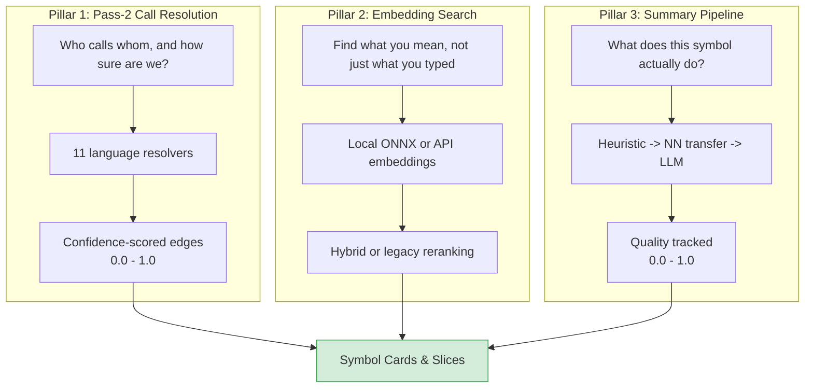

| Pillar                | Runs When                                                 | Output                             | Default State                                                                 |
| :-------------------- | :-------------------------------------------------------- | :--------------------------------- | :---------------------------------------------------------------------------- |
| **Pass-2 Resolution** | Every index (full & incremental)                          | Confidence-scored call edges       | Always on                                                                     |
| **Embedding Search**  | On `sdl.symbol.search` with `semantic: true`              | Reranked search results            | Enabled, opt-in per query                                                     |
| **Summary Pipeline**  | Every index (heuristics + NN transfer); LLM if configured | Quality-scored summaries (0.3-1.0) | Heuristics always on; NN transfer when `semantic.enabled`; LLM off by default |

---

## Pass-2 Call Resolution

### The Problem with Naive Call Detection

Pass-1 (initial indexing) extracts _raw_ call identifiers from AST nodes. When it sees `validateToken(input)`, it records a call to the name `"validateToken"` — but doesn't know _which_ `validateToken`. Is it the one from `./auth/jwt.ts`? Or the one from `./utils/validation.ts`? Or a third-party library function?

Pass-2 answers this question by tracing import chains, analyzing scope, and resolving each raw call identifier to a specific `symbolId` with a confidence score.

### Two-Pass Architecture

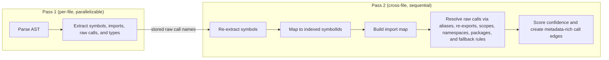

### 11 Language Resolvers

The resolver system uses a **registry pattern**. Each language registers a `Pass2Resolver` that knows its own import semantics, scope rules, and naming conventions.

| Language       | Resolver              | Key Capabilities                                                                                |
| :------------- | :-------------------- | :---------------------------------------------------------------------------------------------- |
| **TypeScript** | `TsPass2Resolver`     | Import aliases, barrel re-exports, tagged templates, TS compiler integration, namespace imports |
| **JavaScript** | `TsPass2Resolver`     | Shared with TypeScript — same module system                                                     |
| **Go**         | `GoPass2Resolver`     | Package indexing, receiver type inference, method resolution on receiver types                  |
| **Python**     | `PythonPass2Resolver` | Module path resolution, relative imports, class method lookup                                   |
| **Java**       | `JavaPass2Resolver`   | Package-based namespacing, generic type handling, inheritance chain traversal                   |
| **C#**         | `CSharpPass2Resolver` | Namespace resolution, generic types                                                             |
| **C**          | `CPass2Resolver`      | Header-based declarations, function pointer patterns                                            |
| **C++**        | `CppPass2Resolver`    | Namespace resolution, template functions, method overloads                                      |
| **PHP**        | `PhpPass2Resolver`    | Namespace resolution, use statements                                                            |
| **Rust**       | `RustPass2Resolver`   | Module system, trait method resolution                                                          |
| **Kotlin**     | `KotlinPass2Resolver` | Package imports, extension functions                                                            |
| **Shell**      | `ShellPass2Resolver`  | Function calls (limited — shell is loosely typed)                                               |

### Resolution Strategies & Confidence Scores

Every resolved call edge is tagged with a **strategy** and a **confidence score**:

| Resolution Strategy | Base Confidence | Description                                                                        |
| :------------------ | :-------------- | :--------------------------------------------------------------------------------- |
| `exact`             | `0.92`          | Direct match via compiler API, node ID, or an unambiguous import                   |
| `heuristic`         | `0.68 - 0.92`   | Single candidate by name and kind, same-package lookup, or receiver type inference |
| `unresolved`        | `0.20 - 0.35`   | Multiple candidates or no match found; placeholder edge created                    |

#### Ambiguity Penalty

When multiple candidate symbols match a call, confidence is penalized:

```text
confidence = max(0, baseline - 0.04 * candidateCount)
```

| Candidates | Result                          |
| :--------- | :------------------------------ |
| 1          | `0.92` (no penalty)             |
| 2          | `0.84` (`0.92 - 0.08`)          |
| 5          | `0.72` (`0.92 - 0.20`)          |
| 10         | `0.52` (`0.92 - 0.40`, clamped) |

### What Gets Stored Per Edge

```json
{
  "edge": "buildSlice() -> getEdgesFrom()",
  "fromSymbolId": "sha256:abc...",
  "toSymbolId": "sha256:def...",
  "edgeType": "call",
  "weight": 1.0,
  "confidence": 0.92,
  "resolution": "exact",
  "resolverId": "pass2-ts",
  "resolutionPhase": "pass2",
  "provenance": "call:getEdgesFrom"
}
```

### TypeScript: Deep Resolution Examples

The TypeScript resolver handles the most complex scenarios:

**Import Alias Resolution:**

```typescript
// File: src/handler.ts
import { validateToken as checkToken } from "./auth/jwt.js";

checkToken(input); // → resolves to validateToken in auth/jwt.ts
//   confidence: 0.92 (exact, unambiguous import)
```

**Barrel Re-export Tracing:**

```typescript
// File: src/auth/index.ts
export { validateToken } from "./jwt.js";
export { hashPassword } from "./crypto.js";

// File: src/handler.ts
import { validateToken } from "./auth/index.js";

validateToken(input); // → resolves through barrel to jwt.ts/validateToken
//   confidence: 0.90 (exact, via re-export chain)
```

**Namespace Imports:**

```typescript
import * as auth from "./auth/index.js";

auth.validateToken(input); // → resolves via namespace map
//   confidence: 0.92 (exact)
```

**Tagged Template Literals:**

```typescript
const result = sql`SELECT * FROM users WHERE id = ${userId}`;
// → resolves "sql" as a tagged template call
//   confidence: 0.35-0.50 (lower, runtime-determined)
```

### Resolution Metadata in Symbol Cards

When you request a card with `includeResolutionMetadata: true`, the response includes the full resolution chain:

```json
{
  "callResolution": {
    "minCallConfidence": 0.5,
    "calls": [
      {
        "symbolId": "sha256:abc...",
        "label": "validateToken",
        "confidence": 0.92,
        "resolutionReason": "exact",
        "resolverId": "pass2-ts",
        "resolutionPhase": "pass2"
      },
      {
        "symbolId": "sha256:def...",
        "label": "hashPassword",
        "confidence": 0.72,
        "resolutionReason": "heuristic",
        "resolverId": "pass2-ts",
        "resolutionPhase": "pass2"
      }
    ]
  }
}
```

### Filtering Low-Confidence Edges

Both `sdl.symbol.getCard` and `sdl.slice.build` accept a `minCallConfidence` parameter:

| Mode      | Threshold | Keeps                                       | Drops                          |
| :-------- | :-------- | :------------------------------------------ | :----------------------------- |
| Default   | `0.5`     | Exact edges and strong heuristics (`0.72+`) | Unresolved and weak heuristics |
| Precision | `0.8`     | Exact edges only                            | Everything below `0.8`         |
| Recall    | `0.0`     | Everything, including unresolved edges      | Nothing                        |

### Health Metric: `callResolution`

`sdl.repo.status` includes a `callResolution` health component (0.0-1.0) measuring the percentage of call edges that were resolved above the confidence threshold. A score below 0.6 indicates the pass-2 resolver is struggling with the codebase (e.g., heavy dynamic dispatch, missing type information).

---

## Semantic Search & Embeddings

### Beyond Lexical Matching

Standard symbol search is lexical: searching for `"validate"` matches `validateToken`, `validateInput`, `isValid`, etc. — ranked by string similarity. But what if you search for `"check auth credentials"`? Lexical search finds nothing. Semantic search finds `validateToken`, `authenticate`, `verifyPassword` — because it understands _meaning_.

### How It Works: Hybrid Retrieval

SDL-MCP supports two retrieval modes, controlled by `semantic.retrieval.mode`:

- **`hybrid`** — FTS + vector search fused via Reciprocal Rank Fusion (recommended)
- **`legacy`** — alpha-blended lexical + embedding rerank (original architecture)

When `semantic.retrieval.mode` is `"hybrid"` and the required database extensions are healthy, searches follow the hybrid path. If extensions or indexes are unavailable, the system automatically falls back to the legacy path.

#### Hybrid Retrieval Pipeline

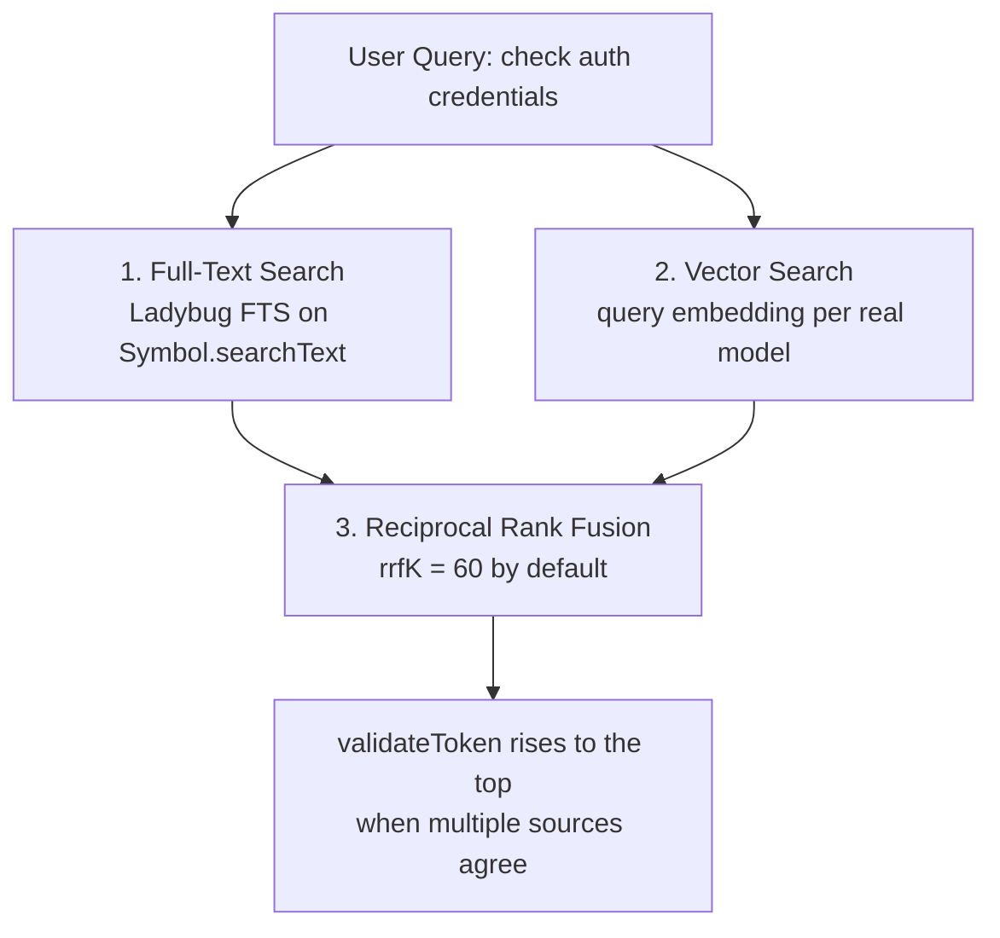

RRF is more robust than alpha-blending because it fuses _rank positions_ rather than raw scores, making it insensitive to score distribution differences between FTS and vector backends.

#### Legacy Pipeline (Alpha Blending)

The legacy path is retained as a fallback and can be explicitly selected via `semantic.retrieval.mode: "legacy"`:

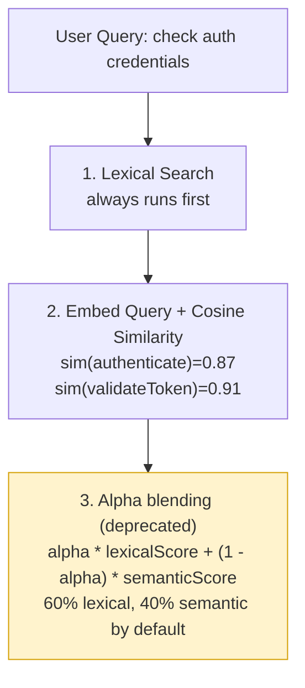

> **Deprecation notice**: `semantic.alpha` is deprecated in favor of `semantic.retrieval.fusion`. The legacy alpha-blending path remains functional but is no longer the recommended default.

#### Automatic Fallback

The hybrid retrieval system performs health checks before each search. If the Ladybug `fts` or `vector` extensions are unavailable, or if indexes are unhealthy, it automatically falls back to the legacy path and records the fallback reason in telemetry. This ensures `symbol.search` and `slice.build` remain functional in all environments.

#### Retrieval Evidence

When `includeRetrievalEvidence: true` is passed to `symbol.search` or `slice.build`, the response includes detailed evidence about how results were retrieved:

```json
{
  "retrievalEvidence": {
    "mode": "hybrid",
    "ftsAvailable": true,
    "vectorAvailable": true,
    "candidateCountPerSource": {
      "fts": 42,
      "vector:all-MiniLM-L6-v2": 38,
      "vector:nomic-embed-text-v1.5": 35
    },
    "fusionLatencyMs": 12,
    "fallbackReason": null
  }
}
```

If a fallback occurred, `mode` is `"legacy"` and `fallbackReason` explains why (e.g., `"fts extension not loaded"`, `"vector index unhealthy"`).

### Three Embedding Models

SDL-MCP ships with three embedding models, each suited to different workflows:

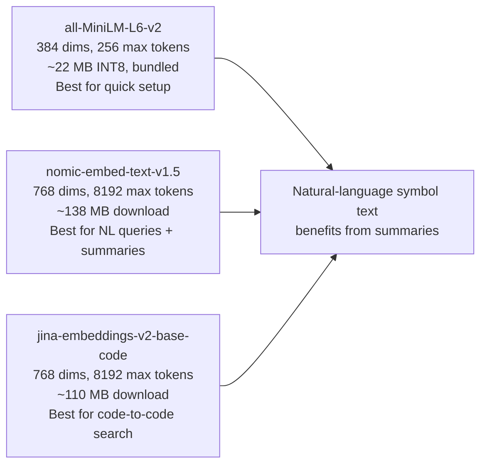

**Which should you choose?**

| If you...                            | Use                                                          |
| :----------------------------------- | :----------------------------------------------------------- |
| Want zero setup, no downloads        | `all-MiniLM-L6-v2` (bundled in npm)                          |
| Want better quality, longer context  | `nomic-embed-text-v1.5` (768-dim, 8192 tokens)               |
| Work with multi-language codebases   | `jina-embeddings-v2-base-code` (trained on 30+ languages)    |
| Have LLM summaries enabled           | MiniLM or Nomic (text models benefit most from NL summaries) |
| Have a large codebase (>10k symbols) | `all-MiniLM-L6-v2` (smaller vectors = faster ANN)            |
| Want the best NL query quality       | `nomic-embed-text-v1.5` + LLM summaries                      |
| Want the best code similarity        | `jina-embeddings-v2-base-code`                               |

### Three Embedding Providers

| Provider              | How It Works                                | When to Use                           |
| :-------------------- | :------------------------------------------ | :------------------------------------ |
| **`local`** (default) | ONNX runtime on your machine, fully offline | Most users — no API keys needed       |
| **`api`**             | Anthropic API                               | Enterprise environments               |
| **`mock`**            | Deterministic hash-based vectors (64-dim)   | Testing, CI, when ONNX is unavailable |

The local provider uses `onnxruntime-node` and `tokenizers` (optional dependencies). If they're not installed, it gracefully falls back to mock embeddings.

### Embedding Storage

Embeddings are stored as **inline properties on Symbol nodes** in LadybugDB. Each model gets its own set of properties:

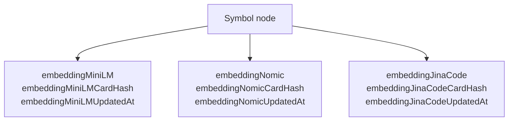

Vectors are compressed for storage: `Float32 -> multiply by 10,000 -> round to Int16 -> base64 encode` (~50% savings vs raw float32, negligible precision loss for cosine similarity).

Each embedding is tagged with a `cardHash` (SHA-256 of the symbol data + text format used). When the symbol changes or the text format changes, the embedding is automatically refreshed during indexing.

> **Migration note**: Prior to the hybrid retrieval rollout, embeddings were stored in a separate `SymbolEmbedding` node table. Migration m007 automatically copies embeddings to the inline Symbol properties. The old `SymbolEmbedding` table is deprecated and will be removed in a future release.

### Vector Indexes

Hybrid retrieval uses native Ladybug vector indexes for fast approximate nearest-neighbor search at query time:

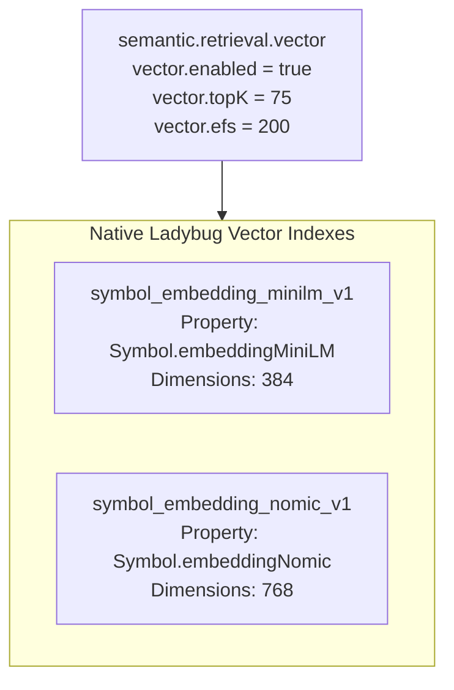

> **Removed in v0.10.1**: The previous `semantic.ann` config (HNSW sidecar indexes via `ann-index.ts`) has been removed. Use `semantic.retrieval.vector` for native Ladybug vector indexes instead. Legacy `semantic.ann` config keys are silently ignored for backward compatibility.

### Live Overlay Handling

When files have unsaved edits (via the live buffer system), their symbols may not have embeddings or vector index entries yet. Both hybrid and legacy search flows handle this:

1. **Durable symbols** (saved, indexed): retrieved via hybrid FTS + vector search (or legacy reranking)
2. **Overlay symbols** (unsaved edits): retrieved via lexical overlay search, keeping original ranking
3. **Merged result**: hybrid/reranked durable symbols first, then overlay symbols in original order — overlay symbols are never suppressed by fusion

This ensures unsaved code always appears in results, just without hybrid retrieval boosting.

---

## Symbol Summary Pipeline

### What They Are

A symbol summary is a 1-3 sentence plain-English description of what a symbol does:

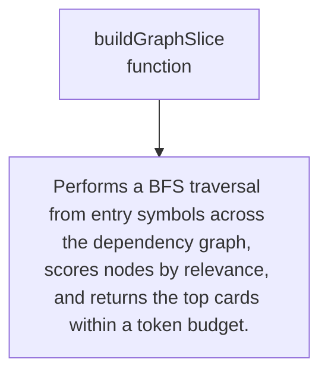

These summaries serve two purposes:

1. **For agents**: instant understanding without reading code (Rung 1 of the Iris Gate Ladder)
2. **For embeddings**: richer text input for the MiniLM model, producing better semantic search results

### Summary Quality Scoring

Every symbol carries a `summaryQuality` (0.0-1.0) score and a `summarySource` field tracking provenance. Higher quality means the summary is more trustworthy and informative.

| Source               | Quality | `summarySource`         | When                                      |
| :------------------- | :------ | :---------------------- | :---------------------------------------- |
| JSDoc / doc comment  | `1.0`   | `jsdoc`                 | Extracted from code comments              |
| LLM-generated        | `0.8`   | `llm`                   | API call (Claude Haiku, Ollama)           |
| NN direct transfer   | `0.6`   | `nn-direct:<symbolId>`  | Neighbor similarity >= `0.85`             |
| NN adapted transfer  | `0.5`   | `nn-adapted:<symbolId>` | Neighbor similarity `0.70-0.85`           |
| Heuristic (typed)    | `0.4`   | `heuristic-typed`       | Functions or methods with parameter types |
| Heuristic (fallback) | `0.3`   | `heuristic-fallback`    | Pattern-matched from name and kind        |
| No summary           | `0.0`   | `unknown`               | No information available                  |

Quality scores flow through the pipeline - each stage only overwrites if it can produce a higher-quality summary. The LLM stage uses quality gating: symbols with `summaryQuality >= 0.8` (for example from JSDoc) are skipped, avoiding redundant API calls.

### Enhanced Heuristic Generation (Tier 1.5)

The heuristic summary engine generates pattern-matched summaries for **all symbol kinds**, not just functions. These run automatically during every index - no configuration required.

| Symbol Kind           | Pattern                                        | Example Output                              |
| :-------------------- | :--------------------------------------------- | :------------------------------------------ |
| `function` / `method` | Typed params plus return type                  | `Validates token using string`              |
| `class`               | Role suffix such as `Provider` or `Factory`    | `Implements the provider pattern for auth`  |
| `class`               | Generic type parameters                        | `Generic cache class parameterized by K, V` |
| `interface`           | `I` prefix like `IUserService`                 | `Contract for user service`                 |
| `interface`           | Suffix such as `Props`, `Options`, or `Config` | `Props definition for button`               |
| `type`                | Suffix plus generics                           | `Result type for query`                     |
| `enum`                | Name expansion                                 | `Enumeration of log level values`           |
| `variable`            | `SCREAMING_SNAKE_CASE`                         | `Constant defining max retries`             |
| `variable`            | `Schema` or `Validator` suffix                 | `Validation schema for user`                |
| `constructor`         | Typed parameters                               | `Constructs from string and number`         |

Both the TypeScript and Rust indexing engines implement these generators with identical output, ensuring consistent summaries regardless of which engine is used.

### NN Summary Transfer

When `semantic.enabled: true`, the NN (nearest-neighbor) summary transfer module runs after metrics computation and before LLM generation. It uses the existing ONNX embedding model and vector similarity search to propagate documentation from well-documented symbols to undocumented neighbors.

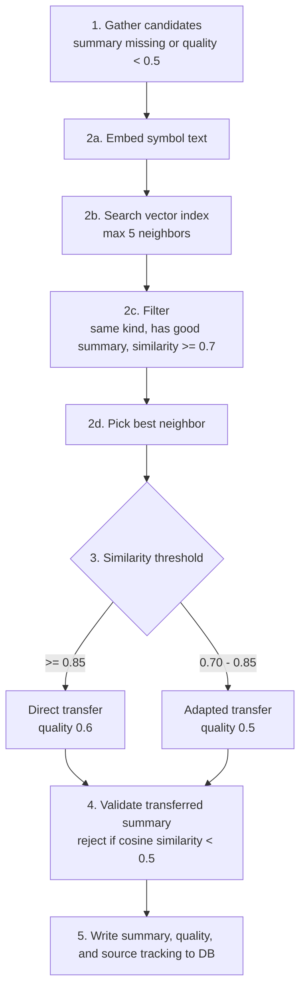

**Adapted transfer example:**
A well-documented function `validateToken` with summary "Validates JWT signature and checks expiration" can donate its verb pattern to a neighbor `validateSession`. The adapted summary becomes "Validates session" - not perfect, but far better than no summary at all (quality 0.5 vs 0.0).

**Pipeline integration point:**

```text
1. updateMetricsForRepo(...)
2. NN summary transfer
3. LLM summary generation (quality-gated: skips quality >= 0.8)
4. refreshSymbolEmbeddings(...)
```

### LLM Generation Pipeline

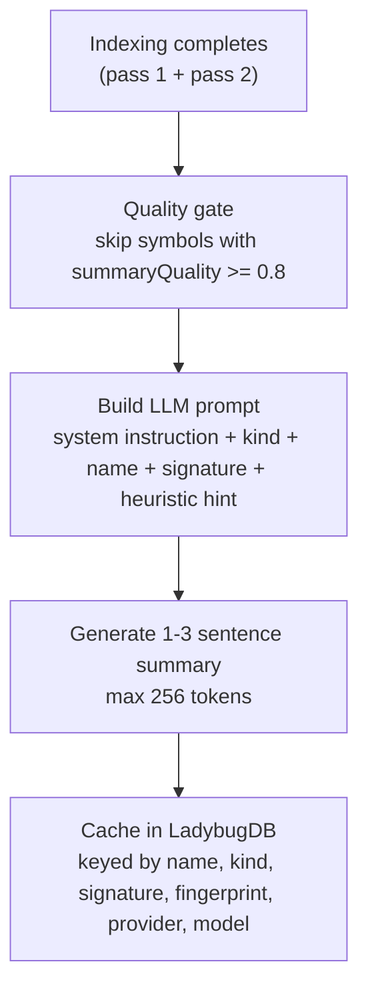

### Three Summary Providers

| Provider                        | Model (default)             | Endpoint                   | Best For                               |
| :------------------------------ | :-------------------------- | :------------------------- | :------------------------------------- |
| **`api`** (Anthropic)           | `claude-haiku-4-5-20251001` | `api.anthropic.com`        | Production (fast, cheap, high quality) |
| **`local`** (OpenAI-compatible) | `gpt-4o-mini`               | `localhost:11434` (Ollama) | Offline / air-gapped environments      |
| **`mock`**                      | —                           | —                          | Testing, CI pipelines                  |

### Batch Processing

Summaries are generated in configurable batches with concurrency control:

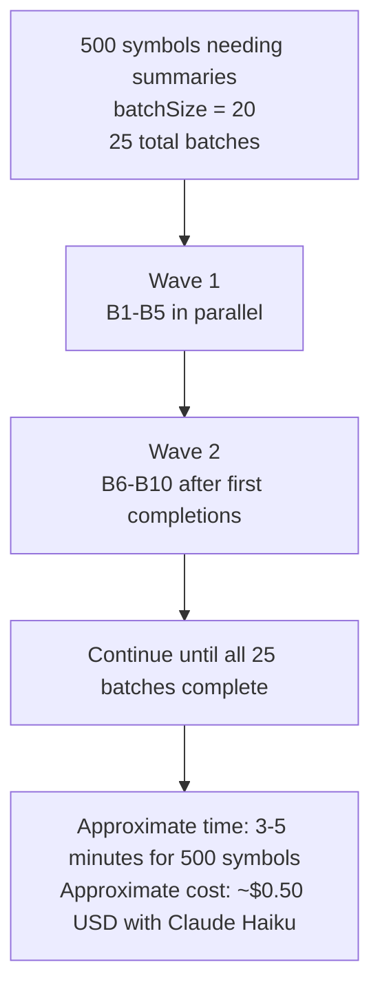

### Cache Invalidation

The cache key is a SHA-256 hash of `name | kind | signature | astFingerprint | provider | model`. This means:

| Change                                        | Invalidates Cache? |
| :-------------------------------------------- | :----------------: |
| Code body changes (different AST fingerprint) |        Yes         |
| Signature changes (new parameter)             |        Yes         |
| Rename the symbol                             |        Yes         |
| Switch from Haiku to GPT-4o-mini              |        Yes         |
| Whitespace-only change (same fingerprint)     |         No         |
| Unrelated file changes                        |         No         |

### Cost Tracking

Every generated summary records its estimated API cost:

```
  estimatedTokens = max(1, ceil(summary.length / 4))
  costUsd = estimatedTokens × $0.000002

  Example: 200-char summary ≈ 50 tokens ≈ $0.0001

  A 1,000-symbol repo ≈ $1.00 for first index
  Incremental re-index: only changed symbols → cents
```

### Summary Compatibility

All three supported embedding models (`all-MiniLM-L6-v2`, `nomic-embed-text-v1.5`, and `jina-embeddings-v2-base-code`) benefit from LLM summaries. When `generateSummaries: true` is set, summaries are generated and embedded for all models, producing higher-quality semantic search results. Note that `jina-embeddings-v2-base-code` is already optimized for code semantics, so the improvement from summaries may be less dramatic than with the general-purpose models.

---

## Configuration Reference

### Full Semantic Config Block

```jsonc
{
  "semantic": {
    // ── Master Switch ──
    "enabled": true, // Enable semantic features globally

    // ── Embedding Configuration ──
    "provider": "local", // "local" (ONNX), "api", or "mock"
    "model": "all-MiniLM-L6-v2", // or "nomic-embed-text-v1.5" or "jina-embeddings-v2-base-code"
    "modelCacheDir": null, // Custom model cache directory
    "alpha": 0.6, // Lexical/semantic blend (0=pure semantic, 1=pure lexical)

    // ── Summary Configuration ──
    "generateSummaries": false, // Enable LLM summary generation
    "summaryProvider": null, // null = inherit from "provider"
    "summaryModel": null, // null = provider default
    "summaryApiKey": null, // null = use ANTHROPIC_API_KEY env var
    "summaryApiBaseUrl": null, // null = provider default
    "summaryMaxConcurrency": 5, // 1-20, parallel batch workers
    "summaryBatchSize": 20, // 1-50, symbols per batch

    // ── ANN Index (Removed in v0.10.1 — silently ignored) ──
    // "ann": { "enabled": true, "m": 16, ... }
    // Use retrieval.vector instead for HNSW index configuration.
  },
}
```

### Quick Config Recipes

**Recipe 1: Fully offline (no API keys needed)**

```json
{
  "semantic": {
    "enabled": true,
    "provider": "local",
    "model": "nomic-embed-text-v1.5",
    "generateSummaries": false
  }
}
```

**Recipe 2: Best quality with Claude Haiku summaries**

```json
{
  "semantic": {
    "enabled": true,
    "provider": "local",
    "model": "nomic-embed-text-v1.5",
    "generateSummaries": true,
    "summaryProvider": "api",
    "summaryModel": "claude-haiku-4-5-20251001"
  }
}
```

Set `ANTHROPIC_API_KEY` in your environment.

**Recipe 3: Code-specialized embeddings (best for code search)**

```json
{
  "semantic": {
    "enabled": true,
    "provider": "local",
    "model": "jina-embeddings-v2-base-code",
    "generateSummaries": false
  }
}
```

Downloads ~110 MB on first run. Trained on 30+ programming languages — best choice when searching for similar code patterns.

**Recipe 4: Local LLM via Ollama**

```json
{
  "semantic": {
    "enabled": true,
    "provider": "local",
    "model": "all-MiniLM-L6-v2",
    "generateSummaries": true,
    "summaryProvider": "local",
    "summaryModel": "llama3.2",
    "summaryApiBaseUrl": "http://localhost:11434/v1",
    "summaryApiKey": "ollama"
  }
}
```

**Recipe 5: CI / testing (no dependencies)**

```json
{
  "semantic": {
    "enabled": true,
    "provider": "mock",
    "generateSummaries": false
  }
}
```

---

## Practical Examples

### Example 1: Semantic Search in Action

```bash
# Standard lexical search
sdl.symbol.search({
  repoId: "my-app",
  query: "check auth credentials"
})
# Result: checkPermissions, AuthChecker  (string matches only)

# Semantic search (uses hybrid retrieval when available)
sdl.symbol.search({
  repoId: "my-app",
  query: "check auth credentials",
  semantic: true
})
# Result: validateToken, authenticate, verifyPassword
#         (understands meaning, not just string matching)
#
# With hybrid retrieval enabled, this query runs FTS + vector
# search in parallel and fuses results via RRF. Falls back to
# legacy alpha-blending if extensions are unavailable.
```

### Example 2: Inspecting Call Resolution

```bash
# Get a card with full resolution metadata
sdl.symbol.getCard({
  repoId: "my-app",
  symbolId: "sha256:abc...",
  includeResolutionMetadata: true
})

# Response includes:
# {
#   "callResolution": {
#     "calls": [
#       {
#         "label": "validateToken",
#         "confidence": 0.92,
#         "resolutionReason": "exact",
#         "resolverId": "pass2-ts"
#       },
#       {
#         "label": "logAuditEvent",
#         "confidence": 0.45,
#         "resolutionReason": "heuristic",
#         "resolverId": "pass2-ts"
#       }
#     ]
#   }
# }
```

### Example 3: Filtering Noise with Confidence

```bash
# Precision mode: only high-confidence edges
sdl.slice.build({
  repoId: "my-app",
  taskText: "debug the auth flow",
  minCallConfidence: 0.8,
  budget: { maxCards: 30 }
})
# Slice contains only symbols connected by high-confidence call edges
# No "maybe" dependencies cluttering the context

# Recall mode: see everything, including uncertain edges
sdl.slice.build({
  repoId: "my-app",
  taskText: "debug the auth flow",
  minCallConfidence: 0.0,
  budget: { maxCards: 50 }
})
# Slice includes unresolved calls — useful for finding
# dynamically dispatched dependencies
```

### Example 4: Index with Summaries

```bash
# First, configure summaries in your config file
# Then run an index:
sdl-mcp index --repo-id my-app

# Output:
# [indexing] Extracted 847 symbols from 92 files
# [pass2] Resolved 1,204 call edges (89% exact, 8% heuristic, 3% unresolved)
# [summaries] Generated 312 summaries, 535 cached, 0 failed ($0.62)
# [embeddings] Computed 847 embeddings (all-MiniLM-L6-v2)
# [ann] Built HNSW index (847 vectors, 384 dims)
# [finalize] Version v47 committed
```

### Example 5: Context Summary Using Semantic Data

```bash
# Generate a portable context briefing
sdl.context.summary({
  repoId: "my-app",
  query: "authentication middleware",
  budget: 2000,
  format: "markdown"
})

# Returns a structured briefing with:
# - Key symbols (with LLM summaries!)
# - Dependency graph
# - Risk areas (high fan-in, recent churn)
# - Files touched
# All within the 2,000 token budget
```

### Example 6: Checking Semantic Health

```bash
sdl.repo.status({ repoId: "my-app" })

# Look for:
# {
#   "healthComponents": {
#     "callResolution": 0.89  ← 89% of calls resolved above threshold
#   }
# }
#
# If this is below 0.6, your pass-2 resolver may be struggling.
# Common causes:
# - Heavy use of dynamic dispatch (eval, Proxy, reflection)
# - Missing type information (plain JS without JSDoc)
# - Unusual import patterns not covered by resolvers
```

### Example 7: Hybrid Retrieval with Evidence

```bash
# Search with retrieval evidence to see how results were found
sdl.symbol.search({
  repoId: "my-app",
  query: "check auth credentials",
  semantic: true,
  includeRetrievalEvidence: true
})

# Response includes per-result evidence:
# {
#   "symbols": [...],
#   "retrievalEvidence": {
#     "mode": "hybrid",
#     "ftsAvailable": true,
#     "vectorAvailable": true,
#     "candidateCountPerSource": {
#       "fts": 42,
#       "vector:all-MiniLM-L6-v2": 38,
#       "vector:nomic-embed-text-v1.5": 35
#     },
#     "fusionLatencyMs": 12,
#     "fallbackReason": null
#   }
# }
#
# If hybrid is unavailable, mode is "legacy" with a fallbackReason:
# "fallbackReason": "vector extension not loaded"
```

### Example 8: Configuring Hybrid Retrieval

```jsonc
{
  "semantic": {
    "enabled": true,
    "provider": "local",
    "model": "nomic-embed-text-v1.5",

    // Hybrid retrieval replaces alpha-blending
    "retrieval": {
      "mode": "hybrid", // "hybrid" or "legacy"
      "fts": {
        "enabled": true, // Full-text search on Symbol.searchText
        "topK": 75, // Max FTS candidates
      },
      "vector": {
        "enabled": true, // Vector search on Symbol embeddings
        "topK": 75, // Max vector candidates per model
        "efs": 200, // Query-time accuracy parameter
      },
      "fusion": {
        "strategy": "rrf", // Reciprocal Rank Fusion
        "rrfK": 60, // RRF smoothing constant
      },
      "candidateLimit": 100, // Max candidates after fusion
    },
  },
}
```

---

## How the Three Pillars Work Together

The real power emerges when all three pillars reinforce each other:

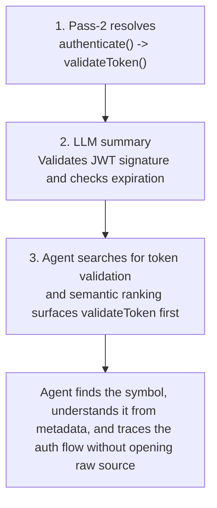

This is how SDL-MCP achieves 10-50x token savings: the semantic engine provides _understanding_ at the metadata level, so raw code is rarely needed.

## Related Documentation

- [Symbol Cards & Indexing](./indexing-languages.md) — How symbols are extracted and enriched
- [Iris Gate Ladder](./iris-gate-ladder.md) — How summaries power Rung 1
- [Graph Slicing](./graph-slicing.md) — How confidence-scored edges shape slices
- [MCP Tools Reference](../mcp-tools-detailed.md) — Full API documentation
- [Configuration Reference](../configuration-reference.md) — All config options

[Back to README](../../README.md)
