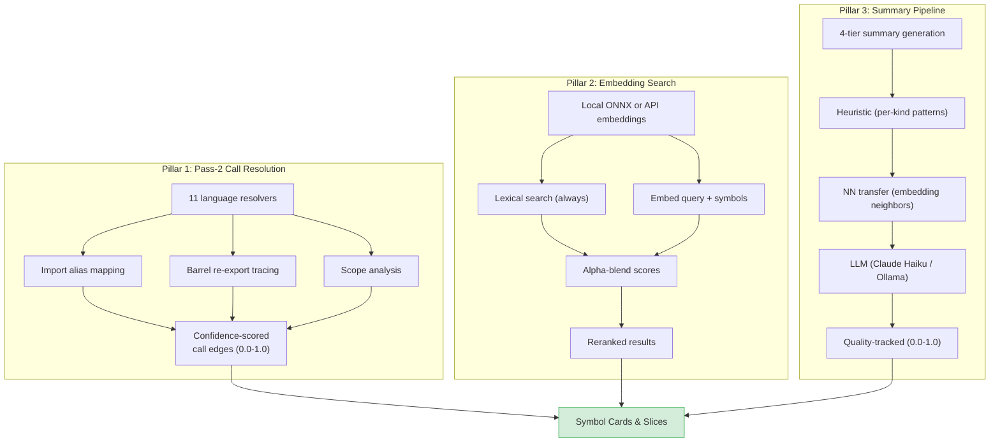

# The Semantic Engine: How SDL-MCP Understands Your Code

[Back to README](../../README.md)

---

SDL-MCP doesn't just parse syntax — it *understands* your code. Three interconnected subsystems form the **semantic engine**: a multi-language call resolver that traces dependencies with confidence scoring, an embedding-powered search reranker that finds what you mean (not just what you typed), and an LLM summary generator that describes what symbols do in plain English.

This document covers all three in depth, with architecture diagrams, configuration examples, and practical usage patterns.

---

## Table of Contents

1. [Overview: The Three Pillars](#overview-the-three-pillars)
2. [Pass-2 Call Resolution](#pass-2-call-resolution)
3. [Semantic Search & Embeddings](#semantic-search--embeddings)
4. [LLM Symbol Summaries](#llm-symbol-summaries)
5. [Configuration Reference](#configuration-reference)
6. [Practical Examples](#practical-examples)

---

## Overview: The Three Pillars

```
  ┌───────────────────────────────────────────────────────────────────┐
  │                    SDL-MCP Semantic Engine                        │
  │                                                                   │
  │  ┌─────────────────┐  ┌──────────────────┐  ┌─────────────────┐  │
  │  │   Pass-2 Call    │  │    Embedding     │  │    Summary      │  │
  │  │   Resolution     │  │    Search        │  │    Pipeline     │  │
  │  │                  │  │                  │  │                 │  │
  │  │ "Who calls whom, │  │ "Find what you   │  │ "What does this │  │
  │  │  and how sure    │  │  mean, not just  │  │  symbol actually│  │
  │  │  are we?"        │  │  what you typed" │  │  do?"           │  │
  │  │                  │  │                  │  │                 │  │
  │  │ 11 language      │  │ Local ONNX or    │  │ 4-tier pipeline:│  │
  │  │ resolvers        │  │ API embeddings   │  │ heuristic → NN  │  │
  │  │                  │  │                  │  │ transfer → LLM  │  │
  │  │ Confidence:      │  │ Alpha-blended    │  │ Quality-tracked │  │
  │  │ 0.0 - 1.0        │  │ lexical+semantic │  │ (0.0 - 1.0)     │  │
  │  └────────┬─────────┘  └────────┬─────────┘  └────────┬────────┘  │
  │           │                     │                      │          │
  │           ▼                     ▼                      ▼          │
  │  ┌──────────────────────────────────────────────────────────────┐ │
  │  │                    Symbol Cards & Slices                     │ │
  │  │  Every card benefits: accurate deps, smart search, summaries│ │
  │  └──────────────────────────────────────────────────────────────┘ │
  └───────────────────────────────────────────────────────────────────┘
```



| Pillar | Runs When | Output | Default State |
|:-------|:----------|:-------|:--------------|
| **Pass-2 Resolution** | Every index (full & incremental) | Confidence-scored call edges | Always on |
| **Embedding Search** | On `sdl.symbol.search` with `semantic: true` | Reranked search results | Enabled, opt-in per query |
| **Summary Pipeline** | Every index (heuristics + NN transfer); LLM if configured | Quality-scored summaries (0.3-1.0) | Heuristics always on; NN transfer when `semantic.enabled`; LLM off by default |

---

## Pass-2 Call Resolution

### The Problem with Naive Call Detection

Pass-1 (initial indexing) extracts *raw* call identifiers from AST nodes. When it sees `validateToken(input)`, it records a call to the name `"validateToken"` — but doesn't know *which* `validateToken`. Is it the one from `./auth/jwt.ts`? Or the one from `./utils/validation.ts`? Or a third-party library function?

Pass-2 answers this question by tracing import chains, analyzing scope, and resolving each raw call identifier to a specific `symbolId` with a confidence score.

### Two-Pass Architecture

```
  PASS 1 (per-file, parallelizable)         PASS 2 (cross-file, sequential)
  ──────────────────────────────────         ─────────────────────────────────

  ┌──────────────┐                           ┌──────────────────────────────┐
  │  Parse AST   │                           │  For each file with calls:   │
  │              │                           │                              │
  │  Extract:    │                           │  1. Re-extract symbols       │
  │  • symbols   │                           │  2. Map to indexed symbolIds │
  │  • imports   │  ─────── stored ───────►  │  3. Build import map         │
  │  • raw calls │  (names only, no IDs)     │  4. For each raw call:       │
  │  • types     │                           │     • Check import aliases   │
  │              │                           │     • Check barrel re-exports│
  │              │                           │     • Check same-file scope  │
  │              │                           │     • Check namespace imports│
  │              │                           │     • Check package/module   │
  │              │                           │     • Check global fallback  │
  └──────────────┘                           │  5. Score confidence         │
                                             │  6. Create edge with metadata│
                                             └──────────────────────────────┘
```

### 11 Language Resolvers

The resolver system uses a **registry pattern**. Each language registers a `Pass2Resolver` that knows its own import semantics, scope rules, and naming conventions.

| Language | Resolver | Key Capabilities |
|:---------|:---------|:-----------------|
| **TypeScript** | `TsPass2Resolver` | Import aliases, barrel re-exports, tagged templates, TS compiler integration, namespace imports |
| **JavaScript** | `TsPass2Resolver` | Shared with TypeScript — same module system |
| **Go** | `GoPass2Resolver` | Package indexing, receiver type inference, method resolution on receiver types |
| **Python** | `PythonPass2Resolver` | Module path resolution, relative imports, class method lookup |
| **Java** | `JavaPass2Resolver` | Package-based namespacing, generic type handling, inheritance chain traversal |
| **C#** | `CSharpPass2Resolver` | Namespace resolution, generic types |
| **C** | `CPass2Resolver` | Header-based declarations, function pointer patterns |
| **C++** | `CppPass2Resolver` | Namespace resolution, template functions, method overloads |
| **PHP** | `PhpPass2Resolver` | Namespace resolution, use statements |
| **Rust** | `RustPass2Resolver` | Module system, trait method resolution |
| **Kotlin** | `KotlinPass2Resolver` | Package imports, extension functions |
| **Shell** | `ShellPass2Resolver` | Function calls (limited — shell is loosely typed) |

### Resolution Strategies & Confidence Scores

Every resolved call edge is tagged with a **strategy** and a **confidence score**:

```
  Resolution Strategy         Base Confidence    Description
  ─────────────────────────   ───────────────    ──────────────────────────────────
  exact                       0.92               Direct match via compiler API,
                                                 node ID, or unambiguous import

  heuristic                   0.68 - 0.92        Single candidate by name+kind,
                                                 same-package lookup, receiver
                                                 type inference

  unresolved                  0.20 - 0.35        Multiple candidates or no match
                                                 found; placeholder edge created
```

#### Ambiguity Penalty

When multiple candidate symbols match a call, confidence is penalized:

```
  confidence = max(0, baseline - 0.04 × candidateCount)

  Examples:
  ┌──────────────────────────────────────────────────────┐
  │  1 candidate  →  0.92 (no penalty)                   │
  │  2 candidates →  0.84 (0.92 - 0.08)                  │
  │  5 candidates →  0.72 (0.92 - 0.20)                  │
  │ 10 candidates →  0.52 (0.92 - 0.40, clamped)         │
  └──────────────────────────────────────────────────────┘
```

### What Gets Stored Per Edge

```
  ┌─────────────────────────────────────────────────────────────┐
  │  Edge: buildSlice() ──calls──► getEdgesFrom()              │
  │─────────────────────────────────────────────────────────────│
  │  fromSymbolId:    "sha256:abc..."                           │
  │  toSymbolId:      "sha256:def..."                           │
  │  edgeType:        "call"                                    │
  │  weight:          1.0            (0.5 for unresolved)       │
  │  confidence:      0.92                                      │
  │  resolution:      "exact"                                   │
  │  resolverId:      "pass2-ts"                                │
  │  resolutionPhase: "pass2"                                   │
  │  provenance:      "call:getEdgesFrom"                       │
  └─────────────────────────────────────────────────────────────┘
```

### TypeScript: Deep Resolution Examples

The TypeScript resolver handles the most complex scenarios:

**Import Alias Resolution:**
```typescript
// File: src/handler.ts
import { validateToken as checkToken } from "./auth/jwt.js";

checkToken(input);  // → resolves to validateToken in auth/jwt.ts
                    //   confidence: 0.92 (exact, unambiguous import)
```

**Barrel Re-export Tracing:**
```typescript
// File: src/auth/index.ts
export { validateToken } from "./jwt.js";
export { hashPassword } from "./crypto.js";

// File: src/handler.ts
import { validateToken } from "./auth/index.js";

validateToken(input);  // → resolves through barrel to jwt.ts/validateToken
                       //   confidence: 0.90 (exact, via re-export chain)
```

**Namespace Imports:**
```typescript
import * as auth from "./auth/index.js";

auth.validateToken(input);  // → resolves via namespace map
                            //   confidence: 0.92 (exact)
```

**Tagged Template Literals:**
```typescript
const result = sql`SELECT * FROM users WHERE id = ${userId}`;
// → resolves "sql" as a tagged template call
//   confidence: 0.35-0.50 (lower, runtime-determined)
```

### Resolution Metadata in Symbol Cards

When you request a card with `includeResolutionMetadata: true`, the response includes the full resolution chain:

```json
{
  "callResolution": {
    "minCallConfidence": 0.5,
    "calls": [
      {
        "symbolId": "sha256:abc...",
        "label": "validateToken",
        "confidence": 0.92,
        "resolutionReason": "exact",
        "resolverId": "pass2-ts",
        "resolutionPhase": "pass2"
      },
      {
        "symbolId": "sha256:def...",
        "label": "hashPassword",
        "confidence": 0.72,
        "resolutionReason": "heuristic",
        "resolverId": "pass2-ts",
        "resolutionPhase": "pass2"
      }
    ]
  }
}
```

### Filtering Low-Confidence Edges

Both `sdl.symbol.getCard` and `sdl.slice.build` accept a `minCallConfidence` parameter:

```
  minCallConfidence: 0.5 (default)
  ───────────────────────────────────────
  Keeps:  exact (0.92), strong heuristic (0.72+)
  Drops:  unresolved (0.20-0.35), weak heuristic

  minCallConfidence: 0.8 (precision mode)
  ───────────────────────────────────────
  Keeps:  exact (0.92) only
  Drops:  everything below 0.8

  minCallConfidence: 0.0 (recall mode)
  ───────────────────────────────────────
  Keeps:  everything, including unresolved
```

### Health Metric: `callResolution`

`sdl.repo.status` includes a `callResolution` health component (0.0-1.0) measuring the percentage of call edges that were resolved above the confidence threshold. A score below 0.6 indicates the pass-2 resolver is struggling with the codebase (e.g., heavy dynamic dispatch, missing type information).

---

## Semantic Search & Embeddings

### Beyond Lexical Matching

Standard symbol search is lexical: searching for `"validate"` matches `validateToken`, `validateInput`, `isValid`, etc. — ranked by string similarity. But what if you search for `"check auth credentials"`? Lexical search finds nothing. Semantic search finds `validateToken`, `authenticate`, `verifyPassword` — because it understands *meaning*.

### How It Works: Hybrid Retrieval

SDL-MCP supports two retrieval modes, controlled by `semantic.retrieval.mode`:

- **`hybrid`** — FTS + vector search fused via Reciprocal Rank Fusion (recommended)
- **`legacy`** — alpha-blended lexical + embedding rerank (original architecture)

When `semantic.retrieval.mode` is `"hybrid"` and the required database extensions are healthy, searches follow the hybrid path. If extensions or indexes are unavailable, the system automatically falls back to the legacy path.

#### Hybrid Retrieval Pipeline

```
  User Query: "check auth credentials"
       │
       ▼
  ┌──────────────────────────────────────────────────────┐
  │  1. Full-Text Search (FTS)                           │
  │     Ladybug FTS index on Symbol.searchText           │
  │     → authenticate, AuthService, checkPermissions    │
  │     Ranked by FTS relevance score                    │
  └─────────────────────┬────────────────────────────────┘
                        │
                        │  (runs in parallel)
                        │
  ┌──────────────────────────────────────────────────────┐
  │  2. Vector Search (per real model)                   │
  │     Embed query → search Ladybug vector index        │
  │                                                      │
  │     MiniLM (384-dim):                                │
  │       validateToken  (0.91), authenticate (0.87)     │
  │     Nomic (768-dim):                                 │
  │       validateToken  (0.93), verifyPassword (0.85)   │
  │                                                      │
  │     One query embedding generated per real model      │
  └─────────────────────┬────────────────────────────────┘
                        │
                        ▼
  ┌──────────────────────────────────────────────────────┐
  │  3. Reciprocal Rank Fusion (RRF)                     │
  │                                                      │
  │  score(d) = Σ  1 / (k + rank_i(d))                  │
  │             sources                                  │
  │                                                      │
  │  With k = 60 (default):                              │
  │  Each source contributes a rank-based score.         │
  │  Symbols ranked highly by multiple sources rise      │
  │  to the top, even if no single source ranked them #1 │
  │                                                      │
  │  Sources: fts, vector:minilm, vector:nomic           │
  │                                                      │
  │  Result: validateToken rises to #1                   │
  │  (top-ranked in both FTS and vector search)          │
  └──────────────────────────────────────────────────────┘
```

RRF is more robust than alpha-blending because it fuses *rank positions* rather than raw scores, making it insensitive to score distribution differences between FTS and vector backends.

#### Legacy Pipeline (Alpha Blending)

The legacy path is retained as a fallback and can be explicitly selected via `semantic.retrieval.mode: "legacy"`:

```
  User Query: "check auth credentials"
       │
       ▼
  ┌──────────────────────────────────────────────────────┐
  │  1. Lexical Search (always runs first)               │
  │     Ranked by string similarity                      │
  └─────────────────────┬────────────────────────────────┘
                        │
                        ▼  (if semantic: true)
  ┌──────────────────────────────────────────────────────┐
  │  2. Embed Query + Cosine Similarity                  │
  │     sim(query, authenticate) = 0.87                  │
  │     sim(query, validateToken) = 0.91                 │
  └─────────────────────┬────────────────────────────────┘
                        │
                        ▼
  ┌──────────────────────────────────────────────────────┐
  │  3. Alpha Blending (deprecated)                      │
  │                                                      │
  │  finalScore = α × lexicalScore + (1-α) × semantic    │
  │                                                      │
  │  With α = 0.6 (default):                             │
  │  60% lexical weight + 40% semantic weight            │
  └──────────────────────────────────────────────────────┘
```

> **Deprecation notice**: `semantic.alpha` is deprecated in favor of `semantic.retrieval.fusion`. The legacy alpha-blending path remains functional but is no longer the recommended default.

#### Automatic Fallback

The hybrid retrieval system performs health checks before each search. If the Ladybug `fts` or `vector` extensions are unavailable, or if indexes are unhealthy, it automatically falls back to the legacy path and records the fallback reason in telemetry. This ensures `symbol.search` and `slice.build` remain functional in all environments.

#### Retrieval Evidence

When `includeRetrievalEvidence: true` is passed to `symbol.search` or `slice.build`, the response includes detailed evidence about how results were retrieved:

```json
{
  "retrievalEvidence": {
    "mode": "hybrid",
    "ftsAvailable": true,
    "vectorAvailable": true,
    "candidateCountPerSource": {
      "fts": 42,
      "vector:all-MiniLM-L6-v2": 38,
      "vector:nomic-embed-text-v1.5": 35
    },
    "fusionLatencyMs": 12,
    "fallbackReason": null
  }
}
```

If a fallback occurred, `mode` is `"legacy"` and `fallbackReason` explains why (e.g., `"fts extension not loaded"`, `"vector index unhealthy"`).

### Two Embedding Models

SDL-MCP ships with two embedding models, each suited to different workflows:

```
  ┌────────────────────────────────────────────────────────────────┐
  │                    all-MiniLM-L6-v2 (Default)                  │
  │────────────────────────────────────────────────────────────────│
  │  Dimensions:    384                                            │
  │  Max tokens:    256                                            │
  │  Size:          ~22 MB (INT8 quantized ONNX)                   │
  │  Bundled:       YES (included in npm package)                  │
  │  Training:      General sentence embeddings                    │
  │  Best for:      Quick setup, small codebases, free tier       │
  │                                                                │
  │  Text input:  "validateToken (function): Validates JWT         │
  │                signature and checks expiration claim"          │
  │  ▲ Uses LLM summary for rich context                          │
  └────────────────────────────────────────────────────────────────┘

  ┌────────────────────────────────────────────────────────────────┐
  │                    nomic-embed-text-v1.5                        │
  │────────────────────────────────────────────────────────────────│
  │  Dimensions:    768                                            │
  │  Max tokens:    8,192                                          │
  │  Size:          ~138 MB (downloaded on first use)              │
  │  Bundled:       NO (fetched from HuggingFace)                  │
  │  Training:      High-quality text embeddings (Matryoshka)      │
  │  Best for:      Better semantic matching, longer context       │
  │                                                                │
  │  Text input:  "validateToken (function): Validates JWT         │
  │                signature and checks expiration claim"          │
  │  ▲ Uses same text format as MiniLM, benefits from summaries   │
  └────────────────────────────────────────────────────────────────┘
```

**Which should you choose?**

| If you... | Use |
|:----------|:----|
| Want zero setup, no downloads | `all-MiniLM-L6-v2` (bundled in npm) |
| Want better quality, longer context | `nomic-embed-text-v1.5` (768-dim, 8192 tokens) |
| Have LLM summaries enabled | Either model benefits from summaries |
| Have a large codebase (>10k symbols) | `all-MiniLM-L6-v2` (smaller vectors = faster ANN) |
| Want the best overall quality | `nomic-embed-text-v1.5` + LLM summaries |

### Three Embedding Providers

| Provider | How It Works | When to Use |
|:---------|:-------------|:------------|
| **`local`** (default) | ONNX runtime on your machine, fully offline | Most users — no API keys needed |
| **`api`** | Anthropic API | Enterprise environments |
| **`mock`** | Deterministic hash-based vectors (64-dim) | Testing, CI, when ONNX is unavailable |

The local provider uses `onnxruntime-node` and `tokenizers` (optional dependencies). If they're not installed, it gracefully falls back to mock embeddings.

### Embedding Storage

Embeddings are stored as **inline properties on Symbol nodes** in LadybugDB. Each model gets its own set of properties:

```
  Symbol node properties:
  ┌──────────────────────────────────────────────────────────┐
  │  embeddingMiniLM          FLOAT[384]   ← MiniLM vector   │
  │  embeddingMiniLMCardHash  STRING       ← freshness key   │
  │  embeddingMiniLMUpdatedAt STRING       ← last refresh    │
  │                                                          │
  │  embeddingNomic           FLOAT[768]   ← Nomic vector    │
  │  embeddingNomicCardHash   STRING       ← freshness key   │
  │  embeddingNomicUpdatedAt  STRING       ← last refresh    │
  └──────────────────────────────────────────────────────────┘
```

Vectors are compressed for storage: `Float32 → multiply by 10,000 → round to Int16 → base64 encode` (~50% savings vs raw float32, negligible precision loss for cosine similarity).

Each embedding is tagged with a `cardHash` (SHA-256 of the symbol data + text format used). When the symbol changes or the text format changes, the embedding is automatically refreshed during indexing.

> **Migration note**: Prior to the hybrid retrieval rollout, embeddings were stored in a separate `SymbolEmbedding` node table. Migration m007 automatically copies embeddings to the inline Symbol properties. The old `SymbolEmbedding` table is deprecated and will be removed in a future release.

### Vector Indexes

Hybrid retrieval uses native Ladybug vector indexes for fast approximate nearest-neighbor search at query time:

```
  Native Ladybug Vector Indexes:
  ┌─────────────────────────────────────────────────────────┐
  │  Index: symbol_embedding_minilm_v1                       │
  │  Property: Symbol.embeddingMiniLM                        │
  │  Dimensions: 384                                         │
  │  Created automatically on DB init when semantic.enabled  │
  │                                                          │
  │  Index: symbol_embedding_nomic_v1                        │
  │  Property: Symbol.embeddingNomic                         │
  │  Dimensions: 768                                         │
  │  Created automatically on DB init when semantic.enabled  │
  └─────────────────────────────────────────────────────────┘

  Configuration (via semantic.retrieval.vector):
  ┌──────────────────────────────┐
  │  vector.enabled:     true    │ ← enable vector search
  │  vector.topK:        75      │ ← candidates per model
  │  vector.efs:         200     │ ← query-time accuracy
  └──────────────────────────────┘
```

> **Removed in v0.10.1**: The previous `semantic.ann` config (HNSW sidecar indexes via `ann-index.ts`) has been removed. Use `semantic.retrieval.vector` for native Ladybug vector indexes instead. Legacy `semantic.ann` config keys are silently ignored for backward compatibility.

### Live Overlay Handling

When files have unsaved edits (via the live buffer system), their symbols may not have embeddings or vector index entries yet. Both hybrid and legacy search flows handle this:

1. **Durable symbols** (saved, indexed): retrieved via hybrid FTS + vector search (or legacy reranking)
2. **Overlay symbols** (unsaved edits): retrieved via lexical overlay search, keeping original ranking
3. **Merged result**: hybrid/reranked durable symbols first, then overlay symbols in original order — overlay symbols are never suppressed by fusion

This ensures unsaved code always appears in results, just without hybrid retrieval boosting.

---

## Symbol Summary Pipeline

### What They Are

A symbol summary is a 1-3 sentence plain-English description of what a symbol does:

```
  ┌─────────────────────────────────────────────────────────┐
  │  Symbol: buildGraphSlice                                │
  │  Kind:   function                                       │
  │  Summary: "Performs a BFS traversal from entry symbols   │
  │  across the dependency graph, scoring each node by       │
  │  relevance and returning the top-N cards within a        │
  │  configurable token budget."                             │
  └─────────────────────────────────────────────────────────┘
```

These summaries serve two purposes:
1. **For agents**: instant understanding without reading code (Rung 1 of the Iris Gate Ladder)
2. **For embeddings**: richer text input for the MiniLM model, producing better semantic search results

### Summary Quality Scoring

Every symbol carries a `summaryQuality` (0.0-1.0) score and a `summarySource` field tracking provenance. Higher quality means the summary is more trustworthy and informative.

```
  Source                     Quality    summarySource           When
  ─────────────────────────  ────────   ─────────────────────   ──────────────────────────
  JSDoc / doc comment        1.0        "jsdoc"                 Extracted from code comments
  LLM-generated              0.8        "llm"                   API call (Claude Haiku, Ollama)
  NN direct transfer         0.6        "nn-direct:<symbolId>"  Neighbor similarity >= 0.85
  NN adapted transfer        0.5        "nn-adapted:<symbolId>" Neighbor similarity 0.70-0.85
  Heuristic (typed)          0.4        "heuristic-typed"       Functions/methods with param types
  Heuristic (fallback)       0.3        "heuristic-fallback"    Pattern-matched from name/kind
  No summary                 0.0        "unknown"               No information available
```

Quality scores flow through the pipeline — each stage only overwrites if it can produce a higher-quality summary. The LLM stage uses quality gating: symbols with `summaryQuality >= 0.8` (e.g., from JSDoc) are skipped, avoiding redundant API calls.

### Enhanced Heuristic Generation (Tier 1.5)

The heuristic summary engine generates pattern-matched summaries for **all symbol kinds**, not just functions. These run automatically during every index — no configuration required.

```
  Symbol Kind      Pattern                         Example Output
  ─────────────    ─────────────────────────────   ──────────────────────────────────
  function/method  Typed params + return type       "Validates token using string"
  class            Role suffix (Provider, Factory)  "Implements the provider pattern for auth"
  class            Generic type parameters           "Generic cache class parameterized by K, V"
  interface        I-prefix (IUserService)           "Contract for user service"
  interface        Suffix (Props, Options, Config)   "Props definition for button"
  type             Suffix + generics                 "Result type for query"
  enum             Name expansion                    "Enumeration of log level values"
  variable         SCREAMING_SNAKE_CASE              "Constant defining max retries"
  variable         Schema/Validator suffix            "Validation schema for user"
  constructor      Typed parameters                  "Constructs from string and number"
```

Both the TypeScript and Rust indexing engines implement these generators with identical output, ensuring consistent summaries regardless of which engine is used.

### NN Summary Transfer

When `semantic.enabled: true`, the NN (nearest-neighbor) summary transfer module runs after metrics computation and before LLM generation. It uses the existing ONNX embedding model and vector similarity search to propagate documentation from well-documented symbols to undocumented neighbors.

```
  ┌──────────────────────────────────────────────────────────────────┐
  │  NN Summary Transfer Pipeline                                    │
  │                                                                  │
  │  1. Gather candidates: symbols with no summary or quality < 0.5  │
  │  2. For each candidate:                                          │
  │     a. Embed the symbol text                                     │
  │     b. Search vector index for nearest neighbors (max 5)            │
  │     c. Filter: same kind, has good summary, similarity >= 0.7    │
  │     d. Pick best neighbor by similarity score                    │
  │                                                                  │
  │  3. Transfer decision:                                           │
  │     ┌─────────────────────────────────────────────────────────┐  │
  │     │  Similarity >= 0.85  →  Direct transfer (quality 0.6)   │  │
  │     │    Copy summary verbatim                                │  │
  │     │                                                         │  │
  │     │  Similarity 0.70-0.85  →  Adapted transfer (quality 0.5)│  │
  │     │    Extract verb/pattern, apply to target name            │  │
  │     └─────────────────────────────────────────────────────────┘  │
  │                                                                  │
  │  4. Quality validation: embed the transferred summary and check  │
  │     cosine similarity to the candidate (reject if < 0.5)         │
  │                                                                  │
  │  5. Write to DB with quality score and source tracking            │
  └──────────────────────────────────────────────────────────────────┘
```

**Adapted transfer example:**
A well-documented function `validateToken` with summary "Validates JWT signature and checks expiration" can donate its verb pattern to a neighbor `validateSession`. The adapted summary becomes "Validates session" — not perfect, but far better than no summary at all (quality 0.5 vs 0.0).

**Pipeline integration point:**
```
  1. updateMetricsForRepo(...)
  2. NN summary transfer    ← runs here (uses vector similarity search)
  3. LLM summary generation (quality-gated: skips quality >= 0.8)
  4. refreshSymbolEmbeddings(...)
```

### LLM Generation Pipeline

```
  Indexing completes (pass-1 + pass-2)
       │
       ▼
  ┌──────────────────────────────────────────────────────┐
  │  Quality gate: skip symbols with summaryQuality ≥ 0.8│
  │  (JSDoc-documented symbols don't need LLM summaries) │
  └─────────────────────┬────────────────────────────────┘
                        │
                        ▼
  ┌──────────────────────────────────────────────────────┐
  │  For each symbol without a fresh cached summary:     │
  │                                                      │
  │  Input to LLM:                                       │
  │  ┌────────────────────────────────────────────────┐   │
  │  │  System: "Write a 1-3 sentence summary of     │   │
  │  │  what this symbol does. Be specific, not       │   │
  │  │  generic. Focus on behavior, not structure."   │   │
  │  │                                                │   │
  │  │  User:                                         │   │
  │  │  Kind: function                                │   │
  │  │  Name: buildGraphSlice                         │   │
  │  │  Signature: (request: SliceBuildRequest):      │   │
  │  │    Promise<GraphSlice>  [truncated 400 chars]  │   │
  │  │  Heuristic hint: Builds a graph slice from     │   │
  │  │    entry symbols  [truncated 200 chars]        │   │
  │  └────────────────────────────────────────────────┘   │
  │                                                      │
  │  Output: 1-3 sentence summary (max 256 tokens)       │
  └─────────────────────┬────────────────────────────────┘
                        │
                        ▼
  ┌──────────────────────────────────────────────────────┐
  │  Cache in LadybugDB:                                 │
  │  Key: SHA-256(name|kind|signature|fingerprint|       │
  │                provider|model)                       │
  │  Value: summary text + provider + model + cost       │
  └──────────────────────────────────────────────────────┘
```

### Three Summary Providers

| Provider | Model (default) | Endpoint | Best For |
|:---------|:----------------|:---------|:---------|
| **`api`** (Anthropic) | `claude-haiku-4-5-20251001` | `api.anthropic.com` | Production (fast, cheap, high quality) |
| **`local`** (OpenAI-compatible) | `gpt-4o-mini` | `localhost:11434` (Ollama) | Offline / air-gapped environments |
| **`mock`** | — | — | Testing, CI pipelines |

### Batch Processing

Summaries are generated in configurable batches with concurrency control:

```
  500 symbols needing summaries
  batchSize = 20 → 25 batches
  maxConcurrency = 5

  ┌─────┬─────┬─────┬─────┬─────┐
  │ B1  │ B2  │ B3  │ B4  │ B5  │  ← 5 batches run in parallel
  └──┬──┘  │     │     │     │
     │     │     │     │     │
  ┌──┴──┬──┴──┬──┴──┬──┴──┬──┴──┐
  │ B6  │ B7  │ B8  │ B9  │ B10 │  ← next 5 after first wave completes
  └─────┴─────┴─────┴─────┴─────┘
     ...  (continues until all 25 batches done)

  Approximate time: 3-5 minutes for 500 symbols
  Approximate cost: ~$0.50 USD (Claude Haiku)
```

### Cache Invalidation

The cache key is a SHA-256 hash of `name | kind | signature | astFingerprint | provider | model`. This means:

| Change | Invalidates Cache? |
|:-------|:------------------:|
| Code body changes (different AST fingerprint) | Yes |
| Signature changes (new parameter) | Yes |
| Rename the symbol | Yes |
| Switch from Haiku to GPT-4o-mini | Yes |
| Whitespace-only change (same fingerprint) | No |
| Unrelated file changes | No |

### Cost Tracking

Every generated summary records its estimated API cost:

```
  estimatedTokens = max(1, ceil(summary.length / 4))
  costUsd = estimatedTokens × $0.000002

  Example: 200-char summary ≈ 50 tokens ≈ $0.0001

  A 1,000-symbol repo ≈ $1.00 for first index
  Incremental re-index: only changed symbols → cents
```

### Summary Compatibility

Both supported embedding models (`all-MiniLM-L6-v2` and `nomic-embed-text-v1.5`) are text-based models that benefit from LLM summaries. When `generateSummaries: true` is set, summaries are generated and embedded for all models, producing higher-quality semantic search results.

---

## Configuration Reference

### Full Semantic Config Block

```jsonc
{
  "semantic": {
    // ── Master Switch ──
    "enabled": true,              // Enable semantic features globally

    // ── Embedding Configuration ──
    "provider": "local",          // "local" (ONNX), "api", or "mock"
    "model": "all-MiniLM-L6-v2", // or "nomic-embed-text-v1.5"
    "modelCacheDir": null,        // Custom model cache directory
    "alpha": 0.6,                 // Lexical/semantic blend (0=pure semantic, 1=pure lexical)

    // ── Summary Configuration ──
    "generateSummaries": false,       // Enable LLM summary generation
    "summaryProvider": null,          // null = inherit from "provider"
    "summaryModel": null,             // null = provider default
    "summaryApiKey": null,            // null = use ANTHROPIC_API_KEY env var
    "summaryApiBaseUrl": null,        // null = provider default
    "summaryMaxConcurrency": 5,       // 1-20, parallel batch workers
    "summaryBatchSize": 20,           // 1-50, symbols per batch

    // ── ANN Index ──
    "ann": {
      "enabled": true,            // Build HNSW index after embedding
      "m": 16,                    // Graph connectivity parameter
      "efConstruction": 200,      // Build-time accuracy
      "efSearch": 50,             // Query-time accuracy
      "maxElements": 200000       // Maximum symbols to index
    }
  }
}
```

### Quick Config Recipes

**Recipe 1: Fully offline (no API keys needed)**
```json
{
  "semantic": {
    "enabled": true,
    "provider": "local",
    "model": "nomic-embed-text-v1.5",
    "generateSummaries": false
  }
}
```

**Recipe 2: Best quality with Claude Haiku summaries**
```json
{
  "semantic": {
    "enabled": true,
    "provider": "local",
    "model": "nomic-embed-text-v1.5",
    "generateSummaries": true,
    "summaryProvider": "api",
    "summaryModel": "claude-haiku-4-5-20251001"
  }
}
```
Set `ANTHROPIC_API_KEY` in your environment.

**Recipe 3: Local LLM via Ollama**
```json
{
  "semantic": {
    "enabled": true,
    "provider": "local",
    "model": "all-MiniLM-L6-v2",
    "generateSummaries": true,
    "summaryProvider": "local",
    "summaryModel": "llama3.2",
    "summaryApiBaseUrl": "http://localhost:11434/v1",
    "summaryApiKey": "ollama"
  }
}
```

**Recipe 4: CI / testing (no dependencies)**
```json
{
  "semantic": {
    "enabled": true,
    "provider": "mock",
    "generateSummaries": false
  }
}
```

---

## Practical Examples

### Example 1: Semantic Search in Action

```bash
# Standard lexical search
sdl.symbol.search({
  repoId: "my-app",
  query: "check auth credentials"
})
# Result: checkPermissions, AuthChecker  (string matches only)

# Semantic search (uses hybrid retrieval when available)
sdl.symbol.search({
  repoId: "my-app",
  query: "check auth credentials",
  semantic: true
})
# Result: validateToken, authenticate, verifyPassword
#         (understands meaning, not just string matching)
#
# With hybrid retrieval enabled, this query runs FTS + vector
# search in parallel and fuses results via RRF. Falls back to
# legacy alpha-blending if extensions are unavailable.
```

### Example 2: Inspecting Call Resolution

```bash
# Get a card with full resolution metadata
sdl.symbol.getCard({
  repoId: "my-app",
  symbolId: "sha256:abc...",
  includeResolutionMetadata: true
})

# Response includes:
# {
#   "callResolution": {
#     "calls": [
#       {
#         "label": "validateToken",
#         "confidence": 0.92,
#         "resolutionReason": "exact",
#         "resolverId": "pass2-ts"
#       },
#       {
#         "label": "logAuditEvent",
#         "confidence": 0.45,
#         "resolutionReason": "heuristic",
#         "resolverId": "pass2-ts"
#       }
#     ]
#   }
# }
```

### Example 3: Filtering Noise with Confidence

```bash
# Precision mode: only high-confidence edges
sdl.slice.build({
  repoId: "my-app",
  taskText: "debug the auth flow",
  minCallConfidence: 0.8,
  budget: { maxCards: 30 }
})
# Slice contains only symbols connected by high-confidence call edges
# No "maybe" dependencies cluttering the context

# Recall mode: see everything, including uncertain edges
sdl.slice.build({
  repoId: "my-app",
  taskText: "debug the auth flow",
  minCallConfidence: 0.0,
  budget: { maxCards: 50 }
})
# Slice includes unresolved calls — useful for finding
# dynamically dispatched dependencies
```

### Example 4: Index with Summaries

```bash
# First, configure summaries in your config file
# Then run an index:
sdl-mcp index --repo-id my-app

# Output:
# [indexing] Extracted 847 symbols from 92 files
# [pass2] Resolved 1,204 call edges (89% exact, 8% heuristic, 3% unresolved)
# [summaries] Generated 312 summaries, 535 cached, 0 failed ($0.62)
# [embeddings] Computed 847 embeddings (all-MiniLM-L6-v2)
# [ann] Built HNSW index (847 vectors, 384 dims)
# [finalize] Version v47 committed
```

### Example 5: Context Summary Using Semantic Data

```bash
# Generate a portable context briefing
sdl.context.summary({
  repoId: "my-app",
  query: "authentication middleware",
  budget: 2000,
  format: "markdown"
})

# Returns a structured briefing with:
# - Key symbols (with LLM summaries!)
# - Dependency graph
# - Risk areas (high fan-in, recent churn)
# - Files touched
# All within the 2,000 token budget
```

### Example 6: Checking Semantic Health

```bash
sdl.repo.status({ repoId: "my-app" })

# Look for:
# {
#   "healthComponents": {
#     "callResolution": 0.89  ← 89% of calls resolved above threshold
#   }
# }
#
# If this is below 0.6, your pass-2 resolver may be struggling.
# Common causes:
# - Heavy use of dynamic dispatch (eval, Proxy, reflection)
# - Missing type information (plain JS without JSDoc)
# - Unusual import patterns not covered by resolvers
```

### Example 7: Hybrid Retrieval with Evidence

```bash
# Search with retrieval evidence to see how results were found
sdl.symbol.search({
  repoId: "my-app",
  query: "check auth credentials",
  semantic: true,
  includeRetrievalEvidence: true
})

# Response includes per-result evidence:
# {
#   "symbols": [...],
#   "retrievalEvidence": {
#     "mode": "hybrid",
#     "ftsAvailable": true,
#     "vectorAvailable": true,
#     "candidateCountPerSource": {
#       "fts": 42,
#       "vector:all-MiniLM-L6-v2": 38,
#       "vector:nomic-embed-text-v1.5": 35
#     },
#     "fusionLatencyMs": 12,
#     "fallbackReason": null
#   }
# }
#
# If hybrid is unavailable, mode is "legacy" with a fallbackReason:
# "fallbackReason": "vector extension not loaded"
```

### Example 8: Configuring Hybrid Retrieval

```jsonc
{
  "semantic": {
    "enabled": true,
    "provider": "local",
    "model": "nomic-embed-text-v1.5",

    // Hybrid retrieval replaces alpha-blending
    "retrieval": {
      "mode": "hybrid",           // "hybrid" or "legacy"
      "fts": {
        "enabled": true,          // Full-text search on Symbol.searchText
        "topK": 75                // Max FTS candidates
      },
      "vector": {
        "enabled": true,          // Vector search on Symbol embeddings
        "topK": 75,               // Max vector candidates per model
        "efs": 200                // Query-time accuracy parameter
      },
      "fusion": {
        "strategy": "rrf",       // Reciprocal Rank Fusion
        "rrfK": 60               // RRF smoothing constant
      },
      "candidateLimit": 100       // Max candidates after fusion
    }
  }
}
```

---

## How the Three Pillars Work Together

The real power emerges when all three pillars reinforce each other:

```
  1. Pass-2 resolves: authenticate() calls validateToken()
                                           │
  2. LLM describes: "Validates JWT         │
     signature and checks expiration"      │
                                           │
  3. Agent searches: "token validation"    │
     Embedding match: validateToken ████████ 0.91
                      authenticate  █████── 0.72
                      checkExpiry   ████─── 0.68

  Result: The agent finds validateToken via semantic search,
          reads its summary to understand it instantly,
          and sees its resolved call edges to trace the auth flow —
          all without reading a single line of source code.
```

This is how SDL-MCP achieves 10-50x token savings: the semantic engine provides *understanding* at the metadata level, so raw code is rarely needed.

---

## Related Documentation

- [Symbol Cards & Indexing](./indexing-languages.md) — How symbols are extracted and enriched
- [Iris Gate Ladder](./iris-gate-ladder.md) — How summaries power Rung 1
- [Graph Slicing](./graph-slicing.md) — How confidence-scored edges shape slices
- [MCP Tools Reference](../mcp-tools-detailed.md) — Full API documentation
- [Configuration Reference](../configuration-reference.md) — All config options

[Back to README](../../README.md)
