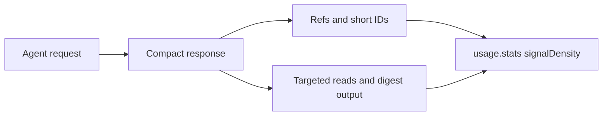

# Token Economy

[Back to README](../../README.md)

---
## Token-control flow




## Why It Exists

The Session 5 token-economy review identified three remaining waste channels: structural overhead, redundant delivery, and zero-value content. SDL-MCP handles those with compact wire shapes, session-scoped reuse, answer-first context, digest runtime output, targeted file reads, and usage telemetry that shows which delivered context actually became useful.

| Evidence | Waste channel | Response |
|:---------|:--------------|:---------|
| 28 lifetime `runtimeExecute` calls reported 0 tokens saved | Noisy command output looked like full raw output | `outputMode: "digest"` plus persisted artifacts |
| `file.read` showed 22% lifetime savings while agents still read whole files | Large untargeted non-indexed reads | Static targeted-read hint |
| Repeated card/context delivery paid for unchanged content | Redundant delivery inside one session | Dedupe refs and delta context |
| 64-hex symbol IDs cost roughly 30-40 tokens each | Structural overhead in packed rows and follow-up calls | Session-local `sN` aliases with `@ids` dictionaries |
| Delivered-but-never-referenced symbols were invisible | Zero-value context could not be measured | `signalDensity` in `usage.stats` |

---

## Feature Reference

### Runtime Digest

Use `outputMode: "digest"` for build, test, lint, and other noisy diagnostics. The response includes a compact `digest` object, short summaries, and an `artifactHandle` for full stdout/stderr recovery through `runtime.queryOutput`.

```json
{
  "fn": "runtimeExecute",
  "args": {
    "runtime": "shell",
    "code": "npm test",
    "outputMode": "digest",
    "persistOutput": true,
    "timeoutMs": 120000
  }
}
```

Use `outputMode: "minimal"` only when exit status is enough. Query the artifact instead of rerunning a command to print full output.

### Dedupe Refs And Delta Context

Repeat card, skeleton, hot-path, or context deliveries may replace unchanged content with a ref:

```json
{ "ref": { "key": "card:my-repo:s1", "etag": "abc123" }, "unchanged": true }
```

This means SDL already delivered the content earlier in the same session. Keep using the copy you hold. Set `refsMode: "off"` only when context was lost, such as after compaction, and you need SDL to send the full body again.

`sdl.context` also reports session deltas such as new, changed, and unchanged cards so repeat calls can spend budget on new evidence instead of re-sending old evidence.

### Short IDs

Packed output may introduce session-local aliases:

```text
@ids=s1:3c6e44f4ed22...,s2:63720054f556...
row=s1|WorkflowExecutor|src/code-mode/workflow.ts
```

Use `s1`, `s2`, and other `sN` aliases anywhere a symbol ID is accepted. Recover the full hash from the `@ids` line that introduced the alias. JSON mode keeps full IDs unchanged.

### Answer-First Context

For explain/debug tasks, start with `sdl.context` and `options.answerFirst: true`:

```json
{
  "repoId": "my-repo",
  "taskType": "explain",
  "taskText": "Trace how runtime output is summarized",
  "options": { "contextMode": "precise", "answerFirst": true }
}
```

SDL returns a compact synthesized answer with evidence IDs when summary provenance is strong enough. If it returns `answerFirstFallback`, use normal card-mode context because SDL did not have enough proven summary coverage to answer safely.

### Search Near Misses

When `symbol.search` misses, `nearMisses` lists likely names without expensive symbol IDs. Retry with one listed `name` instead of guessing broader terms.

### Targeted File Reads

Large untargeted `file.read` responses can include this static hint:

```text
Large untargeted read. Use search+searchContext, offset+limit, or maxTokens to fetch only what you need.
```

Retry with `search` plus `searchContext`, `offset` plus `limit`, `jsonPath`, `maxTokens`, or `maxBytes`.

### Static Price Tags

`sdl.manual` and `sdl.action.search` expose static per-build response-cost estimates. They guide first tool choice; they are not live telemetry and do not vary per call. Update them at release time from usage telemetry medians so prompt-cache hygiene stays intact.

### Signal Density

`usage.stats` reports `signalDensity`, which compares delivered IDs with IDs referenced later in the session. Low density means an agent is receiving more context than it uses. Treat it as a tuning signal, not a reason to suppress required correctness evidence.

---

## Failure And Recovery

| Situation | Recovery |
|:----------|:---------|
| A response contains `{ ref, unchanged: true }`, but the agent no longer has the original content | Re-run the request with `refsMode: "off"` |
| A request using `s41` fails with an unknown-alias error | Re-run the producing packed call or use the full symbol ID from the original `@ids` line |
| A digest omits the needed failure detail | Call `runtime.queryOutput` with focused `queryTerms` or `lineRange` |
| `answerFirst` returns `answerFirstFallback` | Call normal `sdl.context` or request cards for evidence symbols |
| `symbol.search` returns `nearMisses` | Retry with one listed `name` |
| `file.read` returns the large-read hint | Retry with a targeted read |

Session-scoped features intentionally vary by delivery history. Determinism fixtures allowlist refs, delta context, short IDs, and usage density with concrete reasons because those bytes depend on what the session already saw. Recovery paths such as `refsMode: "off"`, full symbol IDs, and artifact queries preserve correctness when session state is unavailable.

---

## Related Docs

- [Code Mode](./code-mode.md)
- [Runtime Execution](./runtime-execution.md)
- [Agent Context](./agent-context.md)
