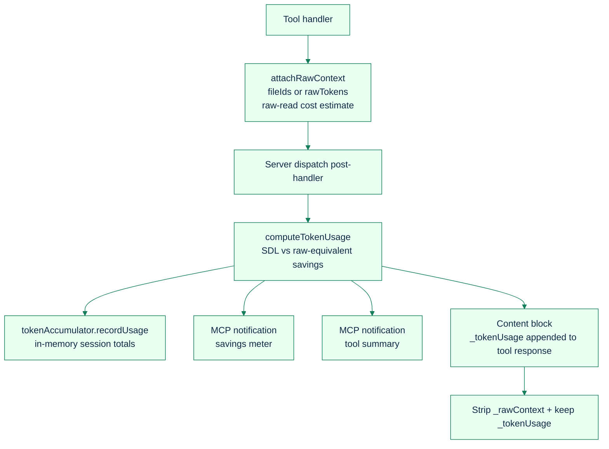
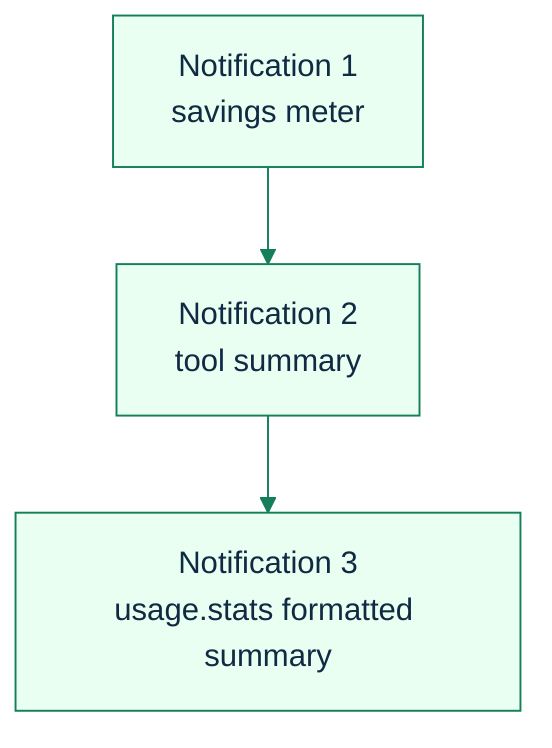
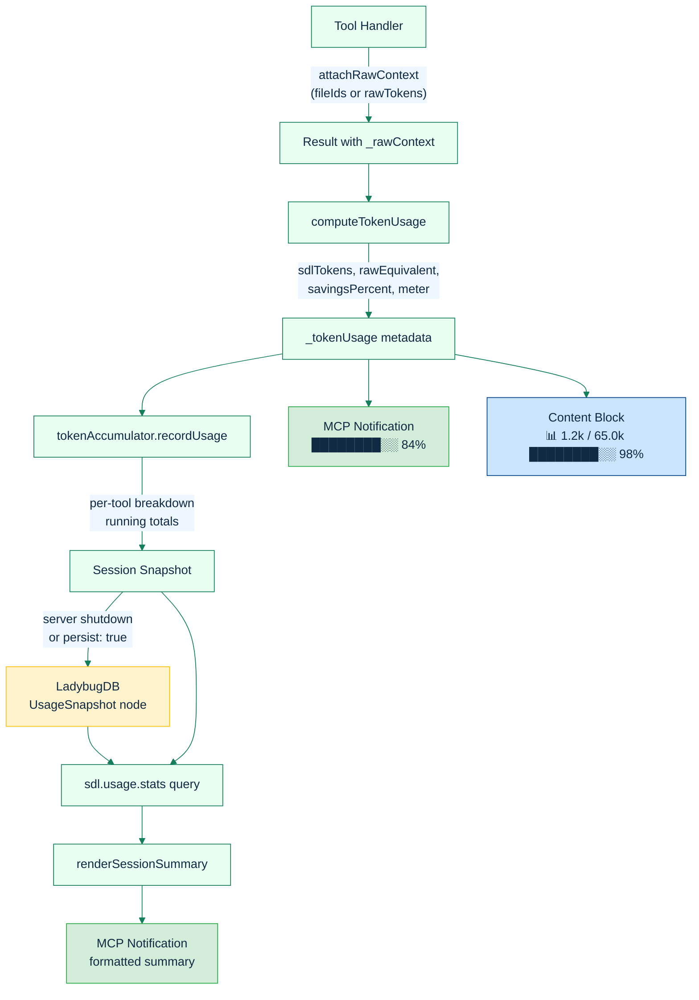

# Token Savings Meter

**Real-time visibility into how many tokens SDL-MCP saves compared to reading raw files — per call, per session, and across your entire usage history.**

[Back to README](../../README.md)

---

## Why Track Token Savings?

SDL-MCP's core value proposition is token efficiency — agents get the code intelligence they need without reading entire files. But "trust us, it saves tokens" isn't enough. The Token Savings Meter makes savings **visible and measurable** at every level:

- **Per-call**: Each tool response shows exactly how many tokens SDL-MCP used vs. the raw-file equivalent
- **Per-session**: Running totals accumulate across all tool calls in the current session
- **Lifetime**: Historical data persists in LadybugDB across sessions for long-term tracking

---

## Architecture



## Session Savings Summary

A `TokenAccumulator` singleton tracks all savings within the current server session.

### What It Tracks

| Metric | Description |
|:-------|:------------|
| `sessionId` | Unique ID: `session_{timestamp}_{8-hex}` |
| `startedAt` | ISO timestamp when the session began |
| `totalSdlTokens` | Sum of SDL tokens across all tracked calls |
| `totalRawEquivalent` | Sum of raw-equivalent tokens across all tracked calls |
| `totalSavedTokens` | `rawEquivalent - sdlTokens` per call, summed. Negative values mean SDL overhead exceeded the raw equivalent for that workload. |
| `overallSavingsPercent` | `Math.round((1 - totalSdl / totalRaw) * 100)`; may be negative when SDL overhead exceeds the raw-equivalent estimate |
| `callCount` | Total tracked tool calls |
| `toolBreakdown` | Per-tool entry with calls, sdlTokens, rawEquivalent, savedTokens |

### Viewing Session Stats

Call `sdl.usage.stats` with `scope: "session"`:

```json
{
  "scope": "session"
}
```

Response includes the session snapshot plus a formatted summary sent as an MCP notification.

---

## Lifetime Savings Summary

Session snapshots are persisted to LadybugDB on server shutdown (or on-demand via `persist: true`), enabling lifetime tracking across sessions.

### LadybugDB Schema

```cypher
CREATE NODE TABLE IF NOT EXISTS UsageSnapshot (
  snapshotId STRING PRIMARY KEY,
  sessionId STRING,
  repoId STRING,
  timestamp STRING,
  totalSdlTokens INT64,
  totalRawEquivalent INT64,
  totalSavedTokens INT64,
  savingsPercent DOUBLE,
  callCount INT64,
  toolBreakdownJson STRING    -- JSON array of per-tool entries
)
```

### When Persistence Happens

1. **Server shutdown** — `MCPServer.stop()` automatically persists the session snapshot if any usage was recorded
2. **On-demand** — Call `sdl.usage.stats` with `persist: true` to save the current session immediately

### Viewing Lifetime Stats

Call `sdl.usage.stats` with `scope: "both"` (default):

```json
{
  "scope": "both"
}
```

---

## The Formatted Summary

When `sdl.usage.stats` is called, it renders a formatted summary showing both session and lifetime data:

```
── Token Savings ──────────────────────────────────
Session: 42 calls │ 18.5k saved │ ████████░░ 85%

  symbol.search     ████████░░ 82% │  15 calls │  8.2k saved
  code.getSkeleton  █████████░ 91% │  12 calls │  6.1k saved
  slice.build       ████████░░ 78% │   8 calls │  3.5k saved

Lifetime: 312 calls │ 8 sessions │ 142.0k saved │ █████████░ 88%

  symbol.search     ████████░░ 84% │ 120 calls │ 62.0k saved
  code.getSkeleton  █████████░ 92% │  85 calls │ 45.0k saved
  slice.build       ████████░░ 80% │  60 calls │ 28.0k saved
───────────────────────────────────────────────────
```

The summary includes:
- **Session header** — total calls, total saved tokens, overall savings meter
- **Session tool breakdown** — top tools sorted by saved tokens, each with its own meter
- **Lifetime header** — total calls, session count, total saved tokens, overall meter
- **Lifetime tool breakdown** — aggregated across all historical sessions, top tools by savings

Token counts use compact formatting: `999`, `1.2k`, `65.0k`, `1.08M`.

This summary is delivered in two ways:
1. As an **MCP logging notification** (`notifications/message`) for immediate user visibility
2. As a **content block** appended to the tool response

---

## `sdl.usage.stats` Tool Reference

### Parameters

| Parameter | Type | Default | Description |
|:----------|:-----|:--------|:------------|
| `repoId` | string | — | Filter by repository (optional) |
| `scope` | `"session"` \| `"history"` \| `"both"` | `"both"` | What data to return |
| `since` | string | — | ISO timestamp filter for historical data |
| `limit` | integer (1-100) | 20 | Max historical snapshots to return |
| `persist` | boolean | — | Persist current session snapshot to DB first |

### Response

```json
{
  "session": {
    "sessionId": "session_1711234567890_a1b2c3d4",
    "startedAt": "2026-03-25T10:00:00.000Z",
    "totalSdlTokens": 3200,
    "totalRawEquivalent": 21300,
    "totalSavedTokens": 18100,
    "overallSavingsPercent": 85,
    "callCount": 42,
    "toolBreakdown": [
      {
        "tool": "sdl.symbol.search",
        "calls": 15,
        "sdlTokens": 1200,
        "rawEquivalent": 7400,
        "savedTokens": 6200
      }
    ]
  },
  "history": {
    "snapshots": [ ... ],
    "aggregate": {
      "totalSdlTokens": 18000,
      "totalRawEquivalent": 160000,
      "totalSavedTokens": 142000,
      "overallSavingsPercent": 88,
      "totalCalls": 312,
      "sessionCount": 8,
      "topToolsBySavings": [
        { "tool": "sdl.symbol.search", "savedTokens": 62000, "savingsPercent": 84 }
      ]
    }
  }
}
```

---

## Human-Readable Tool Call Formatter

Alongside the savings meter, each tool call also sends a human-readable one-line summary as an MCP notification. This gives users immediate context about what the tool did:

| Tool | Example Output |
|:-----|:---------------|
| `symbol.search` | `symbol.search "parse" → 12 results` |
| `symbol.getCard` | `symbol.getCard → parseConfig (function)` |
| `code.getSkeleton` | `code.getSkeleton → .../server.ts` |
| `code.needWindow` | `code.needWindow → [approved] L42-120 (~1.2k tokens)` |
| `slice.build` | `slice.build → 24 cards (handle: a1b2c3d4...)` |
| `workflow` | `workflow -> 5 steps (4 ok, 1 errors) ~2.5k tokens` |

These summaries are non-critical — formatting failures are silently caught and never break tool dispatch.

---

## MCP Notifications Mechanism

The server declares `logging: {}` in its MCP capabilities, enabling the `notifications/message` method. Up to three notifications are sent per tool call:



All notifications use:
```json
{
  "method": "notifications/message",
  "params": {
    "level": "info",
    "logger": "sdl-mcp",
    "data": "<payload>"
  }
}
```

---

## Data Flow Diagram



---

## Related Docs

- [Iris Gate Ladder](./iris-gate-ladder.md) — the four-rung context escalation that drives savings
- [Tool Gateway](./tool-gateway.md) — 81% reduction in `tools/list` overhead
- [Governance & Policy](./governance-policy.md) — proof-of-need gating that prevents wasteful raw reads
- [Agent Context](./agent-context.md) — task-shaped context retrieval with budget control
- [MCP Tools Reference](../mcp-tools-reference.md#sdlusagestats) — `sdl.usage.stats` parameter details

[Back to README](../../README.md)
