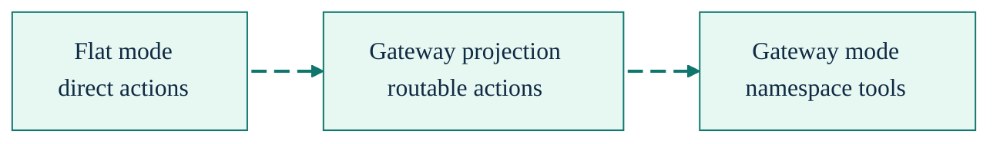

# Tool Gateway

[Back to README](../../README.md) | [Documentation Hub](../README.md) | [Generated Tool Inventory](../generated/tool-inventory.md)

The gateway compresses most of the flat SDL-MCP surface into namespace tools: `sdl.query`, `sdl.code`, `sdl.repo`, and `sdl.agent`. It exists to reduce `tools/list` overhead without changing the underlying handler behavior.



## Current Surface Matrix

| Mode                | Composition                                                                  |
| ------------------- | ---------------------------------------------------------------------------- |
| Flat                | Direct action surface plus universal discovery and diagnostics                |
| Gateway             | Namespace projection over gateway-routable actions                            |
| Gateway + legacy    | Gateway projection plus legacy flat actions                                   |
| Code Mode exclusive | `sdl.action.search`, `sdl.context`, `sdl.file`, `sdl.manual`, `sdl.workflow` |

The generated source of truth is [tool-inventory.md](../generated/tool-inventory.md).

## What the Gateway Actually Covers

The gateway exposes most flat actions through namespace schemas.

Key exceptions and edit paths:

- `file.write` is the only flat action outside the gateway namespace schemas. It remains available in flat mode and through the Code Mode `sdl.file` gateway.
- `search.edit` and `symbol.edit` are routable through the mutation-capable `sdl.repo` gateway envelope.
- Code Mode also exposes those edit flows through `sdl.file`.
- `symbol.edit` is available through `sdl.workflow` when a workflow step is the better fit.

| Gateway tool | Current action set                                                                                                                                                                                         |
| ------------ | ---------------------------------------------------------------------------------------------------------------------------------------------------------------------------------------------------------- |
| `sdl.query`  | `symbol.search`, `symbol.getCard`, `slice.build`, `slice.refresh`, `slice.spillover.get`, `delta.get`, `pr.risk.analyze`, `response.get`                                                                    |
| `sdl.code`   | `code.needWindow`, `code.getSkeleton`, `code.getHotPath`                                                                                                                                                   |
| `sdl.repo`   | `repo.register`, `repo.status`, `repo.overview`, `index.refresh`, `policy.get`, `policy.set`, `usage.stats`, `file.read`, `search.edit`, `symbol.edit`, `semantic.enrichment.refresh`, `semantic.enrichment.status` |
| `sdl.agent`  | `agent.feedback`, `agent.feedback.query`, `buffer.push`, `buffer.checkpoint`, `buffer.status`, `runtime.execute`, `runtime.queryOutput`, `memory.store`, `memory.query`, `memory.remove`, `memory.surface` |

In Code Mode:

- Use `sdl.file({ op: "searchEditPreview" })` and `sdl.file({ op: "searchEditApply" })` for two-phase cross-file edits. Preview first, then apply the stored plan with sha256/mtime preconditions and rollback on mid-batch failure.
- Use `sdl.file({ op: "symbolEditPreview" })`, `sdl.file({ op: "symbolEditApply" })`, and `sdl.file({ op: "symbolEditApplyNow" })` for one-symbol edits with symbol snapshot preconditions.
- Use `sdl.file({ op: "previewWindow" })` and `sdl.file({ op: "sourceWindow" })` for indexed source follow-up. These operations bind a plan handle to the normal `code.needWindow` policy instead of exposing raw file reads.

The same `search.edit` action is also callable through `sdl.repo` and via `sdl.workflow`. See [sdl.search.edit - Cross-File Search and Edit](../search-edit-tool.md) and [sdl.symbol.edit](../symbol-edit-tool.md) for request shapes and examples.

## Routing Path


The important implementation detail is not the namespace wrapper. It is the preservation of the original validation and handler path after routing. Gateway mode is a registration optimization, not a separate execution engine.


## Output Contract

Gateway, flat, and Code Mode tools share the same outward response contract. Visible MCP `content` is human-readable first. Machine-readable task data is returned as `structuredContent`, including follow-up identifiers such as `etag`, handles, symbol IDs, file paths, status, errors, summaries, and next-action hints. Internal SDL-MCP bookkeeping such as timings, packed stats, raw-context baselines, action traces, and logging-only details is withheld from the normal model-visible surfaces unless the caller explicitly requests diagnostics.

## Why It Exists

- Fewer tool descriptors reduce startup token cost in MCP clients.
- Namespace routing keeps tool choice simpler for agents that do not need every flat tool listed separately.
- The underlying handlers stay shared, so behavior drift between flat and gateway mode stays low.

## Limits and Gotchas

- `file.write` is outside the four namespace gateway schemas. In Code Mode, use `sdl.file` which unifies `file.read`, `file.write`, and `search.edit` under one tool.
- `sdl.info` is universal outside Code Mode exclusive. It is not part of the four gateway tools.
- Code Mode exclusive bypasses the regular gateway and flat surfaces entirely.
- The CLI `sdl-mcp tool` command is related but not identical. It exposes direct action aliases, including `file.write`, and now proxies only the low-risk metadata tools `action.search` and `manual` (plus `sdl.` aliases). `sdl.context`, `sdl.workflow`, and `sdl.file` remain MCP-only wrapper tools. See [CLI Tool Access](./cli-tool-access.md).

## Configuration

The current non-deprecated gateway setting is:

```json
{
  "gateway": {
    "enabled": true
  }
}
```

That setting only matters when Code Mode is not exclusive. With the default `codeMode.exclusive: true`, the server exposes the Code Mode-only surface instead.

If you are migrating older agent instructions that still depend on flat tool names, there is still a compatibility path in source for emitting legacy flat aliases alongside gateway tools. It is intentionally omitted from the main configuration reference because it is deprecated and should not be the recommended steady-state setup.

## When To Use Which Surface

| Situation                                          | Recommended surface                                      |
| -------------------------------------------------- | -------------------------------------------------------- |
| Smallest registration footprint                    | Gateway mode                                             |
| Task-shaped retrieval first                        | Code Mode                                                |
| Need `file.write`                                  | Code Mode `sdl.file`, direct CLI `file.write`, flat mode, or `sdl.workflow` steps |
| Need `search.edit` or `symbol.edit`                | `sdl.repo`, Code Mode `sdl.file`, flat mode, or `sdl.workflow` |
| Existing legacy instructions still call flat tools | Flat mode, or a temporary migration setup                |

## Practical Recommendation

If you want the current best default for agent work, use Code Mode for discovery and retrieval, then disable exclusivity only when you also need the regular gateway or flat tools in the same session.
