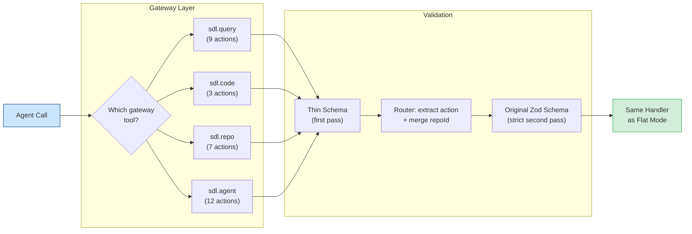

# Tool Gateway

**Reduce MCP tool registration overhead by collapsing the 30 legacy action tools into 4 namespace-scoped gateway tools, while keeping `sdl.action.search` and `sdl.info` available as universal discovery and diagnostics surfaces.**

The tool gateway consolidates the 30 legacy action tools into 4 typed proxy tools (`sdl.query`, `sdl.code`, `sdl.repo`, `sdl.agent`). Each gateway tool accepts an `action` field that routes the call to the appropriate handler and then applies the original per-tool validation. `sdl.action.search` and `sdl.info` stay registered outside the gateway so discovery and environment diagnostics remain available in every mode.

---

## The Problem

When an MCP client connects, it calls `tools/list` to discover available tools. The response includes tool names, descriptions, and JSON schemas. Registering 30 legacy action tools separately is expensive, especially once titles, richer descriptions, and action-specific schema metadata are included.

```
Without gateway:
  tools/list → 33 tools
  = 31 action tools + sdl.action.search + sdl.info

With gateway:
  tools/list → 6 tools
  = 4 gateway tools + sdl.action.search + sdl.info

The gateway measurement script still compares the core 30 legacy tools against the 4 gateway tools, because those are the surfaces being consolidated. The two universal tools are present in both modes.
```

This matters because:
- Agents process `tools/list` at the **start of every conversation**
- Tokens spent on tool schemas are tokens **not available** for code context
- Large tool registrations cause some MCP clients to **truncate or error**
- Fewer tools means fewer **selection decisions** for the agent (faster + more accurate)

---

## Architecture

### Before (Flat Mode)

```
┌─────────────────────────────────────────────────────┐
│                    MCP Server                        │
│                                                      │
│  sdl.repo.register    sdl.symbol.search              │
│  sdl.repo.status      sdl.symbol.getCard             │
│  sdl.repo.overview    sdl.symbol.getCards             │
│  sdl.index.refresh    sdl.slice.build                │
│  sdl.buffer.push      sdl.slice.refresh              │
│  sdl.buffer.checkpoint sdl.slice.spillover.get       │
│  sdl.buffer.status    sdl.delta.get                  │
│  sdl.code.needWindow  sdl.policy.get                 │
│  sdl.code.getSkeleton sdl.policy.set                 │
│  sdl.code.getHotPath  sdl.pr.risk.analyze            │
│  sdl.agent.orchestrate sdl.context.summary           │
│  sdl.agent.feedback   sdl.agent.feedback.query       │
│  sdl.runtime.execute  sdl.memory.store               │
│  sdl.runtime.queryOutput sdl.memory.query             │
│  sdl.memory.remove    sdl.memory.surface              │
│  sdl.usage.stats                                      │
│                                                      │
│            31 tools × full JSON schema               │
│               ~4,000+ tokens total                   │
└─────────────────────────────────────────────────────┘
```

### After (Gateway Mode)

```
┌─────────────────────────────────────────────────────┐
│                    MCP Server                        │
│                                                      │
│  sdl.query   → 9 actions (symbol.*, slice.*, etc.)    │
│  sdl.code    → 3 actions (code.*)                     │
│  sdl.repo    → 7 actions (repo.*, index.*, policy.*,  │
│                             usage.stats)              │
│  sdl.agent   → 12 actions (agent.*, buffer.*, runtime,│
│                             memory.*)                  │
│                                                      │
│     4 tools × compact schema + compact desc          │
│               ~713 tokens total                      │
└─────────────────────────────────────────────────────┘
```

---

## How It Works

### Gateway Routing Diagram



### 1. Namespace-Scoped Tools

The 31 action tools are organized into 4 namespaces:

| Gateway Tool | Actions | Domain |
|:-------------|:--------|:-------|
| `sdl.query` | 9 | Read-only intelligence: symbol search/cards, slices, deltas, summaries, PR risk |
| `sdl.code` | 3 | Gated code access: needWindow, skeleton, hotPath |
| `sdl.repo` | 7 | Repository lifecycle: register, status, overview, index, policy, usage stats |
| `sdl.agent` | 12 | Agentic ops: orchestrate, feedback, buffers, runtime, runtime.queryOutput, memory |

Outside the gateway, SDL-MCP always keeps:

- `sdl.action.search` for action discovery
- `sdl.info` for runtime and environment diagnostics

### 2. Action-Based Union Schema

Each gateway tool uses an action-based union schema on the `action` field. Some actions add a second validation layer for mutually exclusive inputs such as `symbolId` versus `symbolRef`. The calling pattern is:

```json
// Instead of:
{ "tool": "sdl.symbol.search", "args": { "repoId": "x", "query": "auth" } }

// Gateway mode:
{ "tool": "sdl.query", "args": { "repoId": "x", "action": "symbol.search", "query": "auth" } }
```

The `repoId` field is hoisted to the envelope level (shared across all actions in a namespace), and the `action` field selects which handler processes the call.

For symbol-card actions, gateway mode now accepts the same natural-identifier shape as flat mode:

```json
{
  "tool": "sdl.query",
  "args": {
    "repoId": "x",
    "action": "symbol.getCard",
    "symbolRef": { "name": "handleRequest", "file": "src/server.ts" }
  }
}
```

`symbol.getCards` follows the same pattern with `symbolRefs`. Mixed natural-reference batches can return partial-success metadata instead of failing the whole request.

Gateway requests also go through the shared normalization layer before validation, so common aliases and snake_case forms work the same way they do in flat mode:

```json
{
  "tool": "sdl.query",
  "args": {
    "repo_id": "x",
    "action": "slice.build",
    "task_text": "trace auth flow",
    "edited_files": ["src/auth/token.ts"]
  }
}
```

Aliases such as `repo`, `repo_id`, `root_path`, `project_path`, `symbol_id`, `symbol_ids`, `from_version`, `to_version`, `slice_handle`, `spillover_handle`, `if_none_match`, `known_etags`, `known_card_etags`, `failing_test_path`, `edited_files`, `entry_symbols`, `relative_cwd`, and `identifiers` normalize to the canonical field names before strict validation.

### 3. Double Validation

Validation happens in two passes for safety:

```
Agent Call
    │
    ▼
┌─────────────────────┐
│ Gateway Schema       │  Discriminated union on `action`
│ (cheap first-pass)   │  Catches wrong action names, type errors
└──────────┬──────────┘
           │
           ▼
┌─────────────────────┐
│ Router               │  Extracts action, merges repoId
│                      │  Looks up handler from ActionMap
└──────────┬──────────┘
           │
           ▼
┌─────────────────────┐
│ Original Zod Schema  │  Strict second-pass validation
│ (per-handler)        │  Identical to flat-mode validation
└──────────┬──────────┘
           │
           ▼
┌─────────────────────┐
│ Handler Function     │  Same handler as flat mode
│                      │  Zero behavioral difference
└─────────────────────┘
```

### 4. Compact Action-Aware Schemas

The key to token savings is the **compact schema** emitted in `tools/list` responses. SDL-MCP no longer publishes a description-free envelope with only `repoId` and `action`. Instead, each gateway tool exposes a compact `oneOf` schema with action-specific fields, while still preserving user-facing descriptions, required-vs-optional visibility, and default semantics where they help the agent construct valid calls.

That means gateway mode keeps most of the usability benefits of flat mode while still compressing the registration surface down to 4 namespace tools.

---

## Token Savings Breakdown

Measured with the included token measurement script (`scripts/measure-gateway-schema-tokens.ts`):

| Mode | Tools | Characters | Est. Tokens |
|:-----|:-----:|:----------:|:-----------:|
| **Flat core action tools** | 31 | ~17,000 | ~4,250 |
| **Gateway core namespace tools** | 4 | ~2,900 | ~725 |
| **Gateway-only runtime surface** | 6 | includes universal tools | varies slightly |
| **Hybrid runtime surface** | 36 | includes universal tools | varies slightly |

| Metric | Value |
|:-------|:------|
| **Token reduction** | **~83%** (4,250 → 725) |
| **Tokens saved per conversation** | **~3,525** |
| **Character reduction** | ~17,000 → ~2,900 |
| **Tool count reduction** | 31 → 4 |

The savings come from three techniques:
1. **Fewer tools** — 4 vs 31 registration entries
2. **Compact action-aware schemas** — gateway `oneOf` variants preserve useful field metadata without publishing every full flat schema separately
3. **$defs deduplication** — repeated sub-schemas are hoisted to `$defs` with `$ref` pointers (via `compact-schema.ts`)

---

## Configuration

Gateway mode is controlled in your SDL-MCP config file:

```jsonc
{
  "gateway": {
    // Enable gateway mode (default: true)
    "enabled": true,
    // Also emit the 31 flat tool names for backward compat (default: true)
    "emitLegacyTools": true
  }
}
```

### Modes

| `enabled` | `emitLegacyTools` | Tools Registered | Use Case |
|:---------:|:-----------------:|:----------------:|:---------|
| `true` | `true` | 37 (4 gateway + 31 action + 2 universal) | Migration period — agents can use either style |
| `true` | `false` | 6 (4 gateway + 2 universal) | Maximum registration savings |
| `false` | — | 33 (31 flat + 2 universal) | Backward compatibility, legacy agents |

Legacy tools include a deprecation notice in their description:
```
[Legacy — prefer sdl.query] Search for symbols by name or summary
```

---

## Implementation Details

### Module Structure

```
src/gateway/
  index.ts            # Registration orchestrator — registers 4 gateway + optional legacy
  router.ts           # Action routing — maps action names to { schema, handler } pairs
  schemas.ts          # Full Zod schemas — action-based unions per namespace
  thin-schemas.ts     # Compact action-aware schemas for tools/list
  descriptions.ts     # Compact tool descriptions — action reference cards
  compact-schema.ts   # $defs/$ref deduplicator for schema optimization
  legacy.ts           # Legacy tool aliases with deprecation notices
```

### Gateway Registration Flow

```typescript
// src/gateway/index.ts
export function registerGatewayTools(server, services, config) {
  const actionMap = createActionMap(services.liveIndex);

  // Register 4 gateway tools with compact action-aware schemas
  server.registerTool("sdl.query", QUERY_DESCRIPTION, QueryGatewaySchema,
    handler, QUERY_THIN_SCHEMA);
  server.registerTool("sdl.code", CODE_DESCRIPTION, CodeGatewaySchema,
    handler, CODE_THIN_SCHEMA);
  server.registerTool("sdl.repo", REPO_DESCRIPTION, RepoGatewaySchema,
    handler, REPO_THIN_SCHEMA);
  server.registerTool("sdl.agent", AGENT_DESCRIPTION, AgentGatewaySchema,
    handler, AGENT_THIN_SCHEMA);

  // Optional: also register 31 flat tool names
  if (config.emitLegacyTools) {
    registerLegacyTools(server, services);
  }
}
```

### Router Logic

The gateway router (`src/gateway/router.ts`) performs the core dispatch:

```typescript
export async function routeGatewayCall(rawArgs, actionMap, ctx) {
  const normalized = normalizeToolArgs(rawArgs);
  const { action, repoId, ...rest } = normalized;

  // Look up handler by action name
  const entry = actionMap[action];
  if (!entry) throw new Error(`Unknown gateway action: ${action}`);

  // Merge repoId back into params for handler compatibility
  const merged = repoId !== undefined ? { repoId, ...rest } : rest;

  // Second-pass validation using the original strict Zod schema
  const parsed = entry.schema.parse(merged);

  return entry.handler(parsed, ctx);
}
```

### Compact Schema Emitter

The `compact-schema.ts` module optimizes JSON Schemas for token efficiency:

1. **Fingerprint sub-schemas** — canonicalize and hash every object node
2. **Deduplicate** — sub-schemas appearing 2+ times with size >40 chars are hoisted to `$defs` and replaced with `$ref` pointers
3. **Preserve useful metadata** — keep action-specific descriptions and defaults that help agents call the gateway correctly

Example deduplication:
```json
// Before: repeated { "type": "number", "minimum": 0, "maximum": 1 } appears 4 times
// After: hoisted to $defs/d0, referenced as { "$ref": "#/$defs/d0" }
```

---

## CLI Integration

The gateway router is also used by the `sdl-mcp tool` command for direct CLI access. The CLI dispatcher calls `createActionMap()` directly, bypassing the MCP server entirely while sharing the same handler map.

See [CLI Tool Access](./cli-tool-access.md) for full CLI documentation.

---

## Migration Guide

### For MCP Client Users

If your agent configuration currently uses the flat tool names (e.g., `sdl.symbol.search`), you have two options:

1. **Do nothing** — Set `emitLegacyTools: true` (the default) and both flat and gateway tools are available
2. **Switch to gateway** — Update your agent instructions to use `sdl.query` with `action: "symbol.search"` instead of `sdl.symbol.search`

### For Agent Instruction Authors

Update your CLAUDE.md / AGENTS.md to use gateway-style calls:

```markdown
# Before (flat tools)
Use `sdl.symbol.search` to find symbols.
Use `sdl.code.getSkeleton` to see code structure.

# After (gateway tools)
Use `sdl.query` with `action: "symbol.search"` to find symbols.
Use `sdl.code` with `action: "code.getSkeleton"` to see code structure.
```

### Disabling Gateway Mode

If you need backward compatibility with older MCP clients:

```json
{
  "gateway": {
    "enabled": false
  }
}
```

This registers the 31 flat tools plus the universal `sdl.action.search` and `sdl.info` surfaces.

---

## Measuring Token Savings

Run the included measurement script to verify savings for your configuration:

```bash
node --experimental-strip-types scripts/measure-gateway-schema-tokens.ts
```

Output:
```
=== SDL-MCP Gateway Schema Token Measurement ===

Flat mode:    31 tools, ~4350 tokens (~17400 chars)
Gateway mode: 4 tools, ~725 tokens (~2900 chars)
Hybrid mode:  33 tools

Gateway is ~17% of flat mode
Estimated savings: ~3525 tokens per tools/list call

✅ Gateway schema is within target (≤40% of flat)
```

---

## What's Next: Code Mode

Gateway mode optimizes **tool registration** overhead. **Code Mode** takes optimization further by eliminating **per-operation round-trip** overhead — batching entire context retrieval pipelines into a single tool call with `$N` inter-step references.

[Code Mode Deep Dive →](./code-mode.md)
