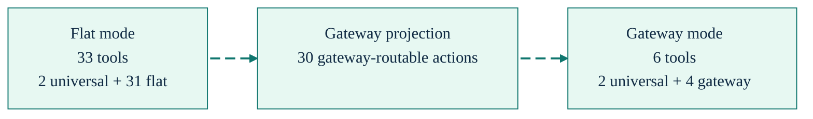
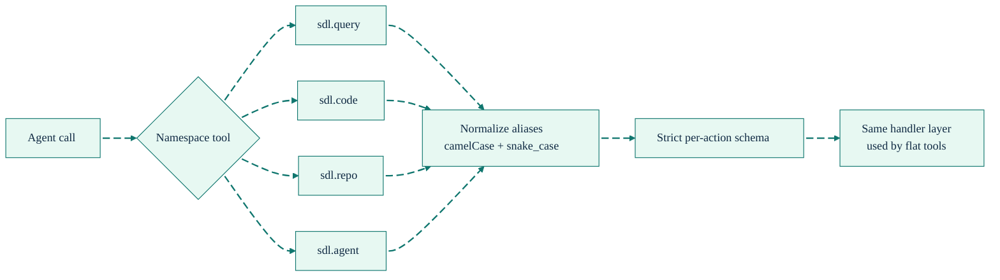

# Tool Gateway

[Back to README](../../README.md) | [Documentation Hub](../README.md) | [Generated Tool Inventory](../generated/tool-inventory.md)

The gateway compresses most of the flat SDL-MCP surface into four namespace tools: `sdl.query`, `sdl.code`, `sdl.repo`, and `sdl.agent`. It exists to reduce `tools/list` overhead without changing the underlying handler behavior.



## Current Surface Matrix

| Mode | Tool count | Composition |
| --- | --- | --- |
| Flat | `33` | `2` universal + `31` flat tools |
| Gateway | `6` | `2` universal + `4` gateway tools |
| Gateway + legacy | `37` | `2` universal + `4` gateway + `31` flat tools |
| Code Mode exclusive | `4` | `sdl.action.search`, `sdl.context`, `sdl.manual`, `sdl.workflow` |

The generated source of truth is [tool-inventory.md](../generated/tool-inventory.md).

## What the Gateway Actually Covers

The gateway currently exposes `30` of the `31` flat actions. The missing flat action is `sdl.file.write`, which remains flat-only today.

| Gateway tool | Actions | Current action set |
| --- | --- | --- |
| `sdl.query` | `7` | `symbol.search`, `symbol.getCard`, `slice.build`, `slice.refresh`, `slice.spillover.get`, `delta.get`, `pr.risk.analyze` |
| `sdl.code` | `3` | `code.needWindow`, `code.getSkeleton`, `code.getHotPath` |
| `sdl.repo` | `9` | `repo.register`, `repo.status`, `repo.overview`, `index.refresh`, `policy.get`, `policy.set`, `usage.stats`, `file.read`, `scip.ingest` |
| `sdl.agent` | `11` | `agent.feedback`, `agent.feedback.query`, `buffer.push`, `buffer.checkpoint`, `buffer.status`, `runtime.execute`, `runtime.queryOutput`, `memory.store`, `memory.query`, `memory.remove`, `memory.surface` |

## Routing Path



The important implementation detail is not the namespace wrapper. It is the preservation of the original validation and handler path after routing. Gateway mode is a registration optimization, not a separate execution engine.

## Why It Exists

- Fewer tool descriptors reduce startup token cost in MCP clients.
- Namespace routing keeps tool choice simpler for agents that do not need every flat tool listed separately.
- The underlying handlers stay shared, so behavior drift between flat and gateway mode stays low.

## Limits and Gotchas

- `sdl.file.write` is still flat-only.
- `sdl.info` is universal outside Code Mode exclusive. It is not part of the four gateway tools.
- Code Mode exclusive bypasses the regular gateway and flat surfaces entirely.
- The CLI `sdl-mcp tool` command is related but not identical. It exposes a narrower direct-action subset. See [CLI Tool Access](./cli-tool-access.md).

## Configuration

The current non-deprecated gateway setting is:

```json
{
  "gateway": {
    "enabled": true
  }
}
```

That setting only matters when Code Mode is not exclusive. With the default `codeMode.exclusive: true`, the server exposes the Code Mode-only surface instead.

If you are migrating older agent instructions that still depend on flat tool names, there is still a compatibility path in source for emitting legacy flat aliases alongside gateway tools. It is intentionally omitted from the main configuration reference because it is deprecated and should not be the recommended steady-state setup.

## When To Use Which Surface

| Situation | Recommended surface |
| --- | --- |
| Smallest registration footprint | Gateway mode |
| Task-shaped retrieval first | Code Mode |
| Need `file.write` | Flat mode or flat + Code Mode |
| Existing legacy instructions still call flat tools | Flat mode, or a temporary migration setup |

## Practical Recommendation

If you want the current best default for agent work, use Code Mode for discovery and retrieval, then disable exclusivity only when you also need the regular gateway or flat tools in the same session.
