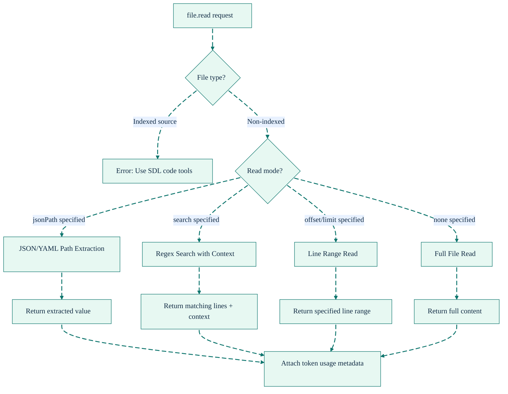
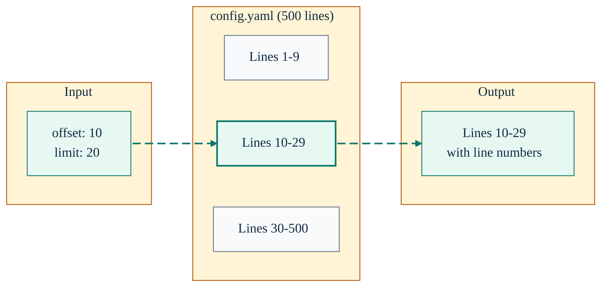
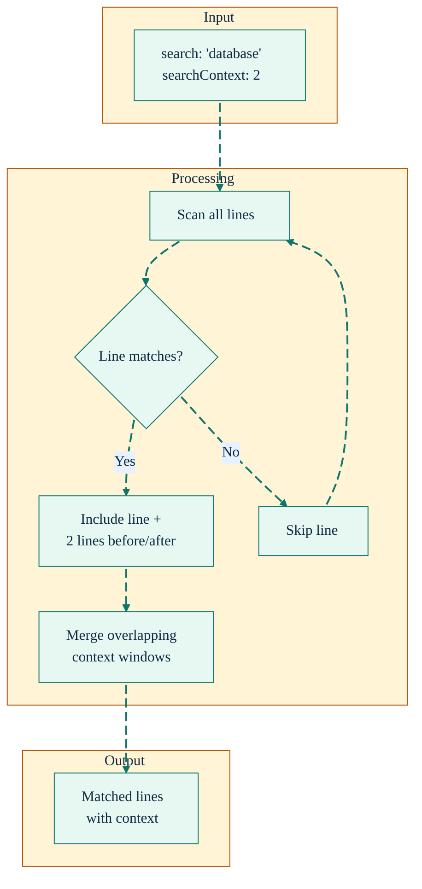
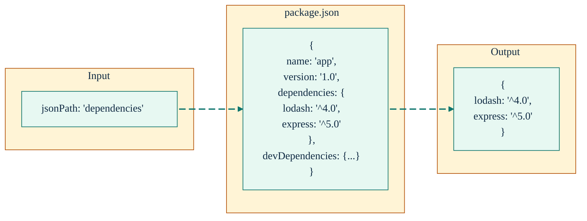
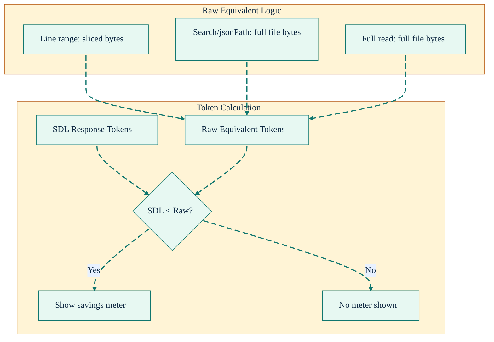

# file.read Tool Reference

<div align="right">
<details>
<summary><strong>Docs Navigation</strong></summary>

- [Overview](../README.md)
- [Documentation Hub](./README.md)
  - [Getting Started](./getting-started.md)
  - [MCP Tools Reference](./mcp-tools-reference.md)
  - [file.read Tool (this page)](./file-read-tool.md)
  - [Configuration Reference](./configuration-reference.md)

</details>
</div>

The `file.read` tool provides token-efficient file reading for non-indexed files (configs, docs, templates, YAML, JSON, etc.). It is available inside `sdl.workflow` steps and offers three targeted read modes that reduce token usage compared to reading entire files.

---

## Overview



---

## Parameters

| Parameter       | Type   | Required | Default | Description                           |
| --------------- | ------ | -------- | ------- | ------------------------------------- |
| `repoId`        | string | Yes      | -       | Repository identifier                 |
| `filePath`      | string | Yes      | -       | File path relative to repo root       |
| `maxBytes`      | number | No       | 524288  | Max bytes to read (max 512KB)         |
| `offset`        | number | No       | 0       | Start line number (0-based)           |
| `limit`         | number | No       | -       | Max lines to return (max 5000)        |
| `search`        | string | No       | -       | Regex pattern for search mode         |
| `searchContext` | number | No       | 2       | Context lines around matches (max 20) |
| `jsonPath`      | string | No       | -       | Dot-separated key path for JSON/YAML  |

---

## Response

| Field           | Type    | Description                             |
| --------------- | ------- | --------------------------------------- |
| `filePath`      | string  | Normalized file path                    |
| `content`       | string  | File content (may be truncated)         |
| `bytes`         | number  | Bytes in returned content               |
| `totalLines`    | number  | Total lines in file                     |
| `returnedLines` | number  | Lines actually returned                 |
| `truncated`     | boolean | Whether content was truncated           |
| `truncatedAt`   | number  | Byte position where truncation occurred |
| `matchCount`    | number  | Total matches found (search mode)       |
| `extractedPath` | string  | Path that was extracted (jsonPath mode) |

---

## Read Modes

### Mode 1: Line Range

Read specific lines using `offset` and `limit`. Ideal when you know which part of a file you need.



**Example:**

```json
{
  "fn": "file.read",
  "args": {
    "filePath": "config/settings.yaml",
    "offset": 10,
    "limit": 20
  }
}
```

**Token Savings:** Compares SDL tokens against the sliced line range (what Claude Code's Read would return for the same offset/limit).

---

### Mode 2: Regex Search

Search for patterns and return matching lines with surrounding context. Automatically merges overlapping context windows.



**Example:**

```json
{
  "fn": "file.read",
  "args": {
    "filePath": "docs/guide.md",
    "search": "authentication",
    "searchContext": 3
  }
}
```

**Safety Features:**

- Pattern length limit: 500 characters
- ReDoS protection: Rejects nested quantifiers like `(a+)+`
- Time budget: 500ms max search time
- Line length cap: 10,000 chars per line tested
- Match limit: 50 matches max (warns if exceeded)

**Token Savings:** Compares SDL tokens against full file (since Claude Code's Read cannot do regex search).

---

### Mode 3: JSON/YAML Path Extraction

Extract specific values from JSON or YAML files using dot-notation paths. Supports array indexing.



**Example:**

```json
{
  "fn": "file.read",
  "args": {
    "filePath": "package.json",
    "jsonPath": "dependencies"
  }
}
```

**Path Syntax:**

- Simple key: `"name"` -> `"my-app"`
- Nested key: `"server.port"` -> `8080`
- Array index: `"users.0.name"` -> `"Alice"`
- Deep path: `"config.database.connection.host"`

**Security:** Blocks prototype pollution paths (`__proto__`, `constructor`, `prototype`).

**Token Savings:** Compares SDL tokens against full file (since Claude Code's Read cannot do JSON path extraction).

---

## Token Savings Meter

The `file.read` tool reports token savings when SDL returns fewer tokens than Claude Code's native Read would for an equivalent operation.



**When savings appear:**

- Reading a 20-line slice from a 1000-line file
- Extracting a single JSON key from a large config
- Searching for specific patterns in documentation

**When savings don't appear:**

- Reading small files (SDL metadata overhead exceeds savings)
- Full file reads of small files
- Overhead cases (SDL tokens > raw equivalent)

---

## Blocked File Types

The `file.read` tool rejects indexed source code files. Use SDL code tools (`sdl.code.getSkeleton`, `sdl.code.getHotPath`, `sdl.code.needWindow`) for these extensions:

| Language              | Extensions                                  |
| --------------------- | ------------------------------------------- |
| TypeScript/JavaScript | `.ts` `.tsx` `.js` `.jsx` `.mjs` `.cjs`     |
| Python                | `.py` `.pyw`                                |
| Go                    | `.go`                                       |
| Java                  | `.java`                                     |
| C#                    | `.cs`                                       |
| C/C++                 | `.c` `.h` `.cpp` `.hpp` `.cc` `.cxx` `.hxx` |
| PHP                   | `.php` `.phtml`                             |
| Rust                  | `.rs`                                       |
| Kotlin                | `.kt` `.kts`                                |
| Shell                 | `.sh` `.bash` `.zsh`                        |

---

## Examples

### Read YAML config section

```json
{
  "fn": "file.read",
  "args": {
    "filePath": "config/database.yaml",
    "offset": 0,
    "limit": 30
  }
}
```

### Extract package dependencies

```json
{
  "fn": "file.read",
  "args": {
    "filePath": "package.json",
    "jsonPath": "dependencies"
  }
}
```

### Search markdown for headings

```json
{
  "fn": "file.read",
  "args": {
    "filePath": "README.md",
    "search": "^##\\s+",
    "searchContext": 0
  }
}
```

### Read SQL migration

```json
{
  "fn": "file.read",
  "args": {
    "filePath": "migrations/001_init.sql",
    "offset": 0,
    "limit": 100
  }
}
```

---

## Error Handling

| Error                         | Cause                      | Solution                           |
| ----------------------------- | -------------------------- | ---------------------------------- |
| `Repository not found`        | Invalid repoId             | Check repo is registered           |
| `File not found`              | Path doesn't exist         | Verify file path                   |
| `Path traversal blocked`      | Path escapes repo root     | Use relative paths only            |
| `Indexed source file`         | Trying to read .ts/.py/etc | Use SDL code tools instead         |
| `Invalid search pattern`      | Bad regex syntax           | Fix regex pattern                  |
| `Nested quantifiers`          | ReDoS-prone pattern        | Simplify regex                     |
| `Search exceeded time budget` | Pattern too slow           | Narrow pattern or use offset/limit |

---

## Best Practices

1. **Prefer targeted reads** - Use `jsonPath`, `search`, or `offset`/`limit` instead of reading entire files
2. **Set reasonable limits** - Use `limit` to cap line counts for large files
3. **Use jsonPath for configs** - More efficient than reading + parsing in the agent
4. **Narrow search patterns** - Specific patterns are faster and return less noise
5. **Check totalLines first** - For unknown files, a small initial read reveals file size
