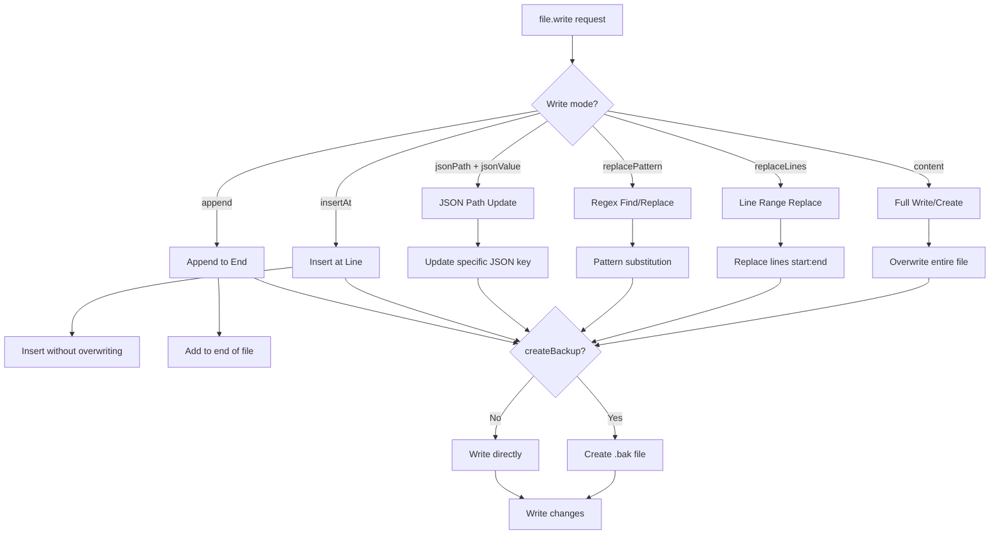
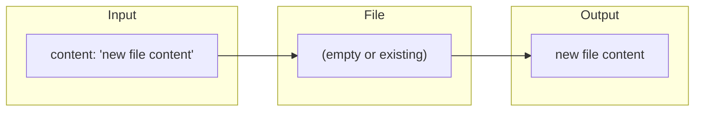
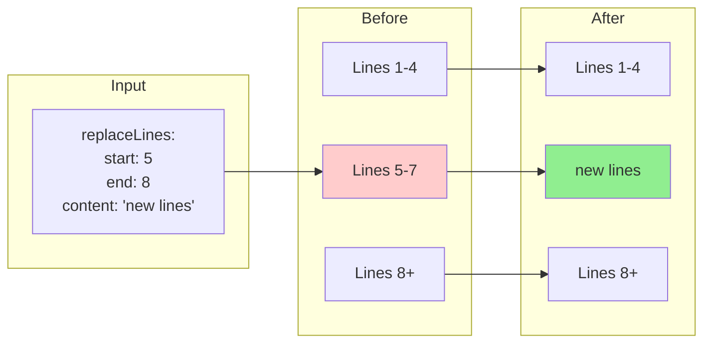
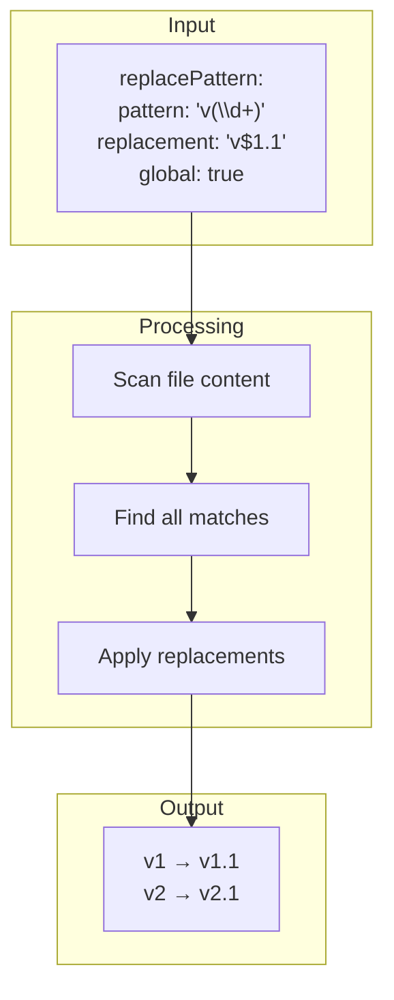
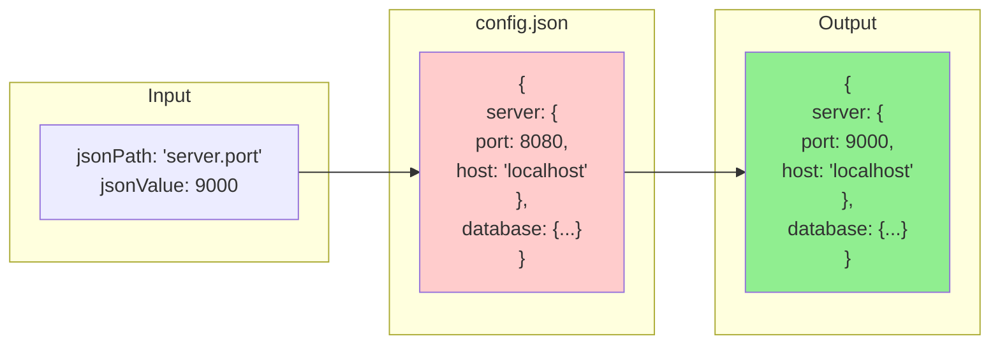
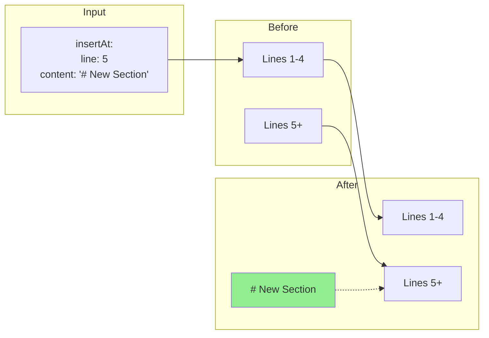
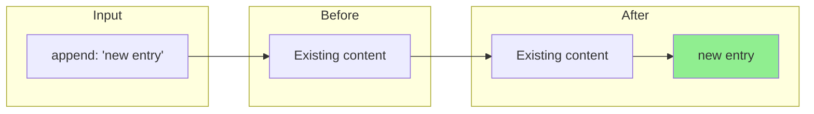
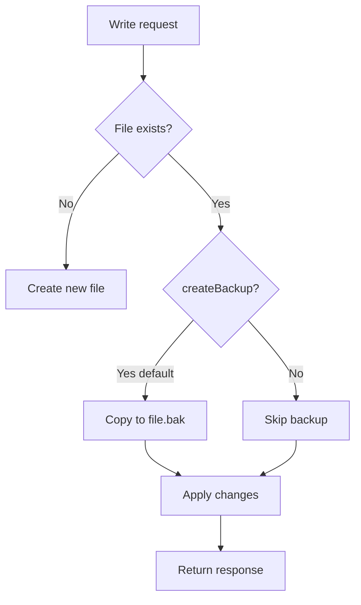

# file.write Tool Reference

<div align="right">
<details>
<summary><strong>Docs Navigation</strong></summary>

- [Overview](../README.md)
- [Documentation Hub](./README.md)
  - [Getting Started](./getting-started.md)
  - [MCP Tools Reference](./mcp-tools-reference.md)
  - [file.read Tool](./file-read-tool.md)
  - [file.write Tool (this page)](./file-write-tool.md)
  - [Configuration Reference](./configuration-reference.md)

</details>
</div>

The `file.write` tool provides token-efficient file writing with six targeted write modes. Instead of sending entire file contents, you can make surgical changes using line replacement, pattern replacement, JSON path updates, insertions, or appends.

---

## Overview



---

## Parameters

| Parameter         | Type    | Required | Default | Description                                       |
| ----------------- | ------- | -------- | ------- | ------------------------------------------------- |
| `repoId`          | string  | Yes      | -       | Repository identifier                             |
| `filePath`        | string  | Yes      | -       | File path relative to repo root                   |
| `content`         | string  | No       | -       | Full file content (create/overwrite mode)         |
| `replaceLines`    | object  | No       | -       | Line range replacement                            |
| `replacePattern`  | object  | No       | -       | Regex find/replace                                |
| `jsonPath`        | string  | No       | -       | Dot-separated path to update in JSON              |
| `jsonValue`       | any     | No       | -       | New value for jsonPath (required if jsonPath set) |
| `insertAt`        | object  | No       | -       | Insert content at line                            |
| `append`          | string  | No       | -       | Content to append to end                          |
| `createBackup`    | boolean | No       | `true`  | Create .bak backup before modifying               |
| `createIfMissing` | boolean | No       | `false` | Create file if it doesn't exist                   |

### Mode Parameters

**replaceLines:**

```typescript
{
  start: number,   // Start line (0-based, inclusive)
  end: number,     // End line (0-based, exclusive)
  content: string  // New content for the range
}
```

**replacePattern:**

```typescript
{
  pattern: string,      // Regex pattern to find
  replacement: string,  // Replacement (supports capture groups)
  global?: boolean      // Replace all occurrences (default: false)
}
```

**insertAt:**

```typescript
{
  line: number,    // Line number to insert at (0-based)
  content: string  // Content to insert
}
```

---

## Response

| Field              | Type   | Description                                  |
| ------------------ | ------ | -------------------------------------------- |
| `filePath`         | string | Normalized file path                         |
| `bytesWritten`     | number | Bytes written to file                        |
| `linesWritten`     | number | Lines in written content                     |
| `mode`             | string | Write mode used                              |
| `backupPath`       | string | Path to backup file (if created)             |
| `replacementCount` | number | Number of replacements (replacePattern mode) |

---

## Write Modes

### Mode 1: Full Content

Create a new file or overwrite existing content entirely.



**Example:**

```json
{
  "fn": "file.write",
  "args": {
    "filePath": "config/new-config.json",
    "content": "{\n  \"version\": 1\n}",
    "createIfMissing": true
  }
}
```

---

### Mode 2: Replace Lines

Replace a specific line range with new content. Ideal for updating sections of config files.



**Example:**

```json
{
  "fn": "file.write",
  "args": {
    "filePath": "config/app.yaml",
    "replaceLines": {
      "start": 10,
      "end": 15,
      "content": "server:\n  port: 8080\n  host: localhost"
    }
  }
}
```

**Token Savings:** Only send the new content for the range instead of the entire file.

---

### Mode 3: Replace Pattern

Find and replace text using regex patterns. Supports capture groups.



**Example:**

```json
{
  "fn": "file.write",
  "args": {
    "filePath": "README.md",
    "replacePattern": {
      "pattern": "version: ([0-9.]+)",
      "replacement": "version: 2.0.0",
      "global": false
    }
  }
}
```

**Safety Features:**

- Pattern length limit: 500 characters
- ReDoS protection: Rejects nested quantifiers

---

### Mode 4: JSON Path Update

Update a specific key in a JSON file without touching other content.



**Example:**

```json
{
  "fn": "file.write",
  "args": {
    "filePath": "package.json",
    "jsonPath": "version",
    "jsonValue": "2.0.0"
  }
}
```

**Path Syntax:**

- Simple key: `"name"`
- Nested key: `"server.port"`
- Array index: `"scripts.0"`
- Deep path: `"dependencies.lodash"`

**Supported Files:** `.json` only

**Token Savings:** Send only the key path and new value (~20-50 tokens) instead of the entire JSON file.

---

### Mode 5: Insert at Line

Insert new content at a specific line without replacing existing content.



**Example:**

```json
{
  "fn": "file.write",
  "args": {
    "filePath": "CHANGELOG.md",
    "insertAt": {
      "line": 2,
      "content": "## [2.0.0] - 2024-01-15\n\n### Added\n- New feature"
    }
  }
}
```

---

### Mode 6: Append

Add content to the end of a file.



**Example:**

```json
{
  "fn": "file.write",
  "args": {
    "filePath": "logs/audit.log",
    "append": "2024-01-15T10:30:00Z - User login: admin\n"
  }
}
```

---

## Backup Behavior

By default, `file.write` creates a backup before modifying any existing file:



The backup path is returned in the response as `backupPath`.

---

## Token Savings Comparison

| Operation           | Without file.write                  | With file.write                     |
| ------------------- | ----------------------------------- | ----------------------------------- |
| Update one JSON key | Send entire file (~500-5000 tokens) | `jsonPath + jsonValue` (~30 tokens) |
| Fix line 45         | Send entire file                    | `replaceLines` (~50 tokens)         |
| Append log entry    | Send entire file                    | `append` (~20 tokens)               |
| Search/replace      | Send entire file                    | `replacePattern` (~40 tokens)       |

---

## Examples

### Update package.json version

```json
{
  "fn": "file.write",
  "args": {
    "filePath": "package.json",
    "jsonPath": "version",
    "jsonValue": "1.2.3"
  }
}
```

### Replace config section

```json
{
  "fn": "file.write",
  "args": {
    "filePath": "config/database.yaml",
    "replaceLines": {
      "start": 10,
      "end": 20,
      "content": "connection:\n  host: db.example.com\n  port: 5432"
    }
  }
}
```

### Add changelog entry

```json
{
  "fn": "file.write",
  "args": {
    "filePath": "CHANGELOG.md",
    "insertAt": {
      "line": 4,
      "content": "\n## [1.2.0] - 2024-01-15\n\n### Fixed\n- Bug in login flow\n"
    }
  }
}
```

### Global find/replace

```json
{
  "fn": "file.write",
  "args": {
    "filePath": "src/config.ts",
    "replacePattern": {
      "pattern": "localhost:3000",
      "replacement": "api.example.com",
      "global": true
    }
  }
}
```

### Create new file

```json
{
  "fn": "file.write",
  "args": {
    "filePath": "config/feature-flags.json",
    "content": "{\n  \"newFeature\": false,\n  \"betaMode\": true\n}",
    "createIfMissing": true,
    "createBackup": false
  }
}
```

---

## Error Handling

| Error                                 | Cause                                             | Solution                                     |
| ------------------------------------- | ------------------------------------------------- | -------------------------------------------- |
| `Repository not found`                | Invalid repoId                                    | Check repo is registered                     |
| `File not found`                      | File doesn't exist and `createIfMissing` is false | Set `createIfMissing: true` or check path    |
| `Path traversal blocked`              | Path escapes repo root                            | Use relative paths only                      |
| `Must specify exactly one write mode` | No mode or multiple modes specified               | Use exactly one: content, replaceLines, etc. |
| `Start line exceeds file length`      | Invalid line number                               | Check file length first with `file.read`     |
| `jsonPath only supports .json files`  | Trying jsonPath on non-JSON                       | Use replacePattern or replaceLines instead   |
| `Invalid regex pattern`               | Bad regex syntax                                  | Fix the pattern                              |
| `Nested quantifiers`                  | ReDoS-prone pattern                               | Simplify regex                               |

---

## Best Practices

1. **Use targeted modes** - Prefer `jsonPath`, `replaceLines`, or `append` over sending full `content`
2. **Keep backups** - Leave `createBackup: true` (default) for safety
3. **Read before write** - Use `file.read` to verify file state before modifications
4. **Atomic updates** - For JSON files, prefer `jsonPath` to avoid formatting changes
5. **Test patterns** - Verify regex patterns work as expected before `global: true`
