# Getting Started

<div align="right">
<details>
<summary><strong>Docs Navigation</strong></summary>

- [Overview](../README.md)
- [Documentation Hub](./README.md)
  - [Getting Started (this page)](./getting-started.md)
  - [Config Examples](./config-examples.md)
  - [CLI Reference](./cli-reference.md)
  - [MCP Tools Reference](./mcp-tools-reference.md)
  - [Configuration Reference](./configuration-reference.md)
  - [Agent Workflows](./agent-workflows.md)
  - [Tool Enforcement](./tool-enforcement.md)
  - [Troubleshooting](./troubleshooting.md)

</details>
</div>

SDL-MCP installs a local MCP server, creates a repository config, indexes your code, and exposes token-efficient code tools to coding agents. Most users should install it, run the setup wizard, verify the install, then start the server over stdio.

## Setup at a Glance

```mermaid
%%{init: {"theme":"base","themeVariables":{"background":"#ffffff","primaryColor":"#E7F8F2","primaryBorderColor":"#0F766E","primaryTextColor":"#102A43","secondaryColor":"#E8F1FF","secondaryBorderColor":"#2563EB","secondaryTextColor":"#102A43","tertiaryColor":"#FFF4D6","tertiaryBorderColor":"#B45309","tertiaryTextColor":"#102A43","lineColor":"#0F766E","textColor":"#102A43","fontFamily":"Inter, ui-sans-serif, system-ui, -apple-system, BlinkMacSystemFont, Segoe UI, sans-serif"},"flowchart":{"curve":"basis","htmlLabels":true}}}%%
flowchart LR
    Install["Install<br/>npx create-sdl-mcp"]
    Wizard["Setup wizard<br/>repo, agents, languages, embeddings"]
    Verify["Verify<br/>sdl-mcp info + doctor"]
    Serve["Serve<br/>sdl-mcp serve --stdio"]
    Connect["Connect agent<br/>Codex, Claude Code, Gemini, OpenCode"]

    Install e1@--> Wizard
    Wizard e2@--> Verify
    Verify e3@--> Serve
    Serve e4@--> Connect

    classDef source fill:#E7F8F2,stroke:#0F766E,stroke-width:2px,color:#102A43;
    classDef process fill:#E8F1FF,stroke:#2563EB,stroke-width:2px,color:#102A43;
    classDef decision fill:#FFF4D6,stroke:#B45309,stroke-width:2px,color:#102A43;
    classDef animate stroke:#0F766E,stroke-width:2px,stroke-dasharray:10\,5,stroke-dashoffset:900,animation:dash 22s linear infinite;
    class e1,e2,e3,e4 animate;
```



## Prerequisites

- Node.js 24+
- npm
- A local repository to index, unless you only want to generate global SDL-MCP resources

## Choose an Install Path

### Clean first install

Use the wrapper installer for the cleanest interactive setup. It installs SDL-MCP globally with npm output suppressed, then runs the SDL-MCP Setup Wizard in the foreground.

```bash
npx create-sdl-mcp
```

### Standard global install

Plain npm installs are quiet by design. They usually do not show the setup wizard because npm runs lifecycle scripts in the background, so run `sdl-mcp init` after install.

```bash
npm install -g sdl-mcp
sdl-mcp init
```

If you explicitly want npm lifecycle output during install, use `--foreground-scripts`, but `npx create-sdl-mcp` is the cleaner path.

```bash
npm install -g --foreground-scripts sdl-mcp
```

### Update install

Use the update path when you only want to install the current binaries and print follow-up setup commands. This path skips the setup wizard.

```bash
npx create-sdl-mcp --update
```

### Run without installing

```bash
npx --yes sdl-mcp@latest version
```

### Install from source

```bash
git clone <repository-url>
cd sdl-mcp
npm install
npm run build
npm link
```

## Setup Wizard

Run the wizard from the repository you want to index.

```bash
cd <repo>
sdl-mcp init
```

The wizard prompts for repository path, agents, language providers, supported languages, embeddings, repo size profile, storage paths, config write, and first index. It preselects detected agents and detected languages when it can scan a repository. Without a detected repo, it uses core language defaults.

If the wizard starts outside a repo, it asks for a repository path. Leave the path blank for a global install. Global mode does not write a repository config or run an index; it writes reusable resources under `~/.sdl-mcp/resources`, writes selected-but-undetected agent config snippets under `~/.sdl-mcp/resources/configs`, and prints repo setup commands. Repo-local runs save selected-but-undetected agent snippets under `~/.sdl-mcp/configs`.

The Language Providers prompt writes `indexing.pipeline: "auto"` when enabled and `"legacy"` when disabled. The Embeddings prompt offers:

- Code: Jina symbol embeddings, no file summaries.
- Enhanced: Jina symbol embeddings and Nomic file summaries.
- Off: disable semantic embeddings.

Direct `sdl-mcp init` shows the wizard when the terminal is interactive and `-y` is not set. The npm postinstall offer also requires an interactive terminal and is skipped in CI, update installs, and when `SDL_MCP_SKIP_SETUP_WIZARD=1` is set.

## Quick Repo Setup

Use the interactive path when you are setting up a real repo for the first time.

```bash
cd <repo>
sdl-mcp init
sdl-mcp info
sdl-mcp doctor
sdl-mcp serve --stdio
```

Use the non-interactive path for scripts and repeatable setup. It creates config, detects repo languages, runs an inline index, then runs doctor checks.

```bash
sdl-mcp init -y --auto-index
```

If you skip the first index in the wizard, run it later:

```bash
sdl-mcp index
```

## Verify Installation

Run these commands before connecting an agent:

```bash
sdl-mcp version
sdl-mcp info
sdl-mcp doctor
```

`sdl-mcp info` reports the installed version, active config path, database paths, registered repositories, feature toggles, and runtime environment. `sdl-mcp doctor` validates the config, native addon, graph database, semantic model plan, and common setup issues.

## Connect Your Agent

For supported clients, let SDL-MCP generate the repo-local instructions and config snippets.

```bash
sdl-mcp init --client codex --enforce-agent-tools
```

Supported rich setup clients are `claude-code`, `codex`, `gemini`, and `opencode`. The wizard also includes many other agent/client choices and can generate saved config snippets for selected clients that are not detected locally.

After server startup, verify that your agent can call these tools:

1. `sdl.repo.register`
2. `sdl.index.refresh`
3. `sdl.symbol.search`
4. `sdl.symbol.getCard`

See [Tool Enforcement](./tool-enforcement.md) for the cross-client guide and [Config Examples](./config-examples.md) for copy-paste stdio and HTTP config snippets.

## Serve Modes

Stdio is the default for one local coding agent.

```bash
sdl-mcp serve --stdio
```

Use HTTP when multiple agents need to share the same SDL-MCP server or when you want browser dashboards and REST endpoints.

```bash
sdl-mcp serve --http --port 3000
```

The HTTP server exposes `/mcp`, `/health`, `/ui/graph`, `/ui/observability`, and `/api/*`. On startup, it prints a bearer token for authenticated requests unless auth is disabled in config. See [Config Examples](./config-examples.md#http-transport-configs) for client snippets and [Observability Dashboard](./feature-deep-dives/observability-dashboard.md) for dashboard details.

## Next Steps

- Copy-paste configs: [Config Examples](./config-examples.md)
- Command details: [CLI Reference](./cli-reference.md)
- Config tuning: [Configuration Reference](./configuration-reference.md)
- Tool payloads: [MCP Tools Reference](./mcp-tools-reference.md)
- Agent usage patterns: [Agent Workflows](./agent-workflows.md)
- Troubleshooting: [Troubleshooting](./troubleshooting.md)
