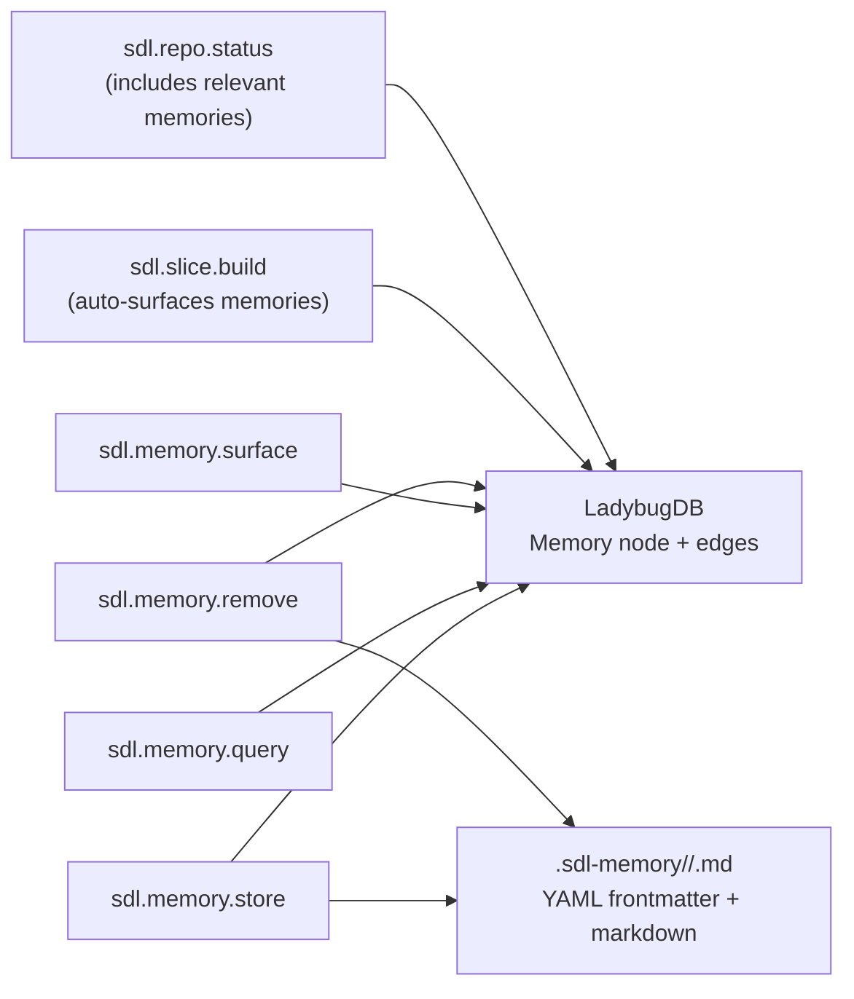

# SDL-MCP Memory Protocol

## Architecture



## When to Store Memories

Store via `sdl.memory.store` at these checkpoints:

| Checkpoint | Type | What to Capture |
|-----------|------|-----------------|
| Architectural decision made | decision | Decision, alternatives considered, rationale |
| Bug root cause identified | bugfix | Symptoms, root cause, fix applied, prevention |
| Code review completed | task_context | Findings, deferred work, TODOs |
| Performance issue found | bugfix | Bottleneck, measurement, fix/workaround |
| Feature implementation done | decision | Design choices, patterns used, trade-offs |
| Debugging session ended | bugfix | Investigation path, dead ends, resolution |
| Dependency/config gotcha | task_context | Gotcha, workaround, affected files |

## What Makes a Good Memory

- **Title**: Action-oriented, scannable (e.g., "Use nullish() not optional() for nullable config values")
- **Content**: 2-5 sentences. Include the *why*, not just the *what*
- **symbolIds**: Link to involved symbols (find via `sdl.symbol.search`)
- **fileRelPaths**: Link to involved files
- **tags**: 2-4 descriptive tags
- **confidence**: 0.9 for verified facts, 0.7 for hypotheses, 0.5 for hunches

## When Memories Are Surfaced

- **At session start**: `sdl.repo.status` auto-includes relevant memories
- **During slice builds**: `sdl.slice.build` auto-includes up to 5 related memories based on symbol overlap
- **On demand**: Call `sdl.memory.surface` with relevant symbolIds for deeper context

## Responding to Memory Hints

When a tool response includes `_memoryHint`, evaluate whether to store a memory.
The hint suggests a type and context — draft a memory and call `sdl.memory.store`.

Do not ignore hints. They indicate patterns worth capturing:
- Deep debugging sessions (3+ code window requests)
- Code review completions
- Large indexing changes (>10 files)
- Feature implementation completions

## Example

After fixing a bug:

```
sdl.memory.store({
  repoId: "<repo>",
  type: "bugfix",
  title: "Always use MERGE not CREATE for Cypher upserts in LadybugDB",
  content: "Using CREATE in Cypher queries causes duplicate nodes when the same symbol is re-indexed. Always use MERGE for idempotent upserts. Also, call normalizePath() before storing any file path — LadybugDB stores forward-slash-only paths, and forgetting this on Windows causes duplicate File nodes with mismatched path separators.",
  fileRelPaths: ["src/db/ladybug-queries.ts"],
  tags: ["ladybugdb", "cypher", "upsert", "paths"],
  confidence: 0.95
})
```

## Other Memory Tools

- **`sdl.memory.query`** — Search memories by text, type, tags, or linked symbols. Use `staleOnly: true` to find memories that need review after symbol changes.
- **`sdl.memory.remove`** — Soft-delete a memory from the graph and optionally from disk.

## File Sync (`.sdl-memory/`)

Memories are dual-stored: in the LadybugDB graph (for fast querying) and as markdown files in `<repo-root>/.sdl-memory/` (for version control and team sharing). Files are organized by type: `decisions/`, `bugfixes/`, `task_context/`, `patterns/`, `conventions/`, `architecture/`, `performance/`, and `security/`. Changes to `.sdl-memory/` files are imported into the graph during `sdl.index.refresh`.

See [Development Memories deep dive](./feature-deep-dives/development-memories.md) for full details.

## Examples

After fixing a bug (see above).

After an architectural decision:

```
sdl.memory.store({
  repoId: "<repo>",
  type: "decision",
  title: "Use LadybugDB graph database instead of SQLite for symbol storage",
  content: "Migrated from SQLite to LadybugDB (embedded graph DB) for symbol storage. Graph queries for slice building are 3-5x faster with native path traversal. Trade-off: less tooling ecosystem, but the query patterns fit graph semantics better.",
  symbolIds: ["<symbolId-for-buildSlice>"],
  tags: ["architecture", "database", "performance"],
  confidence: 0.9
})
```
