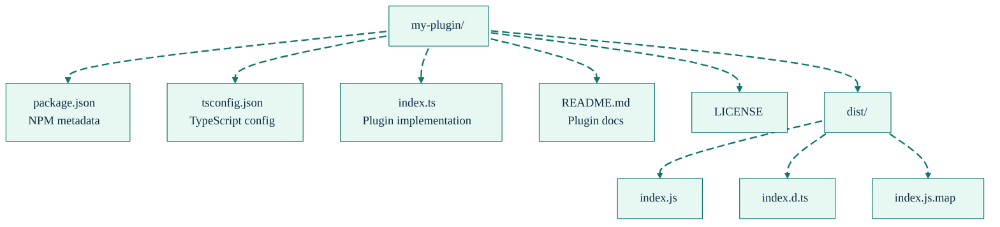

# Adapter Plugin SDK - Quick Reference

<div align="right">
<details>
<summary><strong>Docs Navigation</strong></summary>

- [Overview](../README.md)
- [Documentation Hub](./README.md)
  - [Getting Started](./getting-started.md)
  - [CLI Reference](./cli-reference.md)
  - [MCP Tools Reference](./mcp-tools-reference.md)
  - [Configuration Reference](./configuration-reference.md)
  - [Agent Workflows](./agent-workflows.md)
  - [Troubleshooting](./troubleshooting.md)

</details>
</div>

Quick reference guide for SDL-MCP adapter plugin system.

## Getting Started

### 1. Create a Plugin

```bash
# Copy template
cp -r templates/plugin-template my-lang-plugin
cd my-lang-plugin

# Build
npm install
npm run build
```

### 2. Configure SDL-MCP

```json
{
  "plugins": {
    "paths": ["./my-lang-plugin/dist/index.js"],
    "enabled": true
  }
}
```

### 3. Test

```bash
sdl-mcp index
```

## Documentation Links

| Document                                                               | Description                              |
| ---------------------------------------------------------------------- | ---------------------------------------- |
| [plugin-sdk-author-guide.md](./plugin-sdk-author-guide.md)             | Complete guide for creating plugins      |
| [plugin-sdk-security.md](./plugin-sdk-security.md)                     | Security best practices and threat model |
| [templates/README.md](../templates/README.md)                          | Template usage guide                     |
| [examples/example-plugin/README.md](../examples/example-plugin/README.md) | Example plugin documentation          |

## Plugin Manifest

```typescript
export const manifest = {
  name: "my-plugin",
  version: "1.0.0",
  apiVersion: "1.0.0",
  description: "Plugin description",
  author: "Your Name",
  license: "MIT",
  adapters: [
    {
      extension: ".mylang",
      languageId: "mylang",
    },
  ],
};
```

## Adapter Implementation

```typescript
class MyLangAdapter extends BaseAdapter {
  languageId = "mylang" as const;
  fileExtensions = [".mylang"] as const;

  extractSymbols(tree, content, filePath): ExtractedSymbol[] {
    // Extract functions, classes, etc.
    return symbols;
  }

  extractImports(tree, content, filePath): ExtractedImport[] {
    // Extract import statements
    return imports;
  }

  extractCalls(tree, content, filePath, symbols): ExtractedCall[] {
    // Extract function/method calls
    return calls;
  }
}
```

## Required Exports

```typescript
export const manifest = {
  /* ... */
};
export async function createAdapters() {
  return [
    {
      extension: ".mylang",
      languageId: "mylang",
      factory: () => new MyLangAdapter(),
    },
  ];
}
export default { manifest, createAdapters };
```

## Common Tasks

### Publishing to NPM

```bash
npm login
npm publish
```

### Running Tests

```bash
# Unit tests
npm test

# Integration tests (requires built SDL-MCP)
node --experimental-strip-types --test tests/integration/example-plugin.test.ts
node --experimental-strip-types --test tests/integration/external-plugin-loading.test.ts
```

### Troubleshooting

| Issue               | Solution                                         |
| ------------------- | ------------------------------------------------ |
| Plugin not loading  | Check file path in config, verify plugin exists  |
| Version error       | Match `apiVersion` in manifest with host version |
| Adapter not working | Verify `fileExtensions` and `languageId` match   |

See [plugin-sdk-author-guide.md#troubleshooting](./plugin-sdk-author-guide.md#troubleshooting) for more.

## Security Checklist

Before installing a plugin:

- [ ] Source is trusted
- [ ] Code has been reviewed
- [ ] No suspicious dependencies
- [ ] Manifest is valid
- [ ] API version matches host

See [plugin-sdk-security.md](./plugin-sdk-security.md) for complete security guidelines.

## Configuration Options

```json
{
  "plugins": {
    "paths": ["./plugin1.js", "./plugin2.js"],
    "enabled": true,
    "strictVersioning": true
  }
}
```

| Option             | Type    | Default | Description                     |
| ------------------ | ------- | ------- | ------------------------------- |
| `paths`            | array   | `[]`    | Plugin file paths               |
| `enabled`          | boolean | `true`  | Enable plugin loading           |
| `strictVersioning` | boolean | `true`  | Require exact API version match |

## File Structure



## Testing Guidelines

### Unit Tests

```typescript
describe("My Adapter", () => {
  it("should extract functions", () => {
    const symbols = adapter.extractSymbols(tree, content, filePath);
    assert.ok(symbols.some((s) => s.name === "myFunction"));
  });
});
```

### Golden File Tests

```typescript
const symbols = adapter.extractSymbols(tree, content, filePath);
const golden = JSON.parse(readFileSync("expected-symbols.json"));
assert.deepStrictEqual(symbols, golden);
```

## Best Practices

1. **Type Safety**: Use TypeScript for all plugin code
2. **Error Handling**: Never let plugin errors crash the indexer
3. **Input Validation**: Validate all user inputs and file paths
4. **Resource Limits**: Add timeouts to prevent hanging
5. **Documentation**: Document plugin behavior and usage
6. **Testing**: Write comprehensive tests before publishing
7. **Versioning**: Use semantic versioning (MAJOR.MINOR.PATCH)

## Support

- **Documentation**: See docs/ directory
- **Examples**: See examples/example-plugin/
- **Templates**: See templates/plugin-template/
- **Issues**: Report bugs on GitHub

## Quick Commands

```bash
# Build SDL-MCP
npm run build

# Build plugin
npm run build

# Run tests
npm test

# Publish plugin
npm publish

# Install plugin locally
npm install ./my-plugin

# Run indexer
sdl-mcp index

# Check logs (SDL-MCP logs to stderr)
SDL_LOG_LEVEL=debug sdl-mcp serve 2>&1 | tail -f
```
